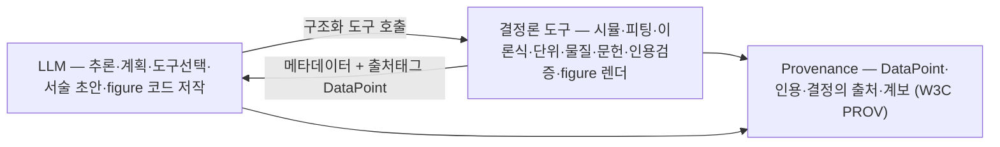

# MagLab — 자성·스핀트로닉스 연구 생애주기 코파일럿 (독립 CLI 에이전트)

> **설계·구축 계획서 — 개요 (PLAN.md)**
>
> 자성/스핀트로닉스 연구자의 연구 생애주기 전체 — 발견 → 설계 → 실행 → 분석
> → 리뷰 → 저술 — 를 자동화하는 **독립 실행 CLI 에이전트 프로그램**.
>
> 설계 철학 = **검증 가능한 오케스트레이터**: LLM은 추론·계획·도구 호출만
> 하고 **숫자·인용·결과는 절대 만들지 않는다**. 모든 수치는 결정론적 물리·
> 피팅 도구에서, 모든 인용은 검증된 문헌 풀에서 나오며, 모든 산출물에 출처가
> 따라붙는다. Figure도 코드/벡터로 *저작*하지 래스터로 *생성*하지 않는다.
>
> 형태 = 독립 CLI 프로그램(BYO API 키 / 위임 CLI 백엔드 / 로컬 모델 인증).
> 반복 작업은 **Ralph 루프**로, 알림·원격 조작은 **메시징 게이트웨이**로 한다.
> 스킬은 **SKILL.md 오픈 표준**. 터미널 UI는 **볼드 솔리드 블록 아이덴티티**.
>
> 이 문서는 다음 세션/구현자가 추가 질문 없이 따라갈 구현 명세서다. 본 문서는
> **개요·아키텍처·로드맵**을 담고, 모듈별 상세 설계는 `plan/` 디렉터리의 파일로
> 분리되어 있다 (「문서 구성」 절 참조). 산출물은 이 마크다운 문서군이며 코드는
> 생성하지 않는다.

---

## 0. 이 문서에 대하여 (메타)

- **산출물 구성**: 루트 `PLAN.md`(개요·배경·제품·원칙·아키텍처·기술 스택·
  로드맵·테스트·리스크) + `plan/` 디렉터리(모듈별 상세 11개 파일 — §5–§17 및
  부록 A–J). 절 번호(§N)는 분리 전후로 동일하게 유지된다. 코드는 생성하지 않는다.
- **프로젝트명**: **MagLab** (CLI 명령·패키지 = `maglab`). 프로젝트 폴더는
  사용자 재량으로 `maglab/`로 개명 가능(현재 `aimag/`).
- **이력**: ① GdFeCo 자구벽 특화 → ② 멀티스케일 시뮬 → ③ 생애주기 코파일럿
  (7대 기능) → ④ 독립 CLI 에이전트(모델링/피팅 프로바이더·메시징·저술) →
  ⑤ `MagLab` 개명 + CLI 디자인 → ⑥ **Figure 제작 엔진 신설** (2026-05-18) →
  ⑦ 외부 도구 조사 기반 13개 기능 통합 + **문서 `plan/` 모듈 분해** →
  ⑧ **MCP·스킬·에이전트 디자인 심화 + 논문 검색 스택 통합** (2026-05-19).
- **본 세션 변경**:

  | 항목 | 내용 | 절 |
  |---|---|---|
  | Figure 엔진 | figure 제작 엔진 신설 — 코드/벡터 저작(matplotlib·SVG), 자성 스키매틱 프리미티브 라이브러리, 정제 Ralph 루프(Loop E) | §12 |

- **Figure 원칙 확정**: figure는 **코드/벡터로 저작**한다 — 데이터 플롯은
  matplotlib, 스키매틱은 LLM이 SVG 코드 저작. **래스터 생성형 이미지 모델
  (Nano Banana 등)은 데이터·텍스트를 담은 figure에 쓰지 않는다** (데이터 환각·
  텍스트 오류·비벡터·비편집·비재현). LLM이 숫자를 계산하지 않듯 데이터를
  *그리지도* 않는다 (§12).
- **시각 아이덴티티**: 로고 = 굵은 솔리드 블록 워드마크(pyfiglet `ansi_shadow`),
  자성은 색으로 — 자화 그라데이션 파랑(스핀-업)→빨강(스핀-다운) (§7.4).
- **유지 확정 사항**: v1 물리 = 멀티스케일(DFT→원자론→미세자기); 장비 =
  실시간 제어 없음, 코드 생성·정적검증만; LLM은 숫자·인용을 만들지 않는다;
  사람이 저자·책임자; 구독 OAuth 직접 미구현(§7.2).
- **조사 기반**: 에이전트 하네스·오케스트레이션, AI-과학 에이전트, Ralph
  루프, 학술 데이터 인프라, 스핀트로닉스 효과 피팅, 메시징, 학술 저술,
  독립 CLI·인증, 터미널 UI/UX, AI figure 생성을 1차 조사해 종합. 출처는 부록 J.

---

## 1. 배경 — 왜 만드는가

자성/스핀트로닉스 연구자는 분야·시료와 무관하게 동일한 생애주기를 돈다:

```
발견(문헌·물질) → 설계(시뮬·실험) → 실행(시뮬·측정)
→ 분석(피팅·이론) → 리뷰(원고) → 저술(논문·서신) → (반복)
```

각 단계는 결정론적 도구로 가속할 *기계적 부분*과 연구자의 *판단*이 섞여
있다. 그런데 도구가 단계마다 흩어져 재사용·추적이 불가능하다 — DFT→원자론→
미세자기 파라미터 핸드오프는 손으로(가장 오류 잦음), 효과별 피팅은 일회용
노트북으로, 장비 코드는 매번 매뉴얼을 뒤지며, **출판용 figure 제작은 가장
큰 통증점**(데이터 플롯 보일러플레이트 + 스키매틱 일러스트 설계). **MagLab은
이 생애주기 전체를 한 독립 도구로 통합하되, LLM은 오케스트레이션만 하고 모든
수치·인용·figure에 출처를 꿴다.**

---

## 2. 제품 정의

### 2.1 대상 사용자

| 페르소나 | 핵심 작업 | MagLab가 푸는 통증 |
|---|---|---|
| 계산 연구자 | DFT·원자론·미세자기 시뮬 | 멀티스케일 핸드오프 자동화, 입력 보일러플레이트 제거 |
| 실험 연구자 | 자기수송·FMR·MOKE·VSM 측정 | 장비 코드 자동생성, 효과별 정확한 피팅, 데이터→figure |
| 이론가/학생 | 모델 피팅·학습·문헌 | 모델링/피팅 프로바이더, 문헌 RAG, 물리 계산기 |
| 저자(공통) | 원고 검토·논문·figure·서신 | 페르소나 리뷰어, figure 엔진, 학술지 저술, 리비전·메일 |

### 2.2 v1 범위 — 6단계 생애주기

발견(§14) · 설계(§10) · 실행(§10·§13) · 분석(§11) · 리뷰(§15) · 저술(§16).
횡단 레이어: 물리 코어(§9), 에이전트 하네스(§5), Ralph 루프(§6), 메시징(§8),
**Figure 엔진(§12)**.

### 2.3 형태

**독립 실행 CLI 에이전트 프로그램** (`maglab`). pip 설치, 자체 에이전트
하네스, 자체 스킬 시스템(SKILL.md 오픈 표준), 자성 테마 터미널 UI. 부가로
MCP 서버를 노출해 외부 하네스 연동도 지원하지만, 제품의 본체는 독립 CLI다.

### 2.4 비목표 (v1 제외)

- 실험 장비 **실시간 제어** — 코드 생성·정적검증만, 하드웨어 VISA 세션 안 엶.
- 솔버 자체 구현 — 외부 바이너리(VASP·VAMPIRE·MuMax3)에 위임.
- 자동 논문 투고 — 초안만, 사람이 저자·책임자, 투고는 사람이.
- 구독 OAuth 토큰을 MagLab가 직접 구현 — §7.2 (약관 준수).
- **래스터 생성형 이미지 모델로 데이터 figure 생성** — §12.1 (환각·무결성).

### 2.5 핵심 설계 원칙

① 3-레이어 분리(LLM 추론 / 결정론 도구 / provenance). ② LLM은 숫자·인용·결과·
데이터-figure를 만들지 않는다. ③ 정직한 리포팅·연구 무결성. ④ 단순함 우선.
⑤ 사람이 책임자. ⑥ 오프라인 우선·Mac 개발 가능. ⑦ 도구·피팅 공식의 정확성이
천장이다.

---

## 3. 설계 원칙 — 검증 가능한 오케스트레이터

> LLM은 과학적 추론 레이어, 결정론적 도구는 계산·인용 진실 레이어, provenance는
> 책임 레이어. 셋은 처음부터 분리되고 절대 흐려지지 않는다.

### 3.1 왜 LLM이 직접 생성하면 안 되는가

환각 수치, 환각 인용(AI 보조 논문에서 만연 — 게재거부·철회 유발), 사후 선택
편향(자동 p-hacking), 확률적·감사 불가, 편향된 학습 데이터(물성값), **figure
데이터 환각**(래스터 이미지 모델이 막대 높이·축 값을 합성). → 계산·인용·물성·
피팅·**figure**는 결정론적 도구/코드로 밀어낸다.

### 3.2 세 레이어



### 3.3 연구 무결성 원칙 (협상 불가)

페르소나 리뷰어는 실명 인물이 아닌 "공개 코퍼스 모델" — 고지 라벨·3인칭·날조
인용 금지(§15.2). 자동 저술은 검증된 결과만 서술, 숫자는 데이터 볼트에서만,
인용은 cite-then-write(§16.4). 사람이 저자·책임자. 효과 피팅·figure는 데이터
레이어 출처와 함께. 데이터 figure는 코드가 실제 값으로 렌더(§12).

---

## 4. 시스템 아키텍처 개요

```mermaid
flowchart TD
    subgraph ENTRY["진입점"]
        CLI["maglab CLI — REPL + 파이프 모드 (Typer/Rich)"]
        GW["메시징 게이트웨이 데몬 (§8)"]
        MCP["MCP 서버 (외부 하네스 연동용)"]
    end
    subgraph HARNESS["에이전트 하네스 — core/ (§5–§6)"]
        ORCH["오케스트레이터 (트리 탐색) · Ralph 루프 엔진"]
        SUB["서브에이전트 풀 · 컨텍스트/메모리 · 자율성 게이트 · 스킬 시스템"]
    end
    subgraph PROV3["3대 프로바이더 추상화"]
        LLMP["LLM 백엔드 — API키 / 위임CLI / 로컬 (§7.2)"]
        CBE["컴퓨트 백엔드 — HPC·GPU·CPU (§10)"]
        MFE["모델링·피팅 엔진 프로바이더 — 분야별 (§11)"]
    end
    subgraph DET["결정론적 도구 레이어"]
        PHYS["physics/"]
        SIM["sim/ 멀티스케일"]
        ANA["analysis/ 효과 피팅 레지스트리"]
        FIG["figure/ 제작 엔진"]
        INSTR["instrument/ 코드생성·매뉴얼 RAG"]
        LIT["literature/ 발견 인텔리전스"]
        REV["reviewer/ · authoring/"]
    end
    PROVST["provenance/ — W3C PROV + 데이터 볼트"]
    CLI --> HARNESS
    GW --> HARNESS
    MCP -. 도구 직접 노출 .-> DET
    HARNESS --> LLMP
    HARNESS --> DET
    DET --> CBE
    DET --> MFE
    DET --> PROVST
    HARNESS --> PROVST
```



### 패키지 구조 (구현 시 생성 — 본 세션 미생성)

```
maglab/
├── PLAN.md  README.md  pyproject.toml  MAGLAB.md
├── plan/                    # 모듈별 상세 설계 문서 (§5–§17, 부록)
├── maglab/
│   ├── __main__.py  cli.py  repl.py  config.py        # 독립 CLI 진입점
│   ├── mcp_server.py                                  # MCP 서버 (연동용)
│   ├── ui/                    # 터미널 UI (§7.4–§7.9)
│   │   ├── banner.py  theme.py  render.py  spinner.py  prompt.py
│   ├── core/                  # 하네스 (§5–§6)
│   │   ├── orchestrator.py  subagents.py  ralph.py
│   │   ├── context.py  memory.py  verify.py  autonomy.py
│   │   ├── checkpoint.py  budget.py  hooks.py  skills.py
│   ├── llm/                   # LLM 백엔드 프로바이더 (§7.2)
│   │   ├── base.py  auth.py  tools.py  prompts/
│   │   └── backends/          #   api.py(litellm) · delegated_cli.py · local.py
│   ├── gateway/               # 메시징 게이트웨이 (§8)
│   │   └── runner.py  session_db.py  adapters/
│   ├── physics/               # 물리 코어 (§9)
│   │   ├── constants.py  units.py  quantity.py  oracle.py
│   │   ├── formulas.py  materials.py  material_builder.py  data/
│   ├── sim/                   # 멀티스케일 시뮬 (§10)
│   │   ├── spec.py  dft/  atomistic/  micro/  device/
│   │   ├── validate.py  handoff.py  custodian.py  parse.py  backends/
│   ├── analysis/              # 모델링·피팅 (§11)
│   │   ├── providers/  effects/
│   │   ├── fit.py  symmetry.py  io.py  consistency.py
│   ├── figure/                # Figure 제작 엔진 (§12)
│   │   ├── spec.py  compose.py  export.py
│   │   ├── renderers/         #   dataplot.py · schematic.py · simviz.py
│   │   ├── primitives/        #   자성 스키매틱 벡터 템플릿
│   │   └── styles/            #   저널별 스타일 프로파일 YAML
│   ├── instrument/            # 장비 코드생성·매뉴얼 (§13)
│   │   ├── scaffold.py  scpi.py  script.py  safety.py  mock.py
│   │   ├── manual_search.py  manual_rag.py  skillgen.py  templates/
│   ├── literature/            # 발견 인텔리전스 (§14)
│   │   ├── connectors.py  authors.py  corpus.py
│   │   ├── keywords.py  journals.py  index.py  rag.py
│   ├── reviewer/              # 페르소나 리뷰 패널 (§15)
│   ├── authoring/             # 저술·커뮤니케이션 스위트 (§16)
│   │   ├── templates/  data_vault.py  bib_manager.py
│   │   ├── citation_auditor.py  section_drafter.py  comms/
│   ├── provenance/            # 감사 레이어 (§17)
│   └── report/                # 정직한 리포팅 (§17)
├── agents/                    # 서브에이전트 정의 `<name>.md` (§5.16)
├── skills/                    # 번들 SKILL.md 스킬 (부록 C)
├── themes/                    # 번들 테마 YAML (§7.8)
├── examples/  configs/  tests/
```

---

## 문서 구성 — 모듈 상세 파일 색인

이 문서(`PLAN.md`)는 **개요·아키텍처·로드맵**을 담는다. 각 모듈의 상세 설계는
`plan/` 디렉터리의 파일로 분리되어 있다. 절 번호(§N)는 분리 전후로 동일하게
유지되므로, 어느 파일에서든 본문의 `(§N)` 교차참조가 그대로 유효하다 — 절이
어느 파일에 있는지는 아래 표로 찾는다.

| 파일 | 절 | 내용 |
|---|---|---|
| `PLAN.md` (이 파일) | §0–§4, §18–§21 | 메타·배경·제품·설계 원칙·시스템 아키텍처 / 기술 스택·로드맵·테스트·리스크 |
| `plan/01-harness.md` | §5–§6 | 에이전트 하네스·오케스트레이션 · 서브에이전트·스킬·MCP 디자인(§5.16–§5.18) · Ralph 루프 |
| `plan/02-delivery.md` | §7–§8 | 전달·인증·CLI 디자인 / 메시징 게이트웨이 |
| `plan/03-physics-simulation.md` | §9–§10 | 결정론적 물리 코어 / 멀티스케일 시뮬레이션 |
| `plan/04-analysis.md` | §11 | 모델링·피팅 엔진 프로바이더 · 효과 피팅 레지스트리 |
| `plan/05-figure.md` | §12 | Figure 제작 엔진 |
| `plan/06-experiment.md` | §13 | 실험 워크플로 — 장비 코드·ELN·측정 계획 |
| `plan/07-literature.md` | §14 | 문헌·발견 인텔리전스 · 논문검색 MCP 커넥터·리서치 오케스트레이션 |
| `plan/08-review.md` | §15 | 원고 리뷰 — 전문가 페르소나 패널 |
| `plan/09-authoring.md` | §16 | 학술 저술·커뮤니케이션 에이전트 스위트 |
| `plan/10-integrity.md` | §17 | 정직한 리포팅·Provenance·무결성 |
| `plan/11-appendices.md` | 부록 A–J | CLI 트리·MCP 카탈로그·스킬 카탈로그·정적검증·기능 매핑·효과 레지스트리·저널 템플릿·하네스 패턴·용어집·참고자료 |

구현은 별도 세션에서 Phase(P0–P6, §19) 단위로 진행하며, `plan/11-appendices.md`
의 부록 E(기능→구현 매핑)·F(효과 피팅 레지스트리)가 착수 체크리스트다.

---

## 18. 기술 스택

- 언어 Python 3.11+. CLI Typer + Rich + prompt_toolkit + pyfiglet +
  rich-gradient. 설정 TOML.
- 하네스 자체 구현(Codex/OpenCode 패턴). LLM LiteLLM(직접 API) + 위임 CLI
  서브프로세스 + Ollama. 자격증명 `keyring`.
- MCP `fastmcp`. provenance SQLite+`prov`.
- 시뮬 (외부): MuMax3·OOMMF·`ubermag`·`magnum.np`·VAMPIRE·Spirit·VASP/QE·TB2J.
- 수치·피팅 numpy·scipy·pandas·matplotlib·`lmfit`.
- **Figure**: matplotlib + `scienceplots`, `discretisedfield`(OVF 시각화),
  `pyvista`(3D off-screen), `cairosvg`/Inkscape CLI(SVG→PDF), `pyfiglet` 무관.
- 메시징 `slack-bolt`·`python-telegram-bot`·`discord.py`.
- 문헌 `pyalex`·`semanticscholar`·`arxiv`·`habanero`. 키워드 scikit-learn·
  `keybert`·`yake`. 물질 `mp-api`·`optimade`; NEMAD/SJR CSV 번들.
- RAG `lancedb`/`sqlite-vec`·`sentence-transformers`(SPECTER2)·`pdfplumber`.
- 저술 `bibtexparser` v2·`pylatex`·`jinja2`·`tectonic`.
- `pyproject.toml` extras: `[sim]`·`[llm]`·`[mcp]`·`[figure]`·`[instr]`·
  `[literature]`·`[reviewer]`·`[authoring]`·`[gateway]`·`[all]`. 코어 설치는
  GPU·LLM 없이.

---

## 19. 로드맵 (구현 — 본 세션 범위 밖)

| Phase | 산출물 | 종료 기준 |
|---|---|---|
| P0 | 독립 CLI 골격·터미널 UI·하네스·인증(3 백엔드)·스킬 시스템·`physics/`·`provenance/`·MCP | Mac에서 GPU 없이 동작, 볼드 블록 배너, golden-value 통과 |
| P1 | `sim/` 미세자기 단일 스케일·**`figure/` 데이터플롯 렌더러·스타일·compose·export**·데이터→figure(F6) | µMAG 표준문제 #1–#5 재현, 저널 스타일 벡터 figure 출력 |
| P2 | `analysis/` 모델링·피팅 프로바이더 + 효과 피팅 레지스트리(부록 F)·`symmetry.py` | AHE·SMR·하모닉 홀·ST-FMR·FMR·OHE 합성 데이터 피팅 |
| P3 | `sim/` 멀티스케일(DFT·원자론·handoff)·**`figure/simviz` OVF 시각화** | bcc Fe T_C, 핸드오프 골든값, 스커미온 시각화 |
| P4 | `instrument/` 매뉴얼 자동검색·skillgen·Ralph 엔진·**`figure/` 스키매틱·프리미티브 라이브러리·Loop B/D/E** | 매뉴얼→스킬, 실험코드 Ralph, 자성 스키매틱 figure |
| P5 | `literature/` 발견 인텔리전스(F3·F4·F5)·`reviewer/` 패널·Loop A | 키워드 검색·임팩트·물질DB·페르소나 리뷰 |
| P6 | `authoring/` 저술·커뮤니케이션 스위트·Loop C·`gateway/` 메시징·자율 루프 | `maglab write`·리비전/메일·Slack/Telegram/Discord 연동 |

P0–P3 = 검증 가능한 오케스트레이터 코어(+UI·효과 피팅·figure 데이터플롯).
P4–P6 = 생애주기 레이어. 각 Phase 독립 검증·머지 가능.

---

## 20. 테스트 / 검증

- Golden-value: µMAG 표준문제 #1–#5, VAMPIRE bcc Fe T_C, 문헌값 `formulas.py`.
- **효과 피팅 테스트**: 알려진 파라미터로 합성 데이터 생성 → 각 `EffectModel`이
  파라미터를 복원하는지(AHE·PHE·SMR·하모닉 홀·ST-FMR·FMR·OHE 등 전수).
- **Figure 테스트**: 데이터플롯이 입력 데이터와 정확히 일치(픽셀이 아닌 값
  검증), 벡터 출력·폰트 임베딩(`fonttype 42`), 저널 치수 준수, 스키매틱
  프리미티브 렌더·SVG→PDF 변환, Loop E 비전 critic 동작.
- 파서·핸드오프·단위/차원·인용(주입 가짜 인용 탐지)·무결성(고지 라벨·데이터
  볼트·figure 미태그 데이터 차단)·Ralph(서킷 브레이커·재개)·인증(3 백엔드).
- **UI 테스트**: 배너 3단 폭 반응, 비-TTY 색 제거, `NO_COLOR` 준수, 테마 로드.
- 하네스 eval 스위트. **정량·인용·피팅 검증에 LLM-as-judge 금지** — 결정론만.
- CLI·MCP·게이트웨이 스모크 테스트.

---

## 21. 리스크 / 미해결 결정

| 항목 | 결정 / 대응 |
|---|---|
| 구독 인증 약관 | 구독 OAuth 직접 미구현. BYO API 키 + 위임 CLI 백엔드 + 로컬 (§7.2) |
| 효과 피팅 공식 정확성 | 부록 F는 1차 문헌 기반, 구현 시 출처 논문으로 확정·골든 합성데이터 테스트 |
| OHE 3-인덱스 텐서 | `EffectModel`이 rank-3 `σ^{l_γ}_{α,β}` 보유, 최신 문헌 반영 |
| **Figure 래스터 생성형 모델** | 데이터·텍스트 figure에 미사용 — 환각·비벡터·비편집. 코드/벡터 저작만 (§12.1). 순수 장식 컨셉아트는 명시 라벨 시에만 예외 검토 |
| **Figure 벡터 엔진 의존** | Illustrator MCP는 macOS·CC·로컬 전용이라 제외. Inkscape(무료·헤드리스·`inkex`)를 SVG→PDF 엔진으로, Illustrator는 사람의 선택 핸드오프로만 |
| 페르소나 리뷰어 명예훼손 | §15.2 7대 안전장치, honesty gate 차단 |
| 자동 저술 날조 | 데이터 볼트·cite-then-write·citation auditor·사람 저자 (§16.4) |
| Ralph 루프 폭주 | §6.2 서킷 브레이커·휴먼게이트 |
| 학술 API 키·레이트 | 지수 백오프·캐시·번들 데이터셋(SJR·NEMAD) |
| 진짜 JCR IF 유료 | SJR·OpenAlex·Eigenfactor 명시 라벨링 대체 (§14.4) |
| 터미널 호환성 | 유니코드 블록·박스 글자 미지원 대비 ASCII 폴백, `TERM=dumb` 평문 (§7.9) |
| 프로젝트 폴더명 | 문서·패키지는 `MagLab`/`maglab`. 폴더(현 `aimag/`)는 사용자 재량 개명 |
| 문서 길이 | `PLAN.md`(개요·아키텍처·로드맵) + `plan/`(모듈 상세 §5–§17) + 부록(참조 테이블)으로 분해 완료(2026-05-19). 절 번호는 전역 유지 — 교차참조 불변. 추가 확장은 해당 모듈 파일 내에서 |

---

*문서 끝. 구현 명세서로 작성되었으며 각 절·부록은 해당 모듈 구현 시 직접
참조한다 — 절↔파일 대응은 「문서 구성」 색인 참조. 구현은 별도 세션에서
Phase(P0–P6) 단위로 진행하며, `plan/11-appendices.md`의 부록 E·F가 착수
체크리스트다.*
