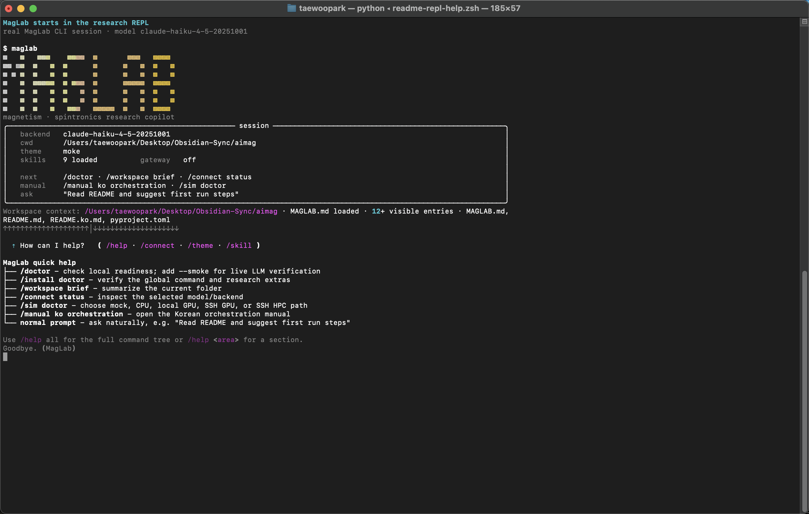
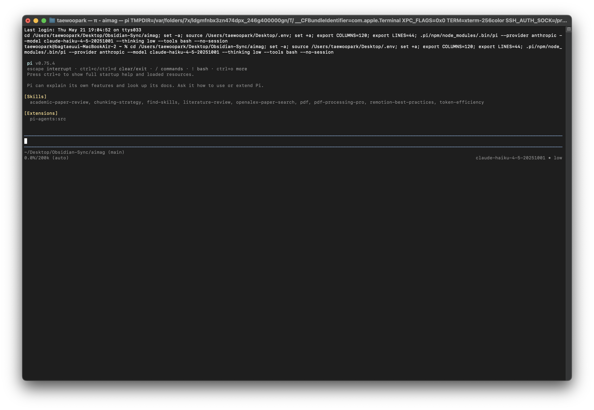
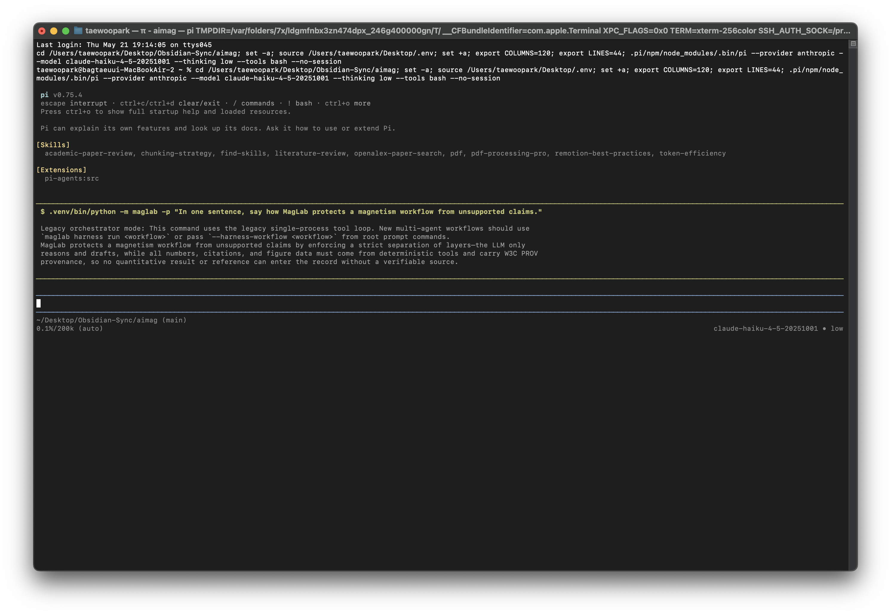

<h1 align="center">MagLab</h1>

<p align="center">
  <strong>자성 및 스핀트로닉스 연구를 위한 AI for Science 하네스.</strong>
</p>

<p align="center">
  <a href="README.md">English README</a> ·
  <a href="docs/manuals/en/index.md">Manuals</a> ·
  <a href="docs/manuals/ko/index.md">한국어 매뉴얼</a>
</p>

<p align="center">
  
  
  
  
  &nbsp;
  
  
  
  
  
  
  
  
  
</p>


## MagLab을 만든 이유

MagLab은 자성 및 스핀트로닉스 연구자가 AI for Science를 실제 연구 도구로
사용할 수 있게 만들기 위한 플랫폼입니다. 목표는 멋진 데모 프롬프트를 만드는
것이 아니라, 연구자가 실제로 시간을 빼앗기는 지점을 구체적으로 지원하는
것입니다. 문헌 탐색과 검증, 물질 스택의 파라미터화, 단위 변환, 물리 범위
체크, 다중 스케일 시뮬레이션 연결, 스핀트로닉스 효과 피팅, 재현 가능한 그림
생성, 계측기 스크립트 작성, 전자 연구노트, 논문 리뷰, 그리고 검증된 결과를
논문, 포스터, 발표, rebuttal, grant text로 옮기는 과정까지 하나의 하네스로
묶습니다.

핵심 설계는 MagLab이 하네스 플랫폼이라는 점입니다. LLM 계층은 계획하고,
라우팅하고, 설명하고, 초안을 작성합니다. 실제 과학 작업은 물리 공식, 단위
변환, 물질 데이터베이스, 시뮬레이션 파이프라인, 피팅 모델, 그림 렌더러,
문헌 커넥터, SCPI 안전 검사, 데이터 lineage, 리뷰 워크플로 같은 도메인
모듈이 수행합니다. 연구자를 대체하려는 도구가 아니라, 연구자의 루프를 더
빠르고 구조적이며 재현 가능하게 만드는 도구입니다.

## AI for Science에 하네스가 필요한 이유

AI for Science가 중요한 이유는 현대 연구의 병목이 더 이상 아이디어 부족에만
있지 않기 때문입니다. 실제 연구 현장에서는 읽어야 할 논문이 너무 많고,
파일 형식과 단위 관습이 제각각이며, 시뮬레이션 backend는 분산되어 있고,
그림 수정과 논문 작성에는 반복적인 문맥 정리가 필요합니다. 실험 조건과
판단 근거는 연구노트, 스크립트, 장비 로그, 개인 기억 속에 흩어져 있습니다.
따라서 과학에 유용한 AI는 단순한 챗봇이어서는 부족합니다. 언어 모델이
검증 가능한 도구를 호출하고, 구조화된 결과를 받고, provenance를 남기며,
연구자가 과정을 추적할 수 있는 제어된 실행 환경이 필요합니다.

MagLab은 LLM을 과학적 사실의 출처가 아니라 오케스트레이션 계층으로 둡니다.
숫자는 공식 모듈, 데이터 파일, 피팅기, 시뮬레이션, 문헌 record, 또는 사용자의
명시적 입력에서 나와야 합니다. 그림은 데이터와 연결된 vector artifact여야
하고, 논문/포스터/메일 초안은 검증된 결과를 바탕으로 만들어지되 인간 검토가
필수임을 계속 표시해야 합니다. 이것이 MagLab이 생각하는 실용적인 AI for
Science입니다. 모델은 연구 루프를 빠르게 돌리고, 하네스는 그 루프를 나중에
검토할 수 있게 유지합니다.

자성 및 스핀트로닉스에서는 이런 구조가 특히 중요합니다. 하나의 프로젝트 안에
material stack, 자기 단위, transport geometry, micromagnetic assumption,
solver-specific file, fitted effect model, 논문용 figure가 함께 존재합니다.
CGS와 SI가 섞이거나, 피팅 파라미터가 물리 범위를 벗어나거나, 그림 생성 경로를
잊거나, 인용한 논문이 실제 claim을 지지하지 않는 일이 쉽게 생깁니다. MagLab은
이 실패 모드들을 중심으로 설계되어 있습니다.

## MagLab이 줄이는 연구 병목

| 연구 병목 | MagLab이 지원하는 것 |
|---|---|
| 문헌 과부하 | 논문 폴더에서 키워드 추출, OpenAlex/Semantic Scholar/arXiv/Crossref 검색, evidence matrix 생성, 저자/저널/인용 그래프/로컬 corpus 확인. |
| 물질과 단위 처리 | 자성 물질 조회, multilayer stack 생성, exchange length/FMR/domain-wall/skyrmion 공식 계산, 자기 단위 변환, physics oracle 실행. |
| 시뮬레이션 handoff | micromagnetic spec 생성과 검증, DFT/atomistic 입력 생성, solver 출력 파싱, DFT -> atomistic -> micromagnetic -> device workflow 연결. |
| 피팅과 해석 | AMR, AHE, OHE, PHE, SMR, USMR, ST-FMR, FMR/Kittel, damping, spin pumping/ISHE, DMI, domain-wall, skyrmion/Thiele, hysteresis, Curie-temperature 모델 피팅. |
| 그림 재현성 | `FigureSpec` JSON 생성, journal-aware vector figure 렌더링, multi-panel composition, spintronics schematic primitive catalog 사용. |
| 계측기 스크립팅 | PyVISA driver scaffold, SCPI sequence 검증, manual RAG ingest, 실험 설명 기반 script 생성, hardware 실행 전 safety check. |
| 실험 기억 | 구조화된 ELN entry 작성, 날짜/샘플/tag/type별 note 조회, measurement plan 생성, DOE/active-learning 기반 다음 실험 제안. |
| 리뷰와 비판 | persona-style manuscript review, consensus/dissent synthesis, anomalous result explanation, AI assistance disclosure. |
| 논문과 커뮤니케이션 | manuscript section, cover letter, revision letter, rebuttal, abstract, grant, email, slides, poster 초안 생성. |
| 오케스트레이션 | interactive REPL, Ralph loop, MCP server/client, subagent, skill, gateway bot, cost tracking, checkpoint, provenance record로 연구 lifecycle 조율. |

## 파이프라인 스택

<p align="center">
  <sub><strong>Terminal UX</strong></sub><br>
  
  
  
  
  
</p>

<p align="center">
  <sub><strong>Physics, Data, Fitting</strong></sub><br>
  
  
  
  
  
  
</p>

<p align="center">
  <sub><strong>Literature Intelligence</strong></sub><br>
  
  
  
  
  
  
  
</p>

<p align="center">
  <sub><strong>Simulation Handoff</strong></sub><br>
  
  
  
  
  
  
</p>

<p align="center">
  <sub><strong>Figures and Authoring</strong></sub><br>
  
  
  
  
  
  
  
</p>

<p align="center">
  <sub><strong>Models, Agents, Gateways</strong></sub><br>
  
  
  
  
  
  
  
  
  
  
</p>

<p align="center">
  <sub><strong>Instruments and Manuals</strong></sub><br>
  
  
  
  
</p>

## 구현 상태

이 README는 미래 계획만 적은 문서가 아니라 현재 소스 트리 기준의 사용 설명입니다.
CLI 진입점은 `maglab/cli.py`에 구현되어 있고, 선택적인 PI/smolagents harness
표면은 `maglab/commands/harness.py`에서 등록되며, `pyproject.toml`은 `maglab`
console script를 노출합니다.

checkout에서 실제 코드 경로를 확인하는 가장 직접적인 방법은 다음입니다.

```sh
.venv/bin/python -m maglab --help
.venv/bin/python -m maglab harness --help
.venv/bin/python -m maglab doctor --help
```

이미 PATH에 오래된 전역 `pipx` 설치본이 있으면 checkout보다 뒤처질 수 있습니다.
그 경우 이 저장소에서는 위 source command가 기준이고, 다음 섹션의 editable
install 명령으로 설치본을 갱신하면 됩니다.

현재 구현된 표면은 다음과 같습니다.

| 표면 | 현재 상태 | 메모 |
|---|---|---|
| CLI와 REPL | 구현됨 | `maglab`, `maglab -p`, `maglab ask`, `maglab run`이 terminal app과 설정된 backend를 통해 동작합니다. |
| deterministic physics/material tool | 구현됨 | 공식 계산, 단위 변환, physics oracle, material lookup/search/build, DataPoint 생성은 LLM credential 없이 실행됩니다. |
| analysis와 fitting | 구현됨 | effect registry, CSV/HDF5 load, model inspect, lmfit 기반 fitting, deterministic discovery, ELN/provenance hook이 연결되어 있습니다. |
| figure tooling | 구현됨 | FigureSpec 생성, render/compose/export, journal style, primitive catalog가 있습니다. 실제 렌더링은 plotting extra에 의존합니다. |
| instrument tooling | scaffold와 safety workflow로 구현됨 | PyVISA driver scaffold, SCPI validation, manual ingest/index, skill generation, script generation, static safety check가 있습니다. |
| literature workflow | optional connector 기반으로 구현됨 | offline keyword extraction은 바로 가능하고, OpenAlex/Semantic Scholar/arXiv/Crossref 경로는 관련 extra와 network/API 준비가 필요합니다. |
| lab notebook과 planning | 구현됨 | ELN note 생성/목록화와 measurement plan 생성이 active workspace에 artifact를 씁니다. |
| review, authoring, communications | human-review gate와 함께 구현됨 | manuscript review, anomaly explanation, manuscript/cover-letter/revision/email/abstract/grant/rebuttal, slides, poster 생성은 연구자 검토 대상으로 표시됩니다. |
| report, provenance, task inspect | 구현됨 | `report inventory`, `prov summary/status/lineage`, `task list/status/scaffold`는 이미 디스크에 남은 artifact를 검사합니다. |
| PI/smolagents harness | readiness, compile, dry-run, local run, handoff UX로 구현됨 | live local worker는 `.[harness]`, smolagents, LiteLLM provider 설정, credential이 필요합니다. live PI 실행은 별도 PI binary 설치가 필요합니다. |
| 외부 solver, hardware, gateway | 환경 의존 | MagLab은 입력 생성, spec 검증, readiness check를 담당합니다. MuMax3, OOMMF, VAMPIRE, VISA driver, Slack/Telegram/Discord credential, remote cluster access를 번들하지 않습니다. |

## 바로 시작하기

먼저 MagLab을 전역 터미널 프로그램으로 설치합니다. 권장 research bundle은
MagLab의 연구 기능 전체를 한 번에 넣고, 남은 provider, solver, instrument,
gateway 설정은 터미널 안에서 확인하도록 안내합니다.

```sh
git clone https://github.com/TaewoooPark/MagLab.git
cd MagLab
pipx install --python python3.12 --editable ".[research]"
maglab install doctor
maglab doctor
maglab setup all
maglab manual --lang ko
```

macOS에서 `pipx`나 Python 3.12가 없다면 아래 경로가 안정적입니다.

```sh
uv tool install pipx --python python3.12
pipx ensurepath
pipx install --python python3.12 --editable ".[research]"
```

개발 checkout에서는 저장소 안의 virtualenv로 실행하는 편이 수정 중인 코드와
가장 정확히 맞습니다.

```sh
uv pip install -e ".[research]"
.venv/bin/python -m maglab --help
.venv/bin/python -m maglab doctor
```

## 실제 터미널 실행 화면

아래 화면은 mocked output이 아니라 실제 CLI에서 캡처한 결과입니다. 첫 화면은
MagLab REPL에 처음 들어갔을 때 보이는 헤드라인과 `/help quick` 결과입니다.



MagLab은 PI의 대화형 TUI 안에서도 운용할 수 있습니다. 아래 PI 세션은 Anthropic
Haiku 모델과 `bash` tool을 켠 상태이며, 시작 화면에서 skill/extension이 충돌
없이 로드된 것을 보여줍니다.



같은 PI 모드에서는 `!` shell operator로 MagLab 명령을 직접 실행할 수 있습니다.
예를 들어 Haiku-backed one-shot query도 다음처럼 실제 응답을 남깁니다.



이후에는 어떤 연구 폴더에서든 `maglab`을 실행하면 됩니다. MagLab은
config/data/cache는 전역 사용자 앱 경로에 보관하고, 프로젝트 산출물은 실행한
폴더를 기준으로 읽고 씁니다.

```sh
cd ~/research/my_spintronics_project
maglab workspace init
maglab workspace status
maglab workspace brief
maglab workspace tree --summary --type docs --max-depth 2
maglab workspace tree --changed
maglab
```

LLM key 없이 deterministic tool부터 사용할 수 있습니다.

```sh
maglab physics compute exchange_length A=13e-12 Ms=860e3
maglab physics units 1000 oe tesla
maglab mat search Py --json
maglab mat show Permalloy
maglab analyze model stfmr
maglab figure primitives list
```

자연어 오케스트레이션, 초안 작성, 리뷰, agent workflow를 쓰려면 LLM backend를
연결합니다. Codex는 공식 Codex CLI의 인증 상태를 위임해서 사용하며, MagLab은
Codex OAuth token을 저장하지 않습니다. 직접 API provider로는 Anthropic, Grok,
DeepSeek, Qwen, Kimi, Gemini, OpenAI를 지원합니다.

```sh
maglab auth codex
maglab auth anthropic
maglab auth qwen
maglab auth status
maglab auth test
maglab doctor --smoke
maglab
```

REPL 안에서는 `/help quick`으로 첫 사용 경로를 보고, `/help all`로 전체
slash-command tree를 볼 수 있습니다. `/workspace brief`, `/doctor`, `/sim
doctor --explain`, `/connect status`로 현재 폴더와 설정 상태를 빠르게
점검합니다.
`/connect codex`, `/connect <provider>`, `/connect api <provider>`,
`/connect ollama`로 backend를 바꿀 수 있습니다. API-key 명령은 터미널 숨김
입력을 사용하며, `maglab auth set <provider>`는 명시적 key 저장과 scripting
용도로 계속 사용할 수 있습니다. `/reset config`는 이전 config backup으로
복구하고, `/reset defaults`는 깨끗한 기본 config로 되돌립니다.

`maglab doctor`는 설치 감사 명령입니다. 현재 폴더, LLM backend, feature extra,
GPU/SSH/no-GPU 시뮬레이션 경로, 한국어/영어 매뉴얼, figure/export 준비 상태,
poster/deck template, workspace-scoped LLM file tool, physics/provenance gate가
`plan/`의 UX 의도와 맞는지 한 번에 보여줍니다.

스크립트나 CI에서는 one-shot 모드를 사용할 수 있습니다.

```sh
maglab -p "Plan a reproducible ST-FMR analysis workflow for Pt/CoFeB/MgO"
```

## 매뉴얼

README는 지도이고, 매뉴얼은 실제 사용 설명서입니다.
전역 설치된 CLI에서도 바로 볼 수 있습니다.

```sh
maglab manual --lang ko
maglab manual figures --lang ko
```

| 영역 | English | 한국어 |
|---|---|---|
| 매뉴얼 인덱스 | [docs/manuals/en/index.md](docs/manuals/en/index.md) | [docs/manuals/ko/index.md](docs/manuals/ko/index.md) |
| 빠른 시작과 실제 운용 | [English](docs/manuals/en/quickstart-operations.md) | [한국어](docs/manuals/ko/quickstart-operations.md) |
| 문헌 인텔리전스 | [English](docs/manuals/en/literature.md) | [한국어](docs/manuals/ko/literature.md) |
| 물질과 물리 | [English](docs/manuals/en/materials-physics.md) | [한국어](docs/manuals/ko/materials-physics.md) |
| 시뮬레이션 | [English](docs/manuals/en/simulation.md) | [한국어](docs/manuals/ko/simulation.md) |
| 분석과 피팅 | [English](docs/manuals/en/analysis-fitting.md) | [한국어](docs/manuals/ko/analysis-fitting.md) |
| 그림 | [English](docs/manuals/en/figures.md) | [한국어](docs/manuals/ko/figures.md) |
| 계측기 | [English](docs/manuals/en/instruments.md) | [한국어](docs/manuals/ko/instruments.md) |
| 연구노트와 계획 | [English](docs/manuals/en/lab-planning.md) | [한국어](docs/manuals/ko/lab-planning.md) |
| 리뷰와 이상 현상 설명 | [English](docs/manuals/en/review-explain.md) | [한국어](docs/manuals/ko/review-explain.md) |
| 논문 작성과 커뮤니케이션 | [English](docs/manuals/en/authoring-comms.md) | [한국어](docs/manuals/ko/authoring-comms.md) |
| 오케스트레이션, agent, MCP, gateway | [English](docs/manuals/en/orchestration.md) | [한국어](docs/manuals/ko/orchestration.md) |

## 실제 운용 매뉴얼

MagLab은 계층적으로 사용하는 것이 안전합니다. 먼저 deterministic command로
폴더, 데이터, 단위, 물리 범위, 외부 의존성을 확인하고, 그 다음 자연어
오케스트레이션을 붙이는 방식이 가장 안정적입니다.

| 상황 | 먼저 실행할 명령 | 결과를 신뢰하기 전 확인할 것 |
|---|---|---|
| fresh clone 또는 전역 설치 | `maglab install doctor` -> `maglab doctor` -> `maglab setup all` | Python 버전, 설치된 extra, 전역 command path, 빠진 optional solver. |
| 새 연구 폴더 열기 | `maglab workspace init` -> `maglab workspace brief` -> `maglab workspace tree --summary` | `MAGLAB.md`, 보이는 프로젝트 파일, private/ignored path, generated output 위치. |
| 모델 연결 | `maglab auth codex` 또는 `maglab auth <provider>` -> `maglab auth status` -> `maglab doctor --smoke` | backend sentinel 응답, credential 저장 위치, 선택된 model. |
| GPU가 없는 노트북 | `maglab sim doctor --backend auto --explain` -> `maglab sim pipeline --backend mock` | mock output은 workflow artifact이며 실제 물리 solver 결과가 아님. |
| 로컬 GPU 사용 | `maglab sim doctor --backend local-gpu` | `mumax3`, `nvidia-smi`, mesh size, 작은 test job으로 먼저 검증. |
| SSH GPU 또는 cluster | `maglab sim doctor --backend ssh-gpu --host <host> --user <user>` | `--probe-ssh` 없이는 remote 접속하지 않음. SSH key와 remote module을 먼저 확인. |
| 측정 CSV 분석 | `maglab analyze load data.csv` -> `maglab analyze model <effect>` -> `maglab fit --effect <effect> data.csv` | column, geometry assumption, parameter bound, residual, provenance ID. |
| 논문용 그림 | `maglab figure spec` -> `maglab figure render ... --datapoints ledger.json` | DataPoint binding, axis label, unit, journal width, vector output. |
| 포스터/발표 자료 | `maglab present templates --detail` -> `maglab present slides|poster ...` | `DESIGN_BRIEF.md`, `[FILL]` field, figure source, venue size/timing rule. |
| 논문 작성 또는 rebuttal | `maglab write ... --dry-run` 또는 `maglab comms revision ...` | `HUMAN REVIEW REQUIRED`, citation existence, claim support, unsupported number 없음. |

REPL 안에서도 같은 흐름을 slash command로 실행합니다.

```text
/help quick
/workspace brief
/doctor
/setup all
/connect codex
/connect openai
/sim doctor --explain
/manual ko quickstart-operations
```

LLM 호출 중에는 MagLab이 compact activity trace를 출력합니다. 현재 단계, 경과
시간, 중지 방법, 하네스가 볼 수 있는 tool/file reference가 표시됩니다. 모델의
숨겨진 reasoning은 출력하지 않습니다. 연구자에게 중요한 관측 신호는 어떤 도구가
실행되었는지, 어떤 Python 모듈이 중재했는지, 어떤 workspace 파일을 참조하거나
수정했는지입니다.

## 예시 연구 루프

**문헌에서 실험 계획까지**

```sh
maglab lit search papers/pt_cofeb_mgo --top-n 40
maglab lit authors "spin orbit torque CoFeB MgO"
maglab lab plan "SOT efficiency in Pt/CoFeB/MgO" --n-doe 16 --output sot_plan.yaml
```

**측정 데이터에서 피팅과 그림까지**

```sh
maglab analyze load data/stfmr.csv --columns frequency,field,voltage
maglab analyze model stfmr
maglab fit --effect stfmr data/stfmr.csv --method least_squares
maglab fit --discover --effect ordinary_hall data/hall.csv --init-grid '{"R_H":[-1e-10,0,1e-10]}'
maglab sim plot data/stfmr.csv --journal aps --format pdf --output figures/stfmr.pdf
```

**다중 스케일 시뮬레이션 handoff**

```sh
maglab sim dft --structure bcc_fe --engine qe --calc-type jij --output-dir runs/dft_fe
maglab sim atomistic --engine vampire --j-ij-k 398 --t-max-k 1300 --output-dir runs/vampire_fe
maglab sim pipeline --structure bcc_fe --scales dft,atomistic,micro,device --backend mock
```

**계측기 workflow**

```sh
maglab instr ingest "Keithley 2400" --manufacturer Keithley --manual-path manuals/keithley_2400.pdf
maglab instr skillgen "Keithley 2400" --manufacturer Keithley --safety-model keithley-2400
maglab instr script "Keithley 2400" --description "field sweep Hall voltage measurement" --output hall_sweep.py
maglab instr check hall_sweep.py
```

**검증된 결과를 바탕으로 authoring**

```sh
maglab write "ST-FMR fit gives xi_DL=0.12 with provenance IDs ..." --journal prl --dry-run
maglab comms cover-letter --journal "Physical Review Letters" --title "Spin-orbit torque ..."
maglab present templates --detail
maglab present slides "Key results and figures from the SOT study" --template aps-12min --format beamer --n-slides 10
maglab present poster "Key results and figures from the SOT study" --template aps-march-poster --format svg
```

## 명령어 표면

```text
maglab                         interactive research agent
maglab -p "QUERY"              non-interactive one-shot query
maglab -p "QUERY" --harness-workflow literature-review
                               manifest workflow를 통한 one-shot query

auth      codex · claude · gemini-cli · ollama · anthropic · grok · deepseek · qwen · kimi · gemini · openai · set · list · status · test
physics   compute · units · oracle
mat       list · show · search · build
sim       doctor · micro · validate · plot · job · dft · atomistic · pipeline
fit       --effect EFFECT DATA.csv
analyze   load · model · consistency · symmetry
device    fom
figure    spec · render · compose · export
          primitives list · show · ingest
instr     scaffold · scpi · script · check · ingest · skillgen · implement
lit       search · authors · keywords · journal · graph
lab       note · note-list · plan
review    MANUSCRIPT
explain   ANOMALY
ralph     start · status · cancel
write     RESULTS
comms     revision · cover-letter · email · abstract · grant · rebuttal
gateway   setup · start · stop · status · install
present   templates · slides · poster
hypotheses TOPIC
mcp       list · serve · add · enable · disable
agents    list · show
skill     list
harness   doctor · compile · run · pi-tool · worker
report    inventory
prov      summary · status · lineage
task      list · status · scaffold
cost
manual    [topic] --lang en|ko
config    show · path · restore · reset
install   doctor
doctor
workspace status · brief · init · tree
theme     list · set
version · info
```

위 목록은 실무에서 자주 보는 표면을 압축한 것입니다. 정확한 option 이름과 안전
flag는 `maglab <command> --help`로 확인합니다. 몇몇 명령은 의도적으로 보수적인
기본값을 가집니다. SSH check는 `--probe-ssh`가 명시되기 전에는 host를 찌르지
않고, 발표/논문 명령은 생성물을 human-reviewed material로 표시하며, live
PI/harness 실행은 `--execute-local` 또는 `--execute-pi`를 명시해야 합니다.

## 아키텍처


MagLab은 계층형 하네스로 구성됩니다.

```text
researcher intent
  -> CLI / REPL / gateway / MCP
  -> orchestrator, subagents, skills, checkpoints, budgets
  -> physics oracle, honesty gate, DataPoint, W3C PROV ledger
  -> deterministic engines
       physics · materials · simulation · analysis · figures · instruments
  -> lifecycle applications
       literature · lab notebook · review · authoring · communications
  -> human-reviewed scientific output
```

검증 계층은 MagLab의 목적 자체가 아닙니다. 과학 연구에서 실제로 유용한 도구가
되기 위한 안전 레일입니다. MagLab은 질문에서 evidence, 실험, 분석,
커뮤니케이션으로 이어지는 루프를 빠르게 돌리되, 나중에 다시 검토할 수 있는
구조를 남기도록 설계되어 있습니다.

## 패키지 구조

```text
maglab/
├── core/          orchestrator, hooks, autonomy, budgets, checkpoints, Ralph, subagents
├── llm/           provider abstraction, credentials, tool schemas, MCP client
├── physics/       formulae, units, materials database, physics oracle
├── sim/           DFT, atomistic, micromagnetic, multiscale pipeline, backends
├── analysis/      effect registry, fitting, consistency, symmetry, device FoM
├── figure/        FigureSpec, renderers, primitives, journal styles, exports
├── instrument/    SCPI, PyVISA scaffold, manual RAG, safety checks, scripts
├── literature/    connectors, corpus, RAG, graphs, authors, journals, keywords
├── lab/           ELN entries, measurement planning, active learning
├── reviewer/      persona review, meta-review, rubrics, disclosure, corpus RAG
├── authoring/     manuscript, BibTeX, data vault, slides, posters, comms
├── gateway/       Slack, Telegram, Discord daemon adapters
├── provenance/    DataPoint, W3C PROV ledger, store
├── report/        honesty gate and report rendering
├── ui/            terminal rendering and themes
└── mcp_server.py  external agent tool server
```

`harness.manifest.json`는 이 패키지를 agent society로 묶습니다.
`local-context-librarian`, `search-scout`, `citation-auditor`, `paper-reviewer`,
`synthesis-editor`, `physics-validator`, `result-analyst`, `experiment-manager`,
`hypothesis-gen`, `comms-writer`가 정의되어 있습니다.

이 manifest는 현재 세 가지 사용자 표면으로 드러납니다.

- Legacy MagLab CLI/REPL mode: `maglab`, `maglab -p ...`, Ralph, 기존
  orchestrator는 MagLab의 기존 backend 계층을 사용합니다.
- Deterministic command: physics, literature, analysis, figure, instrument 관련
  명령은 구체적인 MagLab 모듈을 실행하며, 기능 자체가 offline이면 LLM key 없이
  사용할 수 있습니다.
- PI harness mode: `maglab harness doctor`,
  `maglab harness compile literature-review`,
  `maglab harness compile --write`, `maglab harness compile --check`,
  `maglab harness run literature-review --dry-run --output text`,
  `maglab harness worker search-scout --task "..."`으로 준비 상태를 확인하고,
  project-local PI wrapper를 생성/검사하며, workflow와 worker 실행 계획을 볼 수
  있습니다. `deep-research`는 local context, MCP 검색, citation audit, paper
  review, physics validation, synthesis를 묶은 end-to-end research workflow이며,
  CLI에서는 `deepresearch`와 `research` 별칭도 허용합니다. 전체 machine-readable
  contract가 필요하면 `--output json`을 쓰거나
  `--output`을 생략합니다. dry-run JSON 출력에는 local worker subprocess 계약용 `local_run_plan`
  command와 PI `workflow` tool에 넘길 topic-bound
  `pi_agents_workflow_payload`가 함께 들어갑니다. `--execute-local --local-max-turns 2 --output text`를
  추가하면 PI 없이 workflow를 local worker 순서대로 실제 실행하며, text mode는
  worker별 진행 상황을 보여주고 smolagents raw log는 기본으로 숨깁니다. `--pi-handoff`를 추가하면
  `pi --mode json --no-builtin-tools --tools workflow -p ...` 형태의 실제 handoff
  command와 prompt도 함께 출력하고, provider credential이 있는 환경에서는
  `--execute-pi`로 그 handoff를 명시적으로 실행할 수 있습니다. 준비된 run을 `--pi-flow-id`와
  연결된 W3C PROV activity로 남기려면 `--record-provenance --provenance-db
  .maglab/harness-provenance.sqlite`를 추가합니다. `maglab harness pi-tool
  --payload-json ... --output json|text`는 PI가 호출할 수 있는 wrapper를 직접
  노출하며, harness 결과에는 PI flow, 감지된 PI workflow/session, MagLab
  provenance id를 묶은 top-level `cross_links` 블록이 들어갑니다. Worker dry-run은
  model alias, resolved model, LiteLLM config 출처, 도구, 로드/누락된 skill context, runtime availability를
  보여주며, 요청된 MCP 서버와 dry-run MCP attach 상태도 함께 표시합니다. live worker 실패는 `.[harness]` 설치, provider key 설정,
  `LITELLM_CONFIG_PATH` 사용 같은 다음 행동을 출력합니다.
  `maglab mcp list`는 MCP 서버가 어떤 harness workflow에서 쓰이는지와 disabled
  read-only 연구 connector를 켜는 `maglab mcp enable <name>` 힌트를 함께 보여줍니다.

첫 workflow 최소 경로는 다음과 같습니다.

```sh
uv pip install -e ".[harness]"
maglab harness doctor
maglab harness compile literature-review
maglab harness run literature-review --topic "SOT switching in CoFeB" --dry-run --output text
maglab harness run literature-review --topic "SOT switching in CoFeB" --execute-local --local-max-turns 2 --output text
maglab harness run deepresearch --topic "field-free SOT switching in Ta/CoFeB/MgO" --dry-run --output text
maglab harness worker citation-auditor --task '{"candidates":[],"session_id":"demo"}' --json
maglab harness pi-tool --payload-json '{"workflow":"literature-review","input":"SOT switching in CoFeB"}' --output text
maglab run "SOT switching in CoFeB" --harness-workflow literature-review
```

`literature-review`는 compact한 5-step survey에 쓰고, `deepresearch`는 local
context, MCP-backed discovery, citation audit, paper-level review, physics
plausibility validation, synthesis를 한 번에 묶을 때 사용합니다. Worker prompt에는
agent가 선언한 MagLab skill 문서(`deep-research`, `literature-search`,
`citation-audit`, `literature-review`, `physics-oracle`)가 실제로 preload되므로,
dry-run 계획, local execution, PI handoff에서 같은 integrity gate가 적용됩니다.

Literature workflow는 기존 직접 명령을 기본값으로 유지하되, 같은 entrypoint에서
harness plan을 opt-in으로 볼 수 있습니다.

```sh
maglab lit search papers/sot --harness-plan --dry-run --topic "SOT switching in CoFeB"
maglab lit search papers/sot --harness-plan --harness-json
```

Harness-plan mode에서 `lit search`는 local keyword를 추출해
`literature-review` PI payload를 준비합니다. 이 경로는 직접 OpenAlex connector를
호출하거나 `evidence_matrix.json`을 쓰지 않습니다.

생성된 `.pi/workflows/*.json` 파일은 manifest workflow compile이 안정적인지
확인하기 위한 정적 drift artifact입니다. live PI 실행 payload가 아니므로,
구체적인 PI `workflow` tool 호출을 연결할 때는 `harness run --dry-run`의
`pi_agents_workflow_payload`를 사용합니다.

현재 CLI는 live PI 실행을 가짜로 흉내 내지 않습니다. `--execute-pi`는 생성된 PI
handoff command를 그대로 실행하며, 실제 성공에는 PI 별도 설치/설정, smolagents,
LiteLLM provider 설정, harness adapter가 들어 있는 MagLab `harness` extra 환경이
필요합니다. PI/pi-agents는 PI package 안내에 따라 별도로 설치한 뒤
`maglab harness doctor`로 확인합니다. project-local `.pi/npm/node_modules/.bin/pi`가
있으면 MagLab은 그 binary를 우선 사용합니다. provider credential과
`LITELLM_CONFIG_PATH` 또는 직접 provider key가 준비되기 전에는 deterministic
command, legacy CLI/REPL, harness dry-run을 fallback으로 사용하세요.
`LITELLM_CONFIG_PATH`가 설정되면 live worker planning과 execution은 모두 built-in
alias 대신 그 config 파일을 사용합니다. 번들 `configs/litellm.example.yaml`은 문서용
예시일 뿐입니다. `harness doctor`는 이 예시 파일만으로는 live-ready라고 표시하지
않고, 실제 config로 복사하거나 `LITELLM_CONFIG_PATH`를 설정하거나
`ANTHROPIC_API_KEY` 같은 직접 key를 제공할 때 readiness를 통과시킵니다.

## 런타임 산출물

MagLab은 상태를 chat transcript 안에 숨기지 않고 workspace에 추적 가능한 파일로
남기도록 설계되어 있습니다. 자주 쓰는 artifact 위치는 다음과 같습니다.

```text
.maglab/
├── artifacts/          저장된 harness payload, report, final result
├── harness-budget.sqlite
├── harness-provenance.sqlite
└── mcp.json            workspace MCP server registry가 설정된 경우

notebook/               ELN entry와 fit-linked note
figures/                render/compose된 figure output
runs/                   simulation과 workflow run directory
papers/                 local literature corpus와 evidence matrix
reports/                manuscript, review, slide, poster output
```

artifact path는 명령별로 다르고 option으로 바꿀 수 있지만, 의도한 운용 방식은
같습니다. raw research file은 project 안에 남기고, 생성물은 디스크에서 확인
가능해야 하며, provenance와 budget record는 inspect 가능해야 하고, LLM-assisted
text는 human review 대상임을 계속 드러냅니다.

## 설치 세부 사항

Python 3.11부터 3.13까지 지원합니다.

```sh
uv pip install -e .                    # core
uv pip install -e ".[research]"        # 권장: 모든 연구 기능
uv pip install -e ".[llm]"             # LLM backends
uv pip install -e ".[mcp]"             # MCP server and client
uv pip install -e ".[sim]"             # simulation stack
uv pip install -e ".[figure]"          # plotting and figure rendering
uv pip install -e ".[instr]"           # PyVISA and instrument manuals
uv pip install -e ".[literature]"      # literature APIs and RAG
uv pip install -e ".[reviewer]"        # reviewer panel support
uv pip install -e ".[authoring]"       # papers, slides, posters, docs
uv pip install -e ".[gateway]"         # messaging gateway
uv pip install -e ".[harness]"         # PI/smolagents harness adapters
uv pip install -e ".[dev]"             # ruff, mypy, pytest, pre-commit
```

일반 연구용 설치에서는 `.[research]` extra를 권장합니다. 설치 후
`maglab install doctor`로 Python, PATH, 전역 앱 경로, research extra 상태를
확인하고, `maglab setup all`을 실행하면 각 기능의 준비 상태, optional remote
package, 터미널 설정 명령, 대응되는 REPL slash command를 한 번에 볼 수 있습니다.
MagLab REPL 안에서는 `/setup`,
`/setup <feature>`, 또는 `/setup-llm`, `/setup-literature`,
`/setup-simulation`, `/setup-figure`, `/setup-instrument`,
`/setup-authoring`, `/setup-review`, `/setup-gateway`, `/setup-mcp`를 사용할 수
있습니다. 이미 준비된 dependency나 외부 명령은 그대로 통과시키고, 부족한 부분만
터미널에서 알려줍니다.

일부 시뮬레이션 엔진은 별도 외부 바이너리나 remote execution package가
필요합니다. 예를 들면 OOMMF, MuMax3, VAMPIRE, VASP, Quantum ESPRESSO,
HPC/GPU 환경, Python-native SSH용 `paramiko`입니다. MagLab은 이런 solver를
직접 소유하지 않아도 입력 생성, spec 검증, mock path, 준비된 출력 파싱을
수행할 수 있습니다.

## 개발

```sh
uv pip install -e ".[dev]"
ruff check maglab/ tests/
mypy maglab/
pytest
```

테스트는 smoke, integrity, golden, integration marker로 구성됩니다. 물리,
피팅, 인용, 수치 정확성은 deterministic validation을 기준으로 하며,
LLM-as-judge를 사용하지 않습니다.

## 프로젝트 문서

- [MAGLAB.md](MAGLAB.md): persistent project context와 invariant principles
- [harness.manifest.json](harness.manifest.json): subagent, workflow, model routing
- [Manuals](docs/manuals/en/index.md): feature-by-feature operating guide
- [한국어 매뉴얼](docs/manuals/ko/index.md): 기능별 한국어 사용 설명서
- [Repository metadata](docs/repository-metadata.md): GitHub description, topic, social preview 문구

## 저장소 메타데이터

권장 GitHub 설명문:

> AI for Science harness for magnetism and spintronics research: literature,
> physics, simulation, fitting, figures, instruments, authoring, and provenance
> in one CLI.

권장 GitHub topic:

```text
ai-for-science, magnetism, spintronics, micromagnetics, materials-science,
scientific-computing, research-automation, llm-agents, cli, provenance,
simulation, data-analysis, scientific-figures, instruments, open-science
```

권장 thumbnail/social preview 설명문:

> MagLab turns the magnetism and spintronics research lifecycle into a
> verifiable CLI workflow: LLM orchestration wrapped around deterministic tools,
> provenance, simulation, fitting, figures, instruments, and scientific writing.

## 라이선스

MIT. [LICENSE](LICENSE)를 참고하세요.

<p align="center">
Built with Python, NumPy, SciPy, lmfit, Matplotlib, Pydantic, and the assumption that researchers remain responsible for science.
</p>
