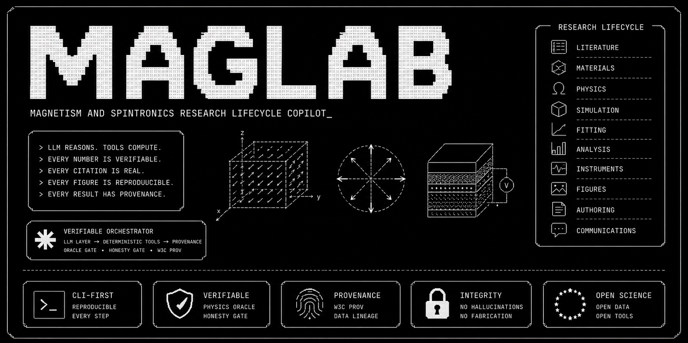
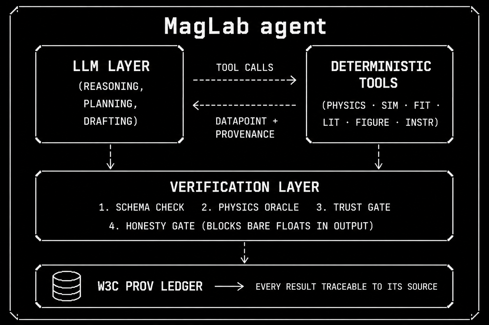

<h1 align="center">MagLab</h1>

<p align="center">
  <strong>An AI for Science harness for magnetism and spintronics research.</strong>
</p>

<p align="center">
  <a href="README.ko.md">한국어 README</a> ·
  <a href="docs/manuals/en/index.md">Manuals</a> ·
  <a href="docs/manuals/ko/index.md">한국어 매뉴얼</a>
</p>

<p align="center">
  
  
  
  
  &nbsp;
  
  
  
  
  
</p>



## Why MagLab Exists

MagLab was built for researchers in magnetism and spintronics who want AI for
Science to become a practical lab instrument, not a demo prompt. The goal is to
support the parts of research that actually slow scientists down: finding and
auditing literature, translating material stacks into parameters, checking units
and physical ranges, moving between simulation scales, fitting spintronic
effects, generating reproducible figures, drafting instrument scripts, keeping
an electronic lab notebook, reviewing manuscripts, and turning verified results
into papers, posters, slides, rebuttals, and grant text.

The central design choice is that MagLab is a harness platform. The LLM layer
plans, routes, explains, and drafts. Domain modules perform the scientific work:
physics formulae, unit conversion, material lookup, simulation pipelines,
fitters, figure renderers, literature connectors, SCPI safety checks, data
lineage, and review workflows. The point is not to replace the scientist. The
point is to make the scientist's research loop faster, more organized, and more
reproducible.

## Why AI for Science Needs a Harness

AI for Science matters because modern research is no longer limited only by
ideas. It is also limited by coordination overhead: too many papers to audit,
too many file formats, too many unit conventions, too many simulation backends,
too many figure revisions, and too much undocumented context living in lab
notebooks, scripts, and memory. A useful scientific AI system therefore cannot
be just a chatbot. It needs a controlled environment where language models can
ask for deterministic tools, receive structured results, preserve provenance,
and expose enough of the process for a scientist to inspect it.

MagLab takes that position seriously. It treats the LLM as an orchestration
layer, not as the source of scientific truth. Numerical values should come from
formula modules, data files, fitters, simulations, literature records, or
explicit user input. Figures should be vector artifacts tied to data and
provenance, not generated raster guesses. Manuscripts, posters, and emails
should start from verified results and remain marked for human review. This is
what makes AI for Science operational: the model helps the research loop move,
while the harness keeps the loop inspectable.

For magnetism and spintronics, this is especially important. A typical project
crosses material stacks, magnetic units, transport geometries, micromagnetic
assumptions, solver-specific files, fitted effect models, and publication
figures. Small mistakes are easy: mixing CGS and SI, reporting a fit parameter
outside a physical range, forgetting how a figure was generated, or citing a
paper that does not support the claim. MagLab is built around those failure
modes.

## What It Helps With

| Research bottleneck | MagLab support |
|---|---|
| Literature overload | Extract keywords from a paper folder, search OpenAlex/Semantic Scholar/arXiv/Crossref, build an evidence matrix, inspect authors, journal metrics, citation graphs, and local corpus context. |
| Material and unit friction | Query magnetic materials, build multilayer stacks, compute exchange length/FMR/domain-wall/skyrmion formulae, convert magnetic units, and run a physics oracle before downstream work. |
| Simulation handoff | Generate and validate micromagnetic specs, prepare DFT and atomistic inputs, parse solver outputs, and connect DFT -> atomistic -> micromagnetic -> device-scale workflows. |
| Fitting and interpretation | Fit AMR, AHE, OHE, PHE, SMR, USMR, ST-FMR, FMR/Kittel, damping, spin pumping/ISHE, DMI, domain-wall, skyrmion/Thiele, hysteresis, and Curie-temperature models. |
| Figure reproducibility | Build `FigureSpec` JSON, render journal-aware vector figures, compose multi-panel outputs, and use a schematic primitive catalog for spintronics figures. |
| Instrument scripting | Scaffold PyVISA drivers, validate SCPI sequences, ingest manuals for RAG, generate scripts from experiment descriptions, and run safety checks before hardware use. |
| Lab memory | Create structured ELN entries, list notes by date/sample/tag/type, generate measurement plans, and create DOE/active-learning next-step suggestions. |
| Review and critique | Run persona-style manuscript review, synthesize consensus/dissent, explain anomalous results, and keep AI assistance disclosure explicit. |
| Authoring and communication | Draft manuscript sections, cover letters, revision letters, rebuttals, abstracts, grants, emails, slides, and posters while preserving human review requirements. |
| Orchestration | Use the interactive REPL, Ralph loops, MCP server/client, subagents, skills, gateway bots, cost tracking, checkpoints, and provenance records to coordinate a full research lifecycle. |

## Start Here

Install MagLab as a global terminal program with the recommended research
bundle. The bundle pulls in every MagLab research feature so the terminal can
guide you through any remaining provider, solver, instrument, or gateway setup.

```sh
git clone https://github.com/TaewoooPark/MagLab.git
cd MagLab
pipx install --python python3.12 --editable ".[research]"
maglab install doctor
maglab doctor
maglab setup all
maglab manual --lang en
```

If `pipx` or Python 3.12 is missing on macOS, use this known-good path:

```sh
uv tool install pipx --python python3.12
pipx ensurepath
pipx install --python python3.12 --editable ".[research]"
```

After that, open any research folder and run `maglab`. MagLab keeps global
config/data/cache in your user app directories, but reads and writes project
artifacts relative to the folder where you launched it.

```sh
cd ~/research/my_spintronics_project
maglab workspace init
maglab workspace status
maglab workspace brief
maglab workspace tree --summary --type docs --max-depth 2
maglab workspace tree --changed
maglab
```

Run deterministic tools without an LLM key:

```sh
maglab physics compute exchange_length A=13e-12 Ms=860e3
maglab physics units 1000 Oe T
maglab mat search Py --json
maglab mat show Permalloy
maglab analyze model stfmr
maglab figure primitives list
```

Connect an LLM backend when you want natural-language orchestration, drafting,
review, or agent workflows. Codex is supported through the official authenticated
Codex CLI; MagLab does not store Codex OAuth tokens. Direct API providers are
also supported for Anthropic, Grok, DeepSeek, Qwen, Kimi, Gemini, and OpenAI.

```sh
maglab auth codex
maglab auth anthropic
maglab auth qwen
maglab auth status
maglab auth test
maglab doctor --smoke
maglab
```

Inside the REPL, use `/help quick` for the first-run path and `/help all` for
the full slash-command tree. Use `/workspace brief`, `/doctor`, `/sim doctor
--explain`, and `/connect status` to inspect the current folder and setup state.
Use
`/connect codex`, `/connect <provider>`, `/connect api <provider>`, or
`/connect ollama` to switch backends. API-key commands always use hidden
terminal input; `maglab auth set <provider>` remains available for explicit key
storage and scripting. Use `/reset config` to restore the previous config backup
or `/reset defaults` to return MagLab to a clean default config.

`maglab doctor` is the installation audit. It checks the active folder,
LLM backend, feature extras, GPU/SSH/no-GPU simulation paths, bilingual manuals,
figure/export readiness, poster/deck templates, workspace-scoped LLM file tools,
and physics/provenance gates against the UX promised in `plan/`.

One-shot mode is useful in scripts and CI:

```sh
maglab -p "Plan a reproducible ST-FMR analysis workflow for Pt/CoFeB/MgO"
```

## Manuals

The README is the map. The manuals are the operating instructions.
They are also available from an installed global CLI:

```sh
maglab manual --lang en
maglab manual figures --lang ko
```

| Area | English | Korean |
|---|---|---|
| Manual index | [docs/manuals/en/index.md](docs/manuals/en/index.md) | [docs/manuals/ko/index.md](docs/manuals/ko/index.md) |
| Quickstart and operating manual | [English](docs/manuals/en/quickstart-operations.md) | [한국어](docs/manuals/ko/quickstart-operations.md) |
| Literature intelligence | [English](docs/manuals/en/literature.md) | [한국어](docs/manuals/ko/literature.md) |
| Materials and physics | [English](docs/manuals/en/materials-physics.md) | [한국어](docs/manuals/ko/materials-physics.md) |
| Simulation | [English](docs/manuals/en/simulation.md) | [한국어](docs/manuals/ko/simulation.md) |
| Analysis and fitting | [English](docs/manuals/en/analysis-fitting.md) | [한국어](docs/manuals/ko/analysis-fitting.md) |
| Figures | [English](docs/manuals/en/figures.md) | [한국어](docs/manuals/ko/figures.md) |
| Instruments | [English](docs/manuals/en/instruments.md) | [한국어](docs/manuals/ko/instruments.md) |
| Lab notebook and planning | [English](docs/manuals/en/lab-planning.md) | [한국어](docs/manuals/ko/lab-planning.md) |
| Review and anomaly explanation | [English](docs/manuals/en/review-explain.md) | [한국어](docs/manuals/ko/review-explain.md) |
| Authoring and communications | [English](docs/manuals/en/authoring-comms.md) | [한국어](docs/manuals/ko/authoring-comms.md) |
| Orchestration, agents, MCP, gateway | [English](docs/manuals/en/orchestration.md) | [한국어](docs/manuals/ko/orchestration.md) |

## Practical Operating Manual

Use MagLab in layers. Start with deterministic commands, then add model
orchestration only when the folder, dependencies, and provenance path are clear.

| Situation | First commands | What to check before trusting output |
|---|---|---|
| Fresh clone or global install | `maglab install doctor` -> `maglab doctor` -> `maglab setup all` | Python version, installed extras, global command path, missing optional solvers. |
| Opening a new research folder | `maglab workspace init` -> `maglab workspace brief` -> `maglab workspace tree --summary` | `MAGLAB.md`, visible project files, ignored/private paths, generated output directory. |
| Connecting a model | `maglab auth codex` or `maglab auth <provider>` -> `maglab auth status` -> `maglab doctor --smoke` | Whether the backend returns the sentinel, where credentials are stored, selected model. |
| No GPU available | `maglab sim doctor --backend auto --explain` -> `maglab sim pipeline --backend mock` | Mock outputs are workflow artifacts, not physical solver results. Use CPU for small real runs. |
| Local GPU available | `maglab sim doctor --backend local-gpu` | `mumax3`, `nvidia-smi`, mesh size, small validated test job before spending time. |
| SSH GPU or cluster | `maglab sim doctor --backend ssh-gpu --host <host> --user <user>` | No connection is opened unless `--probe-ssh` is added; verify SSH keys and remote modules first. |
| Measurement CSV ready | `maglab analyze load data.csv` -> `maglab analyze model <effect>` -> `maglab fit --effect <effect> data.csv` | Required columns, geometry assumptions, parameter bounds, residuals, provenance IDs. |
| Figure needed | `maglab figure spec` -> `maglab figure render ... --datapoints ledger.json` | DataPoint binding, axis labels, units, journal width, vector output. |
| Poster or slides needed | `maglab present templates --detail` -> `maglab present slides|poster ...` | `DESIGN_BRIEF.md`, `[FILL]` fields, figure sources, venue size/timing rules. |
| Writing or rebuttal | `maglab write ... --dry-run` or `maglab comms revision ...` | `HUMAN REVIEW REQUIRED`, citation existence, claim support, no unsupported numbers. |

Inside the REPL, the same flow is available through slash commands:

```text
/help quick
/workspace brief
/doctor
/setup all
/connect codex
/connect openai
/sim doctor --explain
/manual ko quickstart-operations
```

During LLM calls, MagLab prints a compact activity trace: model stage, elapsed
time, stop instruction, and tool/file references when they are visible to the
harness. Hidden model reasoning is not printed. The useful observable signal is
what was run, which Python module mediated it, and which workspace files were
referenced or touched.

## Example Research Loops

**Literature to experiment plan**

```sh
maglab lit search papers/pt_cofeb_mgo --top-n 40
maglab lit authors "spin orbit torque CoFeB MgO"
maglab lab plan "SOT efficiency in Pt/CoFeB/MgO" --n-doe 16 --output sot_plan.yaml
```

**Measurement to fit to figure**

```sh
maglab analyze load data/stfmr.csv --columns frequency,field,voltage
maglab analyze model stfmr
maglab fit --effect stfmr data/stfmr.csv --method least_squares
maglab fit --discover --effect ordinary_hall data/hall.csv --init-grid '{"R_H":[-1e-10,0,1e-10]}'
maglab sim plot data/stfmr.csv --journal aps --format pdf --output figures/stfmr.pdf
```

**Multiscale simulation handoff**

```sh
maglab sim dft --structure bcc_fe --engine qe --calc-type jij --output-dir runs/dft_fe
maglab sim atomistic --engine vampire --j-ij-k 398 --t-max-k 1300 --output-dir runs/vampire_fe
maglab sim pipeline --structure bcc_fe --scales dft,atomistic,micro,device --backend mock
```

**Instrument workflow**

```sh
maglab instr ingest "Keithley 2400" --manufacturer Keithley --manual-path manuals/keithley_2400.pdf
maglab instr skillgen "Keithley 2400" --manufacturer Keithley --safety-model keithley-2400
maglab instr script "Keithley 2400" --description "field sweep Hall voltage measurement" --output hall_sweep.py
maglab instr check hall_sweep.py
```

**Authoring after verified results**

```sh
maglab write "ST-FMR fit gives xi_DL=0.12 with provenance IDs ..." --journal prl --dry-run
maglab comms cover-letter --journal "Physical Review Letters" --title "Spin-orbit torque ..."
maglab present templates --detail
maglab present slides "Key results and figures from the SOT study" --template aps-12min --format beamer --n-slides 10
maglab present poster "Key results and figures from the SOT study" --template aps-march-poster --format svg
```

**First-run readiness check**

```sh
maglab doctor
maglab doctor --feature simulation --sim-backend ssh-gpu --host gpu.example.edu --user alice
```

## Command Surface

```text
maglab                    interactive research agent
maglab -p "QUERY"         non-interactive one-shot query

auth      codex · claude · gemini-cli · ollama · anthropic · grok · deepseek · qwen · kimi · gemini · openai · set · list · status · test
physics   compute · units · oracle
mat       list · show · build
sim       doctor · micro · validate · plot · job · dft · atomistic · pipeline
fit       --effect EFFECT DATA.csv
analyze   load · model · consistency · symmetry
device    fom
figure    spec · render · compose · export
          primitives list · show
instr     scaffold · scpi · script · check · ingest · skillgen · implement
lit       search · authors · keywords · journal · graph
lab       note · note-list · plan
review    MANUSCRIPT
explain   ANOMALY
ralph     start · status · cancel
write     RESULTS
comms     revision · cover-letter · email · abstract · grant · rebuttal
gateway   setup · start · stop · status · install
present   templates · slides · poster
hypotheses TOPIC
mcp       list · serve · add · enable · disable
agents    list · show
skill     list
cost
manual    [topic] --lang en|ko
config    show · path · restore · reset
install   doctor
doctor
workspace status · brief · init · tree
theme     list · set
version · info
```

## Architecture



MagLab is organized as a layered harness:

```text
researcher intent
  -> CLI / REPL / gateway / MCP
  -> orchestrator, subagents, skills, checkpoints, budgets
  -> physics oracle, honesty gate, DataPoint, W3C PROV ledger
  -> deterministic engines
       physics · materials · simulation · analysis · figures · instruments
  -> lifecycle applications
       literature · lab notebook · review · authoring · communications
  -> human-reviewed scientific output
```

The verification layer is not the mission statement. It is the safety rail that
lets MagLab be useful in scientific work. MagLab should help a researcher move
from question to evidence to experiment to analysis to communication while
keeping enough structure that the work can be inspected later.

## Package Layout

```text
maglab/
├── core/          orchestrator, hooks, autonomy, budgets, checkpoints, Ralph, subagents
├── llm/           provider abstraction, credentials, tool schemas, MCP client
├── physics/       formulae, units, materials database, physics oracle
├── sim/           DFT, atomistic, micromagnetic, multiscale pipeline, backends
├── analysis/      effect registry, fitting, consistency, symmetry, device FoM
├── figure/        FigureSpec, renderers, primitives, journal styles, exports
├── instrument/    SCPI, PyVISA scaffold, manual RAG, safety checks, scripts
├── literature/    connectors, corpus, RAG, graphs, authors, journals, keywords
├── lab/           ELN entries, measurement planning, active learning
├── reviewer/      persona review, meta-review, rubrics, disclosure, corpus RAG
├── authoring/     manuscript, BibTeX, data vault, slides, posters, comms
├── gateway/       Slack, Telegram, Discord daemon adapters
├── provenance/    DataPoint, W3C PROV ledger, store
├── report/        honesty gate and report rendering
├── ui/            terminal rendering and themes
└── mcp_server.py  external agent tool server
```

`harness.manifest.json` defines the agent society around this package:
`local-context-librarian`, `search-scout`, `citation-auditor`, `paper-reviewer`,
`synthesis-editor`, `physics-validator`, `result-analyst`, `experiment-manager`,
`hypothesis-gen`, and `comms-writer`.

## Installation Details

Python 3.11 to 3.13 is supported.

```sh
uv pip install -e .                    # core
uv pip install -e ".[research]"        # recommended: all research features
uv pip install -e ".[llm]"             # LLM backends
uv pip install -e ".[mcp]"             # MCP server and client
uv pip install -e ".[sim]"             # simulation stack
uv pip install -e ".[figure]"          # plotting and figure rendering
uv pip install -e ".[instr]"           # PyVISA and instrument manuals
uv pip install -e ".[literature]"      # literature APIs and RAG
uv pip install -e ".[reviewer]"        # reviewer panel support
uv pip install -e ".[authoring]"       # papers, slides, posters, docs
uv pip install -e ".[gateway]"         # messaging gateway
uv pip install -e ".[dev]"             # ruff, mypy, pytest, pre-commit
```

For normal research use, prefer the all-in-one `.[research]` extra. Then run
`maglab install doctor` to check Python, PATH, global app paths, and installed
research extras; run `maglab doctor` for a first-run readiness report and
`maglab setup all` to see feature-specific setup checks, optional remote
packages, terminal setup commands, and the matching REPL slash commands. Inside
the MagLab REPL, use `/setup`,
`/setup <feature>`, or direct commands such as `/setup-llm`,
`/setup-literature`, `/setup-simulation`, `/setup-figure`,
`/setup-instrument`, `/setup-authoring`, `/setup-review`, `/setup-gateway`, and
`/setup-mcp`. Existing working dependencies and commands are treated as ready;
the setup and doctor views only tell you what still needs attention.

Some simulation engines require external binaries or remote-execution packages
that must be installed separately: OOMMF, MuMax3, VAMPIRE, VASP, Quantum
ESPRESSO, HPC/GPU execution environments, and `paramiko` for Python-native SSH.
MagLab can still generate inputs, validate specs, run mock paths, and parse
prepared outputs without owning those solver installations.

## Development

```sh
uv pip install -e ".[dev]"
ruff check maglab/ tests/
mypy maglab/
pytest
```

The test suite is organized around smoke, integrity, golden, and integration
markers. Quantitative validation is expected to be deterministic. LLM-as-judge
is not used for physics, fitting, citation, or numerical correctness.

## Project Docs

- [MAGLAB.md](MAGLAB.md): persistent project context and invariant principles
- [harness.manifest.json](harness.manifest.json): subagents, workflows, and model routing
- [Manuals](docs/manuals/en/index.md): feature-by-feature operating guide
- [한국어 매뉴얼](docs/manuals/ko/index.md): 기능별 한국어 사용 설명서
- [Repository metadata](docs/repository-metadata.md): GitHub description, topics, and social-preview copy

## Repository Metadata

Suggested GitHub description:

> AI for Science harness for magnetism and spintronics research: literature,
> physics, simulation, fitting, figures, instruments, authoring, and provenance
> in one CLI.

Suggested GitHub topics:

```text
ai-for-science, magnetism, spintronics, micromagnetics, materials-science,
scientific-computing, research-automation, llm-agents, cli, provenance,
simulation, data-analysis, scientific-figures, instruments, open-science
```

Suggested thumbnail/social preview description:

> MagLab turns the magnetism and spintronics research lifecycle into a
> verifiable CLI workflow: LLM orchestration wrapped around deterministic tools,
> provenance, simulation, fitting, figures, instruments, and scientific writing.

## License

MIT. See [LICENSE](LICENSE).

<p align="center">
Built with Python, NumPy, SciPy, lmfit, Matplotlib, Pydantic, and the assumption that researchers remain responsible for science.
</p>
