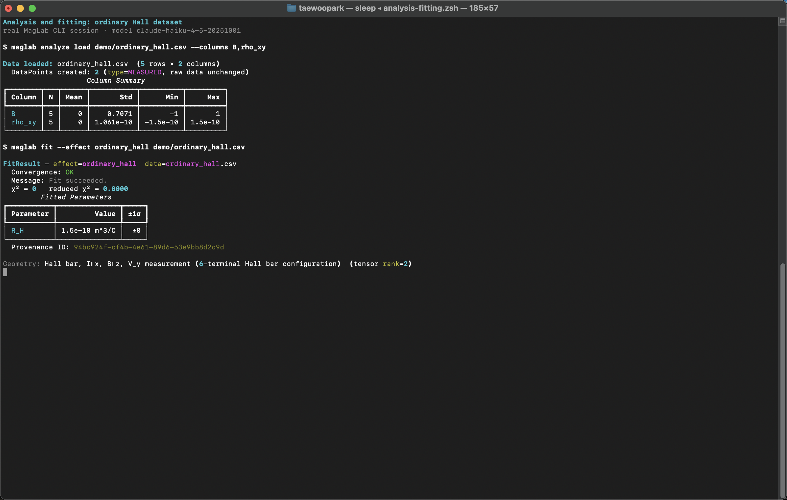
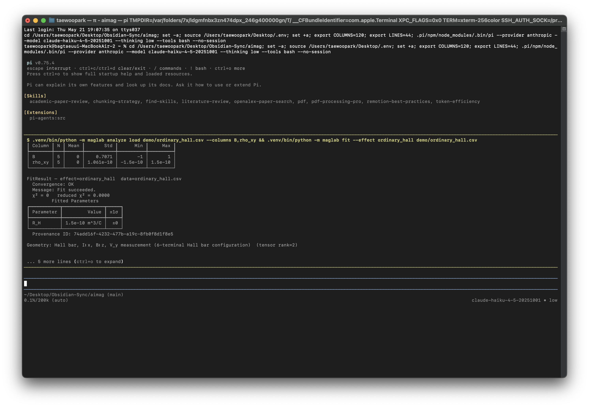

# Analysis and Fitting

[Manual index](index.md) · [한국어](../ko/analysis-fitting.md)

Use this module when you have measured or simulated data and need model-aware
fitting rather than ad hoc notebooks.

## Terminal Walkthrough

Real MagLab CLI data loading and ordinary Hall fitting:



The same analysis workflow executed inside PI's interactive TUI with the `!`
operator:



## Install

```sh
uv pip install -e .
```

The core dependencies include NumPy, SciPy, pandas, and lmfit.

## Commands

```sh
maglab analyze load data/stfmr.csv
maglab analyze model
maglab analyze model stfmr
maglab fit --effect stfmr data/stfmr.csv --method least_squares
maglab fit --discover --effect ordinary_hall data/hall.csv --init-grid '{"R_H":[-1e-10,0,1e-10]}'

maglab analyze consistency anomalous_hall ahe.csv ordinary_hall ohe.csv
maglab analyze symmetry 4/mmm
maglab analyze symmetry ignored --list

maglab device fom list
maglab device fom sot-mram --Ms 8e5 --t 2e-9 --Ku 4e5 --theta-sh 0.1
```

## Supported Analysis Tasks

- Load CSV/HDF5 data and summarize columns.
- Inspect effect models, required columns, parameter bounds, and references.
- Fit spintronic effect models through the registered provider system.
- Run deterministic bilevel inner-loop discovery over a known effect model
  form with multi-start initial values and AIC/BIC reporting.
- Compare fits for consistency.
- Check symmetry-allowed tensor components.
- Compute device figures of merit for SOT-MRAM, STT-MRAM, and racetrack devices.

## Effect Families

The effect registry includes models for AMR, AHE, ordinary Hall, planar Hall,
SMR, USMR, GMR/TMR, orbital Hall, topological Hall, FMR/Kittel, Gilbert damping,
ST-FMR, SOT harmonic Hall, spin pumping/ISHE, DMI, 1D domain-wall models,
macrospin/LLG, Thiele/skyrmion dynamics, Curie temperature, and hysteresis.

## Data Expectations

Each effect model declares required columns. Run this before fitting:

```sh
maglab analyze model EFFECT_NAME
```

Then make your CSV headers match the model. If a fit fails, check:

- Required columns.
- Unit consistency.
- Geometry JSON.
- Parameter bounds.
- Reduced chi-square and warnings.

## Discover Mode

`maglab fit --discover` is the CLI entry point promised in `plan/04-analysis.md`
for the deterministic inner layer of bilevel model discovery. In the current
terminal UX it does not let an LLM invent equations or numbers. It uses the
selected registered effect model as the model form, tries deterministic
initial-value candidates, applies the same physical parameter bounds, and
reports `chi2`, reduced `chi2`, AIC, BIC, and provenance.

For two-column effect models, MagLab chooses the first required column as `x`
and the last required column as `y`. For more complex data, pass `--x-col` and
`--y-col` explicitly.

## Handoff

```sh
maglab figure render fit_figure.json --datapoints fit_datapoints.json
maglab explain "ST-FMR symmetric component changes sign after annealing"
maglab write "Fit summary with provenance IDs..." --journal prl
```
