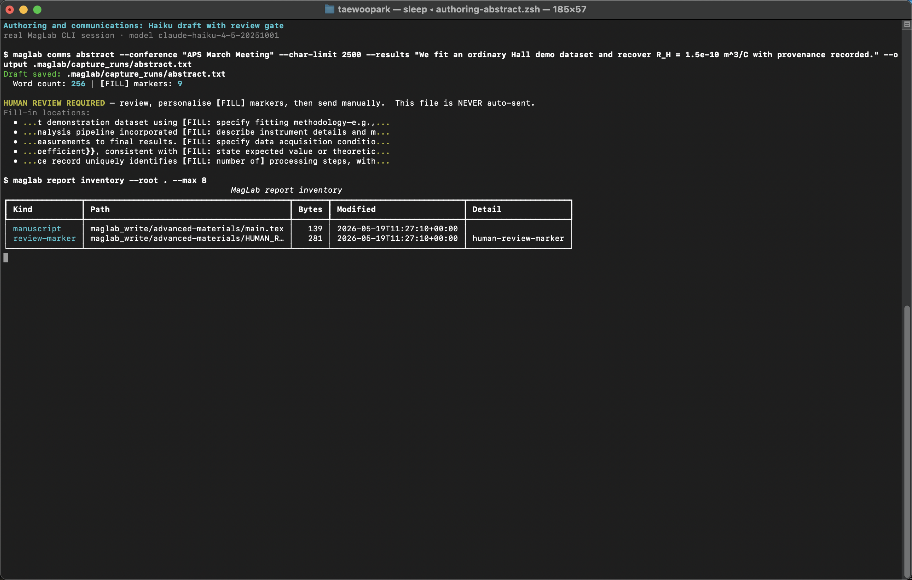
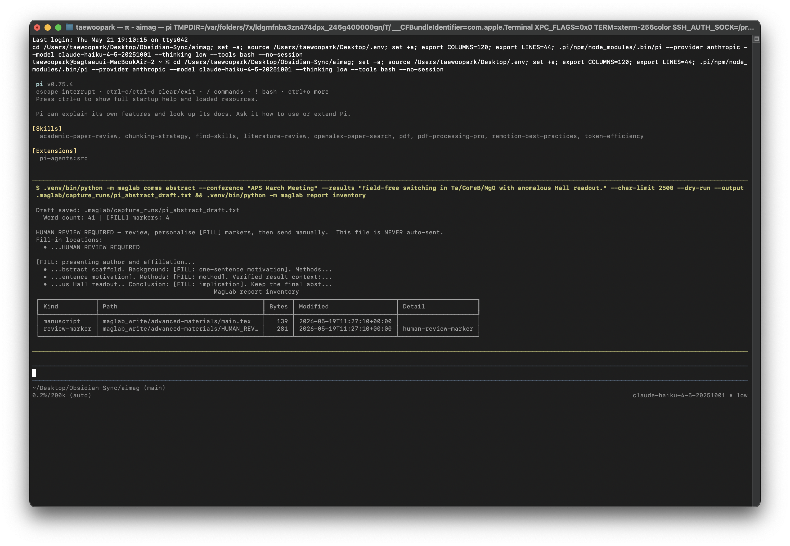

# Authoring and Communications

[Manual index](index.md) · [한국어](../ko/authoring-comms.md)

Use this module after you have real results, figures, citations, and notes.
MagLab can draft scientific text, but every output is for human review.

## Terminal Walkthrough

Real MagLab CLI abstract drafting and report inventory:



The same authoring workflow executed inside PI's interactive TUI with the `!`
operator:



## Install

```sh
uv pip install -e ".[authoring]"
```

## Manuscript Drafting

```sh
maglab write "ST-FMR fit gives xi_DL=0.12 with provenance IDs ..." --journal prl --dry-run
maglab write "Summary of verified PRB results, figures, citations, and provenance IDs ..." --journal prb --output-dir maglab_write/prb
```

The output directory includes a `HUMAN_REVIEW_REQUIRED.txt` marker. AI tools are
not authors. Named researchers remain responsible for content, data, and
citations.

`maglab write` currently receives the results summary as a text argument. If
your summary is in a file, review it first and pass the relevant condensed
summary text.

## Communications

```sh
maglab comms cover-letter --journal "Physical Review Letters" --title "Spin-orbit torque ..."
maglab comms revision --review decision_letter.txt --notes response_notes.md
maglab comms rebuttal --reviews conference_reviews.txt --notes rebuttal_notes.md
maglab comms abstract --conference "APS March Meeting" --char-limit 1750 --results results.md
maglab comms grant --agency NSF --mechanism NSF-DMR --aims aims.md
maglab comms email collaboration --recipient "Prof. X" --purpose "follow-up on SOT dataset"
```

## Presentations

```sh
maglab present templates
maglab present templates --detail
maglab present templates --kind poster
maglab present slides "Main results and verified figures" --template aps-12min --format beamer --n-slides 10
maglab present slides "Main results and verified figures" --template aps-12min --format beamer --dry-run
maglab present slides "Main results and verified figures" --format pptx
maglab present poster "Main results and verified figures" --size A0 --format svg
maglab present poster "Main results and verified figures" --template aps-march-poster --format svg
maglab present poster "Main results and verified figures" --template aps-march-poster --format svg --dry-run
maglab present poster "Main results and verified figures" --size A0 --format beamerposter
```

Template profiles include APS March/April contributed oral talks (10 minute
talk + 2 minute Q&A), longer seminar decks, internal updates, APS March/April
96 x 48 inch poster boards, A0 SVG/PDF posters, and A0 beamerposter LaTeX
source. Use `--detail` to print the installed source file and public reference
URLs behind each profile.

`--dry-run` still writes format-valid skeletons: Beamer/Marp/PPTX decks,
SVG/beamerposter poster layouts, `HUMAN_REVIEW_REQUIRED.txt`, and
`DESIGN_BRIEF.md`. The design brief records the selected template profile,
installed source files, public reference URLs, and review checklist beside the
artifact. It does not call an LLM, and every `[FILL]` field must be replaced
with verified content before presentation or submission.

## Recommended Input Pack

Before calling authoring tools, prepare:

- Results summary.
- Figure paths or FigureSpec files.
- Evidence matrix or BibTeX library.
- Fit outputs and provenance IDs.
- Target journal or conference.
- Human-written constraints: tone, claims to avoid, required citations, and word limits.

## Handoff

Authoring outputs should be reviewed, edited, and version-controlled:

```sh
git diff maglab_write/
maglab review maglab_write/prl/main.tex --journal prl
```
