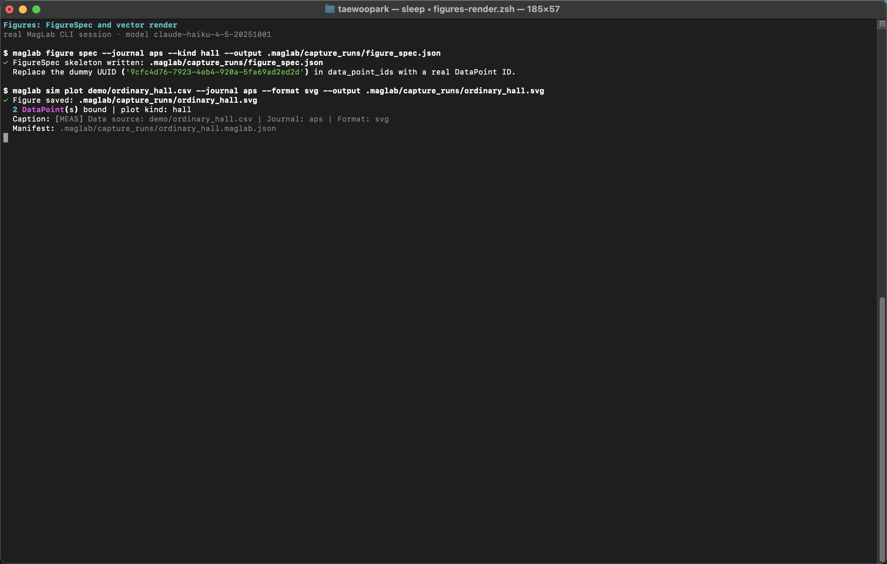
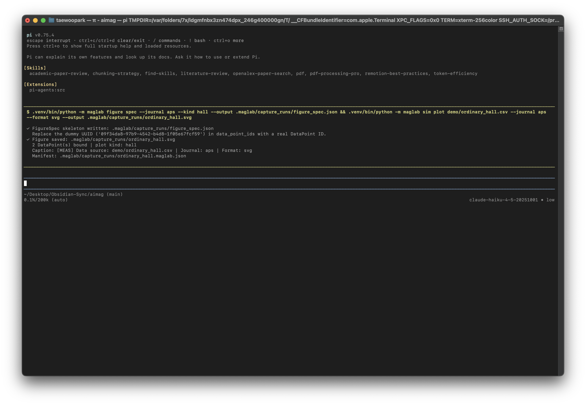

# Figures

[Manual index](index.md) · [한국어](../ko/figures.md)

Use this module when a figure needs to be a reproducible research artifact:
data-bound, journal-aware, vector-exportable, and inspectable.

## Terminal Walkthrough

Real MagLab CLI figure spec and SVG plot generation:



The same figure workflow executed inside PI's interactive TUI with the `!`
operator:



## Install

```sh
uv pip install -e ".[figure]"
```

## Commands

```sh
maglab figure primitives list
maglab figure primitives show hall-bar
maglab figure primitives ingest schematics/sot-loop.svg \
  --name sot-loop --description "Spin-orbit torque loop schematic." --tag SOT

maglab figure spec --journal nature --kind hysteresis --output figspec.json
maglab figure render figspec.json --datapoints datapoints.json --output figure.pdf
maglab figure compose multipanel.json --output multipanel.svg --format svg
maglab figure export multipanel.json --output figures/panel --format pdf --format svg

maglab sim plot data.csv --journal aps --format pdf --output data_plot.pdf
```

## FigureSpec Workflow

1. Create or edit a `FigureSpec` JSON.
2. Bind the spec to `DataPoint` records.
3. Render locally and inspect the output.
4. Export journal-ready vector formats.
5. Keep the spec next to the manuscript or data directory.

## Primitive Catalog

The schematic catalog contains reusable spintronics and magnetism primitives:
Hall bars, MTJ pillars, multilayer stacks, Bloch and Neel domain walls,
skyrmions, LLG precession, coordinate axes, measurement geometries, and
spin-texture color wheels.

Use the catalog to avoid redrawing the same schematic from scratch:

```sh
maglab figure primitives list --search skyrmion
maglab figure primitives show skyrmion-bloch
```

## Primitive Ingestion

When a useful schematic does not exist in the built-in catalog, ingest the
local SVG or JSON descriptor into a workspace review package instead of pasting
ad hoc artwork into the manuscript. The deterministic ingestion core writes:

- `.maglab/figure/primitives/catalog/<name>/PRIMITIVE.md`
- `.maglab/figure/primitives/catalog/<name>/primitive.json`
- `.maglab/figure/primitives/catalog/<name>/preview.svg`
- `.maglab/figure/primitives/catalog/<name>/quality.json`
- `.maglab/figure/primitives/catalog/<name>/REVIEW.md`

CLI usage:

```sh
maglab figure primitives ingest schematics/sot-loop.svg \
  --name sot-loop \
  --category concept/process \
  --description "Spin-orbit torque loop schematic." \
  --tag SOT \
  --tag torque
```

Python usage for custom automation:

```python
from maglab.figure.primitives import ingest_primitive

result = ingest_primitive(
    "schematics/sot-loop.svg",
    metadata={
        "category": "concept/process",
        "tags": ["SOT", "torque"],
        "description": "Spin-orbit torque loop schematic.",
        "physics_convention": "Current along x; spin accumulation along y.",
        "references": ["doi:10.1038/nnano.2013.243"],
    },
)
print(result.status)
print(result.review_md)
```

JSON descriptors may provide `svg` or `svg_path` plus metadata fields such as
`name`, `category`, `tags`, `parameters`, `physics_convention`, `references`,
and `journal_styles`. Ingestion never executes descriptor code. It only copies
vector material, normalizes metadata, and records quality checks such as SVG
parse validity, deterministic dimensions, embedded raster use, external links,
parameterization, references, and physics convention completeness.

Treat `ready_for_promotion` as "review passed, promotion possible", not as
automatic installation into the built-in catalog. Promotion still requires a
`primitive.py` implementation and tests.

## Journal Styles

Figure rendering supports journal profiles such as APS, Nature, IEEE, and
Elsevier. These profiles should be treated as starting points: verify final
font sizes, labels, and export requirements against the target journal.

## Handoff

Figures are usually consumed by:

```sh
maglab write "Results with FigureSpec path figures/figspec.json"
maglab present templates
maglab present slides "Use figures/stfmr.pdf and figures/device.svg"
maglab present poster "Use verified figure exports from figures/"
```
