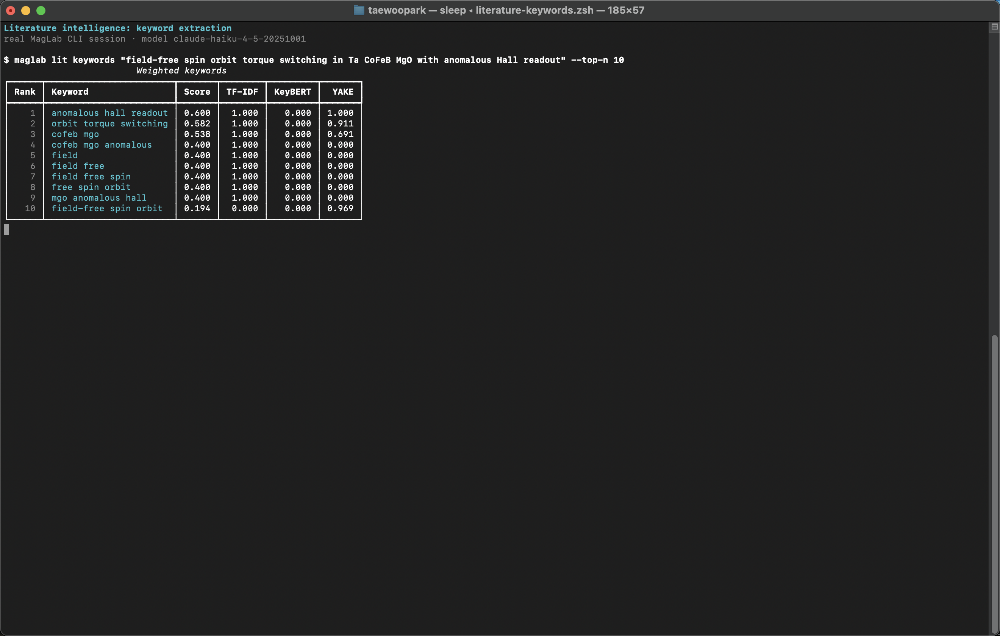
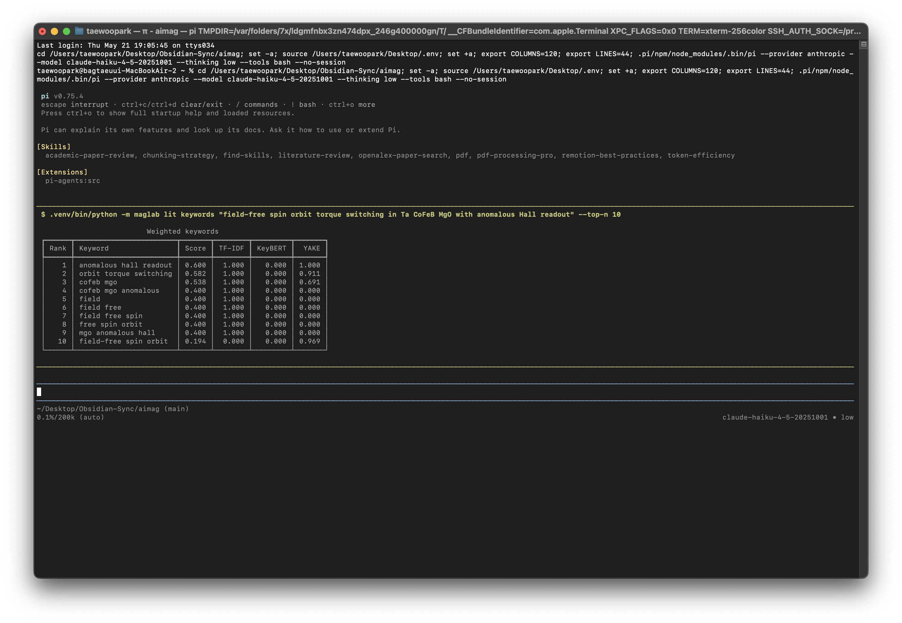

# 문헌 인텔리전스

[매뉴얼 인덱스](index.md) · [English](../en/literature.md)

이 모듈은 "문단을 써줘"가 아니라 "어떤 증거를 찾아야 하고, 무엇을 확인해야
하며, 어떻게 정리해야 다음 연구 결정을 내릴 수 있는가"를 다룰 때 사용합니다.

## 터미널 실행 화면

실제 MagLab CLI 키워드 추출 화면입니다.



같은 workflow를 PI 대화형 TUI 안에서 `!` operator로 실행한 화면입니다.



## 하는 일

- 논문 폴더나 자유 텍스트에서 weighted keyword를 추출합니다.
- connector module을 통해 문헌 source를 검색합니다.
- DOI, open-access, retraction, tier field를 가진 evidence matrix를 만듭니다.
- 주제별 주요 저자를 찾습니다.
- open journal metric을 조회합니다.
- 로컬 citation/knowledge graph record를 탐색합니다.

## 설치

```sh
uv pip install -e ".[literature]"
```

## 핵심 명령

```sh
maglab lit search papers/spin_orbit_torque --top-n 40 --show 15
maglab lit search papers/spin_orbit_torque --matrix-out evidence_matrix.json
maglab lit keywords "spin Hall magnetoresistance in Pt/YIG bilayers"
maglab lit authors "orbital Hall effect ferromagnet"
maglab lit journal "Physical Review Letters"
maglab lit graph "spin Hall effect"
maglab lit graph "spin Hall effect" --cite-map "10.1103/PhysRevLett.xxx"
```

## 일반적인 workflow

1. 다운로드한 논문 PDF나 text file을 프로젝트 폴더에 모읍니다.
2. `maglab lit search <folder>`로 keyword를 추출하고 evidence matrix를 만듭니다.
3. `maglab lit authors <topic>`으로 반드시 확인해야 할 연구자를 찾습니다.
4. `maglab lit journal <journal>`로 투고 후보 저널의 open metric을 확인합니다.
5. evidence matrix를 analysis, review, authoring workflow로 넘깁니다.

## 출력 파일

`maglab lit search`는 matrix generation이 켜져 있으면 evidence matrix JSON을
씁니다. 이 파일은 연구자가 읽고 수정해야 하는 working artifact입니다. 약한
record를 지우고, note를 추가하고, review나 authoring에서 재사용하세요.

## 실무 메모

- keyword 단계는 로컬 폴더에서 실행할 수 있습니다.
- live search는 API availability와 optional connector package에 의존합니다.
- retraction과 verification field는 논문을 읽는 일을 대체하지 않습니다.

## 다음 단계

```sh
maglab lab plan "SOT efficiency in Pt/CoFeB/MgO"
maglab review draft.md --journal prl
maglab write "Verified evidence matrix plus key measured results..." --journal prl
```
