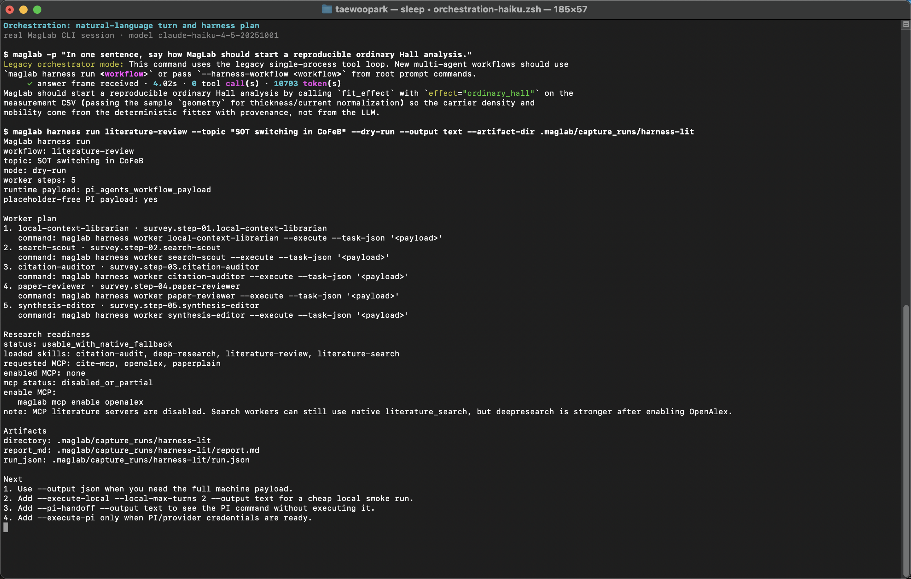
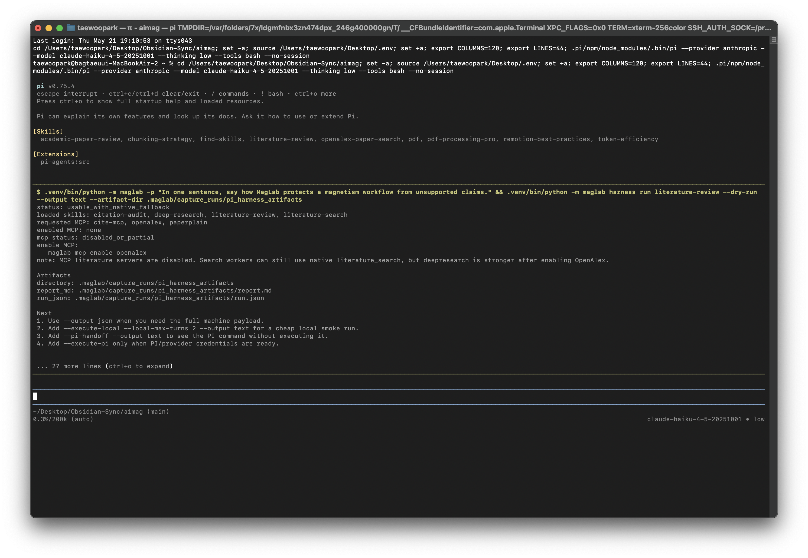

# 오케스트레이션, Agent, MCP, Gateway

[매뉴얼 인덱스](index.md) · [English](../en/orchestration.md)

단일 명령을 실행하는 것이 아니라 여러 연구 도구를 MagLab이 조율하게 하고
싶을 때 사용합니다.

## 터미널 실행 화면

실제 MagLab CLI에서 Anthropic Haiku로 실행한 one-shot orchestration 화면입니다.



PI에서도 같은 작업을 대화형으로 운용할 수 있습니다. 시작 화면에는 skill conflict
없이 로드된 skill/extension이 보여야 합니다.


PI 안에서는 `!` operator로 MagLab 명령을 실행합니다.


harness readiness와 handoff 흐름도 명시적인 CLI action으로 확인합니다.



## Interactive와 one-shot 사용

```sh
maglab
maglab -p "Plan a reproducible SOT analysis workflow for Pt/CoFeB/MgO"
maglab doctor
maglab doctor --smoke
maglab workspace brief
maglab workspace tree --summary --type docs --max-depth 2
maglab workspace tree --changed
```

REPL은 자연어 표면입니다. deterministic tool, notebook, literature workflow,
analysis, authoring으로 작업을 라우팅하는 데 사용합니다.

설치 직후에는 `maglab doctor`를 먼저 실행하세요. 현재 workspace, `MAGLAB.md`,
configured backend, optional research extra, 외부 solver, simulation readiness를
비밀값 출력 없이 한 번에 점검합니다.
기본 doctor는 빠른 등록 상태 확인만 수행합니다. 실제 LLM sentinel prompt까지
보내 delegated CLI/API 출력이 순수 model content로 parse되는지 검증하려면
`maglab doctor --smoke`를 사용하세요.

프로젝트 질문을 하기 전에는 `workspace brief`로 현재 폴더를 먼저 요약하세요.
폴더가 크면 `workspace tree --type docs|code|data`, `--max-depth`,
`--changed`로 MagLab이나 모델이 볼 범위를 좁힐 수 있습니다.

## Credential과 configuration

```sh
maglab auth codex
maglab auth anthropic
maglab auth grok
maglab auth deepseek
maglab auth qwen
maglab auth kimi
maglab auth gemini
maglab auth openai
maglab auth list
maglab auth test anthropic
maglab auth status
maglab doctor --feature llm
maglab config
maglab cost
maglab theme list
maglab theme set mono
```

Codex는 먼저 공식 Codex CLI에서 인증합니다. 그 다음 `maglab auth codex`를
실행하거나 REPL 안에서 `/connect codex`를 사용하세요. MagLab은
`config.toml`에 backend 선택만 저장하고 Codex OAuth token은 공식 CLI에 남깁니다.

REPL에서는 `/help quick`이 첫 사용 경로를 보여주고, `/help all`이 전체 tree를
보여줍니다. `/help workspace`, `/help llm`, `/help sim`, `/help figure`처럼
영역별 help도 볼 수 있습니다.

직접 API provider는 provider 명령을 실행한 뒤 터미널 숨김 입력으로 key를
넣습니다. REPL에서는 `/connect anthropic`, `/connect grok`,
`/connect deepseek`, `/connect qwen`, `/connect kimi`, `/connect gemini`,
`/connect openai`를 사용할 수 있습니다. 각 provider는 별도의 MagLab runtime
profile을 로드하므로, 모델은 자신이 MagLab research orchestration agent로
동작한다는 전제와 provider별 planning/verification 지침을 함께 받습니다.

## Subagent와 skill

```sh
maglab agents list
maglab agents show citation-auditor
maglab skill list
maglab harness doctor
maglab harness compile literature-review
maglab harness compile --write
maglab harness compile --check
maglab harness run literature-review --dry-run --output text
maglab harness run literature-review --topic "Find SOT papers" --execute-local --local-max-turns 2 --output text
maglab harness pi-tool --payload-json '{"workflow":"literature-review","input":"Find SOT papers"}' --output text
maglab run "Find SOT papers" --harness-workflow literature-review
maglab harness worker search-scout --task "Find SOT papers"
maglab harness worker search-scout --task-json '{"workflow":"literature-review","input":"Find SOT papers"}' --execute
```

Subagent는 `harness.manifest.json`에 선언되어 있습니다. local corpus checking,
search scouting, citation auditing, paper review, physics validation, result
analysis, experiment management, hypothesis generation, communications writing
같은 bounded role을 나타냅니다.

현재 실행 표면은 세 가지입니다.

- Legacy MagLab CLI/REPL mode: `maglab`, `maglab -p ...`, Ralph, 기존
  orchestrator는 MagLab의 기존 backend 계층으로 model call을 라우팅합니다.
- Deterministic command: `maglab physics ...`, `maglab lit ...`,
  `maglab analyze ...`, `maglab figure ...` 같은 명령은 구체적인 MagLab
  모듈을 실행합니다. 해당 기능이 별도로 요구하지 않으면 LLM key가 필요하지
  않습니다.
- PI harness mode: `maglab harness ...`는 manifest workflow를 PI와
  smolagents worker로 실행하기 위한 전환 표면입니다. 현재 CLI는 readiness
  확인, `literature-review` workflow graph compile, project-local `.pi/`
  wrapper 생성/검사, manifest reference validation, workflow 또는 worker 계획
  표시를 지원합니다.
  live PI 실행을 가짜로 흉내 내지는 않습니다.

`maglab harness doctor`는 PI, smolagents, LiteLLM, MCP 준비 상태를 나눠서
보여줍니다. `maglab harness compile literature-review`는 manifest workflow
변환을 검증하고, `maglab harness compile --write`는 `.pi/agents`와
`.pi/workflows`를 쓰며, `maglab harness compile --check`는 generated wrapper
drift와 manifest reference drift를 탐지합니다. `maglab harness run literature-review --dry-run --output text`는 PI나
live model worker를 시작하지 않고 workflow 실행 계획을 사람이 읽기 쉬운 요약으로
보여줍니다. 자동화가 전체 machine contract를 필요로 할 때는 `--output json`을
사용하거나 `--output`을 생략합니다. 이 dry-run JSON record에는 local worker subprocess 계획인 `local_run_plan`과 PI `workflow`
tool에 넘길 topic-bound `pi_agents_workflow_payload`가 함께 들어가며, payload의
각 spawn task는 concrete worker JSON을 포함합니다.
`maglab harness run literature-review --topic "..." --execute-local`은 같은 worker들을
PI 없이 local에서 순차 실행합니다. 저비용 live smoke에는 `--local-max-turns 2`를
붙이고, text mode는 step 시작/완료 진행을 보여주며 `--show-agent-log`가 없으면
smolagents raw log를 숨깁니다.
`maglab harness worker <agent> --task "..."`는 단일 smolagents worker runtime
계획을 보여줍니다. provider credential이 준비된 환경에서는 `--execute --task-json ...`로
local worker subprocess 계약을 실행할 수 있습니다. worker dry-run 출력은 model
alias, resolved model, LiteLLM config 출처, 도구, runtime availability를 보여줍니다.
live worker 실패 시에는 traceback 대신 `.[harness]` 설치, `ANTHROPIC_API_KEY`
설정, `LITELLM_CONFIG_PATH` proxy/custom model config 지정 같은 다음 행동을 짧게
안내합니다.
`maglab harness run literature-review --topic "..." --pi-handoff`는 실제 PI CLI
handoff command와 prompt를 출력합니다. project-local
`.pi/npm/node_modules/.bin/pi`가 있으면 그 binary를 우선 사용하고, parent PI
process는 `--no-builtin-tools --tools workflow`로 `workflow` tool만 쓰도록
제한합니다. `--execute-pi`는 이 command를 명시적으로 실행하므로 provider-backed
smoke 또는 실제 run에서만 사용합니다. 이미 PI flow id가 있는 경우 `harness run`에 `--pi-flow-id`를
넘겨 dry-run record가 provenance cross-link 계약과 같은 형태가 되도록 할 수
있습니다. 준비된 run을 실제 W3C PROV activity로 남기려면
`--record-provenance --provenance-db .maglab/harness-provenance.sqlite`를 추가합니다.
이때 생성된 `provenance_activity_id`는 dry-run JSON에 다시 반영됩니다.
PI 또는 wrapper가 MagLab 쪽 workflow-tool 계약을 직접 받아야 할 때는
`maglab harness pi-tool --payload-json ... --output json|text`를 사용합니다.
harness 응답에는 PI flow id, 감지된 PI workflow/session id, MagLab provenance id를
한 곳에 묶은 `cross_links`가 포함됩니다. `maglab run "..."
--harness-workflow literature-review`는 root command migration 경로이고,
`--harness-workflow`가 없으면 `maglab run`은 legacy orchestrator fallback입니다.

MCP live tool을 연결하는 harness 실행은 run-scoped `McpRunSession` 계약을
사용합니다. 세션은 workflow/run 시작 시 열고 정상 종료 또는 예외 시
`close_all()`로 닫습니다. `.maglab/mcp.json`에서 disabled 서버는
discovery/doctor에서 설정만 검증되고 외부 MCP process를 시작하지 않습니다.

첫 migration 대상인 literature workflow는 기존 `lit search` entrypoint에서도
opt-in으로 harness plan을 볼 수 있습니다.

```sh
maglab lit search papers/sot --harness-plan --dry-run --topic "SOT switching in CoFeB"
maglab lit search papers/sot --harness-plan --harness-json
```

이 경로는 folder에서 local keyword를 추출한 뒤 `literature-review` PI payload를
준비합니다. legacy 직접 OpenAlex connector는 호출하지 않고
`evidence_matrix.json`도 쓰지 않습니다. 현재 direct evidence-matrix 동작이 필요하면
기존처럼 `maglab lit search`를 그대로 사용합니다.

`.pi/workflows` 아래 파일은 `harness.manifest.json` 대비 drift를 검사하기 위한
정적 생성 artifact입니다. topic/input이 묶인 live PI 실행 payload가 아니므로,
구체적인 PI handoff에는 dry-run의 `pi_agents_workflow_payload`를 사용합니다.

Live PI 실행은 environment-gated입니다. 별도로 PI를 설치/설정하고,
smolagents와 LiteLLM provider 설정이 포함된 MagLab `harness` extra 환경이
필요합니다. provider-backed bridge가 설정되기 전에는 실제 작업에는 deterministic
command나 legacy CLI/REPL을 사용하고, harness dry-run 또는 `--pi-handoff` 출력은
workflow 검증과 PI handoff 점검으로 취급하세요.
PI/pi-agents는 PI package 안내에 따라 별도로 설치한 뒤 `maglab harness doctor`로
확인합니다. project-local `.pi/npm/node_modules/.bin/pi`가 있으면 MagLab은 그
binary를 우선 사용합니다. LiteLLM은 `LITELLM_CONFIG_PATH`로 proxy config를
지정하거나 `ANTHROPIC_API_KEY` 같은 직접 provider credential을 제공하세요.
`LITELLM_CONFIG_PATH`가 설정되면 live `maglab harness worker ... --execute`는
planning과 execution 모두에서 그 파일을 사용합니다. 번들
`configs/litellm.example.yaml`은 live readiness로 취급하지 않습니다. 실제 config로
복사하거나 직접 provider credential을 제공해야 `harness doctor`가 통과하며,
readiness가 incomplete여도 dry-run과 PI handoff 점검은 계속 사용할 수 있습니다.

Workspace skill은 `.maglab/skills/<skill-name>/` 아래에 두며, user-global
skill과 번들 skill보다 먼저 발견됩니다. 현재 로컬 helper 계층은 deterministic
offline 동작만 제공합니다.

- `maglab skill create <name> --description "..."`
  명령은 load 가능한 `SKILL.md` package와 `references/`, `scripts/`,
  `evals/` 디렉터리를 만듭니다.
- `maglab skill install <path>`는 기존 로컬 skill package의 frontmatter를
  검증한 뒤 `.maglab/skills`로 복사합니다.
- 두 helper 모두 idempotent입니다. 같은 skill이 이미 있으면 local edit를
  덮어쓰지 않고 skip합니다.

REPL에서도 같은 표면을 `/skill create`, `/skill install`, `/skill list`로
사용할 수 있습니다. Instrument 전용 skill은 `maglab instr skillgen`을
사용하세요.

## Ralph loop

Ralph는 autonomous research-loop engine입니다. 무제한 자동 결론 생성이 아니라
bounded exploration에 사용하세요.

```sh
maglab ralph start "Optimize SOT measurement plan for Pt/CoFeB/MgO" --max-iter 10
maglab ralph status
maglab ralph cancel
```

## Hypotheses

```sh
maglab hypotheses "orbital Hall torque in light-metal/ferromagnet bilayers" --n 8 --json-out hypotheses.json
```

생성된 hypothesis는 ranked suggestion입니다. physical check, literature check,
experiment가 필요합니다.

## MCP

MagLab은 MCP로 tool을 노출하거나 외부 MCP server를 등록할 수 있습니다.

```sh
maglab mcp serve
maglab mcp list
maglab mcp add arxiv "npx -y @modelcontextprotocol/server-arxiv" --trust-level trusted
maglab mcp enable arxiv
maglab mcp disable arxiv
```

## Gateway bot

Gateway는 Slack, Telegram, Discord에서 lab이 MagLab과 상호작용하게 합니다.

```sh
maglab gateway setup
maglab gateway start
maglab gateway status
maglab gateway stop
maglab gateway install
```

Credential을 private하게 유지하고 allowed user/channel을 제한하세요.

## 실무 패턴

처음에는 개별 deterministic command로 workflow를 만듭니다. 단계가 명확해지면
같은 단계를 REPL, Ralph, subagent workflow로 묶어 반복 실행합니다.
