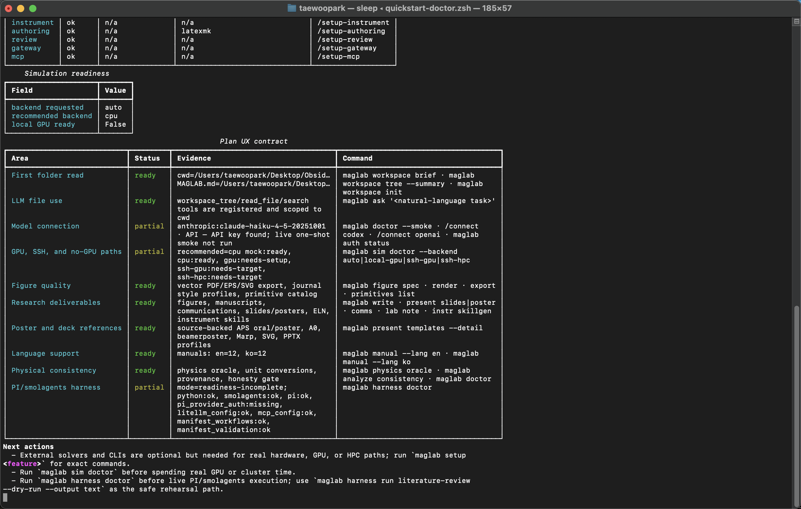
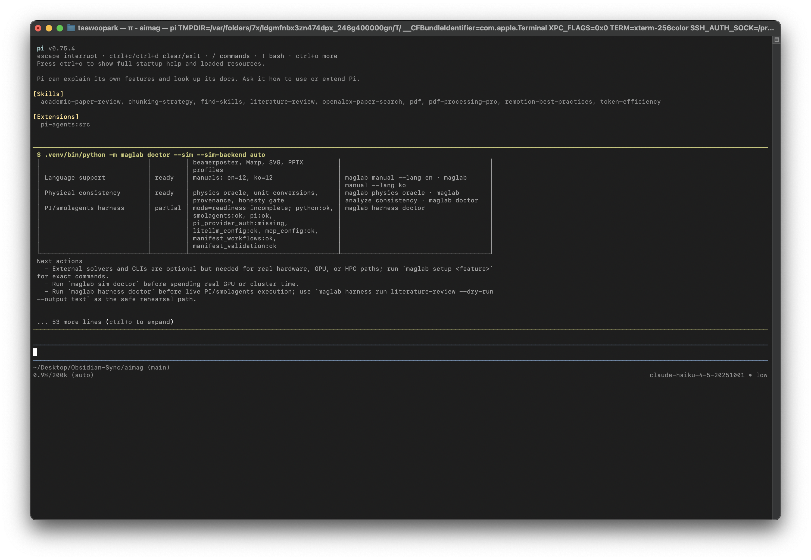

# 빠른 시작과 실제 운용

[매뉴얼 인덱스](index.md) · [English](../en/quickstart-operations.md)

이 문서는 MagLab을 전역 연구 CLI처럼 쓰기 위한 안내서입니다. 한 번 설치한 뒤,
어떤 연구 폴더에서든 실행하고, 원하는 model provider를 연결하고, deterministic
scientific tool과 LLM 오케스트레이션을 같은 터미널 세션에서 사용하는 흐름을
다룹니다.

## 터미널 실행 화면

실제 MagLab CLI doctor 실행 화면입니다.



같은 명령을 PI 대화형 TUI 안에서 `!` operator로 실행한 화면입니다.



## 기본 모델

MagLab은 세 계층으로 동작합니다.

1. 전역 프로그램: `maglab` 명령이 shell path에 설치됩니다.
2. 현재 연구 폴더: MagLab은 실행한 디렉터리를 기준으로 프로젝트 파일을 읽고
   산출물을 씁니다.
3. 사용자 앱 디렉터리: credential, config, cache, provider 설정은 clone한
   repository 밖에 저장됩니다.

이 구조 때문에 MagLab repository는 개발용으로 clone하고, 실제 사용은 Codex,
Claude Code, 일반 터미널 editor처럼 원하는 연구 폴더에서 열 수 있습니다.

## 권장 설치

일반 연구용으로는 research bundle 설치를 권장합니다. physics, materials,
fitting, figures, literature, instruments, authoring, simulation helper, MCP,
gateway 기능을 함께 설치합니다.

```sh
git clone https://github.com/TaewoooPark/MagLab.git
cd MagLab
pipx install --python python3.12 --editable ".[research]"
maglab install doctor
maglab doctor
maglab setup all
```

`pipx`가 없으면:

```sh
uv tool install pipx --python python3.12
pipx ensurepath
pipx install --python python3.12 --editable ".[research]"
```

MagLab 자체를 개발하려면:

```sh
uv venv --python 3.12
source .venv/bin/activate
uv pip install -e ".[dev,research]"
maglab doctor
```

## 연구 폴더 열기

논문, 데이터, 스크립트, 그림, 노트가 있는 폴더에서 MagLab을 실행합니다.

```sh
cd ~/research/pt-cofeb-mgo-sot
maglab workspace init
maglab workspace brief
maglab workspace tree --summary --type docs --max-depth 2
maglab workspace tree --changed
maglab
```

`workspace init`은 로컬 `MAGLAB.md` context 파일을 만듭니다. 샘플 naming
convention, device stack, geometry, measurement sign convention, 파일 위치,
잊으면 안 되는 claim을 여기에 적어두면 좋습니다.

## 모델 Provider 연결

MagLab은 모델 없이도 deterministic command를 실행할 수 있습니다. 자연어
오케스트레이션, 코드/파일 보조, 리뷰, 작성 기능을 쓰고 싶을 때만 LLM을
연결합니다.

Codex는 공식 Codex CLI 인증 상태를 위임해서 사용합니다. MagLab은 Codex OAuth
token을 저장하지 않습니다.

```sh
codex login
maglab auth codex
maglab auth status
maglab auth test codex
maglab doctor --smoke
```

직접 API key provider는 터미널 숨김 입력을 사용합니다.

```sh
maglab auth anthropic
maglab auth grok
maglab auth deepseek
maglab auth qwen
maglab auth kimi
maglab auth gemini
maglab auth openai
maglab auth status
maglab auth test
```

로컬 Ollama:

```sh
ollama serve
ollama pull qwen2.5-coder:7b
maglab auth ollama
maglab auth test ollama
```

REPL 안에서는 slash command를 사용합니다.

```text
/connect codex
/connect anthropic
/connect qwen
/connect ollama
/connect status
```

## 첫 1시간 체크리스트

새 설치를 신뢰하기 전에 아래 순서를 실행합니다.

```sh
maglab install doctor
maglab doctor
maglab setup all
maglab manual --lang ko
maglab workspace init
maglab workspace brief
maglab physics units 1000 oe tesla
maglab physics compute exchange_length A=13e-12 Ms=860e3
maglab analyze model stfmr
maglab figure primitives list
```

backend를 연결했다면 추가로 실행합니다.

```sh
maglab auth status
maglab auth test
maglab doctor --smoke
maglab -p "Summarize this workspace and propose the first safe MagLab command to run."
```

## REPL 기본 사용

interactive agent를 시작합니다.

```sh
maglab
```

처음 유용한 명령:

```text
/help quick
/help all
/workspace brief
/workspace tree --summary --type data
/doctor
/setup all
/manual ko simulation
/theme list
/theme set mono
/reset config
```

workspace가 확인된 뒤에는 자연어로 요청합니다.

```text
Read the README, inspect the data folder, and propose a reproducible ST-FMR
analysis workflow. Do not fit anything yet.
```

MagLab은 user/assistant turn 사이에 separator를 넣고, LLM 작업 중에는 compact
activity trace를 보여줍니다. trace에는 경과 시간, 중지 방법, tool 이름, Python
파일 reference, workspace 파일 reference가 포함될 수 있습니다. 숨겨진 model
reasoning은 표시하지 않습니다.

## 실제 연구 Workflow

### 문헌에서 실험 계획까지

```sh
maglab lit search papers/pt_cofeb_mgo --top-n 40
maglab lit keywords papers/pt_cofeb_mgo --top-n 30
maglab lit authors "spin orbit torque CoFeB MgO"
maglab lab plan "SOT efficiency in Pt/CoFeB/MgO" --n-doe 16 --output plans/sot_plan.yaml
```

evidence matrix가 실제 인용하려는 논문을 포함하는지 확인합니다. 생성된 요약만을
claim의 유일한 근거로 사용하지 마세요.

### 측정 CSV에서 피팅 결과까지

```sh
maglab analyze load data/stfmr.csv --columns frequency,field,voltage
maglab analyze model stfmr
maglab fit --effect stfmr data/stfmr.csv --method least_squares --json
maglab analyze consistency data/stfmr.csv --effect stfmr
```

논문에 넣기 전 parameter bound, residual, sign convention, device geometry,
추출량이 측정으로 실제 식별되는지 확인합니다.

### 결과에서 논문용 그림까지

```sh
maglab figure spec --journal aps --kind xy --output figures/stfmr_spec.json
maglab figure render figures/stfmr_spec.json --format pdf --output figures/stfmr.pdf
maglab figure export figures/stfmr_spec.json --format svg --output figures/stfmr.svg
```

피팅 결과나 처리된 데이터에서 나온 숫자는 DataPoint/provenance record에 묶는
것이 좋습니다. 논문 그림은 vector output을 우선 사용합니다.

### 시뮬레이션 준비

```sh
maglab sim doctor --explain
maglab physics compute exchange_length A=13e-12 Ms=860e3
maglab sim micro --material Permalloy --nx 64 --ny 64 --nz 1 --cell-nm 4 --output spec.json
maglab sim validate spec.json
```

GPU나 cluster 시간을 쓰기 전 mock 또는 validation mode로 workflow를 먼저
검증합니다. 원격 cluster는 먼저 `sim doctor`를 `--probe-ssh` 없이 실행하고,
일반 shell SSH가 되는 것을 확인한 뒤 `--probe-ssh`를 붙입니다.

### 계측기 Script 초안

```sh
maglab instr ingest "Keithley 2400" --manufacturer Keithley --manual-path manuals/keithley_2400.pdf
maglab instr script "Keithley 2400" --description "field sweep Hall voltage measurement" --output scripts/hall_sweep.py
maglab instr check scripts/hall_sweep.py
```

생성된 script는 출발점입니다. 실제 장비 실행 전 current limit, compliance,
interlock, sweep range, delay, device safety를 사람이 확인해야 합니다.

### 검증 이후 작성

```sh
maglab write "ST-FMR fit gives xi_DL=0.12 with provenance IDs ..." --journal prl --dry-run
maglab comms cover-letter --journal "Physical Review Letters" --title "Spin-orbit torque ..."
maglab present slides "Key results and figures from the SOT study" --template aps-12min --format beamer --n-slides 10
maglab present poster "Key results and figures from the SOT study" --template aps-march-poster --format svg
```

authoring 명령은 인간 검토 필요성을 의도적으로 남깁니다. 빠진 claim, citation,
figure reference는 연구자가 직접 채워야 합니다.

## 신뢰 전 체크리스트

MagLab 출력이 논문, 발표, 포스터, 실험 의사결정에 들어가기 전에 확인합니다.

- 보고된 숫자가 데이터, deterministic formula, fitter, simulation record,
  literature record, 또는 사용자의 명시적 입력에서 왔는가?
- 단위와 sign convention이 기록되어 있는가?
- provenance path가 보존되어 있는가?
- 인용 논문이 실제 문장을 지지하는가?
- mock simulation 결과를 실제 solver 결과처럼 취급하지 않았는가?
- 장비 제한과 hardware safety constraint를 사람이 확인했는가?
- 생성된 manuscript, email, rebuttal, slide, poster가 human review 대상으로
  표시되어 있는가?

## 복구와 Reset

```sh
maglab config path
maglab config show
maglab config restore
maglab config reset
```

REPL 안에서는:

```text
/reset config
/reset defaults
```

이전 backup이 있으면 `restore`를 사용하고, 정말 깨끗한 기본 설정으로 돌아가고
싶을 때만 `reset`을 사용합니다.

## 문제 해결

| 증상 | 먼저 확인할 것 |
|---|---|
| `maglab` 명령을 찾지 못함 | `pipx ensurepath` 실행, shell 재시작, `maglab install doctor`. |
| provider credential이 없다고 나옴 | `maglab auth status` 확인 후 `maglab auth <provider>`로 다시 연결. |
| Codex는 shell에서 되는데 MagLab에서 안 됨 | `codex exec "Reply exactly: OK"`와 `maglab auth test codex` 실행. |
| LLM output이 MagLab agent 정체성을 모름 | `maglab auth <provider>`를 다시 실행해 provider runtime guidance 선택. |
| simulation doctor가 partial | `maglab sim doctor --explain` 확인. 노트북에서 external solver missing은 정상일 수 있음. |
| manual command가 문서를 못 찾음 | `docs/manuals` package data가 포함된 repo 또는 wheel에서 다시 설치. |

## 매일 쓰는 패턴

1. 프로젝트 폴더를 엽니다.
2. `maglab workspace brief`를 실행합니다.
3. 작업에 가장 가까운 deterministic command를 먼저 실행합니다.
4. deterministic path가 명확해진 뒤 REPL에 오케스트레이션을 맡깁니다.
5. 생성된 spec, figure, log, note를 workspace에 저장합니다.
6. 환경이 바뀌면 `maglab doctor` 또는 feature-specific doctor를 실행합니다.
7. 최종 과학적 판단은 연구자의 책임으로 둡니다.
