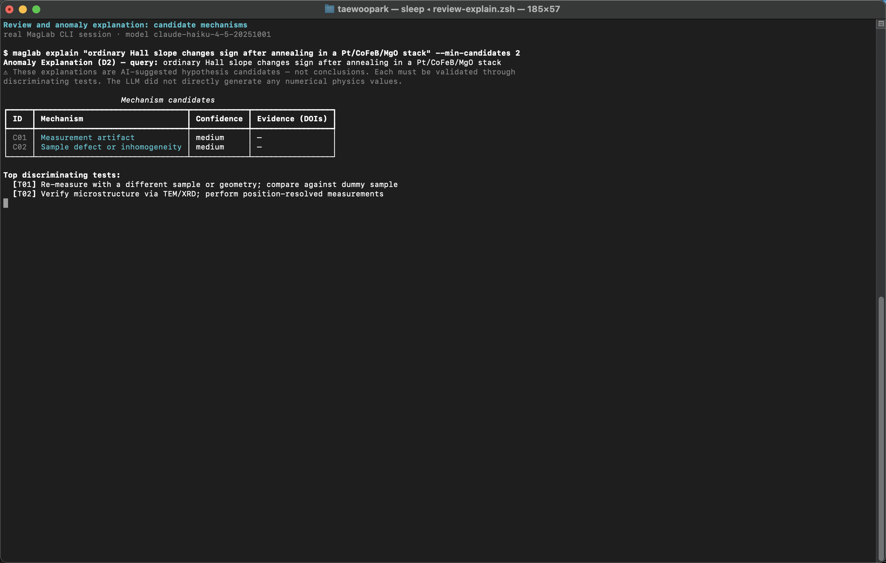
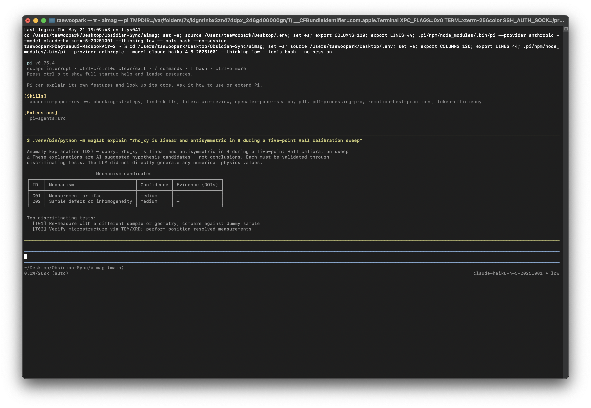

# 리뷰와 이상 현상 설명

[매뉴얼 인덱스](index.md) · [English](../en/review-explain.md)

구조화된 과학적 비판이 필요하거나, 예상 밖 데이터에 대한 mechanism 후보가
필요할 때 사용합니다.

## 터미널 실행 화면

실제 MagLab CLI 이상 현상 설명 실행 화면입니다.



같은 explanation workflow를 PI 대화형 TUI 안에서 `!` operator로 실행한 화면입니다.



## 설치

```sh
uv pip install -e ".[reviewer,literature]"
```

## 명령

```sh
maglab review manuscript.md --journal prl
maglab review manuscript.md --journal prb --author reviewer-a --author reviewer-b

maglab explain "AHE sign reverses above 200 K in Pt/CoFeB/MgO" --min-candidates 3
maglab explain "ST-FMR linewidth broadens nonlinearly with current" --json
```

## Review panel

`review` 명령은 persona-style panel을 실행한 뒤 consensus와 dissent를
synthesize합니다. 투고 전, group meeting 전, 큰 rewrite 후에 사용하기 좋습니다.

좋은 입력:

- Manuscript Markdown file.
- Section draft.
- Response-to-reviewer draft.
- Technical abstract.

## Anomaly explanation

`explain` 명령은 abductive reasoning용입니다. mechanism candidate와
discriminating test를 제안합니다. 출력은 결론이 아니라 hypothesis list로
취급해야 합니다.

좋은 prompt:

```sh
maglab explain "SMR changes sign after oxygen annealing"
maglab explain "FMR linewidth has a low-temperature upturn"
maglab explain "domain-wall velocity saturates at unexpectedly low current"
```

## 해석상의 주의

- Review output은 실제 peer review가 아닙니다.
- Anomaly explanation은 proof가 아닙니다.
- 반복 측정, control sample, temperature sweep, angular dependence,
  thickness dependence, literature triage를 설계하기 위한 시작점으로 쓰세요.

## 다음 단계

```sh
maglab lab plan "discriminate between Joule heating and spin torque artifact"
maglab lit search papers/anomaly_followup --top-n 30
maglab comms rebuttal --reviews reviews.txt --notes author_notes.md
```
