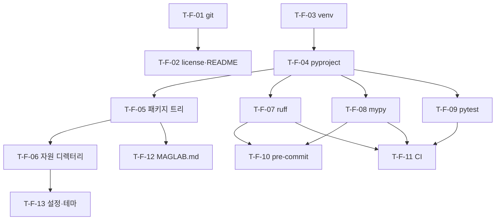

# MagLab 구현 계획 — 사전 준비 (Foundation)

> 설계 근거: PLAN.md §0 메타 · §4 패키지 구조 · §18 기술 스택 · §2.5 핵심 설계 원칙
> 이 문서는 **P0 착수 *전*** 리포지터리·툴체인·패키지 골격을 세우는 단계다.
> 코드를 생성하지 않고 태스크·순서·DoD를 명세한다. 규약: impl/README.md

## F.0 목표 & 범위

빈 폴더(현재 `PLAN.md`·`plan/`·`impl/`만 존재)를 **P0 구현을 바로 시작할 수
있는 상태**로 만든다 — git 리포, Python 가상환경, `pyproject.toml`(코어 +
extras), `maglab/` 패키지 골격, lint·type·test·CI 툴체인, 불멸 컨텍스트 파일.
이 단계가 끝나면 `uv pip install -e .` 가 GPU·LLM 없이 Mac에서 성공하고
`maglab --help` 가 동작한다(PLAN §2.5 ⑥ 오프라인·Mac 개발 가능).

**범위 안**: 리포·라이선스, 가상환경, `pyproject.toml`, 패키지·자원 디렉터리
스캐폴드(빈 모듈 스텁), ruff·mypy·pytest·pre-commit, GitHub Actions CI,
`MAGLAB.md`, 설정·테마 스캐폴드.

**범위 밖**: 모든 실제 기능 모듈(P0~P6). 이 단계의 모듈은 `import` 가능한
**빈 스텁**일 뿐이다 — 로직은 P0부터.

## F.1 현재 환경 (이 머신 감사 결과 — 2026-05-19)

| 도구 | 상태 | 비고 |
|---|---|---|
| Python | 3.14.2 / 3.12.12 / 3.11.14 | **venv는 3.12 채택** — 3.14는 과학 패키지 휠 미성숙 위험 |
| `uv` | 0.10.4 ✓ | 패키지·venv 관리자로 채택 |
| `pip` | 25.3 ✓ | |
| `git` | 2.39.5 ✓ | 리포 초기화 완료(본 세션) |
| `node` / `npx` | v24.13.0 ✓ | P5 논문검색 MCP 커넥터 구동용 |
| `tectonic` | ✓ | P6 LaTeX 컴파일 |
| `ollama` | ✓ | P0 로컬 LLM 백엔드 |
| `inkscape` | ✗ 미설치 | P1·P4 SVG→PDF — `cairosvg`(pip) 폴백 가능, 상세 `08-skills-and-tools.md` |
| `pandoc` | ✗ 미설치 | 설계상 불필수(저술은 `tectonic`·`pylatex`) |

전체 도구·패키지 카탈로그는 [`08-skills-and-tools.md`](08-skills-and-tools.md).

## F.2 작업 분해 (WBS)

### 리포지터리

- [x] **T-F-01  git 리포 초기화 · `.gitignore`**
  - 대상: `.git/`, `.gitignore`
  - 설계 근거: §0 메타(Ralph 루프가 iteration마다 git 커밋, §6.2)
  - 구현: `git init -b main`. `.gitignore`는 venv·캐시·런타임 상태(`.maglab/`)·
    **자격증명(`auth.json`·`.env`·`*.key`)**·OS 산출물 제외.
  - 의존: —
  - DoD: `git status` 동작, `.gitignore`가 자격증명·venv 제외. **(본 세션 완료)**
  - 스킬/도구: git

- [ ] **T-F-02  라이선스 · 루트 README**
  - 대상: `LICENSE`, `README.md`(리포 루트)
  - 설계 근거: §0(`PLAN.md`는 설계 문서 — 사용자용 README 별도 필요)
  - 구현: 라이선스 결정 후 `LICENSE` 작성(오픈소스 시 Apache-2.0 권장 —
    위임 CLI 백엔드 Codex가 Apache-2.0, 번들 MCP 커넥터가 MIT/Apache-2.0이라
    생태계 정합; 최종 결정은 소유자). 루트 `README.md`는 설치·빠른시작·
    `PLAN.md`/`plan/`/`impl/` 안내.
  - 의존: —
  - DoD: 두 파일 존재, README가 설치 명령을 담음.
  - 스킬/도구: —

### Python 툴체인

- [ ] **T-F-03  가상환경 생성**
  - 대상: `.venv/`
  - 설계 근거: §18(Python 3.11+), §2.5 ⑥(Mac 개발 가능)
  - 구현: `uv venv --python 3.12`. **Python 3.12 채택** — 설계 "3.11+"를
    충족하면서 `numpy`·`scipy`·`pyvista`·`lancedb` 등 과학 패키지 휠 커버리지가
    가장 안정적(3.14는 회피).
  - 의존: —
  - DoD: `.venv/` 활성화 후 `python --version` = 3.12.x.
  - 스킬/도구: uv

- [ ] **T-F-04  `pyproject.toml` — 패키지 메타 · 의존성 · extras**
  - 대상: `pyproject.toml`
  - 설계 근거: §4, §18(extras 목록), §2.3(독립 CLI·pip 설치)
  - 구현: 빌드 시스템(hatchling), 메타(`name="maglab"`, `requires-python>=3.11`),
    콘솔 스크립트 `maglab = "maglab.__main__:app"`. **코어 의존**은 GPU·LLM
    없이 — `typer`·`rich`·`prompt_toolkit`·`pyfiglet`·`rich-gradient`·
    `platformdirs`·`tomlkit`·`keyring`·`pydantic`·`numpy`·`scipy`·`pandas`·
    `lmfit`·`prov`. **extras**: `[llm]`·`[mcp]`·`[sim]`·`[figure]`·`[instr]`·
    `[literature]`·`[reviewer]`·`[authoring]`·`[gateway]`·`[dev]`·`[all]`
    (구성은 `08-skills-and-tools.md` §3).
  - 의존: T-F-03
  - DoD: `uv pip install -e .` 가 extras 없이 Mac에서 성공(§19 P0 종료 기준
    "GPU 없이 동작"의 전제).
  - 스킬/도구: uv

### 패키지 골격

- [ ] **T-F-05  `maglab/` 패키지 디렉터리 트리 + 모듈 스텁**
  - 대상: `maglab/` 전체 트리
  - 설계 근거: §4 패키지 구조
  - 구현: §4의 디렉터리 트리를 `__init__.py` + **빈 모듈 스텁**으로 생성 —
    `ui/`·`core/`·`llm/`(+`backends/`·`prompts/`)·`gateway/`(+`adapters/`)·
    `physics/`(+`data/`)·`sim/`(+`dft/`·`atomistic/`·`micro/`·`device/`·
    `backends/`)·`analysis/`(+`providers/`·`effects/`)·`figure/`(+`renderers/`·
    `primitives/`·`styles/`)·`instrument/`(+`templates/`)·`literature/`·
    `reviewer/`·`authoring/`(+`templates/`·`comms/`·`present/`)·`provenance/`·
    `report/`·`lab/`. 진입점 `__main__.py`·`cli.py`·`repl.py`·`config.py`·
    `mcp_server.py`. `cli.py`는 `maglab --help` 만 동작하는 Typer 앱 스텁.
  - 의존: T-F-04
  - DoD: `import maglab` 성공, `maglab --help` 가 서브커맨드 트리(부록 A) 골격
    출력. `ruff`·`mypy` 가 스텁에서 무오류.
  - 스킬/도구: —

- [ ] **T-F-06  최상위 자원 디렉터리**
  - 대상: `agents/`·`skills/`·`themes/`·`examples/`·`configs/`·`tests/`
  - 설계 근거: §4
  - 구현: 6개 디렉터리 + 각 `README.md`(용도 한 줄) 또는 `.gitkeep`.
  - 의존: —
  - DoD: 디렉터리 존재·git 추적.
  - 스킬/도구: —

### dev 툴체인

- [ ] **T-F-07  lint · format — ruff**
  - 대상: `pyproject.toml`(`[tool.ruff]`)
  - 설계 근거: §18(코드 품질 — 명시 외, 표준 관행)
  - 구현: `ruff` 린트 + 포맷 설정(line-length, rule set — E·F·I·UP·B 등).
  - 의존: T-F-04
  - DoD: `ruff check` · `ruff format --check` 통과.
  - 스킬/도구: ruff

- [ ] **T-F-08  타입 검사 — mypy**
  - 대상: `pyproject.toml`(`[tool.mypy]`)
  - 설계 근거: §3(검증 가능 — 정적 보장)
  - 구현: `mypy` 점진적 strict 설정. provenance `DataPoint` enum·`Quantity`
    타입이 타입 시스템으로 강제되도록(§17·§9).
  - 의존: T-F-04
  - DoD: `mypy maglab` 가 스텁 단계에서 무오류.
  - 스킬/도구: mypy

- [ ] **T-F-09  테스트 러너 · `tests/` 레이아웃**
  - 대상: `pyproject.toml`(`[tool.pytest]`), `tests/`, `conftest.py`
  - 설계 근거: §20 테스트/검증
  - 구현: `pytest` + `pytest-cov`. `tests/` 하위 `unit/`·`golden/`·
    `integration/`·`smoke/`·`integrity/`·`ui/`. `conftest.py` + golden 픽스처
    디렉터리 `tests/golden/data/`. **`tests/README.md`에 "정량·인용·피팅 검증에
    LLM-as-judge 금지 — 결정론 검사만"(§20)을 명문화.** 상세 계층은
    [`09-testing-and-ci.md`](09-testing-and-ci.md).
  - 의존: T-F-04
  - DoD: `pytest` 수집 성공(placeholder 테스트 통과).
  - 스킬/도구: pytest

- [ ] **T-F-10  pre-commit 훅**
  - 대상: `.pre-commit-config.yaml`
  - 설계 근거: §3(하네스가 강제 — 리포 차원 가드레일), §7.2(자격증명 보호)
  - 구현: `ruff`(린트+포맷)·`mypy`·기본 훅(trailing-whitespace·end-of-file·
    대용량 파일 차단)·**비밀키 탐지 훅**(`auth.json`·API 키 커밋 차단).
  - 의존: T-F-07, T-F-08
  - DoD: `pre-commit run --all-files` 통과.
  - 스킬/도구: pre-commit

### CI

- [ ] **T-F-11  GitHub Actions CI**
  - 대상: `.github/workflows/ci.yml`
  - 설계 근거: §19(각 Phase 독립 검증·머지 가능), §20
  - 구현: matrix(macOS·Linux × Python 3.11·3.12). 잡 순서 — `uv sync` →
    `ruff` → `mypy` → `pytest`(unit) → **코어 설치 검증**(extras 없이
    `import maglab`·`maglab --help`) → golden-value 잡(placeholder). Phase
    진행에 따라 µMAG·효과 피팅 잡을 점진 추가([`09-testing-and-ci.md`](09-testing-and-ci.md) §5).
  - 의존: T-F-07, T-F-08, T-F-09
  - DoD: CI 그린(2 OS × 2 Python).
  - 스킬/도구: GitHub Actions

### 프로젝트 컨텍스트 · 설정

- [ ] **T-F-12  `MAGLAB.md` — 불멸 프로젝트 컨텍스트**
  - 대상: `MAGLAB.md`(리포 루트)
  - 설계 근거: §5.5(불멸 파일 — compaction 후에도 유지되는 프로젝트 컨텍스트)
  - 구현: 프로젝트 정체성, 3-레이어 원칙(§3), 디렉터리 맵, 핵심 불변식
    ("LLM은 숫자·인용·figure 데이터를 만들지 않는다"), 빌드·테스트 명령,
    Phase 로드맵·`impl/` 포인터. P0의 `core/context.py` 가 이 파일을 로드 대상으로
    인식한다.
  - 의존: T-F-05
  - DoD: 파일 존재, 내용이 위 항목을 모두 포함.
  - 스킬/도구: —

- [ ] **T-F-13  설정 · 테마 스캐폴드**
  - 대상: `configs/config.example.toml`, `themes/{domain,mono,moke,light}.yaml`
  - 설계 근거: §7.1(XDG `~/.config/maglab/config.toml`), §7.8(번들 테마 4종)
  - 구현: `config.example.toml`(백엔드·단계별 모델 라우팅·자율성 모드 등 키
    템플릿), 4개 테마 YAML **자리표시자**(팔레트 키만 — 실제 값은 P0 `ui/theme.py`).
  - 의존: T-F-06
  - DoD: `config.example.toml` 이 유효 TOML, 테마 YAML 4개가 유효 YAML.
  - 스킬/도구: —

## F.3 마일스톤 & 의존성

| 마일스톤 | 태스크 | 완료 시 |
|---|---|---|
| **M-F1 리포 가동** | T-F-01·02 | git·라이선스·README |
| **M-F2 설치 가능** | T-F-03·04·05·06 | `uv pip install -e .` 성공, `maglab --help` |
| **M-F3 품질 게이트** | T-F-07·08·09·10·11 | lint·type·test·CI 그린 |
| **M-F4 컨텍스트 완비** | T-F-12·13 | `MAGLAB.md`·설정·테마 스캐폴드 |

## F.4 검증 게이트 (종료 기준)

P0 착수 전 아래가 **모두** 참이어야 한다:

- [ ] `uv pip install -e .` 성공 — Mac, GPU·LLM extras 없이 (§19 P0 전제).
- [ ] `maglab --help` 가 서브커맨드 트리(부록 A) 골격 출력.
- [ ] `import maglab` 및 모든 서브패키지 import 무오류.
- [ ] `ruff check` · `ruff format --check` · `mypy maglab` · `pytest` 통과.
- [ ] `pre-commit run --all-files` 통과.
- [ ] CI 그린 (macOS·Linux × Python 3.11·3.12).
- [ ] `MAGLAB.md` 존재 · 3-레이어 원칙·디렉터리 맵 포함.
- [ ] `.gitignore` 가 `auth.json` 등 자격증명을 제외 — 비밀키 커밋 불가.

## F.5 스킬·도구·패키지

- **도구**(이 단계 신규): `uv`(✓ 설치됨), `ruff`·`mypy`·`pytest`·`pytest-cov`·
  `pre-commit`(venv에 `[dev]` extra로 설치), GitHub Actions(원격).
- **Claude 스킬**: 이 단계는 불필요. P0부터 `mcp-builder`(MCP 서버)·
  `skill-creator`(스킬 시스템) 등 사용 — [`08-skills-and-tools.md`](08-skills-and-tools.md) §2.
- **패키지**: 코어 의존만(T-F-04). extras는 해당 Phase 착수 시 설치.

## F.6 리스크 & 주의

| 항목 | 대응 |
|---|---|
| Python 3.14 기본 | venv를 명시적으로 3.12로 고정(T-F-03). CI도 3.11·3.12만. |
| `inkscape`·`pandoc` 미설치 | P1·P4 전까지 불필요. P1 착수 시 `brew install inkscape` 또는 `cairosvg` 폴백([`08-skills-and-tools.md`](08-skills-and-tools.md) §4). |
| 코어 설치가 무거워짐 | extras 분리 엄수 — GPU·LLM·시뮬·문헌 패키지는 절대 코어에 넣지 않는다(§18 "코어 설치는 GPU·LLM 없이"). |
| `Obsidian-Sync` 폴더 내 `.git` | 동기화 도구가 `.git/`을 동기화하면 충돌 가능 — 동기화 제외 설정 권장(사용자 판단). |
| 폴더명 `aimag/` | 패키지·CLI는 `maglab`. 폴더 개명은 사용자 재량(§21). |

## 관련 문서

- 다음 단계: [`01-P0-core.md`](01-P0-core.md) — P0 코어 구현
- 횡단: [`08-skills-and-tools.md`](08-skills-and-tools.md) · [`09-testing-and-ci.md`](09-testing-and-ci.md)
- 설계: [`../PLAN.md`](../PLAN.md) §4·§18
