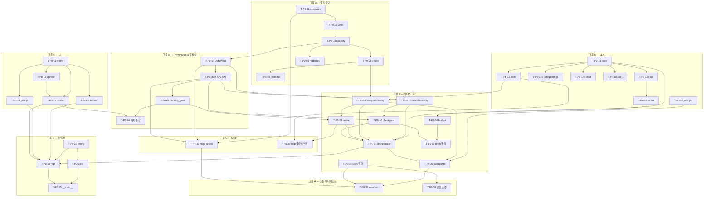

# MagLab 구현 계획 — Phase P0: 검증 가능한 오케스트레이터 코어

> 설계 근거: PLAN.md §19 로드맵 · plan/01-harness.md · plan/02-delivery.md · plan/03-physics-simulation.md(§9) · plan/10-integrity.md
> 이 문서는 구현 실행 계획이다 — 코드를 생성하지 않고 태스크·순서·DoD를 명세. 규약: impl/README.md

---

## P0.0 목표 & 범위

P0의 목표는 "Mac에서 GPU 없이 `maglab` CLI가 실행되고, 볼드 블록 배너가 렌더되고, 물리 골든값이 통과하는" 상태를 확보하는 것이다. 이는 이후 모든 기능 레이어(P1–P6)가 올라설 검증 가능한 오케스트레이터 코어다. LLM은 추론·계획·도구 호출만 하고, 수치·인용·figure는 결정론 도구에서 나오며, 모든 산출에 provenance가 따라붙는다는 불변 원칙을 P0에서 처음부터 강제한다.

**범위 안**

- 진입점: `maglab/__main__.py`, `cli.py`(Typer), `repl.py`(REPL + 파이프 모드), `config.py`(XDG TOML)
- UI: `ui/`(banner·theme·render·spinner·prompt) — 볼드 블록 로고·자화 그라데이션·반응형 3단·`NO_COLOR`·접근성 (§7.4·§7.9)
- 핵심 하네스: `core/orchestrator.py`, `core/subagents.py`, `core/context.py`, `core/memory.py`(research_pool §5.13 포함), `core/verify.py`, `core/autonomy.py`, `core/checkpoint.py`, `core/budget.py`, `core/hooks.py`, `core/skills.py`, `core/ralph.py`(골격만 — 2 실행모드 스캐폴드·서킷 브레이커 자료구조·완료 신호 파싱)
- LLM 레이어: `llm/base.py`, `llm/auth.py`, `llm/tools.py`, `llm/prompts/`, `llm/backends/api.py`(LiteLLM), `llm/backends/delegated_cli.py`, `llm/backends/local.py`; 단계별 모델 라우팅 (§7.3)
- 물리 코어: `physics/constants.py`, `physics/units.py`, `physics/quantity.py`, `physics/oracle.py`, `physics/formulas.py`, `physics/materials.py`(물성 DB 정적 데이터)
- Provenance: `provenance/` — DataPoint 자료구조·W3C PROV SQLite 감사 레이어 (§17)
- 리포팅: `report/honesty_gate.py` — 무태그 숫자·미검증 인용·미바인딩 figure 차단 (§5.15·§17)
- MCP: `mcp_server.py` + `llm/` MCP 클라이언트 + `.maglab/mcp.json` 레지스트리 (§5.18)
- 서브에이전트 정의 포맷: `agents/` 디렉터리 + 핵심 에이전트 spec (§5.16)
- 스킬 시스템: `core/skills.py` 로더 + `skills/` 번들 스킬 일부 (§5.6·§5.17)
- CLI 명령: `maglab auth`, `maglab physics`, `maglab mcp`, `maglab skill list`, `maglab cost`, `maglab theme` (부록 A P0 범위)
- 하네스 매니페스트: `harness.manifest.json` 초기 버전

**범위 밖**

- `sim/`, `analysis/`, `figure/`, `instrument/`, `literature/`, `reviewer/`, `authoring/`, `gateway/` 실모듈
- Ralph 루프 A~E 실동작 (P0는 골격 스캐폴드만; 루프 실동작은 P4–P6)
- `physics/material_builder.py` (P5)
- `core/reasoning.py` (P6 — 가설 생성·이상 설명)
- 효과 피팅·figure 렌더링·멀티스케일 핸드오프
- 메시징 게이트웨이 실 연동 (`gateway/` — P6)

---

## P0.1 전제조건

`00-foundation.md` 완료 항목:

- [ ] git 리포지터리 초기화, `main` 브랜치, `.gitignore` (Python·venv·IDE·`.maglab/`)
- [ ] `pyproject.toml` — 패키지명 `maglab`, Python ≥3.11, extras `[sim]`·`[llm]`·`[mcp]`·`[figure]`·`[instr]`·`[literature]`·`[reviewer]`·`[authoring]`·`[gateway]`·`[all]`
- [ ] 코어 의존성 고정: `typer`, `rich`, `rich-gradient`, `pyfiglet`, `prompt_toolkit`, `litellm`, `fastmcp`, `prov`, `keyring`, `tomli` (코어 설치에 GPU·LLM 불필요)
- [ ] `maglab/` 패키지 골격 (모든 하위 패키지 디렉터리 + `__init__.py`)
- [ ] dev 툴체인: `ruff`, `mypy`, `pytest`, `pre-commit` 훅 구성
- [ ] CI 파이프라인 초안 (GitHub Actions — `ruff`·`mypy`·`pytest` 자동 실행)
- [ ] `MAGLAB.md` — 프로젝트 영속 컨텍스트 파일 (오케스트레이터 첫 로드)

---

## P0.2 작업 분해 (WBS)

태스크는 의존이 적은 결정론 코어부터 상위 레이어 순으로 정렬한다.

---

### 그룹 A — 물리 코어 (`physics/`)

의존이 없는 순수 결정론 모듈. 이 그룹이 완료되면 `oracle`·`formulas`가 golden-value 테스트를 통과해 P0 종료 기준의 핵심을 충족한다.

- [ ] **T-P0-01  `constants.py` — CODATA 물리 상수**
  - 대상 파일: `maglab/physics/constants.py`
  - 설계 근거: §9 (plan/03-physics-simulation.md)
  - 구현: 자성 관련 CODATA 2022 상수(μ_B·μ_0·ħ·k_B·e·m_e·g_e)를 명명 상수로 정의. 불변 모듈 — 외부 의존 없음, 런타임 계산 없음.
  - 의존: 없음
  - DoD: 값이 CODATA 2022 표준값과 일치(6자리), 단위 문자열 동반, `import maglab.physics.constants` 성공.
  - 스킬/도구: —

- [ ] **T-P0-02  `units.py` — 자성 단위 변환 테이블**
  - 대상 파일: `maglab/physics/units.py`
  - 설계 근거: §9
  - 구현: 자성 도메인 단위 변환 함수군 — Oe↔A/m↔T, emu/cm³↔A/m, erg/cm↔J/m², J_ij meV↔K, DMI mJ/m²↔meV/ų, CGS↔SI 전환 팩터. 모든 변환은 역변환 가능.
  - 의존: T-P0-01
  - DoD: 표준 변환값(예: 1 Oe = 1000/(4π) A/m) 정확 일치; 역변환 왕복 오차 < 1 ppm; 단위 불일치 입력에 명시적 예외.
  - 스킬/도구: —

- [ ] **T-P0-03  `quantity.py` — `Quantity` 타입**
  - 대상 파일: `maglab/physics/quantity.py`
  - 설계 근거: §9
  - 구현: 값·단위·불확실도를 묶는 `Quantity` 자료구조. `units.py` 변환 함수를 `.to(unit)` 메서드로 노출. 산술 연산 시 단위 불일치 검출. `DataPoint`(T-P0-22)와 연동할 수 있도록 직렬화 인터페이스 제공.
  - 의존: T-P0-01, T-P0-02
  - DoD: 단위 불일치 연산 시 예외 발생; `.to()` 변환 왕복 일치; `DataPoint`로 변환 가능.
  - 스킬/도구: —

- [ ] **T-P0-04  `oracle.py` — sanity oracle**
  - 대상 파일: `maglab/physics/oracle.py`
  - 설계 근거: §9, §5.7 검증 루프
  - 구현: 물리 범위 검사 함수군 — `0 ≤ α ≤ 1`, `M ≤ M_s`, `T > 0`, 속도 한계(`v < c`), 에너지 보존 단순 검사. 비물리 결과에 구조화된 거부 사유 반환(`{ok: bool, reason: str, param: str}`). 결정론적, LLM 비개입.
  - 의존: T-P0-03
  - DoD: 물리/비물리 입력 각 10건 골든 케이스 정확 판정; `physics_check` MCP 도구로 노출(T-P0-29); `oracle.check()` 반환 스키마 고정.
  - 스킬/도구: —

- [ ] **T-P0-05  `formulas.py` — 결정론 수식 라이브러리**
  - 대상 파일: `maglab/physics/formulas.py`
  - 설계 근거: §9
  - 구현: 멀티스케일 결정론 수식 — 교환 길이(l_ex), 도메인벽 너비(Δ=√(A/K)), 스커미온 반경 스케일링, 스핀파 분산, Kittel 공식(면내·면외), Walker 항복 필드, Thiele 방정식 계수. 각 함수는 `Quantity` 입출력, 출처 논문 레퍼런스 인라인 주석.
  - 의존: T-P0-03, T-P0-04
  - DoD: §20 golden-value — 문헌값과 1% 이내 일치(예: l_ex(permalloy)≈5.7 nm, Walker H_W); `physics_compute` MCP 도구로 노출(T-P0-29).
  - 스킬/도구: —

- [ ] **T-P0-06  `materials.py` — 정적 물성 DB**
  - 대상 파일: `maglab/physics/materials.py`, `maglab/physics/data/`
  - 설계 근거: §9
  - 구현: 큐레이션 물질 데이터(Permalloy·YIG·CoFeB·GdFeCo 등)를 YAML/JSON 번들로 저장. `materials.py`가 조회·검색 인터페이스 제공. 각 물성은 출처(`DataPoint.LITERATURE` 태그·DOI) 동반. `material_builder.py`(P5 범위)와 인터페이스 호환.
  - 의존: T-P0-03, T-P0-22
  - DoD: 5종 이상 물질 조회 성공; 물성값에 출처 태그 동반; `material_lookup` MCP 도구로 노출(T-P0-29).
  - 스킬/도구: —

---

### 그룹 B — Provenance & 무결성 (`provenance/`, `report/`)

물리 코어 위에 즉시 올라서야 한다. 이후 모든 모듈이 `DataPoint`를 소비하므로 조기 확정이 필수다.

- [ ] **T-P0-07  `DataPoint` 자료구조**
  - 대상 파일: `maglab/provenance/datapoint.py`
  - 설계 근거: §17 (plan/10-integrity.md)
  - 구현: `DataPoint = {value, units, uncertainty, provenance_type: enum{SIMULATED, MEASURED, THEORY, LITERATURE, FITTED}, source_ref, timestamp, conditions}`. Pydantic 모델 또는 dataclass로 정의, JSON 직렬화, `Quantity`(T-P0-03)에서 생성하는 팩터리.
  - 의존: T-P0-03
  - DoD: 6개 필드 완전 직렬화·역직렬화; `provenance_type` 누락 시 생성 거부; `Quantity`→`DataPoint` 변환 성공.
  - 스킬/도구: —

- [ ] **T-P0-08  W3C PROV 감사 레이어**
  - 대상 파일: `maglab/provenance/audit.py`, `maglab/provenance/db.py`
  - 설계 근거: §17
  - 구현: `prov` 라이브러리로 Entity·Activity·Agent 트리플 기록. `db.py`가 SQLite 백엔드 관리(읽기·쓰기·JSON-LD 내보내기). 모든 LLM 호출, 물리 계산, 도구 실행이 Activity로 기록됨. `provenance_query` MCP 도구 노출(T-P0-29).
  - 의존: T-P0-07
  - DoD: Activity 기록→조회 왕복; JSON-LD 내보내기 W3C PROV 스키마 유효; LLM 호출 1건 기록 검증.
  - 스킬/도구: —

- [ ] **T-P0-09  `honesty_gate.py` — 무결성 차단 게이트**
  - 대상 파일: `maglab/report/honesty_gate.py`
  - 설계 근거: §5.15, §17
  - 구현: 차단 검사 함수군 — ① 무태그 숫자(DataPoint 없는 수치 감지) ② 미검증 인용(DOI 불일치) ③ 페르소나 고지 누락 ④ 1인칭 귀속 패턴 ⑤ 데이터 볼트 밖 수치 참조. 검사 통과 실패 시 `HonestyViolation` 예외 — 경고가 아닌 차단. promise-check 함수: 에이전트 발화에서 "실행했다" 주장을 추출, provenance 로그와 대조.
  - 의존: T-P0-07, T-P0-08
  - DoD: 주입 가짜 인용 10건 탐지(§20); 무태그 수치 5건 차단; promise-check 불일치 2건 플래그.
  - 스킬/도구: —

- [ ] **T-P0-10  `render.py` DataPoint 배지 통합**
  - 대상 파일: `maglab/ui/render.py` (T-P0-18에서 생성, 여기서 DataPoint 통합)
  - 설계 근거: §7.6, §17
  - 구현: `render.py`의 수치 출력 경로에 DataPoint 배지 자동 부착 — `[SIM]`(시안)·`[MEAS]`(초록)·`[FIT]`(보라)·`[PRED]`(노랑)·`[LIT]`(회색). `provenance_type`→배지 색 매핑 테이블.
  - 의존: T-P0-07, T-P0-18
  - DoD: SIMULATED·MEASURED·FITTED·LITERATURE 배지가 각각 올바른 색으로 렌더; `NO_COLOR` 환경에서 색 없이 라벨만.
  - 스킬/도구: —

---

### 그룹 C — 터미널 UI (`ui/`)

물리·provenance 코어가 확정된 뒤 병렬로 진행 가능. 이 그룹 완료 시 "볼드 블록 배너 렌더" 종료 기준 충족.

- [ ] **T-P0-11  `theme.py` — 테마 시스템**
  - 대상 파일: `maglab/ui/theme.py`, `themes/`
  - 설계 근거: §7.8
  - 구현: 테마 = `themes/*.yaml`. 자동 감지 3계층(`MAGLAB_THEME` env → `COLORFGBG` → OSC 11 터미널 배경 프로브). 번들 테마 4종(`domain`·`mono`·`moke`·`light`) YAML 정의. 팔레트 자료구조: 강조·오류·성공·경고·dim 5색 매핑. `Theme.load()` 팩터리.
  - 의존: 없음
  - DoD: 4종 테마 각 로드 성공; `NO_COLOR` 시 모노크롬 팔레트로 폴백; `/theme <name>` 전환 시 팔레트 교체.
  - 스킬/도구: —

- [ ] **T-P0-12  `banner.py` — 볼드 블록 배너**
  - 대상 파일: `maglab/ui/banner.py`
  - 설계 근거: §7.4, §7.5
  - 구현: `pyfiglet` `ansi_shadow` 글꼴로 블록 워드마크 생성 → `rich-gradient`로 파랑(`#38bdf8`)→빨강(`#f43f5e`) 자화 그라데이션 적용. 반응형 3단: ≥100컬럼 `ansi_shadow` / ≥60 `slant` / <60 단축 워드마크. `shutil.get_terminal_size()`로 폭 감지. 비-TTY·`NO_COLOR`·`TERM=dumb`에서 그라데이션·블록 억제·ASCII 폴백. `banner.render()` 함수가 즉시 반환(무거운 import 지연 완료 전에 출력 가능).
  - 의존: T-P0-11
  - DoD: §20 UI 테스트 — ≥100·≥60·<60 컬럼 각 올바른 폰트 선택; `NO_COLOR=1` 시 색 없음; `TERM=dumb` 시 ASCII; 비-TTY 파이프 시 색 제거.
  - 스킬/도구: —

- [ ] **T-P0-13  `spinner.py` — 스핀 세차 스피너**
  - 대상 파일: `maglab/ui/spinner.py`
  - 설계 근거: §7.4
  - 구현: Larmor 세차 애니메이션 프레임(`↑↗→↘↓↙←↖`) 순환. `rich.progress.SpinnerColumn` 커스텀 또는 `rich.live.Live` 기반 컨텍스트 매니저. `NO_COLOR`·`TERM=dumb`·`MAGLAB_NO_ANIMATION`에서 억제.
  - 의존: T-P0-11
  - DoD: 비-TTY 환경에서 스피너 출력 없음; 컨텍스트 매니저 진입/종료 정상.
  - 스킬/도구: —

- [ ] **T-P0-14  `prompt.py` — 입력 프롬프트**
  - 대상 파일: `maglab/ui/prompt.py`
  - 설계 근거: §7.7
  - 구현: `prompt_toolkit.PromptSession` — `FileHistory`(`~/.maglab/history`), `FuzzyCompleter`(슬래시 커맨드 `NestedCompleter`), `AutoSuggestFromHistory`, 동적 `bottom_toolbar`(backend·토큰·상태), 멀티라인(Meta+Enter), Ctrl+R 이력 검색. 프롬프트 글리프 `⇡`. 비-TTY 모드에서 `input()` 폴백.
  - 의존: T-P0-11
  - DoD: 슬래시 커맨드 퍼지 자동완성 동작; `FileHistory` 파일 생성; 비-TTY 폴백 정상 동작.
  - 스킬/도구: —

- [ ] **T-P0-15  `render.py` — 메인 렌더러 (DataPoint 통합 제외 초기 구현)**
  - 대상 파일: `maglab/ui/render.py`
  - 설계 근거: §7.6
  - 구현: `rich.Console` 래퍼. 스트리밍 응답 — `rich.live.Live`(~12 fps) + `Panel(Markdown)` 토큰 배치 갱신. 도구 호출 — `Panel`+`Tree`·상태 아이콘 `⟳`/`✓`/`✗`. thinking — `dim` `Panel`(box.MINIMAL) 기본 접힘. 오류/경고 — rose/amber `Panel`. 비-TTY에서 `Console(no_color=True, highlight=False)` 폴백.
  - 의존: T-P0-11, T-P0-13
  - DoD: 스트리밍 Mock 응답 10토큰 라이브 렌더 성공; 비-TTY stdout 파이프 시 색 코드 미포함.
  - 스킬/도구: —

*참고: T-P0-10(DataPoint 배지)은 T-P0-15 완료 후 적용.*

---

### 그룹 D — LLM 레이어 (`llm/`)

UI 그룹과 병렬 진행 가능. 인증 3 백엔드를 완료해야 `maglab auth` 스모크 테스트 통과.

- [ ] **T-P0-16  `llm/base.py` — 추상 LLM 인터페이스**
  - 대상 파일: `maglab/llm/base.py`
  - 설계 근거: §7.2, §7.3
  - 구현: `LLMBackend` 추상 기반 클래스 — `complete()`, `stream()`, `tool_call()` 시그니처. 응답 스키마 공통 자료구조(`LLMResponse`: content·usage·tool_calls). 비용 메타데이터 필드(T-P0-26 budget 연동용).
  - 의존: 없음
  - DoD: 세 백엔드(T-P0-17a~c)가 모두 이 인터페이스를 구현하고 단위 테스트 통과.
  - 스킬/도구: —

- [ ] **T-P0-17a  `backends/api.py` — 직접 API 백엔드 (LiteLLM)**
  - 대상 파일: `maglab/llm/backends/api.py`
  - 설계 근거: §7.2
  - 구현: LiteLLM으로 Anthropic·OpenAI·Google·OpenAI호환 엔드포인트 통합. `keyring` 자격증명 조회, `MAGLAB_<PROVIDER>_API_KEY` env var 최우선. 스트리밍 응답 지원. 재시도(지수 백오프).
  - 의존: T-P0-16, T-P0-19(auth)
  - DoD: §20 인증 스모크 — 실제 API 키로 단발 호출 성공; keyring 저장·조회 왕복; 잘못된 키에 명시적 오류.
  - 스킬/도구: —

- [ ] **T-P0-17b  `backends/delegated_cli.py` — 위임 CLI 백엔드**
  - 대상 파일: `maglab/llm/backends/delegated_cli.py`
  - 설계 근거: §7.2
  - 구현: `codex exec`·`claude`·`gemini` CLI를 서브프로세스로 구동. `which <cmd>`로 존재 확인, 없으면 명시적 안내. `--json`·`-p` 플래그로 비대화형 호출. stdout 파싱 → `LLMResponse`. 타임아웃·프로세스 오류 처리.
  - 의존: T-P0-16, T-P0-19(auth)
  - DoD: §20 인증 스모크 — `claude -p "ping"` 서브프로세스 성공 시 LLMResponse 반환; CLI 미설치 시 안내 오류.
  - 스킬/도구: —

- [ ] **T-P0-17c  `backends/local.py` — 로컬 모델 백엔드 (Ollama)**
  - 대상 파일: `maglab/llm/backends/local.py`
  - 설계 근거: §7.2
  - 구현: Ollama REST API(`http://localhost:11434`) 호출. 모델 목록 조회, `generate`·`chat` 엔드포인트. Ollama 미기동 시 명시적 안내.
  - 의존: T-P0-16
  - DoD: §20 인증 스모크 — Ollama가 기동된 환경에서 `tinyllama` 단발 호출 성공; 미기동 시 설치 안내 오류.
  - 스킬/도구: —

- [ ] **T-P0-18  `llm/auth.py` — 인증 관리자**
  - 대상 파일: `maglab/llm/auth.py`
  - 설계 근거: §7.2
  - 구현: `keyring` 우선 자격증명 저장·조회. 헤드리스 폴백 `~/.config/maglab/auth.json`(`0600` chmod 강제). env var 최우선 로직. `maglab auth set|list|test` CLI 명령 백엔드. 자격증명 파일 퍼미션 검사·경고.
  - 의존: T-P0-16
  - DoD: `keyring` 저장→조회 왕복; auth.json `0600` 강제 검증; `maglab auth test` 3 백엔드 각 연결 성공 메시지.
  - 스킬/도구: —

- [ ] **T-P0-19  `llm/tools.py` — 도구 호출 프레임워크**
  - 대상 파일: `maglab/llm/tools.py`
  - 설계 근거: §5.16, §5.18
  - 구현: 도구 정의 레지스트리 — 함수→JSON Schema 자동 변환(`@tool` 데코레이터). 도구 호출 파싱·실행·결과 직렬화. `readOnlyHint`·`destructiveHint` 주석 지원(§5.8 자율성 게이트 연동). 최소권한 도구 allowlist 필터링.
  - 의존: T-P0-16
  - DoD: `@tool` 데코레이터가 JSON Schema 자동 생성; 허용 리스트 외 도구 호출 차단; `readOnly` 도구 호출 시 사람 승인 불필요.
  - 스킬/도구: —

- [ ] **T-P0-20  `llm/prompts/` — 핵심 프롬프트 템플릿**
  - 대상 파일: `maglab/llm/prompts/system.md`, `maglab/llm/prompts/orchestrator.md`, `maglab/llm/prompts/physics_validator.md`
  - 설계 근거: §5.1, §5.3, §5.16
  - 구현: 오케스트레이터 시스템 프롬프트(LLM은 숫자·인용 생성 금지 강제, 결정론 도구 위임 명령, 서브에이전트 위임 패턴). 물리 검증기 서브에이전트용 프롬프트. `MAGLAB.md` JIT 주입 템플릿.
  - 의존: 없음
  - DoD: 시스템 프롬프트가 "LLM은 숫자를 만들지 않는다" 원칙을 명시; 오케스트레이터 프롬프트 로드 성공.
  - 스킬/도구: —

- [ ] **T-P0-21  단계별 모델 라우팅**
  - 대상 파일: `maglab/llm/router.py`, `~/.config/maglab/config.toml`
  - 설계 근거: §7.3
  - 구현: 파이프라인 단계→모델 매핑 테이블(`config.toml`의 `[routing]` 섹션). 계획·심층 추론→고성능 모델, 빌드·요약·압축→저렴한 모델, 비전 critic→비전 모델. `Router.for_stage(stage_name)` → `LLMBackend` 인스턴스 반환.
  - 의존: T-P0-16, T-P0-17a
  - DoD: `config.toml` 라우팅 재정의 시 정확히 다른 백엔드 선택; 미정의 단계는 기본 모델 폴백.
  - 스킬/도구: —

---

### 그룹 E — 진입점 & CLI (`__main__.py`, `cli.py`, `repl.py`, `config.py`)

LLM·UI 그룹 완료 후 조립.

- [ ] **T-P0-22  `config.py` — 설정 관리**
  - 대상 파일: `maglab/config.py`
  - 설계 근거: §7.1
  - 구현: XDG 규약 경로(`~/.config/maglab/config.toml`). Pydantic 모델로 설정 스키마 정의. `config.load()`·`config.save()`. 기본값 번들, 사용자 설정으로 오버라이드. `maglab config` 명령 백엔드.
  - 의존: 없음
  - DoD: 기본 설정 로드 성공; 사용자 오버라이드 적용; 스키마 오류 시 명시적 오류.
  - 스킬/도구: —

- [ ] **T-P0-23  `cli.py` — Typer CLI 진입점**
  - 대상 파일: `maglab/cli.py`
  - 설계 근거: §7.1, 부록 A
  - 구현: Typer 앱으로 P0 범위 서브커맨드 등록 — `auth`(T-P0-18), `physics`(T-P0-01–05), `mcp`(T-P0-29), `skill`(T-P0-31), `cost`(T-P0-26), `theme`(T-P0-11), `config`(T-P0-22). 비대화형 단발 모드(`-p`). 공통 옵션: `--json`(구조화 출력), `--verbose`, `--backend`.
  - 의존: T-P0-11~15, T-P0-18, T-P0-22
  - DoD: §20 CLI 스모크 — `maglab --help`, `maglab auth list`, `maglab physics oracle` 각 종료코드 0 반환.
  - 스킬/도구: —

- [ ] **T-P0-24  `repl.py` — 대화형 REPL**
  - 대상 파일: `maglab/repl.py`
  - 설계 근거: §7.1, §7.5
  - 구현: 시작 시퀀스 — `banner.render()` → 테마 로드 → 세션 정보 패널(backend·cwd·skills·gateway) → 스핀 격자 Rule → 프롬프트 루프. `prompt.py`(T-P0-14) 입력 루프. 사용자 입력 → 오케스트레이터(T-P0-25) 전달 → `render.py` 출력. Ctrl+C 인터럽트 처리. `/help`·`/theme`·`/skill` 슬래시 커맨드.
  - 의존: T-P0-12, T-P0-14, T-P0-15, T-P0-25(orchestrator)
  - DoD: §20 UI 테스트 — 시작 시 배너 렌더; 배너 3단 폭 반응; Ctrl+C 정상 종료; `/help` 응답.
  - 스킬/도구: —

- [ ] **T-P0-25  `__main__.py` — 패키지 진입점**
  - 대상 파일: `maglab/__main__.py`
  - 설계 근거: §7.1
  - 구현: `python -m maglab` 진입. 인자가 있으면 `cli.py`, 없으면 `repl.py` 분기. 최초 import 시 무거운 모듈 지연 로드(배너를 먼저 출력).
  - 의존: T-P0-23, T-P0-24
  - DoD: `python -m maglab --help` 종료코드 0; `python -m maglab` 대화형 루프 진입 확인.
  - 스킬/도구: —

---

### 그룹 F — 하네스 코어 (`core/`)

LLM 레이어(그룹 D) 위에 올라선다. orchestrator·subagents는 UI도 필요하므로 그룹 C·D 완료 후.

- [ ] **T-P0-26  `core/budget.py` — 비용·자원 추적**
  - 대상 파일: `maglab/core/budget.py`
  - 설계 근거: §5.14
  - 구현: 스텝 계량 — LLM 호출(토큰·USD 비용·latency), 도구 호출(wall-time), 시뮬 잡(코어-시간, P1 이후 채움). 세션·런·Ralph 루프별 누적. `maglab cost` 명령 백엔드. 예산 상한 설정 및 초과 경고 훅.
  - 의존: T-P0-16, T-P0-08
  - DoD: LLM 호출 1건 이상 기록 후 `maglab cost` 출력에 토큰·USD 표시; 예산 초과 시 경고 이벤트 발생.
  - 스킬/도구: —

- [ ] **T-P0-27  `core/context.py` & `core/memory.py` — 컨텍스트·메모리**
  - 대상 파일: `maglab/core/context.py`, `maglab/core/memory.py`
  - 설계 근거: §5.5, §5.13
  - 구현: `context.py` — 작업 컨텍스트 자료구조, compaction 시 파라미터 이름·provenance ID·잡 ID 보존. `memory.py` — 3계층(작업 컨텍스트 / 세션 상태 SQLite `~/.local/share/maglab/sessions/` / 장기 메모리 `memories/*.md`). `research_pool` 서브모듈 — `memories/research_pool/`에 확정 결과·실패 파라미터·이상 적립·벡터 색인 + grep 검색(§5.13). 새 런 시작 시 풀 JIT 질의.
  - 의존: T-P0-07, T-P0-08
  - DoD: 세션 종료 후 재시작 시 SQLite 세션 재개; research_pool 레코드 저장·질의 왕복; compaction 후 provenance ID 보존 확인.
  - 스킬/도구: —

- [ ] **T-P0-28  `core/verify.py` & `core/autonomy.py` — 검증·자율성 게이트**
  - 대상 파일: `maglab/core/verify.py`, `maglab/core/autonomy.py`
  - 설계 근거: §5.7, §5.8
  - 구현: `verify.py` — 서브에이전트 결과 4계층 검증(스키마 검사→oracle→신뢰도 신호→LLM 평가자). `autonomy.py` — 자율성 모드 3단(`copilot`/`semi-auto`/`autonomous`), 액션 cost-tier 0–3 분류, tier 2+ 승인 훅 인터페이스.
  - 의존: T-P0-04, T-P0-19
  - DoD: cost-tier 3 액션에 승인 요청 발생; oracle 실패 시 서브에이전트 결과 거부; tier 0 액션은 자동 승인.
  - 스킬/도구: —

- [ ] **T-P0-29  `core/hooks.py` — PreToolUse 검증 훅**
  - 대상 파일: `maglab/core/hooks.py`
  - 설계 근거: §5.8, §5.15
  - 구현: PreToolUse 훅 시스템 — 도구 호출 전 실행되는 체이닝 가능한 훅 함수 목록. 기본 훅: ① `deny_rule` 검사(설정 기반 금지 패턴) ② oracle 물리 범위 검사(물리 도구) ③ honesty gate promise-check ④ 비가역성 게이트(삭제·외부 쓰기 Tier 2+). 훅 실패 시 도구 호출 차단·사유 반환.
  - 의존: T-P0-04, T-P0-09, T-P0-28
  - DoD: `deny_rule` 일치 도구 호출 차단; oracle 범위 외 물리 파라미터 차단; 비가역 도구 Tier 2 미만에서 차단.
  - 스킬/도구: —

- [ ] **T-P0-30  `core/checkpoint.py` — 체크포인트·재개**
  - 대상 파일: `maglab/core/checkpoint.py`
  - 설계 근거: §5.8, §5.12
  - 구현: 연구 루프 트리 상태·Ralph 루프 상태를 SQLite에 주기적 직렬화(멱등 키). `maglab task status <id>` 백엔드. 재시작 후 `checkpoint.restore()` → 루프 재개. 체크포인트는 provenance 연결 포함.
  - 의존: T-P0-27, T-P0-08
  - DoD: 체크포인트 저장→프로세스 재시작→복원 왕복; provenance ID 연속성 유지.
  - 스킬/도구: —

- [ ] **T-P0-31  `core/orchestrator.py` — 오케스트레이터**
  - 대상 파일: `maglab/core/orchestrator.py`
  - 설계 근거: §5.3, §5.12, §5.16
  - 구현: 연구 루프 백트래킹 트리 — 노드 자료구조(`{가설, 설계, 실행 상태, 결과, 분석 판단, 점수}`), best-first 확장, oracle+정적 검증 점수화, 막다른 가지 기록. `harness.manifest.json` 로드. `MAGLAB.md` JIT 주입. 서브에이전트 위임(T-P0-32). 예산 게이트(T-P0-26). cost-tier별 병렬/직렬 분기.
  - 의존: T-P0-21, T-P0-27, T-P0-28, T-P0-29, T-P0-30
  - DoD: 단순 목표("계산 수행") 입력 시 도구 호출 → 결과 반환 왕복; cost-tier 0 도구 자동 실행; oracle 실패 노드 가지치기 기록.
  - 스킬/도구: —

- [ ] **T-P0-32  `core/subagents.py` — 서브에이전트 풀**
  - 대상 파일: `maglab/core/subagents.py`, `agents/`
  - 설계 근거: §5.4, §5.16
  - 구현: `agents/<name>.md` 로더 (YAML frontmatter + 본문=시스템 프롬프트). 서브에이전트 스폰 함수 — 격리 컨텍스트에서 과업 실행 → 압축 결론 반환. 6요소 계약 검증(출력 스키마 `{status, 결과, warnings}`). 중첩 스폰 2단 깊이 상한 강제. P0에서 정의할 초기 에이전트 spec: `physics-validator.md`.
  - 의존: T-P0-20, T-P0-28, T-P0-31
  - DoD: `agents/physics-validator.md` 로드·스폰·결과 반환; `status: failed` 반환 시 오케스트레이터 재실행 또는 상향 모델; 깊이 3 스폰 시도 차단.
  - 스킬/도구: —

- [ ] **T-P0-33  `core/ralph.py` — Ralph 루프 골격**
  - 대상 파일: `maglab/core/ralph.py`
  - 설계 근거: §6 (plan/01-harness.md)
  - 구현: 골격 — 2 실행모드 스캐폴드(인-세션 `Stop`-훅 / 분리형 신선-컨텍스트) 인터페이스 정의. 서킷 브레이커 자료구조(3회 무진전·동일오류 5회·유사도 >0.95·비용 속도 초과 필드). 완료 신호 `<promise>DONE</promise>` 파싱 함수. 상태 파일 `.maglab/ralph.local.md` 읽기/쓰기. `max_iterations` 기본값 20. Ralph 루프 실동작(A~E)은 P4–P6에서 구현.
  - 의존: T-P0-26, T-P0-30
  - DoD: 서킷 브레이커 조건(무진전 3회) 트리거 시 중단 신호 발생; `DONE` 파싱 정확; 상태 파일 저장·복원.
  - 스킬/도구: —

- [ ] **T-P0-34  `core/skills.py` — 스킬 로더**
  - 대상 파일: `maglab/core/skills.py`
  - 설계 근거: §5.6, §5.17
  - 구현: 3단계 점진 공개 — L1 메타데이터(`name`+`description`, 시작 시 항상 로드, ~100토큰/스킬) / L2 SKILL.md 본문(트리거 시) / L3 번들 파일(명시 접근 시만). 탐색 경로: `.maglab/skills/`→`~/.local/share/maglab/skills/`→번들 `skills/`. SKILL.md frontmatter 구조 검증(T-P0-38). `maglab skill list` 백엔드. MagLab 확장 필드 처리(`user-invocable`·`disable-model-invocation`·`paths`·`context`).
  - 의존: 없음
  - DoD: 번들 스킬 `L1` 목록 즉시 로드(<100ms); `maglab skill list` 출력에 name+description 포함; 구조 오류 스킬 로드 거부·경고.
  - 스킬/도구: `skill-creator` 패턴 참조(신규 스킬 생성 시)

---

### 그룹 G — MCP 통합 (`mcp_server.py`, `llm/` MCP 클라이언트)

하네스(그룹 F)와 물리 코어(그룹 A)가 완료된 후 통합 가능.

- [ ] **T-P0-35  `mcp_server.py` — MagLab MCP 서버 (B 역할)**
  - 대상 파일: `maglab/mcp_server.py`
  - 설계 근거: §5.18, 부록 B
  - 구현: `fastmcp`로 MagLab 자체 MCP 서버 구현. P0에서 노출할 Tools: `physics_compute`, `physics_check`, `convert_units`, `material_lookup`, `report_build`, `provenance_query`. Resources: `maglab://material/{id}`, `maglab://effects`. Prompts: `analyze_experiment`. stdio 기본, `maglab mcp serve`로 기동.
  - 의존: T-P0-01~06, T-P0-07, T-P0-08
  - DoD: §20 MCP 스모크 — `maglab mcp serve` 기동 후 `physics_compute` 도구 호출 성공; `material_lookup` 리소스 반환.
  - 스킬/도구: `mcp-builder` 스킬

- [ ] **T-P0-36  MCP 클라이언트 & 레지스트리**
  - 대상 파일: `maglab/llm/mcp_client.py`, `.maglab/mcp.json`
  - 설계 근거: §5.18
  - 구현: `mcp_client.py` — 외부 MCP 서버 연결(stdio/HTTP), lazy 연결(과업 필요 시만 기동), 도구 네임스페이싱(`server::tool_name`). `.maglab/mcp.json` 레지스트리 파싱: `type`·`command`·`trust_level`·`enabled`·`always_load`. 신뢰 서버 allowlist, `destructiveHint` 도구는 사람 승인. `maglab mcp add|list|enable|disable` 명령 백엔드.
  - 의존: T-P0-19, T-P0-29
  - DoD: `mcp.json`에 서버 등록→`maglab mcp list` 출력; lazy 연결 — `always_load: false` 서버는 과업 요청 전 기동 안 함.
  - 스킬/도구: —

---

### 그룹 H — 번들 스킬 초기 집합 & 하네스 매니페스트

- [ ] **T-P0-37  `harness.manifest.json` — 하네스 매니페스트**
  - 대상 파일: `harness.manifest.json`
  - 설계 근거: §5.16
  - 구현: P0 범위 항목 등록 — 서브에이전트(`physics-validator`), 번들 스킬(T-P0-38 목록), MCP 서버(MagLab 자체), 단계→모델 라우팅(T-P0-21). 새 도메인 추가 = 이 파일 1 항목.
  - 의존: T-P0-32, T-P0-34, T-P0-35
  - DoD: 오케스트레이터가 로드 시 매니페스트 파싱 성공; 등록된 서브에이전트·스킬 수가 실제 파일 수와 일치.
  - 스킬/도구: —

- [ ] **T-P0-38  번들 스킬 초기 집합**
  - 대상 파일: `skills/` 하위 스킬 디렉터리들
  - 설계 근거: §5.6, §5.17, 부록 C
  - 구현: P0에서 제공할 최소 번들 스킬 — `magnetotransport-fitting` (SKILL.md 초안, scripts/ 없음), `physics-calculator`(물리 계산 도우미). SKILL.md frontmatter 필수 필드(`name`·`description`·`license`·`compatibility`) 충족. 구조 검증(frontmatter·≤500줄·참조 1단계).
  - 의존: T-P0-34
  - DoD: `maglab skill list`에 2종 이상 표시; 구조 검증 통과; `L2` 본문 로드 성공.
  - 스킬/도구: `skill-creator` 패턴 참조

---

## P0.3 마일스톤 & 의존성

### 마일스톤

| 마일스톤 | 포함 태스크 | 완료 기준 |
|---|---|---|
| **M0-A 물리·provenance 코어** | T-P0-01~09 | `oracle` golden-value 통과; `DataPoint` 직렬화; W3C PROV 기록 |
| **M0-B UI + LLM 레이어** | T-P0-11~21 | 볼드 블록 배너 3단 렌더; 인증 3 백엔드 스모크 통과 |
| **M0-C 하네스 조립** | T-P0-22~34 | `maglab` CLI 기동; REPL 루프; 오케스트레이터 단순 루프; Ralph 골격; 스킬 로더 |
| **M0-D MCP·스킬·매니페스트** | T-P0-35~38 | `mcp serve` 스모크; 번들 스킬 로드; 매니페스트 파싱 |

### 의존성 그래프

---

## P0.4 검증 게이트 (종료 기준)

P0 완료는 아래 모든 항목 통과 시로 정의한다 (§19 P0 종료 기준 직결).

### 물리 golden-value (§20)

- [ ] `formulas.py` — 교환 길이 l_ex(Permalloy) 문헌값과 1% 이내 일치
- [ ] `formulas.py` — DW 너비 Δ(YIG) 문헌값과 1% 이내 일치
- [ ] `formulas.py` — Kittel 공식 면내 공진 주파수 (Permalloy) 문헌값과 1% 이내 일치
- [ ] `oracle.py` — 물리 입력 10건 정확 판정(5 물리·5 비물리)
- [ ] `oracle.py` — 비물리 거부 사유 구조화 반환

### UI 테스트 (§20)

- [ ] 배너 — ≥100·≥60·<60 컬럼 각각 올바른 폰트 렌더
- [ ] 배너 — `NO_COLOR=1` 설정 시 색 코드 미포함
- [ ] 배너 — `TERM=dumb` 설정 시 ASCII 텍스트 출력
- [ ] 배너 — 비-TTY stdout 파이프 시 색 제거
- [ ] 테마 로드 — 4종 번들 테마 각각 로드 성공
- [ ] DataPoint 배지 — 5종 provenance_type 각각 올바른 배지 색

### 인증 스모크 (§20)

- [ ] `maglab auth test --backend api` — 유효 API 키로 단발 호출 성공
- [ ] `maglab auth test --backend delegated_cli` — 공식 CLI 설치 환경에서 성공
- [ ] `maglab auth test --backend local` — Ollama 기동 환경에서 성공
- [ ] 자격증명 파일 `auth.json` 퍼미션 `0600` 강제 검증

### honesty gate 테스트 (§20)

- [ ] 주입 가짜 인용 10건 탐지·차단
- [ ] 무태그 수치 5건 차단
- [ ] promise-check 불일치 2건 플래그

### 하네스 eval (§20)

- [ ] 오케스트레이터 단순 목표 루프 — 물리 계산 1건 도구 호출→결과 반환
- [ ] 서킷 브레이커 — 무진전 3회 중단
- [ ] cost-tier 3 액션 승인 요청 발생
- [ ] 체크포인트 저장→재시작→복원 왕복

### CLI·MCP 스모크 (§20)

- [ ] `maglab --help` 종료코드 0
- [ ] `maglab physics oracle` 결과 반환
- [ ] `maglab skill list` 2종 이상 출력
- [ ] `maglab cost` 빈 세션 출력 (0 비용)
- [ ] `maglab mcp serve` 기동 후 `physics_compute` 도구 호출 성공
- [ ] `maglab mcp list` 등록 서버 출력

### 전체 종료 조건

- [ ] Mac(Apple Silicon 또는 Intel)에서 GPU 없이 `pip install -e ".[mcp,llm]"` 후 `maglab` 기동 성공
- [ ] 볼드 블록 배너 렌더 (터미널 ≥80컬럼)
- [ ] §20 golden-value 전 항목 통과
- [ ] `ruff`·`mypy`·`pytest` CI 게이트 통과

---

## P0.5 스킬·도구·패키지

| 범주 | 항목 | 용도 |
|---|---|---|
| Claude 스킬 | `mcp-builder` | T-P0-35 `mcp_server.py` 구현 — FastMCP 서버 스캐폴드·도구 등록 패턴 |
| Claude 스킬 | `skill-creator` 패턴 참조 | T-P0-34·T-P0-38 스킬 로더·번들 스킬 SKILL.md 구조 설계 |
| Python 패키지 (코어) | `typer`, `rich`, `rich-gradient`, `pyfiglet`, `prompt_toolkit` | CLI·UI 진입점 |
| Python 패키지 (LLM) | `litellm`, `keyring` | 직접 API 백엔드·자격증명 |
| Python 패키지 (MCP) | `fastmcp` | MCP 서버·클라이언트 |
| Python 패키지 (provenance) | `prov`, `sqlite3`(stdlib) | W3C PROV 감사 레이어 |
| Python 패키지 (수치) | `numpy`, `scipy` | `formulas.py` 수치 계산 |
| Python 패키지 (설정) | `tomllib`(stdlib, 3.11+), `pydantic` | 설정·자료구조 |
| Python 패키지 (dev) | `ruff`, `mypy`, `pytest`, `pre-commit` | 코드 품질·CI |
| 외부 도구 | `ollama` | 로컬 모델 백엔드 (테스트 환경) |
| 외부 CLI (선택) | `claude`, `codex`, `gemini` | 위임 CLI 백엔드 (테스트 환경) |

스킬·도구·패키지 전체 카탈로그 및 설치·활성화 절차는 `08-skills-and-tools.md`.

---

## P0.6 리스크 & 주의

§21(PLAN.md) 연계:

| 리스크 | 연관 태스크 | 대응 |
|---|---|---|
| 구독 인증 약관 위반 | T-P0-17b (위임 CLI) | 공식 도구 서브프로세스만 — OAuth 토큰 직접 접근 절대 금지. `auth.json`에 OAuth 토큰 저장 불가 |
| 자격증명 노출 | T-P0-18 (`auth.py`) | `keyring` 우선; 폴백 `auth.json`은 생성 시 즉시 `chmod 0600`; env var은 로그·provenance에 마스킹 |
| 터미널 호환성 | T-P0-12 (banner) | `TERM=dumb` → ASCII 평문; 유니코드 블록 미지원 → ASCII 글꼴 폴백; `NO_COLOR` 준수; 비-TTY 파이프 자동 감지 |
| LLM 숫자 생성 | T-P0-20 (prompts), T-P0-09 (honesty_gate) | 시스템 프롬프트에 금지 명시; honesty gate가 무태그 수치 차단 — 프롬프트가 아닌 하네스가 강제 |
| Ralph 루프 폭주 | T-P0-33 (ralph 골격) | 서킷 브레이커 자료구조 P0에서 확정; `max_iterations=20` 기본; 비용 속도 초과 훅 (T-P0-26) |
| MCP 프롬프트 인젝션 | T-P0-36 (mcp 클라이언트) | 도구 결과 비신뢰 취급; stdio 샌드박싱; `trust_level: restricted` 서버는 도구 호출마다 사람 확인 |
| 멀티에이전트 토큰 비용 | T-P0-31 (orchestrator) | 단일 에이전트가 기본 — 서브에이전트는 입증된 경우만; 비용 추적(T-P0-26)으로 조기 경보 |

---

## 관련 문서

- `impl/00-foundation.md` — 전제조건 상세 (리포·venv·pyproject.toml·dev 툴체인·CI)
- `impl/02-P1-figure-sim.md` — P0 완료 후 시작; `physics/`·`provenance/`·`core/`를 직접 계승
- `impl/09-testing-and-ci.md` — P0.4 검증 게이트의 테스트 코드 명세·골든 데이터셋
- `impl/08-skills-and-tools.md` — `mcp-builder`·`skill-creator` 상세 사용 절차
- `plan/01-harness.md` — §5–§6 하네스·Ralph 루프 설계 상세
- `plan/02-delivery.md` — §7 인증·UI 설계 상세
- `plan/03-physics-simulation.md` — §9 물리 코어 설계 상세
- `plan/10-integrity.md` — §17 honesty gate·provenance 설계 상세
- `plan/11-appendices.md` — 부록 A(CLI 트리)·B(MCP 카탈로그)·C(스킬 카탈로그)·E(기능→Phase 매핑)·H(하네스 패턴)
