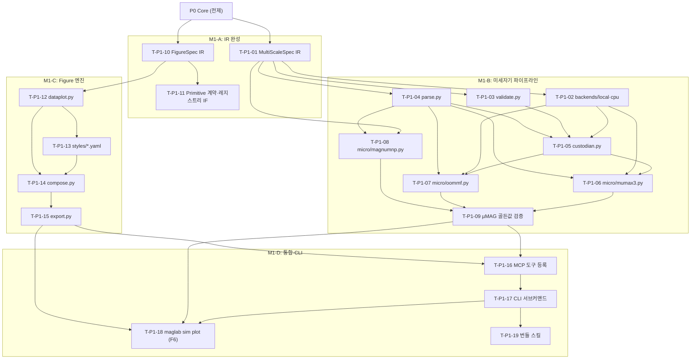

# MagLab 구현 계획 — Phase P1: 미세자기 단일 스케일 시뮬 · Figure 데이터플롯 엔진

> 설계 근거: PLAN.md §19 로드맵 · plan/03-physics-simulation.md(§10) · plan/05-figure.md(§12)
> 이 문서는 구현 실행 계획이다 — 코드 생성 없이 태스크·순서·DoD를 명세. 규약: impl/README.md

---

## P1.0 목표 & 범위

P1은 P0의 물리 코어·하네스·provenance 위에 두 기둥을 세운다: **미세자기 단일
스케일 시뮬레이션 파이프라인**(`sim/`)과 **Figure 데이터플롯 엔진**(`figure/`).
두 기둥은 F6(`maglab sim plot`) CLI로 연결된다 — 실험 데이터를 넣으면 시뮬과
나란히 출판급 벡터 figure가 나온다. `sim/spec.py`의 `MultiScaleSpec` IR은 처음
부터 멀티스케일 수용형으로 설계하여 P3 DFT·원자론 확장이 IR 파괴 없이 삽입
되도록 한다. Figure는 코드/벡터로만 저작하며, 래스터 생성형 이미지 모델은 데이터
figure에 일절 사용하지 않는다(§12.1).

**범위 안:**
- `sim/spec.py` (`MultiScaleSpec` IR — 단일·멀티스케일 수용형)
- `sim/micro/` (MuMax3·OOMMF·magnum.np 미세자기 백엔드 래퍼·입력 생성기)
- `sim/validate.py` (정적 검증 — 부록 D 미세자기 규칙)
- `sim/parse.py` (구조화 `JobResult` 생성 — LLM은 원시 출력 파일 비독)
- `sim/custodian.py` (엔진 오류 분류·기본 자동 교정)
- `sim/backends/local.py`·`sim/backends/cpu.py` (OOMMF/magnum.np/VAMPIRE CPU — Mac 개발 가능)
- `figure/spec.py` (`FigureSpec` IR — 패널·데이터바인딩·레이아웃·저널 타깃)
- `figure/renderers/dataplot.py` (matplotlib·SciencePlots 데이터플롯)
- `figure/compose.py` (멀티패널 GridSpec·패널 라벨 a/b/c·저널 컬럼폭)
- `figure/export.py` (벡터 PDF/EPS/SVG·폰트 임베딩)
- `figure/styles/*.yaml` (저널별 스타일 프로파일 — Nature·APS·IEEE·Elsevier)
- `figure/primitives/spec.py` (Primitive 계약·레지스트리 인터페이스 — 프리미티브 자체는 P4)
- F6 CLI `maglab sim plot` (데이터→시뮬→figure 통합 진입점, §10.3)
- MCP 도구: `sim_design`·`sim_validate`·`sim_run`·`sim_parse`·`figure_design`·`figure_render`·`figure_compose`·`figure_export` (부록 B)

**범위 밖:**
- DFT(`sim/dft/`)·원자론(`sim/atomistic/`)·`sim/handoff.py` → P3
- `sim/backends/ssh_hpc.py`·`sim/backends/ssh_gpu.py` → P3
- `figure/renderers/simviz.py` (OVF 시각화) → P3
- `figure/renderers/schematic.py`·`figure/primitives/` 본체·`figure/primitives/registry.py` → P4
- Figure 정제 Ralph 루프 E → P4
- 효과 피팅(`analysis/`) → P2

---

## P1.1 전제조건

P0 산출물이 모두 완료·검증된 후 P1을 착수한다.

- [ ] `maglab` CLI 골격 동작 (`maglab --help`, REPL 진입)
- [ ] `core/orchestrator.py`·`core/subagents.py`·`core/verify.py` 완료
- [ ] `core/hooks.py` honesty gate 활성 (미태그 figure 차단 포함)
- [ ] `physics/units.py`·`physics/quantity.py`·`physics/oracle.py` 완료
- [ ] `physics/constants.py`·`physics/formulas.py`·`physics/materials.py` 완료
- [ ] `provenance/` DataPoint·figure 엔티티 스키마 완료 (P1 figure 바인딩용)
- [ ] `pyproject.toml` extras `[sim]`·`[figure]` 정의 완료
- [ ] MCP 서버 골격(`mcp_server.py`)·fastmcp 등록 구조 완료
- [ ] 테스트 인프라·CI 게이트(`09-testing-and-ci.md`) 완료
- [ ] 개발 환경: Python 3.11+, OOMMF 또는 magnum.np CPU 설치 확인

---

## P1.2 작업 분해 (WBS)

### sim/ — 기반 IR · 백엔드 골격

- [ ] **T-P1-01  `sim/spec.py` — `MultiScaleSpec` IR**
  - 대상 파일: `maglab/sim/spec.py`
  - 설계 근거: §10.2 (plan/03-physics-simulation.md)
  - 구현: `ScaleSpec`(스케일별 단일 시뮬 명세)과 `MultiScaleSpec`(ScaleSpec 배열 + Handoff 배열)을 선언형 IR로 정의. `scale` 필드는 `"micro"·"atomistic"·"dft"·"device"` 열거형으로 P3 확장을 처음부터 수용. 단일 스케일 작업은 `MultiScaleSpec` 에서 원소 하나인 경우로 표현 — 별도 단일 스케일 타입 없음. 엔진 비종속: SimSpec이 어느 미세자기 백엔드에도 바인딩되지 않음.
  - 의존: T-P0 (`physics/units.py`·`provenance/`)
  - DoD: `MultiScaleSpec`의 단일 미세자기 ScaleSpec을 직렬화·역직렬화해 동일성 보존. `scale` 열거 오류 시 즉각 예외.

- [ ] **T-P1-02  `sim/backends/local.py` · `sim/backends/cpu.py` — Mac 로컬 백엔드**
  - 대상 파일: `maglab/sim/backends/local.py`, `maglab/sim/backends/cpu.py`
  - 설계 근거: §10.2 (`cpu` 폴백 — Mac 개발 가능)
  - 구현: `local`은 프로세스 직접 실행(OOMMF·magnum.np), `cpu`는 CPU 전용 폴백 라우터. 양쪽 모두 `BackendBase` 추상 인터페이스를 구현. 실행 결과는 stdout/stderr + 종료 코드를 구조화 dict로 반환 — 해석은 `parse.py`에 위임. GPU/HPC 백엔드(`ssh_hpc`·`ssh_gpu`)는 P3에서 추가.
  - 의존: T-P1-01
  - DoD: OOMMF 또는 magnum.np CPU로 단순 박막 시뮬이 터미널에서 완료. 타임아웃·프로세스 킬 처리 확인.

- [ ] **T-P1-03  `sim/validate.py` — 미세자기 정적 검증**
  - 대상 파일: `maglab/sim/validate.py`
  - 설계 근거: §10.2·부록 D
  - 구현: `MultiScaleSpec` 입력을 받아 실행 전 검증. 부록 D 미세자기 규칙 전수 구현: 셀 크기 < 교환 길이 l_ex, 댐핑 α > 0, 전 region에 물질 파라미터 할당, 시뮬 시간 ≥ 수배 τ_relax. `oracle.py`의 범위 검사와 연동. 위반 시 `ValidationError`를 raise하며 위반 항목·권고값을 구조화 메시지로 포함.
  - 의존: T-P1-01, T-P0 (`physics/oracle.py`)
  - DoD: 결함 있는 SimSpec(α=0·셀 과대·run 부족)에서 `ValidationError` 발생. 정상 SimSpec은 통과. §20 정적 검증 테스트 연결.

- [ ] **T-P1-04  `sim/parse.py` — `JobResult` 구조화 파서**
  - 대상 파일: `maglab/sim/parse.py`
  - 설계 근거: §10.2 (LLM은 원시 파일 비독)
  - 구현: MuMax3 `.out` 테이블·OOMMF `.odt`·magnum.np HDF5 출력을 읽어 `JobResult` 구조체로 변환. `JobResult`는 물리량 이름→`DataPoint` 배열·수렴 여부·실행 시간·파일 경로 인덱스를 담는다. OVF/OMF 자화 파일 경로는 레퍼런스만 보관 — 실제 읽기는 P3 simviz가 담당. LLM에 노출되는 것은 `JobResult` 요약 텍스트만.
  - 의존: T-P1-01, T-P0 (`provenance/`)
  - DoD: MuMax3·OOMMF 각 샘플 출력 파일에서 `JobResult`를 정확히 파싱. `DataPoint` 출처 필드에 파일 경로·행 번호 기록.

- [ ] **T-P1-05  `sim/custodian.py` — 엔진 오류 분류·기본 교정**
  - 대상 파일: `maglab/sim/custodian.py`
  - 설계 근거: §10.2
  - 구현: 엔진 종료 코드·stderr에서 오류 패턴을 분류(`ConvergenceError`·`InputError`·`ResourceError`·`UnknownError`). `InputError`(예: 파라미터 범위)는 `validate.py`와 연동해 자동 교정 힌트를 생성. `ResourceError`는 백엔드 재라우팅 제안. P3에서 핸드오프 오류 분류가 추가된다. LLM은 분류 결과만 수신.
  - 의존: T-P1-02, T-P1-03, T-P1-04
  - DoD: 의도적 입력 오류·메모리 초과 오류 케이스에서 올바른 `ErrorClass` 반환 및 구조화 힌트 포함.

### sim/micro/ — 미세자기 백엔드 래퍼

- [ ] **T-P1-06  `sim/micro/mumax3.py` — MuMax3 입력 생성·실행 래퍼**
  - 대상 파일: `maglab/sim/micro/mumax3.py`
  - 설계 근거: §10.1·§10.2
  - 구현: `ScaleSpec`(micro) + 물질 파라미터를 받아 MuMax3 `.mx3` 스크립트를 생성. 물질 파라미터는 `physics/materials.py`에서 조회하거나 사용자 지정값을 검증 후 삽입. `local`·`cpu` 백엔드로 실행을 위임하고 결과를 `parse.py`에 전달. GPU 없는 Mac에서는 CPU 시뮬 규모(소형 도메인)로 폴백 경고.
  - 의존: T-P1-01, T-P1-02, T-P1-04, T-P0 (`physics/materials.py`)
  - DoD: 단층 박막 µMAG 표준문제 #1 입력 파일이 정확히 생성되고, MuMax3 바이너리 존재 시 실행 완료.

- [ ] **T-P1-07  `sim/micro/oommf.py` — OOMMF 입력 생성·실행 래퍼**
  - 대상 파일: `maglab/sim/micro/oommf.py`
  - 설계 근거: §10.1·§10.2
  - 구현: `ScaleSpec`(micro) → OVF/MIF 2.1 입력 파일 생성. OOMMF는 CPU 전용이라 Mac 개발 환경에서 우선 검증 대상. 기하·경계·스테이지·출력 설정을 ScaleSpec에서 유도. `custodian.py`와 연동해 OOMMF 특유 오류(tcl 인터프리터·허가 오류)를 분류.
  - 의존: T-P1-01, T-P1-02, T-P1-04, T-P1-05
  - DoD: OOMMF로 µMAG 표준문제 #1·#2 MIF 파일 생성 후 실행 완료. `JobResult` 정확성 확인.

- [ ] **T-P1-08  `sim/micro/magnumnp.py` — magnum.np 래퍼**
  - 대상 파일: `maglab/sim/micro/magnumnp.py`
  - 설계 근거: §10.2 (CPU 폴백, Mac 개발 가능)
  - 구현: `magnum.np` Python API를 직접 호출(외부 바이너리 없음). `ScaleSpec`에서 메시·물질·외부 자기장·스테이퍼를 매핑. CPU 실행에서 메모리·시간 예측값을 사전 경고. `parse.py`에서 HDF5 출력을 파싱.
  - 의존: T-P1-01, T-P1-04
  - DoD: magnum.np CPU로 소형 도메인(64³ 이하) 릴랙세이션 완료. `JobResult`에서 최종 자화 값 추출 확인.

### sim/ — µMAG 표준문제 검증

- [ ] **T-P1-09  µMAG 표준문제 #1–#5 골든값 재현 검증**
  - 대상 파일: `tests/golden/micromagnetics/` (데이터), `tests/test_mumax_golden.py`
  - 설계 근거: §19·§20 골든값 종료 기준
  - 구현: µMAG 표준문제 공식 골든값(NIST µMAG 웹사이트)을 `tests/golden/` 에 JSON으로 번들. #1(자화 반전)·#2(동적 탈자화)·#3(스핀파)·#4(STT)·#5(DW) 각 문제에 대해 MuMax3·OOMMF로 계산한 값이 허용 오차 내에 있음을 단위 테스트로 검증. LLM-as-judge 금지 — 수치 비교만.
  - 의존: T-P1-06, T-P1-07, T-P1-08
  - DoD: `pytest tests/test_mumax_golden.py`가 #1–#5 모두 통과. 허용 오차는 각 µMAG 문제 공식 기준값의 1% 이내(또는 문제별 지정 기준).

### figure/ — FigureSpec IR

- [ ] **T-P1-10  `figure/spec.py` — `FigureSpec` IR**
  - 대상 파일: `maglab/figure/spec.py`
  - 설계 근거: §12.3-① (plan/05-figure.md)
  - 구현: `FigureSpec`은 패널 목록·각 패널의 유형(data-plot / schematic / sim-viz)·데이터 바인딩(`DataPoint` 레퍼런스 목록)·그리드 레이아웃·저널 타깃·캡션을 담는 선언형 구조체. `SimSpec`과 동형 설계(DiagrammerGPT 교훈 — 공간 레이아웃을 텍스트로 먼저 계획). 데이터 바인딩 필드가 없는 data-plot 패널은 honesty gate가 생성을 차단.
  - 의존: T-P0 (`provenance/` DataPoint·figure 엔티티)
  - DoD: `FigureSpec` 직렬화·역직렬화 동일성 보존. 데이터 바인딩 누락 data-plot 패널이 `ValidationError`를 raise.

- [ ] **T-P1-11  `figure/primitives/spec.py` — Primitive 계약·레지스트리 인터페이스**
  - 대상 파일: `maglab/figure/primitives/spec.py`
  - 설계 근거: §12.4-① (plan/05-figure.md)
  - 구현: `Primitive` 데이터 계약(`name`·`category`·`tags`·`description`·`parameters`·`render()`·`physics_convention`·`references`·`provenance`·`preview`·`journal_styles`)과 `PrimitiveRegistry`(검색·로드·등록 인터페이스)를 정의. P1에서 계약과 레지스트리 인터페이스만 확립 — 프리미티브 본체와 `registry.py` 구현은 P4. `figure-designer` 에이전트가 색인으로 자연어 검색하는 진입점도 인터페이스로만 선언.
  - 의존: T-P1-10
  - DoD: `Primitive` 프로토콜이 타입 검사 통과. `PrimitiveRegistry.search()`·`load()` 인터페이스 서명 확정. P4에서 이 인터페이스를 파괴 없이 구현 가능.

### figure/ — 데이터플롯 렌더러

- [ ] **T-P1-12  `figure/renderers/dataplot.py` — matplotlib 데이터플롯 렌더러**
  - 대상 파일: `maglab/figure/renderers/dataplot.py`
  - 설계 근거: §12.3-② (plan/05-figure.md)
  - 구현: `FigureSpec`의 data-plot 패널을 matplotlib로 렌더. 지원 플롯 유형: 히스테리시스(M-H)·Hall(ρ_xy-H)·FMR(선형·주파수 의존)·분산(ω-k)·일반 XY. 데이터는 `DataPoint` 레퍼런스에서만 바인딩 — LLM이 데이터 값을 삽입하거나 플롯을 직접 그리지 않음. SciencePlots 스타일을 저널 타깃에 따라 자동 적용. 오버레이 모드(실험+시뮬)를 F6에서 사용.
  - 의존: T-P1-10, T-P0 (`provenance/`)
  - DoD: 입력 `DataPoint` 배열의 값과 렌더 결과의 데이터 값이 정확히 일치(픽셀이 아닌 값 검증 — 렌더 후 추출한 플롯 데이터를 원본과 수치 비교, §20 Figure 테스트). LLM이 데이터 값을 직접 삽입하면 `Provenance` 바인딩 누락으로 차단됨을 테스트로 확인.

### figure/ — compose · export · styles

- [ ] **T-P1-13  `figure/styles/` — 저널별 스타일 프로파일 YAML**
  - 대상 파일: `maglab/figure/styles/nature.yaml`, `aps.yaml`, `ieee.yaml`, `elsevier.yaml`
  - 설계 근거: §12.3-⑤·부록 G (plan/05-figure.md·plan/11-appendices.md)
  - 구현: 저널 타깃별 YAML: 컬럼폭(단/2단 mm)·폰트 패밀리·폰트 크기 계층·선폭 범위·색맹 안전 팔레트·DPI. Nature 89/183mm·APS 86/178mm·IEEE 88.9mm·Elsevier 90mm. `StyleProfile` 로더가 YAML을 파싱해 matplotlib `rcParams`와 `FigureSpec` 치수로 변환. 부록 G 테이블을 규범 소스로 한다.
  - 의존: T-P1-10
  - DoD: 각 저널 YAML을 로드해 컬럼폭이 부록 G 기준값과 일치. 저널별 rcParams가 matplotlib에 주입됨을 확인.

- [ ] **T-P1-14  `figure/compose.py` — 멀티패널 합성·레이아웃**
  - 대상 파일: `maglab/figure/compose.py`
  - 설계 근거: §12.3-④ (plan/05-figure.md)
  - 구현: `FigureSpec`의 그리드 레이아웃 명세(행·열·패널별 span)를 matplotlib `GridSpec`/`subfigures`로 구현. 패널 라벨(a/b/c/d) 자동 삽입(위치·폰트 스타일은 StyleProfile에서). 저널 컬럼폭에 맞춘 figure 크기 계산. 공유 컬러스케일·정렬·패딩을 StyleProfile 로직으로 처리. 패널 렌더러(`dataplot`·P3 simviz·P4 schematic)의 반환 axes를 받아 조합.
  - 의존: T-P1-12, T-P1-13
  - DoD: 2×2 패널 FigureSpec을 렌더했을 때 패널 라벨(a–d)이 정확한 위치에, 저널 컬럼폭 치수 내에 수납됨. pytest로 figure 크기·라벨 위치 검증.

- [ ] **T-P1-15  `figure/export.py` — 벡터 내보내기**
  - 대상 파일: `maglab/figure/export.py`
  - 설계 근거: §12.3-⑥·§21 (plan/05-figure.md·PLAN.md)
  - 구현: matplotlib savefig를 PDF/EPS/SVG로 내보냄. 폰트 임베딩: `pdf.fonttype=42`·`svg.fonttype=none`. `cairosvg`가 설치된 경우 SVG→PDF 변환 폴백. Inkscape CLI 헤드리스는 P4 schematic용으로 예약 — P1 export는 matplotlib 네이티브 벡터 출력만. 저널별 필요 시 래스터 TIFF(DPI 지정) 병행 내보내기 지원. 내보낸 파일 경로를 provenance에 기록.
  - 의존: T-P1-14
  - DoD: PDF 출력의 폰트가 Type 42로 임베딩됨을 `pdfplumber`로 확인. EPS·SVG 출력이 텍스트 에디터로 편집 가능한 벡터임을 확인. §20 Figure 테스트 연결.

### MCP 도구 등록

- [ ] **T-P1-16  `mcp_server.py` — sim·figure MCP 도구 등록**
  - 대상 파일: `maglab/mcp_server.py` (P0에서 골격 생성, P1에서 확장)
  - 설계 근거: 부록 B
  - 구현: P0 MCP 골격에 `sim_design`·`sim_validate`·`sim_run`·`sim_parse`·`figure_design`·`figure_render`·`figure_compose`·`figure_export` 도구를 fastmcp로 등록. 각 도구의 입력은 구조화 JSON 스키마, 출력은 `JobResult` 또는 `FigureSpec` 또는 파일 경로. LLM은 이 도구를 호출하며 원시 출력 파일을 직접 받지 않음.
  - 의존: T-P1-01~T-P1-15
  - DoD: `maglab mcp list`에서 8개 도구가 모두 노출됨. 각 도구를 Claude Code MCP 클라이언트에서 단발 호출 성공.

### F6 CLI — 데이터→시뮬→figure 통합

- [ ] **T-P1-17  `cli.py` 확장 — `maglab sim` · `maglab figure` 서브커맨드**
  - 대상 파일: `maglab/cli.py` (P0 골격 확장)
  - 설계 근거: 부록 A·§10.3
  - 구현: `maglab sim dft`·`maglab sim micro`·`maglab sim job`·`maglab sim plot` 서브커맨드를 Typer로 추가. `maglab figure spec`·`render`·`compose`·`export` 서브커맨드 추가. 각 서브커맨드는 `sim/`·`figure/` 파이프라인을 호출하고 Rich 스피너·진행 상태를 출력. `maglab sim plot`은 F6 통합 진입점(T-P1-18).
  - 의존: T-P1-01~T-P1-15
  - DoD: `maglab sim --help`·`maglab figure --help`가 서브커맨드 목록 출력. 각 서브커맨드가 잘못된 인자에서 명확한 오류 메시지 반환.

- [ ] **T-P1-18  F6 `maglab sim plot` — 데이터→시뮬→figure 통합 파이프라인**
  - 대상 파일: `maglab/cli.py`·`maglab/sim/`·`maglab/figure/` 파이프라인 연결
  - 설계 근거: §10.3 (plan/03-physics-simulation.md)
  - 구현: `maglab sim plot <데이터파일>` — ① 실험 데이터에서 실험 유형 추론(`sim-designer` 서브에이전트) ② `MultiScaleSpec` 미세자기 ScaleSpec 생성 ③ `validate.py`로 검증 ④ 백엔드 실행 ⑤ `parse.py`로 `JobResult` 생성 ⑥ `FigureSpec` 생성(시뮬 vs 측정 오버레이) ⑦ `dataplot.py`·`compose.py`·`export.py` 순 렌더 ⑧ provenance 캡션 포함 PDF 출력. 복잡 케이스는 Ralph Loop B(P4)에 위임.
  - 의존: T-P1-09~T-P1-17
  - DoD: 샘플 히스테리시스 데이터 파일로 `maglab sim plot` 실행 시 벡터 PDF figure가 생성되고, 플롯 값이 입력 데이터·시뮬 결과와 정확히 일치. provenance 캡션에 데이터 출처·시뮬 백엔드·버전 포함.

### 스킬 번들

- [ ] **T-P1-19  번들 스킬 `micromagnetics-setup` · `figure-dataplot` 정의**
  - 대상 파일: `skills/micromagnetics-setup/SKILL.md`, `skills/figure-dataplot/SKILL.md`
  - 설계 근거: 부록 C·§5.17
  - 구현: 두 스킬의 `SKILL.md` 명세(목표·입력·출력·스크립트·레퍼런스·evals). `micromagnetics-setup`는 ScaleSpec 작성과 validate 호출을 안내. `figure-dataplot`는 FigureSpec data-plot 패널 작성과 렌더 파이프라인을 안내. 코드가 아닌 명세 문서 — 구현은 `sim/`·`figure/` 파이프라인에 있음.
  - 의존: T-P1-17
  - DoD: `maglab skill list`에서 두 스킬이 노출됨. 스킬 설명이 `FigureSpec` 바인딩 필수·래스터 생성형 이미지 미사용 원칙을 명시.

---

## P1.3 마일스톤 & 의존성

| 마일스톤 | 태스크 포함 | 기준 |
|---|---|---|
| **M1-A: IR 완성** | T-P1-01, T-P1-10, T-P1-11 | MultiScaleSpec·FigureSpec 직렬화 통과. Primitive 계약 확정. |
| **M1-B: 미세자기 파이프라인 동작** | T-P1-02~T-P1-09 | OOMMF로 µMAG #1 실행·파싱. custodian 오류 분류. µMAG #1–#5 골든값 통과. |
| **M1-C: Figure 엔진 동작** | T-P1-12~T-P1-15 | 데이터플롯 값 검증·벡터 PDF 출력·폰트 임베딩 확인. |
| **M1-D: F6 통합·CLI 완성** | T-P1-16~T-P1-19 | `maglab sim plot` 단대단 실행. MCP 도구 8개 노출. 스킬 2개 등록. |

M1-A 완료 후 M1-B와 M1-C는 **병렬 진행 가능**. M1-D는 M1-B·M1-C 완료 후 착수.

---

## P1.4 검증 게이트 (종료 기준)

P1 종료를 선언하려면 아래 항목을 전수 통과해야 한다.

### §19 로드맵 종료 기준

- [ ] µMAG 표준문제 #1–#5 골든값 재현 (T-P1-09, 허용 오차 문제별 기준)
- [ ] 저널 스타일 벡터 figure 출력 — Nature·APS·IEEE·Elsevier 컬럼폭 준수, 벡터 PDF 폰트 임베딩 확인

### §20 테스트 체크리스트 (P1 해당)

**미세자기 시뮬 테스트**
- [ ] `validate.py`: 결함 SpectSpec(α=0·셀 과대·run 부족) → `ValidationError` 발생
- [ ] `parse.py`: MuMax3·OOMMF 샘플 출력 파싱 → `JobResult` 값 정확성
- [ ] `custodian.py`: 의도적 입력 오류·리소스 오류 → 올바른 `ErrorClass` 반환
- [ ] µMAG #1–#5 골든값 단위 테스트 (`test_mumax_golden.py`, 수치 비교만 — LLM-as-judge 금지)

**Figure 테스트**
- [ ] `dataplot.py`: 입력 `DataPoint` 값과 플롯 데이터 값이 정확히 일치 (값 검증, 픽셀 비교 아님)
- [ ] `dataplot.py`: 데이터 바인딩 없는 패널 → honesty gate 차단 확인
- [ ] `export.py`: PDF `pdf.fonttype=42` 임베딩 확인 (`pdfplumber`)
- [ ] `export.py`: SVG·EPS가 텍스트 편집 가능한 벡터 파일임을 확인
- [ ] `compose.py`: 멀티패널 figure 크기가 저널 컬럼폭 내에 수납됨 (치수 단위 테스트)
- [ ] StyleProfile: 각 저널 YAML 로드 후 컬럼폭이 부록 G 기준값과 일치

**통합 테스트**
- [ ] `maglab sim plot <샘플 데이터>` 단대단 실행 → 벡터 PDF 생성, 플롯 값 정확성
- [ ] `maglab mcp list` → 8개 sim·figure 도구 노출
- [ ] `maglab skill list` → `micromagnetics-setup`·`figure-dataplot` 노출
- [ ] CLI `maglab sim --help`·`maglab figure --help` 서브커맨드 목록 정확

**무결성 게이트**
- [ ] LLM이 데이터 값을 직접 `FigureSpec`에 삽입 시 `Provenance` 바인딩 누락으로 차단
- [ ] 래스터 생성형 이미지 모델 호출 경로가 코드베이스에 존재하지 않음 (grep 확인)

---

## P1.5 스킬·도구·패키지

자세한 설치·활성화 방법은 `impl/08-skills-and-tools.md` 참조.

**Python 패키지 (`[sim]`·`[figure]` extras)**

| 패키지 | 용도 | extras |
|---|---|---|
| `matplotlib` | 데이터플롯·compose·export | `[figure]` |
| `scienceplots` | 저널 스타일 rcParams | `[figure]` |
| `numpy`·`scipy` | 수치 처리·보간 | 코어 |
| `magnum.np` | CPU 미세자기 솔버 | `[sim]` |
| `cairosvg` | SVG→PDF 폴백 | `[figure]` |
| `pdfplumber` | PDF 폰트 임베딩 검증(테스트용) | dev |
| `h5py` | magnum.np HDF5 파싱 | `[sim]` |
| `prov` | provenance W3C PROV | 코어(P0) |

**외부 바이너리**

| 바이너리 | 용도 | 설치 방법 |
|---|---|---|
| MuMax3 | GPU/CPU 미세자기 시뮬 | 공식 바이너리(gpu 없으면 cpu 모드) |
| OOMMF | CPU 미세자기 시뮬 | Tcl/Tk + oommf.tcl |

**Claude 스킬 (번들)**
- `micromagnetics-setup` — ScaleSpec 작성·validate 안내 (T-P1-19)
- `figure-dataplot` — FigureSpec data-plot 작성·렌더 안내 (T-P1-19)

**외부 스킬 (08-skills-and-tools.md 참조)**
- `nodisian-tauri-ipc`·`pyqt5-thread-safety` — P1 해당 없음, P4에서 참조

---

## P1.6 리스크 & 주의

PLAN §21 연계. P1에 직접 영향하는 항목만 기재.

| 항목 | 영향 | 대응 |
|---|---|---|
| **MuMax3 GPU 없음** | Mac 개발 환경에서 GPU 시뮬 불가 | OOMMF·magnum.np CPU 폴백으로 #1–#5 검증. GPU 백엔드는 P3에서 추가. 소형 도메인으로 실행 시간 제한. |
| **Figure 래스터 생성형 원칙 오염** | LLM이 데이터를 직접 그리거나 이미지 모델을 호출하면 무결성 위반 | honesty gate·DataPoint 바인딩 강제·grep 테스트로 코드베이스 내 이미지 생성 모델 호출 부재 확인. 모든 figure 태스크 DoD에 반영. |
| **Figure 벡터 엔진 의존 (Inkscape)** | Inkscape 헤드리스가 P1 export에 필요할 수 있음 | P1 export는 matplotlib 네이티브 벡터 출력만 사용. cairosvg를 SVG→PDF 폴백으로 준비. Inkscape는 P4 schematic에서만 요구. |
| **µMAG 골든값 허용 오차 미확정** | 문제별 허용 오차 기준이 다름 | NIST µMAG 공식 사이트 기준값 사용. 문제별 허용 오차를 JSON 번들에 명시. |
| **StyleProfile 저널 치수 오류** | 컬럼폭이 부록 G와 다르면 투고 거부 | 부록 G를 규범 소스로 고정. 단위 테스트로 각 저널 치수 자동 검증. |
| **MultiScaleSpec IR 조기 고착** | P3에서 DFT·원자론 스케일 삽입 시 IR 파괴 | `scale` 필드를 열거형·확장 가능 구조로. P1에서 `"dft"`·`"atomistic"` 열거값을 미리 정의(구현 없이). |

---

## 관련 문서

- `impl/00-foundation.md` — 리포·툴체인·패키지 골격 (P1 착수 전 완료)
- `impl/01-P0-core.md` — P0 하네스·physics·provenance·MCP (P1 전제)
- `impl/03-P2-analysis.md` — P2 효과 피팅·analysis/ (P1 figure와 교차: 피팅 결과를 dataplot으로 렌더)
- `impl/04-P3-multiscale.md` — P3 DFT·원자론·simviz (MultiScaleSpec IR 확장·OVF 시각화)
- `impl/05-P4-instrument-figure.md` — P4 schematic·primitives·Loop E (figure 스키매틱·Ralph 루프)
- `impl/08-skills-and-tools.md` — 스킬·패키지·외부 바이너리 상세 카탈로그
- `impl/09-testing-and-ci.md` — 검증 전략·골든값 데이터셋·CI 게이트
- `plan/03-physics-simulation.md` — §9–§10 물리 코어·멀티스케일 시뮬 설계
- `plan/05-figure.md` — §12 Figure 제작 엔진 설계 (FigureSpec·렌더러·compose·export·Loop E)
- `plan/11-appendices.md` — 부록 D(정적 검증)·E(기능→Phase 매핑)·G(저널 치수)
- `PLAN.md` — §19 로드맵·§20 테스트·§21 리스크·§4 패키지 구조
