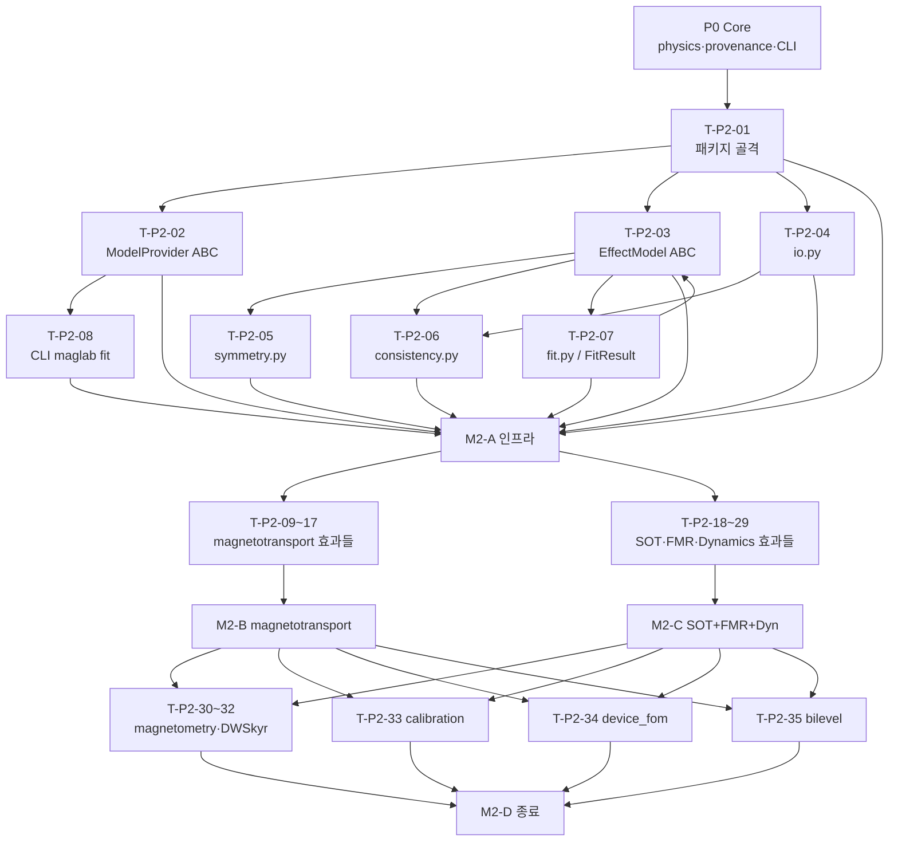

# MagLab 구현 계획 — Phase P2: 모델링·피팅 엔진 프로바이더 · 효과 피팅 레지스트리

> 설계 근거: PLAN.md §19 로드맵 · plan/04-analysis.md(§11) · 부록 F
> 이 문서는 구현 실행 계획이다 — 코드 생성 없이 태스크·순서·DoD를 명세. 규약: impl/README.md

---

## P2.0 목표 & 범위

**목표**: `analysis/` 패키지를 완성해 자성/스핀트로닉스 분야 효과 피팅 레지스트리를 운영 가능 상태로 만든다. 연구자는 `maglab fit --effect <name> data.csv` 한 명령으로 알려진 파라미터를 가진 피팅 결과(`FitResult`)를 얻고, 모든 수치·출처는 provenance로 추적된다.

**범위 안**:
- `analysis/providers/` — 6개 `ModelProvider` 클래스 (`magnetotransport`, `spin_orbitronics`, `ferromagnetic_resonance`, `magnetization_dynamics`, `magnetometry`, `domain_walls_skyrmions`)
- `analysis/effects/` — 부록 F 전수 `EffectModel` (§11.2 인터페이스)
- `analysis/fit.py` — lmfit 기반 `FitResult`(파라미터·불확실도·χ²)
- `analysis/symmetry.py` — 자기점군 허용 성분 필터
- `analysis/io.py` — CSV/HDF5 데이터 로드·저장
- `analysis/consistency.py` — 불일치 탐지 (D2 explain 트리거)
- `analysis/calibration.py` — 교정 레지스트리·계통 보정 파이프라인·GUM 불확실도 예산 (§11.6)
- `analysis/device_fom.py` — 소자 FoM 레지스트리 (§11.7, `maglab device fom`)
- `analysis/` 내 bilevel 피팅 측 로직 (§11.8, `maglab fit --discover` 안쪽 결정론 층)
- CLI 진입점: `maglab fit`, `maglab analyze`, `maglab device fom`

**범위 밖**: figure 렌더 (P1 dataplot 사용, 후행 통합), bilevel의 시뮬 측 (P3 `sim/`), Loop D 반복 자동화 전체 (P2는 피팅 개선 로직·잔차/물리 경계 검사까지, Loop D 스케줄러는 P4)

---

## P2.1 전제조건 — P0 산출물 체크리스트

P2 착수 전 아래 P0 산출물이 병합·통과 상태여야 한다.

- [ ] `maglab/physics/units.py` — Pint 기반 단위 시스템, `Quantity` 래퍼
- [ ] `maglab/physics/quantity.py` — `Quantity` 타입 (값·단위·출처 3-필드)
- [ ] `maglab/physics/oracle.py` — `sanity_oracle`: 차원·물리 경계 결정론 검사
- [ ] `maglab/physics/formulas.py` — 기본 물리 공식 (LLG 등 진입점)
- [ ] `maglab/provenance/` — `DataPoint`(raw·corrected·FITTED 타입), W3C PROV SQLite 백엔드
- [ ] `maglab/core/hooks.py` — honesty gate, promise-check 인터셉터
- [ ] `maglab/cli.py` + `maglab/__main__.py` — Typer 기반 CLI 골격, 서브커맨드 등록 훅
- [ ] P0 CI 게이트 통과 (golden-value, 단위 차원 검사, 배너 3단 반응)

P1과는 **병렬 진행 가능** — P2는 figure 렌더를 직접 생성하지 않으므로 P1 완료를 기다리지 않는다. 피팅 결과 시각화가 필요한 경우 P1 `figure/dataplot.py`를 **선택적·후행 통합**한다.

---

## P2.2 작업 분해 (WBS)

### 그룹 A — 인프라 (모든 효과 태스크의 선행)

- [ ] **T-P2-01  `analysis/__init__.py` + 패키지 골격**
  - 대상 파일: `maglab/analysis/__init__.py`, `maglab/analysis/providers/__init__.py`, `maglab/analysis/effects/__init__.py`
  - 설계 근거: §11.1 (plan/04-analysis.md)
  - 구현: 패키지 네임스페이스 등록, `ModelProvider` 추상 기반 클래스, `EffectModel` 추상 기반 클래스 선언 골격. 각 파일은 import-able 상태만. 실 구현은 T-P2-02·T-P2-03에서.
  - 의존: P0 완료
  - DoD: `python -c "from maglab.analysis import providers, effects"` 오류 없음.

- [ ] **T-P2-02  `ModelProvider` 추상 클래스**
  - 대상 파일: `maglab/analysis/providers/base.py`
  - 설계 근거: §11.1
  - 구현: `ModelProvider`는 `name`, `effects: list[EffectModel]`, `get(name)`, `list()` 메서드를 선언. 등록은 클래스 데코레이터(`@register_provider`)로. 프로바이더 6개는 각자 하위 모듈에서 구현 후 `providers/__init__.py`에 자동 등록.
  - 의존: T-P2-01
  - DoD: `ModelProvider` 인스턴스 생성, `list()` 호환 확인. pytest 단위 테스트 통과.

- [ ] **T-P2-03  `EffectModel` 인터페이스 확정**
  - 대상 파일: `maglab/analysis/effects/base.py`
  - 설계 근거: §11.2 (plan/04-analysis.md)
  - 구현: `EffectModel` ABC는 `name`, `subfield`, `references: list[str]`, `parameters: list[ParamSpec]`, `measurement_config: MeasurementConfig`, `forward(params, geometry)`, `fit(data, geometry) -> FitResult`, `symmetry_constraints` 속성·메서드를 선언. `ParamSpec`은 (이름, 단위, 물리 하한, 물리 상한) 4-필드. `MeasurementConfig`는 필요 기하·텐서 rank 명세.
  - 의존: T-P2-01, T-P2-08 (FitResult 선언 선행)
  - DoD: 인터페이스 ABC 완전 선언, 미구현 하위클래스 인스턴스화 시 `TypeError` 확인.

- [ ] **T-P2-04  `analysis/io.py` — 데이터 로드·저장**
  - 대상 파일: `maglab/analysis/io.py`
  - 설계 근거: §11 (plan/04-analysis.md), §17 provenance
  - 구현: CSV(pandas), HDF5(h5py) 로드 → `DataPoint[]` 반환. 컬럼 매핑 설정 지원. 저장 시 FITTED 타입 `DataPoint`에 fit provenance 기록. raw 데이터 변경 불가 보장.
  - 의존: T-P2-01, P0 `provenance/`
  - DoD: 합성 CSV 로드 → `DataPoint[]` 변환 → 재저장 → 재로드 동일성 pytest 확인.

- [ ] **T-P2-05  `analysis/symmetry.py` — 자기점군 허용 성분**
  - 대상 파일: `maglab/analysis/symmetry.py`
  - 설계 근거: §11 (plan/04-analysis.md), 부록 D
  - 구현: 자기점군 레이블(Schönflies + 자기 확장) 입력 → 허용 전기전도도·홀전도도 텐서 성분 목록 반환. `EffectModel.symmetry_constraints`가 이를 호출해 금지 성분 자동 0-고정. 핵심 대칭군(m3m·4/mmm·mm2 등 자성 실험에 빈출) 우선 구현.
  - 의존: T-P2-03
  - DoD: 입방 대칭계에서 off-diagonal AHE 성분 허용, AMR 성분 금지 케이스 결정론 검사 통과.

- [ ] **T-P2-06  `analysis/consistency.py` — 불일치 탐지**
  - 대상 파일: `maglab/analysis/consistency.py`
  - 설계 근거: §11 (plan/04-analysis.md), §5.11 D2 explain
  - 구현: 두 독립 효과 피팅 결과(예: AHE `R_0` vs. 홀 캐리어 농도)의 물리 일관성 검사. 불일치 시 경고 + `maglab explain` D2 트리거 신호 반환. 결정론 검사만 — LLM 판단 없음.
  - 의존: T-P2-08 (FitResult 구조), P0 `oracle`
  - DoD: 의도적으로 불일치하는 두 FitResult 입력 시 경고 반환, 일치 케이스에서 OK 반환. pytest 통과.

- [ ] **T-P2-07  `analysis/fit.py` — lmfit 래퍼 & `FitResult`**
  - 대상 파일: `maglab/analysis/fit.py`
  - 설계 근거: §11.2·§11.4 (plan/04-analysis.md), §20
  - 구현: `FitResult` 데이터클래스 — `params: dict[str, Quantity]`, `uncertainties: dict[str, float]`, `chi2: float`, `reduced_chi2: float`, `covariance: np.ndarray`, `provenance_id: str`. lmfit `Minimizer`를 래핑하는 `run_fit(model_fn, data, params_init, method='leastsq') -> FitResult`. 물리 경계(하한/상한)는 lmfit `Parameters.add(..., min=, max=)` 로 전달. 수렴 실패 시 `FitConvergenceError` 발생. 결과를 `DataPoint(type=FITTED)`로 provenance 등록.
  - 의존: T-P2-01, P0 `provenance/`, P0 `physics/units.py`
  - DoD: 알려진 파라미터로 선형 모델 합성 데이터 생성 → `run_fit` → 파라미터 복원 (1σ 이내) pytest 확인.
  - 스킬/도구: lmfit

- [ ] **T-P2-08  CLI 진입점 — `maglab fit`, `maglab analyze`**
  - 대상 파일: `maglab/cli.py` (서브커맨드 추가)
  - 설계 근거: §11.2, 부록 A
  - 구현: `maglab fit --effect <name> <data>` → 해당 `EffectModel.fit()` 호출 → `FitResult` Rich 테이블 출력. `maglab analyze load|model|consistency|symmetry` 서브커맨드. `--discover` 플래그는 bilevel 안쪽 층 진입 (T-P2-37). 인자 파싱은 Typer.
  - 의존: T-P2-02, T-P2-03, T-P2-07, P0 CLI 골격
  - DoD: `maglab fit --effect anomalous_hall tests/fixtures/ahe_synthetic.csv` 실행 시 FitResult 테이블 출력, 0아닌 χ² 확인. 스모크 테스트 통과.

---

### 그룹 B — magnetotransport 프로바이더 효과들

- [ ] **T-P2-09  `magnetotransport` ModelProvider 등록**
  - 대상 파일: `maglab/analysis/providers/magnetotransport.py`
  - 설계 근거: §11.1
  - 구현: `MagnetotransportProvider(ModelProvider)` — `effects` 목록에 T-P2-10~T-P2-16 EffectModel 등록. `@register_provider` 데코레이터.
  - 의존: T-P2-02, T-P2-10~T-P2-16 (후행 등록)
  - DoD: `provider.list()` → 7개 효과 이름 반환 pytest 통과.

- [ ] **T-P2-10  일반 홀 EffectModel**
  - 대상 파일: `maglab/analysis/effects/ordinary_hall.py`
  - 설계 근거: §11.3 (plan/04-analysis.md), 부록 F
  - 구현: `ρ_xy = R_H·B`, `R_H = 1/(n·q)`. forward는 B 배열 입력 → ρ_xy 배열 반환. fit은 선형 회귀 (`R_H` 단일 파라미터). `measurement_config`: Hall bar, I∥x, B∥z, V_y 측정. 출처: Kittel *Introduction to Solid State Physics* 8판 §6.
  - 의존: T-P2-03, T-P2-07
  - DoD: 알려진 n으로 합성 ρ_xy(B) 생성 → fit → n 복원 (1% 이내) pytest 통과. 출처 명기.
  - 스킬/도구: lmfit, numpy

- [ ] **T-P2-11  이상 홀 (AHE) EffectModel**
  - 대상 파일: `maglab/analysis/effects/anomalous_hall.py`
  - 설계 근거: §11.3 (plan/04-analysis.md), 부록 F
  - 구현: `ρ_xy = R_0·B + μ₀·R_s·M(H)`. M(H)는 별도 히스테리시스 데이터 또는 Langevin 모델로 공급. 두 파라미터 `R_0`, `R_s` 동시 피팅. `measurement_config`: Hall bar, 포화 필드까지 스윕. 출처: Nagaosa et al., *Rev. Mod. Phys.* 82, 1539 (2010).
  - 의존: T-P2-03, T-P2-07
  - DoD: 알려진 `R_0`, `R_s`로 합성 데이터 생성 → fit → 파라미터 복원 (§20 효과 피팅 테스트). 출처 명기.
  - 스킬/도구: lmfit

- [ ] **T-P2-12  TYJ 스케일링 EffectModel**
  - 대상 파일: `maglab/analysis/effects/tyj_scaling.py`
  - 설계 근거: §11.3 (plan/04-analysis.md), 부록 F
  - 구현: `ρ_AHE = a·ρ_xx0 + b·ρ_xx²`. T-가변 `ρ_xx(T)`, `ρ_AHE(T)` 쌍 입력 → `a`(외인성 스캐터링), `b`(내인성 Berry 위상) 피팅. 출처: Tian, Ye, Jin, *Phys. Rev. Lett.* 103, 087206 (2009).
  - 의존: T-P2-03, T-P2-07, T-P2-11 (AHE ρ_AHE 입력 가능)
  - DoD: 알려진 `a`, `b`로 합성 (ρ_xx, ρ_AHE) 쌍 생성 → fit → 복원 pytest 통과. 출처 명기.
  - 스킬/도구: lmfit

- [ ] **T-P2-13  평면 홀 (PHE) EffectModel**
  - 대상 파일: `maglab/analysis/effects/planar_hall.py`
  - 설계 근거: 부록 F
  - 구현: `ρ_xy = (Δρ/2)·sin(2φ)`. 면내 각도 φ 스윕 데이터 → `Δρ` 피팅. `measurement_config`: 면내 φ 회전, Hall bar. 출처: Taskin & Ando, *Phys. Rev. B* 84, 035301 (2011).
  - 의존: T-P2-03, T-P2-07
  - DoD: 알려진 Δρ 합성 데이터 → fit → 복원 pytest 통과. 출처 명기.
  - 스킬/도구: lmfit

- [ ] **T-P2-14  토폴로지컬 홀 (THE) EffectModel**
  - 대상 파일: `maglab/analysis/effects/topological_hall.py`
  - 설계 근거: 부록 F
  - 구현: `ρ_THE = ρ_xy − R_0·B − μ₀·R_s·M`. 배경(OHE+AHE) 차감 후 잔차 추출. `ρ_xy(H)`, `M(H)` 동시 입력 필요. `measurement_config`: ρ_xy(H)+M(H) 쌍. 출처: Neubauer et al., *Phys. Rev. Lett.* 102, 186602 (2009).
  - 의존: T-P2-03, T-P2-07, T-P2-10 (R_0 차감), T-P2-11 (R_s 차감)
  - DoD: 알려진 배경 + THE 신호 합성 데이터 → 배경 차감 → THE 잔차 추출 pytest 통과.

- [ ] **T-P2-15  AMR EffectModel**
  - 대상 파일: `maglab/analysis/effects/amr.py`
  - 설계 근거: 부록 F
  - 구현: `ρ(θ) = ρ⊥ + Δρ_AMR·cos²θ`. 면내 각도 θ 스윕 → `ρ⊥`, `Δρ_AMR` 피팅. `symmetry_constraints` 통해 대칭 허용 성분 검증. 출처: McGuire & Potter, *IEEE Trans. Magn.* 11, 1018 (1975).
  - 의존: T-P2-03, T-P2-05 (symmetry), T-P2-07
  - DoD: 알려진 Δρ_AMR 합성 → fit → 복원, 대칭 금지 성분 0 고정 확인 pytest 통과.
  - 스킬/도구: lmfit

- [ ] **T-P2-16  SMR EffectModel**
  - 대상 파일: `maglab/analysis/effects/smr.py`
  - 설계 근거: §11.3, 부록 F
  - 구현: `ρ_long = ρ_0 + Δρ_0 + Δρ_1·(1 − m_y²)`, `ρ_Hall = Δρ_2·m_y`. α/β/γ 각 스캔 3기하에서 동시 피팅 → `Δρ_1`, `Δρ_2`, `θ_SH`, `λ`, `G↑↓`. 출처: Chen et al., *Phys. Rev. B* 87, 144411 (2013).
  - 의존: T-P2-03, T-P2-07
  - DoD: 알려진 파라미터 3기하 합성 데이터 → fit → 복원 pytest 통과. 출처 명기.
  - 스킬/도구: lmfit

- [ ] **T-P2-17  GMR/TMR EffectModel**
  - 대상 파일: `maglab/analysis/effects/gmr_tmr.py`
  - 설계 근거: 부록 F
  - 구현: `G(θ) = G_0·(1 + (TMR/2)·cosθ)`; Julliere: `TMR = 2P₁P₂/(1 − P₁P₂)`. 스핀밸브/MTJ 각도 스윕 → `P₁`, `P₂` 피팅. 출처: Julliere, *Phys. Lett. A* 54, 225 (1975); Slonczewski, *Phys. Rev. B* 39, 6995 (1989).
  - 의존: T-P2-03, T-P2-07
  - DoD: 알려진 `P₁`, `P₂` 합성 → fit → 복원 pytest 통과. 출처 명기.
  - 스킬/도구: lmfit

---

### 그룹 C — spin_orbitronics 프로바이더 효과들

- [ ] **T-P2-18  `spin_orbitronics` ModelProvider 등록**
  - 대상 파일: `maglab/analysis/providers/spin_orbitronics.py`
  - 설계 근거: §11.1
  - 구현: `SpinOrbitronicsProvider(ModelProvider)` — SOT 하모닉 홀·ST-FMR·스핀 펌핑/ISHE·OHE 등록.
  - 의존: T-P2-02, T-P2-19~T-P2-22
  - DoD: `provider.list()` → 4개 효과 이름 반환 pytest 통과.

- [ ] **T-P2-19  SOT 하모닉 홀 EffectModel**
  - 대상 파일: `maglab/analysis/effects/sot_harmonic_hall.py`
  - 설계 근거: §11.3 (plan/04-analysis.md), 부록 F
  - 구현: 1ω·2ω 각의존성 데이터 → `H_DL`, `H_FL` 추출. PHE 보정 포함: `H_DL = (H_DL_raw − 2ξ·H_FL_raw)/(1 − 4ξ²)`. `ξ_DL`, `ξ_FL`로 효율 계산. `measurement_config`: 락인 1ω·2ω 동시 기록, φ 회전. 출처: Hayashi et al., *Phys. Rev. B* 89, 144425 (2014).
  - 의존: T-P2-03, T-P2-07
  - DoD: 알려진 `H_DL`, `H_FL`로 합성 1ω/2ω → PHE 보정 → fit → 복원 pytest 통과. 출처 명기.
  - 스킬/도구: lmfit

- [ ] **T-P2-20  ST-FMR EffectModel**
  - 대상 파일: `maglab/analysis/effects/stfmr.py`
  - 설계 근거: §11.3 (plan/04-analysis.md), 부록 F
  - 구현: `V_mix = S·F_sym(H) + A·F_asym(H)`, Lorentzian·반Lorentzian 성분. S/A 비로 댐핑형 스핀 홀 각 `ξ_DL = (S/A)·(eμ₀M_s·t_FM·t_NM/ħ)`. 공진 필드 `H_res`, 선폭 `ΔH`도 피팅. 출처: Liu et al., *Phys. Rev. Lett.* 106, 036601 (2011).
  - 의존: T-P2-03, T-P2-07
  - DoD: 알려진 S, A, H_res, ΔH 합성 → fit → 복원 pytest 통과. 출처 명기.
  - 스킬/도구: lmfit

- [ ] **T-P2-21  스핀 펌핑/ISHE EffectModel**
  - 대상 파일: `maglab/analysis/effects/spin_pumping_ishe.py`
  - 설계 근거: 부록 F
  - 구현: 선폭 증가 `Δα = (γħ·g↑↓)/(4π·μ₀·M_s·d_FM)` → `g↑↓` 추출. `V_ISHE = θ_SH·λ_sf·(tanh(d/(2λ_sf)))·ρ·j_s·w`. FMR 선폭 vs. d_NM 데이터 → `λ_sf`, `θ_SH`. 출처: Mizukami et al., *Jpn. J. Appl. Phys.* 40, 580 (2001); Mosendz et al., *Phys. Rev. B* 82, 214403 (2010).
  - 의존: T-P2-03, T-P2-07
  - DoD: 알려진 `g↑↓`, `θ_SH` 합성 → fit → 복원 pytest 통과. 출처 명기.
  - 스킬/도구: lmfit

- [ ] **T-P2-22  오비탈 홀 (OHE) EffectModel — rank-3 텐서**
  - 대상 파일: `maglab/analysis/effects/orbital_hall.py`
  - 설계 근거: §11.3 (plan/04-analysis.md), §21 리스크, 부록 F
  - 구현: 오비탈 홀 전도도는 **전하 홀(2-인덱스)과 달리 rank-3 텐서** `σ^{l_γ}_{α,β}` (3×3×3) — α=전류 방향, β=가로 방향, γ=궤도 각운동량 편극 방향. `EffectModel`이 `sigma_OH[α][β][γ]`(3×3×3 ndarray)를 보유. `θ_OH = σ_OH/σ_xx`. 측정 기하: 하모닉 홀/Hanle MR/MOKE 등 다중 기하 결합. 출처: Choi et al., *Nature* 619, 52 (2023); Go et al., arXiv:2409.20526.
  - 의존: T-P2-03, T-P2-07, T-P2-05 (symmetry rank-3 허용 성분)
  - DoD: `sigma_OH` 3×3×3 배열 초기화·접근 pytest 확인. 알려진 `θ_OH`로 합성 하모닉 홀 신호 → fit → θ_OH 복원 pytest 통과. rank-3 텐서가 `measurement_config`에 명기됨 확인. 출처 명기.
  - 스킬/도구: lmfit, numpy

---

### 그룹 D — ferromagnetic_resonance 프로바이더 효과들

- [ ] **T-P2-23  `ferromagnetic_resonance` ModelProvider 등록**
  - 대상 파일: `maglab/analysis/providers/ferromagnetic_resonance.py`
  - 설계 근거: §11.1
  - 구현: `FMRProvider(ModelProvider)` — Kittel·Gilbert 댐핑·스핀혼합전도도 등록.
  - 의존: T-P2-02, T-P2-24~T-P2-25
  - DoD: `provider.list()` 반환 pytest 통과.

- [ ] **T-P2-24  FMR Kittel EffectModel**
  - 대상 파일: `maglab/analysis/effects/fmr_kittel.py`
  - 설계 근거: §11.3, 부록 F
  - 구현: 면내: `(ω/γ)² = μ₀²·H_res·(H_res + M_eff)`, 면외: `(ω/γ) = μ₀·(H_res − M_eff)`. 두 기하 선택 가능. `M_eff`, `γ` 피팅. 출처: Kittel, *Phys. Rev.* 73, 155 (1948).
  - 의존: T-P2-03, T-P2-07
  - DoD: 알려진 `M_eff`, `γ` 면내/면외 합성 → fit → 복원 pytest 통과. 출처 명기.
  - 스킬/도구: lmfit

- [ ] **T-P2-25  Gilbert 댐핑 EffectModel**
  - 대상 파일: `maglab/analysis/effects/gilbert_damping.py`
  - 설계 근거: §11.3, 부록 F
  - 구현: `ΔH = ΔH₀ + (2α/γ)·f`. 주파수-의존 FMR 선폭 데이터 → `α`, `ΔH₀`(불균일 선폭) 피팅. 광대역(VNA-FMR/ST-FMR 주파수 스윕). 출처: Kalinikos & Slavin, *J. Phys. C* 19, 7013 (1986); Gilbert, *IEEE Trans. Magn.* 40, 3443 (2004).
  - 의존: T-P2-03, T-P2-07
  - DoD: 알려진 `α`, `ΔH₀` 합성 → fit → 복원 pytest 통과. 출처 명기.
  - 스킬/도구: lmfit

---

### 그룹 E — magnetization_dynamics 프로바이더 효과들

- [ ] **T-P2-26  `magnetization_dynamics` ModelProvider 등록**
  - 대상 파일: `maglab/analysis/providers/magnetization_dynamics.py`
  - 설계 근거: §11.1
  - 구현: `MagDynProvider(ModelProvider)` — LLG·1D DW·Thiele 등록.
  - 의존: T-P2-02, T-P2-27~T-P2-29
  - DoD: `provider.list()` 반환 pytest 통과.

- [ ] **T-P2-27  LLG (+STT/SOT) EffectModel**
  - 대상 파일: `maglab/analysis/effects/llg.py`
  - 설계 근거: §11.3, 부록 F
  - 구현: `dm/dt = −γ₀(m×H_eff) + α(m×ṁ) + τ_STT/SOT`. scipy ODE 통합(RK45). 전진 계산 후 관측량(자화 성분, 스위칭 시간) 추출. STT 항: `τ_DL·(m×m_p×m)`, SOT 항 추가 가능. 파라미터: `α`, `τ_DL`, `τ_FL`. 출처: Landau & Lifshitz (1935); Gilbert (2004); Slonczewski (1996).
  - 의존: T-P2-03, T-P2-07, P0 `physics/oracle.py`
  - DoD: LLG precession 진폭·주파수 해석해와 수치 비교 (< 1%) pytest 통과. 출처 명기.
  - 스킬/도구: scipy (odeint/solve_ivp)

- [ ] **T-P2-28  1D DW (q–Φ) EffectModel**
  - 대상 파일: `maglab/analysis/effects/dw_1d.py`
  - 설계 근거: §11.3, 부록 F
  - 구현: Thiele의 q–Φ 결합 ODE. Walker 분기 필드 `H_W = α·K⊥/M_s`. q(t), Φ(t) 수치 적분 → DW 속도 vs. H 곡선. 파라미터: `α`, `Δ`(DW 폭), `K⊥`. 출처: Schryer & Walker, *J. Appl. Phys.* 45, 5406 (1974).
  - 의존: T-P2-03, T-P2-07
  - DoD: Walker 분기 `H_W` 해석해와 수치 비교 pytest 통과. 출처 명기.
  - 스킬/도구: scipy

- [ ] **T-P2-29  Thiele EffectModel — 스커미온 홀각**
  - 대상 파일: `maglab/analysis/effects/thiele.py`
  - 설계 근거: §11.3, 부록 F
  - 구현: `G×v + α·D·v = F`. 자이로벡터 `G`, 소산 텐서 `D`, 구동력 `F`. 스커미온 홀각 `tan(θ_SkH) = G/(αD)`. 파라미터: 위상수 `Q`(토폴로지컬 전하), `D`, `α`. 출처: Thiele, *Phys. Rev. Lett.* 30, 230 (1973).
  - 의존: T-P2-03, T-P2-07
  - DoD: 알려진 Q, D, α로 합성 → θ_SkH 결정론 확인 pytest 통과. 출처 명기.

---

### 그룹 F — magnetometry 프로바이더

- [ ] **T-P2-30  `magnetometry` ModelProvider 등록 + 히스테리시스 EffectModel**
  - 대상 파일: `maglab/analysis/providers/magnetometry.py`, `maglab/analysis/effects/hysteresis.py`
  - 설계 근거: §11.1
  - 구현: `MagnetometryProvider(ModelProvider)`. 히스테리시스 루프 분석: `M_s`(포화), `M_r`(잔류), `H_c`(보자력), 제1사분면 이방성 에너지 추출. Stoner-Wohlfarth 모델 선택 가능. 출처: Stoner & Wohlfarth, *Philos. Trans. R. Soc. London A* 240, 599 (1948).
  - 의존: T-P2-02, T-P2-03, T-P2-07
  - DoD: 합성 히스테리시스 루프 → `M_s`, `H_c` 추출 pytest 통과.
  - 스킬/도구: lmfit, numpy

---

### 그룹 G — domain_walls_skyrmions 프로바이더

- [ ] **T-P2-31  `domain_walls_skyrmions` ModelProvider 등록**
  - 대상 파일: `maglab/analysis/providers/domain_walls_skyrmions.py`
  - 설계 근거: §11.1
  - 구현: `DWSkyrProvider(ModelProvider)` — Thiele(T-P2-29 공유), DMI 등록.
  - 의존: T-P2-02, T-P2-29, T-P2-32
  - DoD: `provider.list()` 반환 pytest 통과.

- [ ] **T-P2-32  DMI (BLS) EffectModel**
  - 대상 파일: `maglab/analysis/effects/dmi.py`
  - 설계 근거: 부록 F
  - 구현: `Δf = (γ·D_i)/(π·M_s)·k`. BLS 비상반성 주파수 시프트 vs. 파수벡터 k → 계면 DMI 상수 `D_i` 선형 피팅. `measurement_config`: BLS k 스캔, ±k 방향. 출처: Di et al., *Phys. Rev. Lett.* 114, 047201 (2015).
  - 의존: T-P2-03, T-P2-07
  - DoD: 알려진 `D_i` 합성 → fit → 복원 pytest 통과. 출처 명기.
  - 스킬/도구: lmfit

---

### 그룹 H — 교정·불확실도·FoM

- [ ] **T-P2-33  `analysis/calibration.py` — 교정 레지스트리 & 계통 보정**
  - 대상 파일: `maglab/analysis/calibration.py`
  - 설계 근거: §11.6 (plan/04-analysis.md), 부록 E (B4)
  - 구현: 교정 레지스트리 — 장비·인자·날짜·유효기간 JSON 저장·조회. 선언형 보정 파이프라인: 배경 차감·오프셋 제거·드리프트 보정·Hall 데이터 반대칭화. 각 보정 단계는 가역·추적·provenance 기록. GUM 불확실도 예산: `σ_total² = σ_measurement² + σ_calibration² + σ_fit²` → error budget 표. 최종 `DataPoint.uncertainty` 갱신.
  - 의존: T-P2-04 (io.py), P0 `provenance/`
  - DoD: 합성 raw 데이터 → 배경 차감 보정 적용 → 역변환 = raw 일치 pytest 확인. GUM 예산 표 수치 정합성 결정론 검사. 출처: GUM:1995/Cor1:2009.

- [ ] **T-P2-34  `analysis/device_fom.py` — 소자 FoM 레지스트리**
  - 대상 파일: `maglab/analysis/device_fom.py`
  - 설계 근거: §11.7 (plan/04-analysis.md), 부록 E (E1)
  - 구현: 소자 FoM 레지스트리 — SOT-MRAM·STT-MRAM·racetrack·MTJ·스핀밸브. 각 소자별 공식 등록: 열 안정성 `Δ = K_u·V/(k_B·T)`, 스위칭 전류 `J_c`, TMR 비 `(R_AP−R_P)/R_P`, DW 속도. 입력: 소자 기하 + 물질 파라미터(§11 효과 모델·§9 물리 DB). 출력: FoM 표 (지표·공식·입력·불확실도, IRDS/상용 타깃 대비). CLI: `maglab device fom <소자-스펙>`. 출처: Dieny et al., *Nat. Electron.* 3, 446 (2020); IRDS 2023.
  - 의존: T-P2-03, T-P2-07, T-P2-33, P0 `physics/`
  - DoD: `maglab device fom sot-mram --Ms 800e3 --t 2e-9 --Ku 4e5` 실행 → Δ, J_c 수치 출력, 타깃 대비 표 확인. 단위 차원 검사 통과.

---

### 그룹 I — bilevel 피팅 측

- [ ] **T-P2-35  bilevel 안쪽 층 — 결정론 파라미터 최적화**
  - 대상 파일: `maglab/analysis/bilevel.py`
  - 설계 근거: §11.8 (plan/04-analysis.md), 부록 E
  - 구현: LLM 바깥 층이 모델 *형태*를 제안하면, 안쪽 층(`bilevel.py`)이 연속 파라미터를 lmfit/scipy로 최적화. 입력: `model_fn` (LLM이 생성·검증한 심볼릭 함수), 데이터. 출력: `FitResult` + 잔차·AIC·BIC. LLM은 수치 계산하지 않음 — 이 모듈이 결정론 층. `maglab fit --discover` 플래그로 진입. 서킷 브레이커: 최대 반복 수 초과 시 중단, 마지막 최적 결과 반환.
  - 의존: T-P2-07, T-P2-08, P0 `oracle`
  - DoD: 알려진 2-파라미터 모델 형태 + 노이즈 데이터 → 안쪽 층 최적화 → 파라미터 복원 pytest 통과. LLM 호출 없는 순수 결정론 경로 확인.
  - 스킬/도구: lmfit, scipy

---

## P2.3 마일스톤 & 의존성

### 마일스톤

| ID | 이름 | 완료 태스크 | 목표 |
|---|---|---|---|
| M2-A | 인프라 완비 | T-P2-01~T-P2-08 | `EffectModel` 인터페이스·fit 엔진·CLI 진입점 완성 |
| M2-B | magnetotransport 완비 | T-P2-09~T-P2-17 + M2-A | AHE·TYJ·PHE·THE·AMR·SMR·GMR 합성 피팅 통과 |
| M2-C | SOT+FMR+Dynamics 완비 | T-P2-18~T-P2-29 + M2-A | 하모닉 홀·ST-FMR·FMR·LLG·OHE 합성 피팅 통과 |
| M2-D | P2 종료 | T-P2-30~T-P2-35 + M2-B + M2-C | 교정·FoM·bilevel·전수 효과 pytest 통과, §19 종료 기준 충족 |

### 의존성 그래프

---

## P2.4 검증 게이트 (종료 기준)

### §19 종료 기준 — P2 완료 판정

- [ ] `maglab fit --effect anomalous_hall tests/fixtures/ahe_synthetic.csv` — FitResult 출력, 파라미터 복원(1σ 이내)
- [ ] `maglab fit --effect smr tests/fixtures/smr_synthetic.csv` — 3기하 동시 피팅, 파라미터 복원
- [ ] `maglab fit --effect sot_harmonic_hall tests/fixtures/harmonic_hall_synthetic.csv` — PHE 보정 포함 H_DL·H_FL 복원
- [ ] `maglab fit --effect stfmr tests/fixtures/stfmr_synthetic.csv` — S·A·H_res·ΔH 복원
- [ ] `maglab fit --effect fmr_kittel tests/fixtures/fmr_synthetic.csv` — M_eff·γ 복원
- [ ] `maglab fit --effect orbital_hall tests/fixtures/ohe_synthetic.csv` — θ_OH 복원, rank-3 텐서 구조 확인
- [ ] `maglab device fom sot-mram ...` — Δ·J_c FoM 표 출력
- [ ] 전수 `EffectModel` pytest 합성-데이터 라운드트립 통과 (`tests/test_effects.py`)

### §20 효과 피팅 테스트 체크리스트 (결정론만)

- [ ] 알려진 파라미터로 합성 데이터 생성 — LLM 개입 없음
- [ ] `EffectModel.forward()` 결정론 검사 (동일 입력 → 동일 출력, 허용 오차 < 1e-10)
- [ ] `EffectModel.fit()` 복원 정확도 — 파라미터 복원 오차 < 5% (노이즈 없는 합성 데이터 기준)
- [ ] 노이즈 포함 합성 데이터 — 복원 오차 < 1σ 신뢰구간 내
- [ ] `FitResult.chi2` 물리적 타당 범위 검사 (reduced_chi2 ≈ 1)
- [ ] 물리 경계 위반 파라미터 입력 시 `FitConvergenceError` 발생 확인
- [ ] OHE `sigma_OH[α][β][γ]` shape = (3,3,3), dtype = float64 확인
- [ ] symmetry_constraints: 대칭 금지 성분 자동 0 고정 확인
- [ ] `DataPoint(type=FITTED)` provenance 기록 — fit_id·출처 포함 확인
- [ ] **LLM-as-judge 금지** — 모든 검증은 수치·결정론 비교만

### 부록 D 정적 검증 — P2 해당 규칙

- [ ] 효과 피팅: 필요 측정 기하 충족 (`measurement_config` 완전 명세)
- [ ] 텐서 rank 일치: OHE rank-3 확인, AHE rank-2 확인
- [ ] 파라미터 물리 경계: lmfit `min`/`max` 설정 확인

---

## P2.5 스킬·도구·패키지

| 항목 | 역할 | 설치 |
|---|---|---|
| `lmfit` | 비선형 최소제곱 피팅, `Parameters`, `Minimizer` | `pip install lmfit` |
| `numpy` | 배열·텐서 연산 (OHE rank-3 포함) | 코어 의존 |
| `scipy` | ODE 통합 (LLG·DW), 최적화 | `pip install scipy` |
| `pandas` | CSV 로드·변환 (io.py) | `pip install pandas` |
| `h5py` | HDF5 로드·저장 | `pip install h5py` |
| `pint` | 단위 연산 (P0 units.py) | P0 설치 완료 |
| `prov` | W3C PROV 기록 (P0 provenance) | P0 설치 완료 |
| `arxiv-search` 스킬 | 1차 문헌 출처 확정 시 논문 검색 | Claude 스킬 |

`pyproject.toml` extras: `[analysis]` = lmfit·scipy·pandas·h5py (P2 신규). 코어 설치는 GPU·LLM 없이 가능해야 함 (§18).

---

## P2.6 리스크 & 주의

| 리스크 | 대응 | PLAN §21 연계 |
|---|---|---|
| 효과 피팅 공식 오류 | 모든 `EffectModel`의 피팅식·파라미터를 **1차 문헌으로 확정**. references 필드 필수. 구현 전 부록 J 출처 교차검증 | §21 "효과 피팅 공식 정확성" |
| OHE rank-3 텐서 착오 | `sigma_OH[α][β][γ]` (3×3×3) 명시 — 2-인덱스 처리 절대 금지. 측정 기하별 수축 공식 별도 명기 | §21 "OHE 3-인덱스 텐서" |
| TYJ 스케일링 체제 혼동 | 외인성(a, ρ_xx0 선형)·내인성(b, ρ_xx² 이차)·혼성 체제 구분. 합성 데이터로 각 체제 단독 복원 확인 | §21 "효과 피팅 공식 정확성" |
| PHE 보정 부재로 SOT 과대추정 | 하모닉 홀 피팅 시 ξ 보정항 필수. T-P2-19에서 PHE 보정 포함 DoD 명시 | §11.3 |
| lmfit 수렴 실패 | 초기값 민감도 검사. `FitConvergenceError` 발생 시 초기값·경계 재조정 후 재시도 최대 N회 (T-P2-07 서킷 브레이커). 미수렴 결과를 FitResult로 반환 금지 | §11.4 Loop D |
| bilevel LLM 층이 수치 직접 생성 | `bilevel.py`는 결정론 층만. LLM 제안 `model_fn`의 수치는 안쪽 층 최적화만 설정. 감사 로그에 LLM-제안 형태 vs. 결정론 파라미터 분리 기록 | §3.2, §11.8 |
| 교정 인자 유효기간 미확인 | `calibration.py`에서 피팅 전 유효기간 자동 검사. 만료 시 경고 + 사용 차단 | §11.6 |

---

## 관련 문서

- [`../PLAN.md`](../PLAN.md) §11·§19·§20·§21 — 설계·로드맵·테스트·리스크
- [`../plan/04-analysis.md`](../plan/04-analysis.md) — §11 모델링·피팅 엔진 상세 설계
- [`../plan/11-appendices.md`](../plan/11-appendices.md) — 부록 D(정적 검증)·E(기능 매핑)·F(효과 피팅 레지스트리)
- [`00-foundation.md`](00-foundation.md) — 툴체인·패키지 골격
- [`01-P0-core.md`](01-P0-core.md) — P0 산출물 (physics·provenance·CLI — P2 전제조건)
- [`02-P1-figure-sim.md`](02-P1-figure-sim.md) — P1 figure 데이터플롯 (피팅 결과 시각화 후행 통합)
- [`04-P3-multiscale.md`](04-P3-multiscale.md) — P3 (bilevel 시뮬 측, P2 완료 후)
- [`09-testing-and-ci.md`](09-testing-and-ci.md) — 전체 검증 전략·CI 게이트
