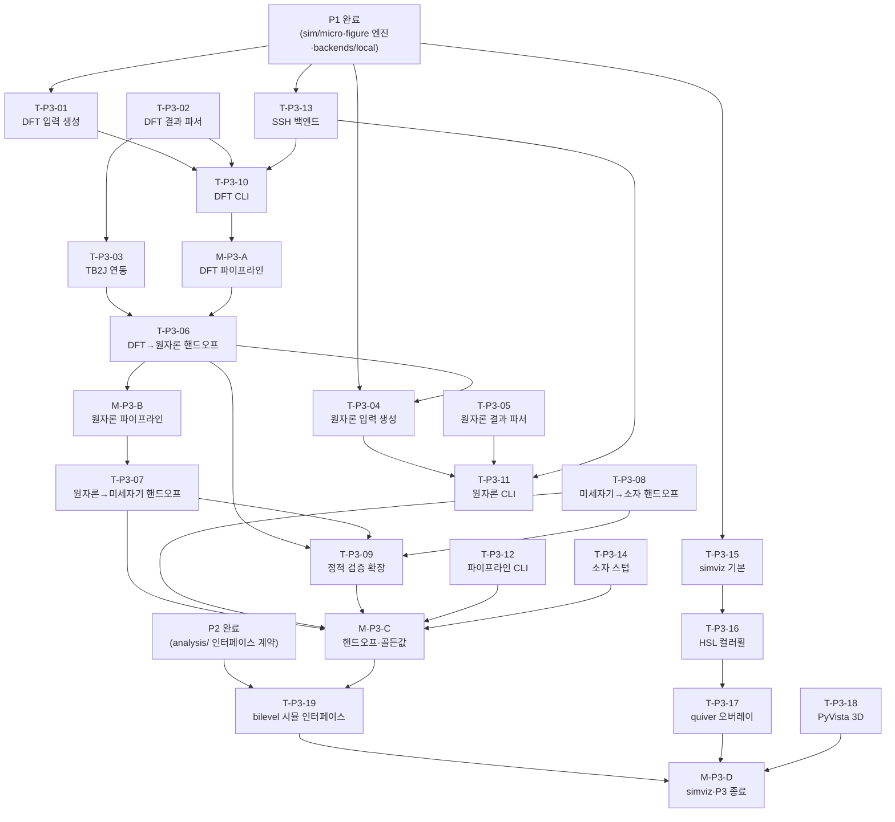

# MagLab 구현 계획 — Phase P3: 멀티스케일 시뮬레이션 · simviz 시각화

> 설계 근거: PLAN.md §19 로드맵 · plan/03-physics-simulation.md(§10) · plan/05-figure.md(§12.3)
> 이 문서는 구현 실행 계획이다 — 코드 생성 없이 태스크·순서·DoD를 명세. 규약: impl/README.md

---

## P3.0 목표 & 범위

**목표.** P1이 구축한 미세자기 단일 스케일 위에 DFT·원자론 스케일을 추가하고,
스케일 간 파라미터 핸드오프(`handoff.py`)를 자동화한다. 동시에 `simviz` OVF
시각화 렌더러를 figure 엔진에 추가해 자화 구조(스커미온·자구벽·볼텍스)를
출판급 컬러휠 이미지로 렌더한다.

**P3 종료 상태.** `maglab sim dft`, `maglab sim atomistic`, `maglab sim pipeline`
명령이 동작하고, `handoff.py`가 DFT→원자론→미세자기→소자 4-스케일 변환을
단위 검증과 함께 수행한다. VAMPIRE bcc Fe T_C 골든값 통과, 핸드오프 골든값
통과(부록 D), 스커미온 HSL 컬러휠 시각화 PNG 출력.

**범위 안.**
- `maglab/sim/dft/` — VASP·QE·FLEUR 입력 생성·결과 파싱(J_ij·MAE·DMI·m 추출), TB2J 연동.
- `maglab/sim/atomistic/` — VAMPIRE·Spirit 입력 생성·결과 파싱(M_s(T)·T_C·A(T)·K(T)).
- `maglab/sim/handoff.py` — 스케일쌍별 변환(DFT→원자론, 원자론→미세자기, 미세자기→소자). 단위·온도의존성·가정 명시·provenance. P3의 핵심 가치.
- `maglab/sim/device/` — 소자/수송 스케일 기초 스텁.
- `maglab/sim/backends/ssh_hpc` · `ssh_gpu` — Slurm·GPU 클러스터 백엔드. Mac에서 mock 검증.
- `maglab/figure/renderers/simviz.py` — discretisedfield `mpl()`·`mpl.lightness()` HSL 컬러휠·matplotlib quiver·PyVista 3D off-screen→PNG.
- `maglab sim pipeline` CLI 명령.
- 이론↔시뮬 bilevel 모델 발견의 시뮬 측(§11.8 — P2와 협동, 안쪽 결정론 층).

**범위 밖.**
- `instrument/`(P4). 미세자기 단일 스케일·`sim/spec.py`·`sim/validate.py`·
  `sim/parse.py`·`sim/custodian.py`·`sim/micro/`·`backends/`local·cpu(P1 완료).
  `figure/spec.py`·`figure/compose.py`·`figure/export.py`(P1 완료 — simviz는
  그 위에 렌더러로 추가됨). 효과 피팅 레지스트리(P2 완료).

---

## P3.1 전제조건

P0·P1 완료를 확인한 후 P3를 착수한다.

**P0 산출물 체크리스트.**
- [ ] `maglab/physics/units.py` · `quantity.py` — 자성 단위 변환(`Quantity` 타입) 동작 확인.
- [ ] `maglab/physics/oracle.py` — 차원·범위 sanity oracle 동작 확인.
- [ ] `maglab/provenance/` — W3C PROV DataPoint 기록 동작 확인.
- [ ] `maglab/sim/spec.py` — `MultiScaleSpec = {ScaleSpec[], Handoff[]}` IR 정의 완료.
- [ ] `maglab/sim/validate.py` — 정적 검증 훅(부록 D) 동작 확인.
- [ ] `maglab/sim/parse.py` · `custodian.py` — `JobResult` 구조화 파싱 완료.
- [ ] `maglab/sim/backends/local` · `cpu` — 로컬/CPU 폴백 백엔드 동작 확인.
- [ ] `maglab/core/hooks.py` — honesty gate(무결성 차단) 동작 확인.

**P1 산출물 체크리스트.**
- [ ] `maglab/sim/micro/` — MuMax3·OOMMF·magnum.np 미세자기 단일 스케일 동작 확인.
- [ ] µMAG 표준문제 #1–#5 골든값 통과 확인.
- [ ] `maglab/figure/spec.py` — FigureSpec IR 완료.
- [ ] `maglab/figure/compose.py` · `export.py` — 멀티패널 합성·벡터 내보내기 완료.
- [ ] `maglab/figure/renderers/dataplot.py` — matplotlib 데이터플롯 렌더러 완료.
- [ ] `maglab/figure/styles/` — 저널별 스타일 프로파일(Nature·APS·IEEE·Elsevier) YAML 완료.

---

## P3.2 작업 분해 (WBS)

### DFT 서브모듈 — sim/dft/

---

#### T-P3-01  DFT 입력 생성기 — sim/dft/input\_gen.py
- [ ] **T-P3-01  DFT 입력 생성기**
  - 대상 파일: `maglab/sim/dft/input_gen.py`
  - 설계 근거: §10.1 (plan/03-physics-simulation.md)
  - 구현: VASP·QE·FLEUR 세 엔진에 대한 입력 파일 생성. `MultiScaleSpec`의 `ScaleSpec` DFT 섹션을 받아 `INCAR`/`KPOINTS`/`POSCAR`(VASP) 또는 `pw.x` 입력(QE) 형식으로 직렬화. SOC·MAE·DMI 계산용 태그 처리. 엔진별 세부 파라미터는 `spec.py`에서 공급.
  - 의존: `sim/spec.py`(P1), `physics/units.py`(P0)
  - DoD: QE CPU 폴백으로 bcc Fe 기본 입력 파일 생성, `validate.py` k-메시·컷오프·SOC 정적 검증 통과(부록 D).

---

#### T-P3-02  DFT 결과 파서 — sim/dft/parse\_dft.py
- [ ] **T-P3-02  DFT 결과 파서**
  - 대상 파일: `maglab/sim/dft/parse_dft.py`
  - 설계 근거: §10.1 (plan/03-physics-simulation.md)
  - 구현: VASP `OUTCAR`·`vasprun.xml`, QE `pw.x` 출력, FLEUR `out.xml`에서 J_ij·MAE·DMI·자기모멘트(m)를 추출해 `JobResult`로 반환. 단위는 출력 파일 원단위 그대로 보존하고 `Quantity` 래핑; 변환은 `handoff.py`로 위임.
  - 의존: `sim/parse.py`(P1), `physics/quantity.py`(P0)
  - DoD: QE bcc Fe 출력에서 J_ij(meV)·MAE(meV/atom)·m(μ_B) 추출 후 `JobResult` 구조화 확인. LLM은 원시 텍스트 파일을 읽지 않는다.

---

#### T-P3-03  TB2J 연동 — sim/dft/tb2j.py
- [ ] **T-P3-03  TB2J 연동**
  - 대상 파일: `maglab/sim/dft/tb2j.py`
  - 설계 근거: §10.1, 부록 D(DFT — J_ij 완전)
  - 구현: TB2J Python API 또는 서브프로세스 래퍼. Wannier90 결과에서 전체 J_ij 교환 텐서(쌍 목록 + 크기)·DMI 벡터(D_ij)를 추출해 `JobResult`에 합산. J_ij 완전성(부록 D DFT 정적 검증 — 잘린 쌍 경고) 체크.
  - 의존: T-P3-02 (`parse_dft.py`), `sim/validate.py`(P1)
  - DoD: bcc Fe TB2J 출력에서 J_ij 쌍 목록 완전 추출 확인. `validate.py` J_ij 완전성 검증 통과.
  - 스킬/도구: TB2J

---

### 원자론 서브모듈 — sim/atomistic/

---

#### T-P3-04  원자론 입력 생성기 — sim/atomistic/input\_gen.py
- [ ] **T-P3-04  원자론 입력 생성기**
  - 대상 파일: `maglab/sim/atomistic/input_gen.py`
  - 설계 근거: §10.1 (plan/03-physics-simulation.md)
  - 구현: VAMPIRE·Spirit 두 엔진의 입력 파일 생성. `ScaleSpec` 원자론 섹션과 `handoff.py`가 공급하는 J_ij·MAE·DMI·m(핸드오프 후 단위)을 받아 `material`/`input` 파일(VAMPIRE) 또는 `cfg.json`(Spirit)으로 직렬화. 온도 가변 스위프 지원.
  - 의존: `sim/spec.py`(P1), T-P3-08 (`handoff.py`), `physics/units.py`(P0)
  - DoD: bcc Fe J_ij 핸드오프 값으로 VAMPIRE 입력 파일 생성. `validate.py` 온도 vs T_C 정적 검증 통과(부록 D).

---

#### T-P3-05  원자론 결과 파서 — sim/atomistic/parse\_atomistic.py
- [ ] **T-P3-05  원자론 결과 파서**
  - 대상 파일: `maglab/sim/atomistic/parse_atomistic.py`
  - 설계 근거: §10.1 (plan/03-physics-simulation.md)
  - 구현: VAMPIRE `output/`·Spirit 출력에서 M_s(T)·T_C·A(T)·K(T) 추출해 `JobResult`로 반환. T_C는 M(T) 곡선 변곡점 또는 `specific_heat` 피크로 결정. `Quantity` 단위 래핑 유지.
  - 의존: `sim/parse.py`(P1), T-P3-04 (입력 생성기)
  - DoD: bcc Fe VAMPIRE 출력에서 T_C(K)·M_s(T)(A/m) 추출 확인. 추출값이 `JobResult`에 구조화됨을 단위 포함 검증.

---

### 핸드오프 — sim/handoff.py (P3 핵심)

---

#### T-P3-06  DFT→원자론 핸드오프
- [ ] **T-P3-06  DFT→원자론 핸드오프**
  - 대상 파일: `maglab/sim/handoff.py` (함수: `dft_to_atomistic`)
  - 설계 근거: §10.1 (plan/03-physics-simulation.md), 부록 D(핸드오프 규칙)
  - 구현: DFT `JobResult`(J_ij[meV]·MAE[meV/atom]·DMI[meV]·m[μ_B])를 원자론 입력 단위(J_ij[K]·K[J]·D_ij[J])로 변환. `Quantity` 타입으로 단위 추적. 변환 가정(: U 계수·Heisenberg 모델 적용 범위)을 코드 근처에 명시적으로 주석 기록. provenance `DataPoint`에 "DFT→원자론 변환" 이벤트 기록. 출력 단위가 T-P3-04 입력 단위와 일치하는지 `oracle.py` 차원 검증.
  - 의존: T-P3-02·T-P3-03 (DFT 파서·TB2J), `physics/units.py`(P0), `physics/oracle.py`(P0), `provenance/`(P0)
  - DoD: 핸드오프 골든값 통과(§20 — 스케일 N 출력단위 = N+1 입력단위 정적 검증, 부록 D). 단위/차원 불일치 시 `oracle` 차단 확인.

---

#### T-P3-07  원자론→미세자기 핸드오프
- [ ] **T-P3-07  원자론→미세자기 핸드오프**
  - 대상 파일: `maglab/sim/handoff.py` (함수: `atomistic_to_micro`)
  - 설계 근거: §10.1, 부록 D
  - 구현: 원자론 `JobResult`(M_s(T)[A/m]·T_C[K]·A(T)[J/m]·K(T)[J/m³])를 미세자기 입력 파라미터(`M_s`·`A`·`K` at 지정 온도)로 변환. 온도 보간(스플라인 또는 선형)으로 임의 온도값 공급. 연속체 근사 가정(격자 상수·연속체 교환 스티프니스 전환)을 명시. provenance 기록.
  - 의존: T-P3-05 (원자론 파서), `physics/units.py`(P0), `physics/oracle.py`(P0)
  - DoD: 핸드오프 골든값 통과. 300 K·400 K에서 A(T) 보간값이 `oracle` 범위 검증 통과. 단위 불일치 시 차단.

---

#### T-P3-08  미세자기→소자 핸드오프
- [ ] **T-P3-08  미세자기→소자 핸드오프**
  - 대상 파일: `maglab/sim/handoff.py` (함수: `micro_to_device`)
  - 설계 근거: §10.1, 부록 D
  - 구현: 미세자기 `JobResult`(자화 구조·동역학 — 임계 전류 밀도·스위칭 시간·스커미온 홀 각도)를 소자/수송 스케일 입력으로 변환. 출력 물리량 목록과 가정(: 연속체→마크로스핀 감소 가정)을 명시. provenance 기록.
  - 의존: T-P3-05 완성 핸드오프 함수 패턴, `sim/micro/`(P1), `physics/units.py`(P0)
  - DoD: 핸드오프 골든값 통과. 임계 전류 밀도 단위 A/m² 검증.

---

#### T-P3-09  핸드오프 정적 검증 확장 — sim/validate.py
- [ ] **T-P3-09  핸드오프 정적 검증 확장**
  - 대상 파일: `maglab/sim/validate.py` (P1 파일에 DFT·원자론·핸드오프 규칙 추가)
  - 설계 근거: 부록 D(정적 검증 규칙)
  - 구현: `validate.py`에 DFT 정적 검증(k-메시 밀도·컷오프·SOC 태그), 원자론 정적 검증(J_ij 완전·온도 vs T_C), 핸드오프 정적 검증(스케일 N 출력단위 = N+1 입력단위 — `Quantity` 차원 비교) 규칙 추가. 위반 시 `JobResult` 차단.
  - 의존: T-P3-01·T-P3-04·T-P3-06·T-P3-07·T-P3-08 (전 핸드오프), `physics/oracle.py`(P0)
  - DoD: 고의 단위 불일치 케이스에서 `validate.py`가 `JobResult` 생성을 차단함을 테스트로 확인.

---

### 파이프라인 CLI — maglab sim pipeline

---

#### T-P3-10  DFT CLI 명령 — maglab sim dft
- [ ] **T-P3-10  DFT CLI 명령**
  - 대상 파일: `maglab/cli.py` (DFT 서브커맨드 등록), `maglab/sim/dft/__init__.py`
  - 설계 근거: 부록 A CLI 명령어 트리, §10
  - 구현: `maglab sim dft <구조파일> [--engine vasp|qe|fleur] [--calc jij|mae|dmi]` 명령. 입력 생성 → 백엔드 제출 → 파싱 → provenance 기록 파이프라인을 오케스트레이터가 순서 실행. 결과를 `JobResult`로 세션 데이터 볼트에 저장.
  - 의존: T-P3-01·T-P3-02·T-P3-03, T-P3-13 (SSH 백엔드 또는 mock), `core/orchestrator.py`(P0)
  - DoD: `maglab sim dft --engine qe --calc jij tests/data/bcc_fe.cif`가 mock 백엔드로 `JobResult`(J_ij 포함) 반환.

---

#### T-P3-11  원자론 CLI 명령 — maglab sim atomistic
- [ ] **T-P3-11  원자론 CLI 명령**
  - 대상 파일: `maglab/cli.py`, `maglab/sim/atomistic/__init__.py`
  - 설계 근거: 부록 A, §10
  - 구현: `maglab sim atomistic [--engine vampire|spirit] [--temp-range 0:1200:50]` 명령. DFT `JobResult` 또는 수동 파라미터를 받아 원자론 입력 생성 → 제출 → 파싱 파이프라인. 온도 스위프 배열 지원.
  - 의존: T-P3-04·T-P3-05, T-P3-06 (핸드오프), T-P3-13 (SSH 백엔드 또는 mock)
  - DoD: `maglab sim atomistic --engine vampire tests/data/bcc_fe_jij.json`이 mock 백엔드로 M_s(T)·T_C 포함 `JobResult` 반환.

---

#### T-P3-12  멀티스케일 파이프라인 CLI — maglab sim pipeline
- [ ] **T-P3-12  멀티스케일 파이프라인 CLI**
  - 대상 파일: `maglab/sim/pipeline.py`, `maglab/cli.py`
  - 설계 근거: §10.1, §10.3 (plan/03-physics-simulation.md)
  - 구현: `maglab sim pipeline <구조파일> [--scales dft,atomistic,micro] [--target-temp 300]` 명령. DFT → 핸드오프 → 원자론 → 핸드오프 → 미세자기 → (선택) 소자 순서를 오케스트레이터가 체이닝. 각 스케일 결과를 세션 볼트에 저장하고 스케일별 provenance를 연결. 실패 스케일에서 중단 후 재개 가능(`checkpoint.py`).
  - 의존: T-P3-10·T-P3-11, T-P3-06·T-P3-07·T-P3-08 (핸드오프 전체), `core/checkpoint.py`(P0)
  - DoD: bcc Fe mock 파이프라인(DFT→원자론→미세자기) 엔드투엔드 실행. 각 스케일 `JobResult`가 provenance로 연결됨 확인. 중간 실패 시 재개 동작.

---

### SSH 백엔드 — sim/backends/

---

#### T-P3-13  SSH 백엔드 — sim/backends/ssh\_hpc.py · ssh\_gpu.py
- [ ] **T-P3-13  SSH 백엔드**
  - 대상 파일: `maglab/sim/backends/ssh_hpc.py`, `maglab/sim/backends/ssh_gpu.py`
  - 설계 근거: §10.2 (plan/03-physics-simulation.md)
  - 구현: `ssh_hpc`는 Slurm 클러스터용 — `sbatch` 제출·`squeue` 폴링·파일 전송(`paramiko` 또는 `subprocess ssh/rsync`). `ssh_gpu`는 단일 GPU 서버 직접 실행용. 백엔드 인터페이스는 P1 local/cpu 백엔드와 동일 추상(submit·poll·fetch·cancel). **Mac 개발 환경에서 mock 모드로 검증 가능**: `--backend mock`이면 실제 SSH 없이 제출·폴링·결과 반환을 로컬 파일로 시뮬레이션.
  - 의존: `sim/backends/`(P1 인터페이스), `core/config.py`(P0 — SSH 자격증명 설정)
  - DoD: mock 모드에서 `submit`→`poll`→`fetch` 사이클 완결 확인. 실제 Slurm 클러스터 선택적 통합테스트(CI skip 가능).

---

### 소자 스케일 기초 — sim/device/

---

#### T-P3-14  소자 스케일 기초 스텁 — sim/device/
- [ ] **T-P3-14  소자 스케일 기초 스텁**
  - 대상 파일: `maglab/sim/device/__init__.py`, `maglab/sim/device/spec.py`
  - 설계 근거: §10.1 (4-스케일 flowchart), 부록 E(소자 성능 지표 FoM — P2 완료)
  - 구현: 소자/수송 스케일의 `ScaleSpec` 확장 정의. T-P3-08 `micro_to_device` 핸드오프 출력을 받는 입력 스키마 선언. P4 이후 실질적 구현을 위한 플레이스홀더. 임계 전류·스위칭 시간·스커미온 홀 각도의 `Quantity` 타입 명세.
  - 의존: T-P3-08 (미세자기→소자 핸드오프), `sim/spec.py`(P1)
  - DoD: `ScaleSpec(scale="device")` 인스턴스가 `MultiScaleSpec`에 삽입 가능. 핸드오프 출력이 소자 입력 스키마와 단위 검증 통과.

---

### simviz 렌더러 — figure/renderers/simviz.py

---

#### T-P3-15  simviz 렌더러 기본 — OVF·discretisedfield
- [ ] **T-P3-15  simviz 렌더러 기본**
  - 대상 파일: `maglab/figure/renderers/simviz.py`
  - 설계 근거: §12.3 (plan/05-figure.md) — `simviz.py` 항목
  - 구현: `FigureSpec` 패널 유형 `sim-viz`를 처리하는 렌더러. `discretisedfield` 라이브러리의 `Field` 객체 또는 OVF 파일 경로를 입력으로 받아 `mpl()` 2D 슬라이스 렌더. `figure/renderers/` 렌더러 추상 인터페이스(`render(spec) -> matplotlib Figure`)를 준수. 출력은 `compose.py`로 전달.
  - 의존: `figure/spec.py`(P1), `figure/compose.py`(P1), `sim/micro/`(P1 — OVF 출력 경로)
  - DoD: 테스트 OVF 파일(`tests/data/skyrmion.ovf`)에서 2D 자화 슬라이스 matplotlib Figure 생성 확인.
  - 스킬/도구: `discretisedfield`, `ubermag`

---

#### T-P3-16  HSL 컬러휠 시각화 — 스커미온 표준
- [ ] **T-P3-16  HSL 컬러휠 시각화**
  - 대상 파일: `maglab/figure/renderers/simviz.py` (함수: `render_hsl`)
  - 설계 근거: §12.3 — `mpl.lightness()` HSL 컬러휠(스커미온 표준)
  - 구현: `discretisedfield` `mpl.lightness()`를 사용해 자화벡터의 면내 방향을 HSL 컬러휠(스핀-up=밝음, 스핀-down=어둠)로 렌더. 스커미온·자구벽·볼텍스에 적용. 컬러바에 각도(0–360°) 표시. `export.py`의 `pdf.fonttype=42` 설정과 연동해 벡터 출력 보장.
  - 의존: T-P3-15 (simviz 기본), `figure/export.py`(P1), `figure/styles/`(P1)
  - DoD: 스커미온 시각화 골든값 통과(§20). HSL 컬러휠 PNG 출력이 각도 대칭성 확인(0°=+x 방향 적색 기준 대칭).

---

#### T-P3-17  matplotlib quiver 오버레이
- [ ] **T-P3-17  matplotlib quiver 오버레이**
  - 대상 파일: `maglab/figure/renderers/simviz.py` (함수: `render_quiver`)
  - 설계 근거: §12.3 — matplotlib quiver
  - 구현: 자화 벡터장을 matplotlib `quiver`로 오버레이. HSL 배경 위에 화살표 오버레이 가능. 서브샘플링(밀도 파라미터)으로 과밀 방지. 화살표 색 = m_z 성분 컬러맵(RdBu).
  - 의존: T-P3-15·T-P3-16, `figure/styles/`(P1)
  - DoD: `tests/data/dw_neel.ovf` 네엘 자구벽에서 quiver 오버레이 Figure 생성. 화살표 방향이 OVF 벡터 방향과 일치 확인.

---

#### T-P3-18  PyVista 3D off-screen 렌더
- [ ] **T-P3-18  PyVista 3D off-screen 렌더**
  - 대상 파일: `maglab/figure/renderers/simviz.py` (함수: `render_3d`)
  - 설계 근거: §12.3 — PyVista 3D off-screen → PNG
  - 구현: `pyvista` off-screen 렌더러로 3D 자화 구조 시각화. `discretisedfield`→`vtk` 변환 후 PyVista `add_arrows` 또는 `glyph` 렌더. off-screen 모드(`pyvista.start_xvfb()` 또는 `MPLBACKEND=Agg` 설정) — Mac·서버 양쪽 지원. 출력은 PNG(래스터 — 3D 미리보기용). 출판용은 T-P3-15·T-P3-16 벡터 경로 사용.
  - 의존: T-P3-15, `[figure]` extra(`pyvista`)
  - DoD: headless 환경에서 3D 볼텍스 구조 PNG 생성. display 없는 CI 환경에서 오류 없이 동작.

---

### bilevel 모델 발견 — 시뮬 측

---

#### T-P3-19  bilevel 시뮬 최적화 인터페이스 — sim/pipeline.py
- [ ] **T-P3-19  bilevel 시뮬 최적화 인터페이스**
  - 대상 파일: `maglab/sim/pipeline.py` (함수: `sim_objective`)
  - 설계 근거: §11.8 (plan/04-analysis.md — 이론↔시뮬 bilevel 모델 발견), 부록 E
  - 구현: 안쪽 결정론 층의 시뮬 측 — 파라미터 벡터(J_ij·MAE·DMI)를 받아 원자론 시뮬 실행 후 M(T) 곡선·T_C를 반환하는 callable `sim_objective`. P2 `analysis/`가 바깥 피팅 루프에서 이 함수를 호출. 함수 서명은 P2와 협의(§11.8 인터페이스 계약).
  - 의존: T-P3-11 (원자론 CLI), T-P3-05 (파서), P2 `analysis/` 인터페이스 계약
  - DoD: P2 `analysis/` 빌드 없이도 단위 테스트로 `sim_objective(params)` → `JobResult` 반환 확인. 인터페이스 서명이 P2 `03-P2-analysis.md`와 일치.

---

## P3.3 마일스톤 & 의존성

### 마일스톤

| ID | 이름 | 포함 태스크 | 기준 |
|---|---|---|---|
| M-P3-A | DFT 파이프라인 완료 | T-P3-01·02·03·10 | `maglab sim dft --engine qe` mock 동작 |
| M-P3-B | 원자론 파이프라인 완료 | T-P3-04·05·11 | `maglab sim atomistic --engine vampire` mock, M_s(T) 반환 |
| M-P3-C | 핸드오프 & 파이프라인 골든값 | T-P3-06·07·08·09·12·13·14 | 핸드오프 골든값 통과, bcc Fe T_C 골든값 통과 |
| M-P3-D | simviz & P3 종료 | T-P3-15·16·17·18·19 | 스커미온 HSL 시각화 통과, P3.4 전체 통과 |

### 의존성 그래프

---

## P3.4 검증 게이트 (종료 기준)

P3 종료는 아래 항목 **전부** 통과 시 선언한다.

- [ ] **G-P3-01  bcc Fe T_C 골든값.** VAMPIRE bcc Fe M(T) 시뮬레이션에서 T_C가 문헌값(1043 K ± 허용 오차)에 수렴. (§20)
- [ ] **G-P3-02  핸드오프 골든값.** DFT→원자론·원자론→미세자기·미세자기→소자 각 스케일 쌍에서 출력 단위 = 다음 스케일 입력 단위 정적 검증 통과. (§20, 부록 D)
- [ ] **G-P3-03  단위 불일치 차단.** 고의 단위 불일치 케이스 투입 시 `validate.py`·`oracle.py`가 `JobResult` 생성을 차단함을 결정론 테스트로 확인.
- [ ] **G-P3-04  스커미온 HSL 시각화.** `tests/data/skyrmion.ovf`에서 HSL 컬러휠 PNG 출력. 각도 대칭성(0°=+x 적색 기준) 결정론 확인. (§20)
- [ ] **G-P3-05  파이프라인 엔드투엔드.** `maglab sim pipeline tests/data/bcc_fe.cif --scales dft,atomistic,micro --backend mock`가 오류 없이 완결하고, 각 스케일 `JobResult`가 provenance로 연결됨 확인.
- [ ] **G-P3-06  SSH 백엔드 mock.** `--backend mock` 모드에서 Slurm submit·poll·fetch 사이클 완결. display 없는 CI 환경에서 T-P3-18 PyVista 3D 오류 없이 실행.
- [ ] **G-P3-07  LLM-as-judge 금지.** 모든 골든값·단위·시각화 검증은 결정론 검사만. 정량 결과 판정에 LLM 사용 없음.

---

## P3.5 스킬·도구·패키지

| 종류 | 이름 | 용도 | extras |
|---|---|---|---|
| Python 패키지 | `ubermag`, `discretisedfield` | OVF 읽기·`mpl()`·`mpl.lightness()` | `[figure]` |
| Python 패키지 | `pyvista` | 3D off-screen 렌더 | `[figure]` |
| Python 패키지 | `paramiko` | SSH 파일 전송(ssh_hpc) | `[sim]` |
| 외부 바이너리 | VASP | DFT(유료 — mock으로 CI 우회) | — |
| 외부 바이너리 | QE(Quantum ESPRESSO) | DFT(무료 — CI 폴백) | — |
| 외부 바이너리 | FLEUR | DFT(무료 FLAPW) | — |
| 외부 바이너리 | TB2J | Wannier→J_ij·DMI 추출 | — |
| 외부 바이너리 | VAMPIRE | 원자론 MC/LLG(무료) | — |
| 외부 바이너리 | Spirit | 원자론·스커미온 시뮬(무료) | — |
| Python 패키지 | `matplotlib`, `scienceplots` | simviz 2D·quiver | `[figure]` |
| MagLab 스킬 | `multiscale-handoff` | 핸드오프 오케스트레이션 지원 | 번들 스킬(부록 C) |
| P0 | `physics/units.py`·`oracle.py` | 단위·차원 검증 | core |
| P1 | `sim/spec.py`·`validate.py`·`parse.py` | IR·정적검증·파싱 기반 | core |
| P1 | `figure/spec.py`·`compose.py`·`export.py` | figure 엔진 기반 | `[figure]` |

---

## P3.6 리스크 & 주의

| 항목 | 내용 | 대응 |
|---|---|---|
| VASP 유료 라이선스 | CI에서 VASP 실행 불가 | QE(무료) 폴백·mock 백엔드로 CI 우회. VASP는 선택적 통합테스트로 격리 |
| 외부 솔버 가용성 | VAMPIRE·Spirit·QE 미설치 환경 | `[sim]` extras 분리. 미설치 시 ImportError 아닌 명시적 안내 메시지 |
| TB2J Wannier 의존 | Wannier90 출력 전제 — 미제공 시 T-P3-03 건너뜀 가능 | TB2J 단계를 optional로 설계. J_ij를 수동 입력으로도 공급 가능하게 |
| SSH 자격증명 | Mac 개발 환경에서 실제 HPC 접속 불가 | mock 모드로 모든 P3 CI 통과. 실 클러스터는 선택적 통합테스트 |
| PyVista headless | CI 서버에 display 없음 | `start_xvfb()` 또는 `OSMesa`·`MPLBACKEND=Agg` 설정. 3D 출력은 PNG만(래스터 3D 미리보기) |
| 온도 보간 정확도 | T-P3-07 스플라인 보간 — 데이터 포인트 부족 시 오차 | 보간 오차를 provenance에 기록. `oracle` 범위 검증으로 비물리 값 차단 |
| bilevel 인터페이스 계약 | P2·P3 동시 진행 시 `sim_objective` 서명 충돌 | T-P3-19 착수 전 P2 `03-P2-analysis.md`와 인터페이스 명시적 합의 필수 |
| P3 의존성 임계 경로 | T-P3-06(핸드오프)이 T-P3-04(원자론 입력)를 차단 | T-P3-01·02·03(DFT 파서) 완료 후 T-P3-06 착수, T-P3-04는 병렬 착수 |

---

## 관련 문서

- [`../PLAN.md`](../PLAN.md) §19 로드맵 P3 행 · §20 테스트/검증 · §21 리스크
- [`../plan/03-physics-simulation.md`](../plan/03-physics-simulation.md) §10 멀티스케일 시뮬레이션 전체 설계
- [`../plan/05-figure.md`](../plan/05-figure.md) §12.3 simviz 렌더러 설계
- [`../plan/11-appendices.md`](../plan/11-appendices.md) 부록 D(정적 검증) · 부록 E(기능→Phase 매핑)
- [`00-foundation.md`](00-foundation.md) 리포·툴체인·패키지 골격
- [`01-P0-core.md`](01-P0-core.md) P0 — `physics/`·`provenance/`·하네스
- [`02-P1-figure-sim.md`](02-P1-figure-sim.md) P1 — `sim/micro/`·figure 엔진 기반(전제조건)
- [`03-P2-analysis.md`](03-P2-analysis.md) P2 — bilevel 시뮬 인터페이스 계약(T-P3-19)
- [`05-P4-instrument-figure.md`](05-P4-instrument-figure.md) P4 — 장비·figure 스키매틱(P3 이후)
- [`08-skills-and-tools.md`](08-skills-and-tools.md) 스킬·패키지·외부 바이너리 카탈로그
- [`09-testing-and-ci.md`](09-testing-and-ci.md) 검증 전략·골든값 데이터셋·CI 게이트
