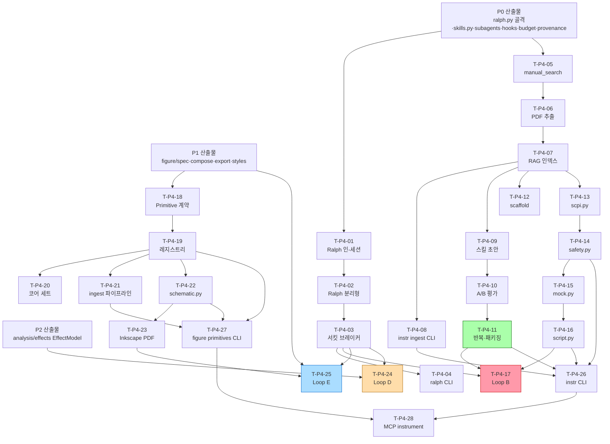

# MagLab 구현 계획 — Phase P4: 실험 장비 워크플로 · Ralph 엔진 · Figure 스키매틱

> 설계 근거: PLAN.md §19 로드맵 · plan/06-experiment.md(§13) · plan/01-harness.md(§5.17·§6) · plan/05-figure.md(§12.4·§12.5)
> 이 문서는 구현 실행 계획이다 — 코드 생성 없이 태스크·순서·DoD를 명세. 규약: impl/README.md

---

## P4.0 목표 & 범위

P4는 두 축을 병행 구현한다.

**축 1 — `instrument/`**: 장비 매뉴얼 자동검색·PDF 판독·구조 인식 RAG·계측기
SKILL.md 자동생성 파이프라인·PyVISA 골격·SCPI 정적검증·안전 envelope·목
계측기·측정 스크립트·실험코드 Ralph(Loop B).

**축 2 — `figure/` 스키매틱 레이어 + Ralph 엔진 완전 구현**: P1이 확정한
`figure/spec.py`·`compose.py`·`export.py` 위에 `schematic.py`(SVG 저작·Inkscape
PDF 내보내기)·`figure/primitives/`(Primitive 계약·레지스트리·수집 파이프라인)를
구현하고, Loop B·Loop D·Loop E를 구동하는 `core/ralph.py` 완전 구현을 완료한다.

**P4 종료 조건**(§19): 매뉴얼→스킬 생성, 실험코드 Ralph(서킷 브레이커·재개),
자성 스키매틱 figure 출력.

**범위 밖**: Loop A(P5), Loop C(P6), ELN·측정 계획·능동학습(`lab/` — §13.5–§13.7은 P5),
figure 데이터플롯·compose·export(P1 완료), 효과 피팅 모델 자체(P2 완료 — Loop D는 P2 모델을 자동화).

---

## P4.1 전제조건

P4 착수 전 아래 P0·P1·P2 산출물이 완료·통과된 상태여야 한다.

**P0 필수 산출물**
- [ ] `core/skills.py` — SKILL.md 로더(3단계 점진 공개, §5.6·§5.17)
- [ ] `core/hooks.py` — PreToolUse 검증 훅, honesty gate 연결 (§5.8·§5.15)
- [ ] `core/subagents.py` — 격리 컨텍스트 서브에이전트 스폰 (§5.16)
- [ ] `core/checkpoint.py` — 멱등 키·체크포인트·중단 재개 (§5.8)
- [ ] `core/budget.py` — 비용 속도·누적 추적 (§5.14)
- [ ] `core/ralph.py` — 골격(인-세션·분리형 모드 시그니처, 상태 파일 경로 정의)
- [ ] `maglab/llm/backends/` — LLM 호출(API·위임CLI·로컬), 비전 모델 호출 포함
- [ ] `maglab/provenance/` — DataPoint·provenance 기록 (§17)
- [ ] `maglab/cli.py` + `maglab instr` 서브커맨드 라우팅 진입점

**P1 필수 산출물**
- [ ] `figure/spec.py` — FigureSpec IR (선언적 패널·데이터바인딩 스키마)
- [ ] `figure/compose.py` — 멀티패널 조립, GridSpec, 패널 라벨
- [ ] `figure/export.py` — 벡터 PDF/EPS/SVG, fonttype 42
- [ ] `figure/styles/*.yaml` — 저널별 치수·폰트·팔레트 (§12·부록 G)

**P2 필수 산출물**
- [ ] `analysis/effects/` — EffectModel 레지스트리(§11, 부록 F), Loop D 대상 피팅 모델

---

## P4.2 작업 분해 (WBS)

### 그룹 A — `core/ralph.py` 완전 구현

#### A-1. Ralph 인-세션 모드
- [ ] **T-P4-01  인-세션 Ralph 루프 완전 구현**
  - 대상 파일: `maglab/core/ralph.py`
  - 설계 근거: §6.1·§6.2 (plan/01-harness.md)
  - 구현: P0 골격 위에 완전 구현. `Stop`-등가 훅이 종료를 가로채 원 프롬프트 재주입. 상태 파일 `.maglab/ralph.local.md`에 `active`·`iteration`·`max_iterations`·`completion_promise` 관리. `<promise>DONE</promise>` 파싱으로 완료 감지. 기본 `max_iterations=20`, 오버나잇 상한 50. iteration마다 git 커밋.
  - 의존: P0 `core/checkpoint.py`, `core/hooks.py`
  - DoD: 인-세션 모드로 5회 이상 반복해 `DONE` 신호에 정상 종료. 상태 파일이 각 iteration 후 갱신됨을 확인. `09-testing-and-ci.md` Ralph 테스트 통과 (§20 Ralph 서킷 브레이커·재개).
  - 스킬/도구: 없음(하네스 코어)

- [ ] **T-P4-02  분리형 신선-컨텍스트 Ralph 모드**
  - 대상 파일: `maglab/core/ralph.py` (분리형 실행 경로)
  - 설계 근거: §6.2 (plan/01-harness.md)
  - 구현: 외부 루프가 `maglab` 프로세스를 매번 새로 서브프로세스로 호출. 상태는 `.maglab/ralph.local.md` + git 커밋 히스토리. 각 호출은 신선 컨텍스트로 시작해 상태 파일을 읽어 이어서 진행.
  - 의존: T-P4-01
  - DoD: 인위적 컨텍스트 고갈 시나리오에서 분리형 모드가 상태 파일을 통해 재개됨 확인. 이전 iteration git 커밋이 보존됨.
  - 스킬/도구: 없음

#### A-2. 서킷 브레이커
- [ ] **T-P4-03  Ralph 서킷 브레이커 — 4조건 구현**
  - 대상 파일: `maglab/core/ralph.py`
  - 설계 근거: §6.2·§5.8 (plan/01-harness.md)
  - 구현: ① 3회 무진전(동일 상태) ② 동일오류 5회 연속 ③ 출력 유사도 >0.95(코사인 또는 edit distance 임계) ④ 비용 속도 초과(`budget.py`). 조건 충족 시 루프 중단 + 에스컬레이션(터미널 경고 + 메시징 게이트웨이 알림 — 게이트웨이 미구현이면 터미널만). iteration 결과 히스토리를 상태 파일에 누적해 ①–③ 판정.
  - 의존: T-P4-01, P0 `core/budget.py`
  - DoD: 각 조건을 트리거하는 목업 루프로 4조건 모두 중단됨을 단위 테스트로 검증. `09-testing-and-ci.md` Ralph 서킷 브레이커 테스트.
  - 스킬/도구: 없음

- [ ] **T-P4-04  Ralph `maglab ralph` CLI 서브커맨드**
  - 대상 파일: `maglab/cli.py` (또는 `maglab/commands/ralph.py`)
  - 설계 근거: 부록 A (PLAN.md)
  - 구현: `maglab ralph start <목표>`, `maglab ralph status`, `maglab ralph cancel`. `start`는 목표 문자열·`--max-iter`·`--mode(in-session|detached)`·`--budget` 파라미터. `status`는 상태 파일 읽어 현재 iteration·완료 여부·비용 출력. `cancel`은 상태 파일에 취소 플래그.
  - 의존: T-P4-01·T-P4-02·T-P4-03
  - DoD: `maglab ralph start "테스트 목표" --max-iter 3`이 3회 후 정상 종료. `status`·`cancel`이 올바른 상태 반환.
  - 스킬/도구: 없음

---

### 그룹 B — `instrument/` — 매뉴얼 검색·판독·RAG

- [ ] **T-P4-05  매뉴얼 자동 검색 — `manual_search.py`**
  - 대상 파일: `maglab/instrument/manual_search.py`
  - 설계 근거: §13.2 (plan/06-experiment.md)
  - 구현: 장비 모델명을 입력받아(추측 금지 — §13.2 명시) 웹 검색으로 매뉴얼 PDF URL을 탐색·다운로드. 검색 엔진: Firecrawl CLI(웹 크롤) + 제조사 사이트 직접 URL 패턴. 다운로드 결과를 `~/.local/share/maglab/manuals/<manufacturer>/<model>/` 에 캐시. SHA256 체크섬 저장해 중복 다운 방지.
  - 의존: P0 CLI 진입점
  - DoD: Keithley 2400·Stanford Research SR830 등 실공개 매뉴얼을 입력 모델명으로 검색해 PDF 다운로드 성공. 캐시 히트 시 재다운로드 없음 확인.
  - 스킬/도구: firecrawl-cli(웹 검색·다운로드)

- [ ] **T-P4-06  매뉴얼 PDF 판독 — 구조 인식 텍스트·표 추출**
  - 대상 파일: `maglab/instrument/manual_rag.py` (추출 단계)
  - 설계 근거: §13.2·§5.17 (plan/06-experiment.md, plan/01-harness.md)
  - 구현: `pdfplumber`로 텍스트·표 추출. SCPI 명령 섹션 식별 — 헤더 패턴·`SCPI Command`·`:` 콜론 트리 인식. SCPI 명령당 1청크(명령 문자열·파라미터 범위·예시·리턴 타입·한계값 포함). 청크 메타데이터: `cmd`·`page`·`section_path`·`params`.
  - 의존: T-P4-05, P0 패키지 (`pdfplumber` extras `[instr]`)
  - DoD: 표준 SCPI 매뉴얼(SR830 또는 Keithley 2400 공개 PDF)을 입력해 SCPI 명령별 청크 추출 개수·내용이 수작업 확인치와 일치.
  - 스킬/도구: pdf(PDF 판독·표 추출)

- [ ] **T-P4-07  매뉴얼 RAG 인덱스 구축 — `manual_rag.py` 임베딩·LanceDB**
  - 대상 파일: `maglab/instrument/manual_rag.py` (인덱스 단계)
  - 설계 근거: §13.2 (plan/06-experiment.md)
  - 구현: T-P4-06 청크를 `voyage-code-2`(온라인) 또는 `nomic-embed-text`(로컬) 임베딩. LanceDB에 `manuals/<model>` 테이블로 저장. 질의 인터페이스: `search(model, query, k=5)` → SCPI 명령 청크 반환. 인덱스는 캐시·점진 갱신.
  - 의존: T-P4-06
  - DoD: 임의 SCPI 명령 질의(예: "전압 측정 명령") → 상위 5청크에 실제 명령 포함. 테스트 매뉴얼로 recall@5 ≥ 0.8 확인.
  - 스킬/도구: pdf, `lancedb`·`sentence-transformers`(extras `[instr]`)

- [ ] **T-P4-08  `maglab instr ingest <model>` CLI**
  - 대상 파일: `maglab/instrument/manual_rag.py` (CLI 래퍼) + `maglab/cli.py`
  - 설계 근거: §13.2·부록 A (plan/06-experiment.md, PLAN.md)
  - 구현: `maglab instr ingest <model>` — T-P4-05 검색→T-P4-06 추출→T-P4-07 인덱스를 한 명령으로. `--manual-path`로 로컬 PDF 직접 지정 가능. 진행 스피너 출력. 완료 시 청크 수·인덱스 경로 리포트.
  - 의존: T-P4-05·T-P4-06·T-P4-07
  - DoD: `maglab instr ingest "Keithley 2400"` 단일 명령으로 전 단계 완료. 오프라인(로컬 PDF) 경로도 동작.
  - 스킬/도구: firecrawl-cli, pdf

---

### 그룹 C — `instrument/` — 계측기 SKILL.md 자동 생성 파이프라인

- [ ] **T-P4-09  스킬 초안 생성 — `skillgen.py` 추출 단계**
  - 대상 파일: `maglab/instrument/skillgen.py`
  - 설계 근거: §13.3·§5.17 (plan/06-experiment.md, plan/01-harness.md)
  - 구현: T-P4-07 RAG에서 통신 인터페이스·파라미터 범위·초기화 시퀀스·안전 인터록·측정 워크플로우·실패 모드를 추출. `SKILL.md` 초안(frontmatter: `name`·`description`·`disable-model-invocation` 판단·`compatibility`) + `SCPI_REFERENCE.md`(전체 명령 표) + `LIMITS.md`(인터록·한계) + `scripts/`(초기화·측정·검증 스크립트 골격) + `evals/evals.json`(3–5 테스트 케이스) 생성. 출력 경로: `skills/<manufacturer>-<model>/`.
  - 의존: T-P4-07
  - DoD: 인덱싱된 매뉴얼 → `skills/<model>/` 디렉터리 생성, 위 5개 파일 모두 존재. SKILL.md frontmatter가 스킬 로더(P0 `core/skills.py`)로 파싱됨.
  - 스킬/도구: skill-creator 패턴(이 파이프라인이 §5.17 skill-creator 구현), pdf

- [ ] **T-P4-10  A/B 평가 — 스킬 로드 vs 미로드 벤치마크**
  - 대상 파일: `maglab/instrument/skillgen.py` (평가 서브루틴)
  - 설계 근거: §5.17-3 A/B 평가 (plan/01-harness.md)
  - 구현: 서브에이전트 두 인스턴스를 병렬 호출 — 하나는 생성된 SKILL.md 로드, 하나는 미로드(baseline). 두 에이전트가 `evals.json` 과업을 각각 실행. 채점 서브에이전트가 결정론 단언(SCPI 명령 정확성·파라미터 범위 준수·안전 시퀀스 순서)으로 점수 산출. 결과를 `evals/results.json`에 기록.
  - 의존: T-P4-09, P0 `core/subagents.py`
  - DoD: 벤치마크 실행 후 `results.json`에 스킬 로드 쪽 점수 ≥ baseline. §20 evals.json 과업 통과 조건 충족.
  - 스킬/도구: skill-creator 패턴

- [ ] **T-P4-11  반복 개선 & 패키징 — 스킬 자동 생성 파이프라인 완성**
  - 대상 파일: `maglab/instrument/skillgen.py`
  - 설계 근거: §5.17-4·§5.17-5 (plan/01-harness.md)
  - 구현: A/B 피드백 → SKILL.md 개선 → 재평가 루프(최대 3회). `description` 자동 튜닝(트리거 쿼리 ~20개로 과소트리거 탐지). 안전임계 판정 시 `disable-model-invocation: true` 설정. `metadata`에 provenance(`source-document` SHA·생성 타임스탬프·장비 시리얼 placeholder) 부여. 완성 스킬 `core/skills.py` 로더로 자동 등록.
  - 의존: T-P4-10
  - DoD: 전체 파이프라인(ingest→초안→A/B→반복→패키징)을 `maglab instr implement --skill-only` 로 실행해 완성 스킬이 `maglab skill list`에 나타남. 안전임계 스킬은 `disable-model-invocation` 확인.
  - 스킬/도구: skill-creator 패턴, pdf

- [ ] **T-P4-12  `maglab instr scaffold` — PyVISA 백엔드 골격**
  - 대상 파일: `maglab/instrument/scaffold.py`
  - 설계 근거: §13.1 (plan/06-experiment.md)
  - 구현: 장비 모델명 + 인터페이스(GPIB/USB/TCP) → PyVISA 연결 골격 Python 파일 생성. 이 파일 자체는 VISA 세션을 열지 않음(코드 생성만). Jinja2 `templates/scaffold.py.j2` 렌더. 생성 파일에 안전 주석("사람이 실행") + `safety.py` 통과 조건 명시.
  - 의존: T-P4-07 (RAG에서 연결 파라미터 추출)
  - DoD: `maglab instr scaffold "Keithley 2400" --iface GPIB` → 유효 Python 파일(구문 오류 없음, `maglab instr check` 통과).
  - 스킬/도구: 없음

---

### 그룹 D — `instrument/` — SCPI 정적검증·안전·목 계측기

- [ ] **T-P4-13  SCPI 시퀀스 생성·정적검증 — `scpi.py`**
  - 대상 파일: `maglab/instrument/scpi.py`
  - 설계 근거: §13.1·부록 D (plan/06-experiment.md, plan/11-appendices.md)
  - 구현: SCPI 명령 시퀀스 생성기(LLM이 호출하는 도구). 생성 직후 정적검증: ① 명령이 RAG 인덱스에 존재하는 알려진 명령인가 ② 파라미터 값이 LIMITS.md 범위 이내인가 ③ 명령 순서가 `templates/` 안전 시퀀스와 일치하는가(초기화→측정→정리 순). 위반 시 생성 거부·에러 메시지.
  - 의존: T-P4-07, T-P4-09
  - DoD: 범위 초과 파라미터 SCPI 명령 주입 시 거부. 정상 시퀀스는 통과. 부록 D "장비(SCPI 안전 envelope·명령 순서)" 검증 규칙 단위 테스트 통과.
  - 스킬/도구: 없음

- [ ] **T-P4-14  하드웨어 안전 envelope 정적검증 — `safety.py`**
  - 대상 파일: `maglab/instrument/safety.py`
  - 설계 근거: §13.1·§13.4 (plan/06-experiment.md)
  - 구현: 생성된 스크립트 전체를 파싱해 물리 안전 한계 위반(전류·전압·온도·자기장 상한) 탐지. 위반 시 Tier 3 차단(실제 실행 불가). `safety.py` 통과는 `script.py`·`scaffold.py` 생성물 실행 전 필수 게이트.
  - 의존: T-P4-13
  - DoD: 의도적 안전 한계 초과 스크립트를 `maglab instr check <script>` 로 실행 시 차단 메시지. 정상 스크립트는 통과. §20 SCPI 안전 envelope 정적검증 테스트.
  - 스킬/도구: 없음

- [ ] **T-P4-15  가상 계측기 — `mock.py`**
  - 대상 파일: `maglab/instrument/mock.py`
  - 설계 근거: §13.1·§13.4 (plan/06-experiment.md)
  - 구현: PyVISA 인터페이스를 모방하는 목 클래스. SCPI 명령을 수신해 하드코딩 또는 랜덤 노이즈 포함 합성 응답 반환. Loop B `pytest` 드라이런에서 실제 장비 없이 스크립트 동작 검증용. 모델별 목 프로파일(`mock_profiles/<model>.yaml`)로 파라미터 설정.
  - 의존: T-P4-13
  - DoD: `mock.py`로 SR830 목을 생성해 `script.py` 스크립트를 하드웨어 없이 실행, 합성 데이터 반환 확인. Loop B pytest 드라이런 기반으로 동작.
  - 스킬/도구: 없음

- [ ] **T-P4-16  측정 스크립트 생성 — `script.py`**
  - 대상 파일: `maglab/instrument/script.py`
  - 설계 근거: §13.1 (plan/06-experiment.md)
  - 구현: 실험 자연어 설명 + 장비 스킬 → 측정 스크립트 생성. 스크립트 구조: 초기화 → 측정 루프(스윕 설정·읽기·기록) → 정리·리셋. 생성물은 standalone Python 파일. `safety.py` 통과 후에만 사용자에게 전달(Tier 3 실행 명시 주석 포함).
  - 의존: T-P4-09·T-P4-13·T-P4-14·T-P4-15
  - DoD: `maglab instr script "SR830으로 1차 고조파 측정"` → 유효 Python 스크립트 생성. `safety.py` 통과. `mock.py`로 드라이런 성공.
  - 스킬/도구: 생성된 계측기 스킬 사용

---

### 그룹 E — Loop B — 실험코드 Ralph 구현

- [ ] **T-P4-17  Loop B Ralph — 실험코드 구현·테스트·수정 루프**
  - 대상 파일: `maglab/instrument/skillgen.py` (Loop B 오케스트레이터), `agents/instrument-codegen.md`
  - 설계 근거: §13.4·§6.3-B (plan/06-experiment.md, plan/01-harness.md)
  - 구현: `maglab instr implement <자연어설명> --instruments <모델1,모델2>` 진입점. 단계: ① 모델명 확인(추측 금지, 미등록 시 T-P4-08 ingest 선행 안내) ② `instrument-codegen` 서브에이전트가 `script.py` 초안 ③ Ralph Loop B 시작(T-P4-01 인-세션 모드) — 생성→`mock.py` pytest -x 드라이런→실패 파싱→수정→반복. ④ `safety.py` 최종 통과 게이트. ⑤ 완성 스크립트 `outputs/<timestamp>/` 저장 + provenance 기록.
  - 의존: T-P4-01·T-P4-03·T-P4-09·T-P4-14·T-P4-15·T-P4-16
  - DoD: SR830 측정 스크립트를 Loop B로 구현해 목 pytest 통과. 서킷 브레이커 중단 시나리오(의도적 오류 주입) 에스컬레이션 확인. 실제 하드웨어 실행은 Tier 3.
  - 스킬/도구: skill-creator(계측기 스킬 활용), 생성된 계측기 스킬

---

### 그룹 F — `figure/primitives/` — Primitive 계약·레지스트리·수집 파이프라인

- [ ] **T-P4-18  Primitive 계약 — `figure/primitives/spec.py`**
  - 대상 파일: `maglab/figure/primitives/spec.py`
  - 설계 근거: §12.4-(1) (plan/05-figure.md)
  - 구현: `Primitive` 데이터클래스(name·category·tags·description·parameters·body·render·physics_convention·references·provenance·preview·journal_styles). `body`는 백엔드별 — SVG Jinja2 템플릿 문자열 / TikZ 매크로 / Python `draw()` 함수. `render(params, backend, style)` 인터페이스가 백엔드를 선택해 벡터 출력. 카테고리 택소노미(§12.4-(2))를 `Category` Enum으로 정의.
  - 의존: P1 `figure/spec.py`·`figure/export.py`
  - DoD: `Primitive` 인스턴스를 생성해 SVG 백엔드로 `render()` 호출 성공. `spec.py` 단위 테스트 통과(파라미터 경계·백엔드 선택·physics_convention 보존).
  - 스킬/도구: 없음

- [ ] **T-P4-19  프리미티브 레지스트리 — 플러그인 패키지 구조**
  - 대상 파일: `maglab/figure/primitives/registry.py`, `maglab/figure/primitives/__init__.py`
  - 설계 근거: §12.4-(5) (plan/05-figure.md)
  - 구현: 프리미티브 = 디렉터리 + `PRIMITIVE.md`(name·category·tags·description frontmatter) + `body.*`(svg/tex/py) 패키지. `registry.py`가 `figure/primitives/catalog/` 내 패키지를 발견·로드. 시작 시 색인(`name`·`category`·`tags`·`description`)만 로드(§5.6 3단계 점진 공개와 동형). 사용 시 전체 본체 로드. `maglab figure primitives list` 명령.
  - 의존: T-P4-18
  - DoD: 샘플 프리미티브 2개(Hall bar, 스핀 텍스처)를 `catalog/`에 두고 `registry.py`가 자동 발견해 색인에 나타남. `maglab figure primitives list` 출력 확인.
  - 스킬/도구: 없음

- [ ] **T-P4-20  코어 프리미티브 세트 — 카테고리별 최소 세트**
  - 대상 파일: `maglab/figure/primitives/catalog/` (각 프리미티브 서브디렉터리)
  - 설계 근거: §12.4-(2)·§12.4-(3) (plan/05-figure.md)
  - 구현: 5개 카테고리에 걸쳐 최소 10개 핸드오서링 프리미티브 제작. 필수 포함: Hall bar 소자 기하, 다층 스택 단면(`Ta/CoFeB/MgO` 파라메트릭), 측정 기하(전류·자기장·전압 벡터), Bloch/Néel 자구벽, 스커미온(Bloch형), 자화 컬러휠, LLG 세차(Bloch 구), 좌표축 주석. 각 프리미티브는 `Primitive` 계약 준수, SVG 백엔드 필수, physics_convention 명시.
  - 의존: T-P4-18·T-P4-19
  - DoD: 10개 프리미티브 전수를 `render()` 호출해 유효 SVG 출력. 파라미터 스윕 테스트(경계값 포함) 통과. §20 스키매틱 프리미티브 렌더 테스트.
  - 스킬/도구: 없음

- [ ] **T-P4-21  수집·승격 파이프라인 — `maglab figure primitives ingest`**
  - 대상 파일: `maglab/instrument/` (신규: `maglab/figure/primitives/ingest.py`)
  - 설계 근거: §12.4-(4) (plan/05-figure.md)
  - 구현: `maglab figure primitives ingest <소스>` — 소스는 SVG 파일, TikZ 매크로, 또는 arXiv figure URL. 단계: ① 벡터화(래스터 입력이면 `svg-trace` 또는 `potrace` 호출) ② 파라미터화(`figure-designer` 서브에이전트가 가변 부분 식별 → `parameters[]` 초안) ③ `oracle`·`symmetry` 물리 규약 검사(적용 가능 시) ④ 메타데이터·provenance 부여 ⑤ `catalog/` 등록. Ralph 루프 자동화 선택적(`--ralph`).
  - 의존: T-P4-18·T-P4-19, P0 `core/subagents.py`
  - DoD: 외부 SVG 파일을 ingest해 `catalog/`에 등록, `maglab figure primitives list`에 나타남. 파라미터화된 `render()` 동작 확인.
  - 스킬/도구: pdf(SVG/PDF 소스 판독)

---

### 그룹 G — `figure/renderers/schematic.py` — SVG 스키매틱 렌더러

- [ ] **T-P4-22  스키매틱 렌더러 — `schematic.py` 기본 구조**
  - 대상 파일: `maglab/figure/renderers/schematic.py`
  - 설계 근거: §12.3·§12.4 (plan/05-figure.md)
  - 구현: `FigureSpec`의 schematic 패널을 입력받아 `figure-designer` 서브에이전트를 호출. 에이전트는 레지스트리(T-P4-19)를 자연어로 검색해 필요한 프리미티브를 선택하고, 파라미터를 채워 조합·배치. 배치 결과를 SVG 문자열로 조립(프리미티브 render() 결과를 `<g>` 요소로 배치). SVG 출력에 provenance 주석(`<!-- generated by MagLab schematic.py -->`) 삽입.
  - 의존: T-P4-18·T-P4-19·T-P4-20, P1 `figure/spec.py`
  - DoD: FigureSpec schematic 패널 → SVG 출력 성공. SVG가 유효 XML(lxml 파싱 통과). 프리미티브 2개 이상 조합 동작 확인.
  - 스킬/도구: figure-schematic 번들 스킬(부록 C)

- [ ] **T-P4-23  Inkscape CLI SVG→PDF 내보내기**
  - 대상 파일: `maglab/figure/renderers/schematic.py` (export 호출), `maglab/figure/export.py` (Inkscape 백엔드 경로)
  - 설계 근거: §12.2·§12.3·PLAN §21 (plan/05-figure.md, PLAN.md)
  - 구현: Inkscape 바이너리(`inkscape --headless --export-pdf`) 래퍼. Inkscape 미설치 시 `cairosvg`로 폴백(단, fonttype 42 보장 필요). export.py의 Inkscape 경로를 schematic.py에서 호출. Inkscape 설치 여부를 시작 시 탐지해 `config`에 기록.
  - 의존: T-P4-22, P1 `figure/export.py`
  - DoD: SVG → PDF 변환 성공. PDF가 벡터(Inkscape 출력 `--export-type=pdf`). `pdfinfo`로 벡터 확인. §20 SVG→PDF 변환 테스트. 미설치 시 cairosvg 폴백 메시지 출력.
  - 스킬/도구: 외부 바이너리: Inkscape(헤드리스), cairosvg(폴백)

---

### 그룹 H — Loop D & Loop E

- [ ] **T-P4-24  Loop D — 효과 피팅 개선 Ralph 루프**
  - 대상 파일: `maglab/core/ralph.py` (Loop D 워크플로우 설정), `agents/effect-fitter.md`
  - 설계 근거: §6.3-D·§11.4 (plan/01-harness.md)
  - 구현: `maglab fit --ralph --effect <name> <data>` 진입점. Ralph Loop D 설정: ① P2 `EffectModel`로 피팅 실행 ② 잔차 검사(χ²·R²·잔차 패턴 랜덤성) + 물리 경계 검사(`oracle`) ③ 검사 실패 시 `effect-fitter` 서브에이전트가 모델/초기값 조정 방안 제안 ④ 재피팅 반복(최대 iteration). 서킷 브레이커(T-P4-03) 적용. `<promise>DONE</promise>`는 χ²·물리 경계 모두 통과 시.
  - 의존: T-P4-01·T-P4-03, P2 `analysis/effects/` EffectModel
  - DoD: 합성 AHE 데이터(알려진 파라미터)로 Loop D 실행. 피팅 실패 초기값에서 시작해 Ralph가 3회 이내 수렴. 물리 경계 위반 케이스에서 서킷 브레이커 또는 재조정 동작 확인.
  - 스킬/도구: `magnetotransport-fitting` 번들 스킬(부록 C)

- [ ] **T-P4-25  Loop E — Figure 정제 Ralph 루프**
  - 대상 파일: `maglab/core/ralph.py` (Loop E 워크플로우 설정), `agents/figure-designer.md`
  - 설계 근거: §12.5·§6.3-E (plan/05-figure.md, plan/01-harness.md)
  - 구현: `maglab figure render --ralph` 또는 figure 렌더 직후 자동 진입. 단계: ① 렌더 → 래스터화 미리보기(PNG 섬네일) ② 비전 모델 critic 호출(P0 LLM 백엔드, 비전 모델 경로) — 체크 항목: 축·단위 라벨 유무, 출판 크기 가독성, 색맹 안전, 패널 라벨, 저널 스펙 치수 일치, 데이터-출처 일치 ③ 수정 포인트를 FigureSpec 또는 schematic 파라미터 수정으로 반영 ④ 재렌더 반복. 서킷 브레이커 적용. 데이터 일치는 결정론 검사(미태그 데이터 차단 — honesty gate).
  - 의존: T-P4-01·T-P4-03·T-P4-22·T-P4-23, P0 LLM 백엔드(비전 모델), P1 `figure/export.py`
  - DoD: 의도적 라벨 누락 figure를 Loop E에 입력, critic이 지적→수정→재렌더 동작 확인. §20 Loop E 비전 critic 동작 테스트. 데이터 미태그 figure는 honesty gate 차단.
  - 스킬/도구: `figure-schematic` 번들 스킬, 비전 모델(LLM 백엔드)

---

### 그룹 I — CLI 통합·MCP 노출

- [ ] **T-P4-26  `maglab instr` 서브커맨드 완성**
  - 대상 파일: `maglab/cli.py` (또는 `maglab/commands/instrument.py`)
  - 설계 근거: 부록 A·B (PLAN.md)
  - 구현: `maglab instr scaffold`·`scpi`·`script`·`check`·`ingest`·`implement` 전체 라우팅. `check`는 `safety.py` + `scpi.py` 정적검증 게이트 통합. 각 서브커맨드에 Rich 진행 표시·오류 메시지 포맷.
  - 의존: T-P4-08·T-P4-12·T-P4-13·T-P4-14·T-P4-16·T-P4-17
  - DoD: `maglab instr --help`에 6개 서브커맨드 나열. 각 서브커맨드 스모크 테스트(정상 입력) 통과.
  - 스킬/도구: 없음

- [ ] **T-P4-27  `maglab figure primitives` 서브커맨드 & MCP 노출**
  - 대상 파일: `maglab/cli.py`, `maglab/mcp_server.py`
  - 설계 근거: 부록 A·B (PLAN.md)
  - 구현: `maglab figure primitives list`·`ingest` 라우팅. MCP 도구 `figure_list_primitives`·`figure_render` schematic 경로 노출(부록 B). MCP 리소스 `primitives://` URI.
  - 의존: T-P4-19·T-P4-21·T-P4-22
  - DoD: `maglab figure primitives list` 동작. MCP `figure_list_primitives` 도구 호출 시 색인 반환.
  - 스킬/도구: 없음

- [ ] **T-P4-28  MCP 도구 — instrument 도메인**
  - 대상 파일: `maglab/mcp_server.py`
  - 설계 근거: 부록 B (PLAN.md)
  - 구현: `instr_search_manual`·`instr_ingest_manual`·`instr_generate_skill`·`instr_scaffold`·`instr_safety_check` MCP 도구 노출. `manuals://` MCP 리소스(캐시 매뉴얼 목록). 각 도구에 `readOnlyHint`·`destructiveHint` 주석.
  - 의존: T-P4-08·T-P4-11·T-P4-14·T-P4-26
  - DoD: MCP 서버 stdio 모드로 기동 후 `instr_safety_check` 도구 호출 성공. `manuals://` 리소스 접근 성공.
  - 스킬/도구: 없음

---

## P4.3 마일스톤 & 의존성

**임계 경로**: P0 → T-P4-01 → T-P4-03 → T-P4-17(Loop B) / T-P4-25(Loop E)

**병렬 가능**: 그룹 A(Ralph)와 그룹 B–D(instrument)는 P0 완료 후 병렬 진행.
그룹 F–G(primitives·schematic)는 P1 완료 후 병렬로 그룹 A·B–D와 독립 진행.

---

## P4.4 검증 게이트 (종료 기준)

P4 머지·종료는 아래 조건 전수 통과를 필요로 한다(§20·§19 연결).

| 번호 | 검증 항목 | 조건 | 관련 태스크 |
|---|---|---|---|
| V1 | Ralph 인-세션 반복·완료 | `<promise>DONE</promise>` 신호로 정상 종료, 상태 파일 갱신 | T-P4-01 |
| V2 | Ralph 서킷 브레이커 4조건 | 각 조건 트리거 단위 테스트 전수 통과 | T-P4-03 |
| V3 | Ralph 재개(분리형) | 인위적 중단 후 상태 파일로 재개 성공 | T-P4-02 |
| V4 | 매뉴얼→스킬 생성 | 실공개 매뉴얼 1종 → `skills/<model>/` 5파일 생성, `maglab skill list`에 등록 | T-P4-09·T-P4-11 |
| V5 | A/B 스킬 평가 통과 | 스킬 로드 점수 ≥ baseline, `evals/results.json` 존재 | T-P4-10 |
| V6 | SCPI 안전 정적검증 | 범위 초과 명령 거부, 정상 시퀀스 통과 (부록 D) | T-P4-13·T-P4-14 |
| V7 | Loop B 드라이런 | SR830 목 pytest -x 통과, 서킷 브레이커 에스컬레이션 | T-P4-17 |
| V8 | Primitive 렌더 | 코어 10개 프리미티브 파라미터 스윕 포함 전수 SVG 출력 | T-P4-20 |
| V9 | SVG→PDF 변환 | Inkscape 헤드리스로 벡터 PDF 생성, `pdfinfo` 확인 | T-P4-23 |
| V10 | Loop E 비전 critic | 의도적 결함 figure → critic 지적 → 재렌더 동작 | T-P4-25 |
| V11 | Loop D 피팅 수렴 | 합성 AHE 데이터로 3회 이내 수렴, 물리 경계 위반 처리 | T-P4-24 |
| V12 | CLI 스모크 | `maglab instr`, `maglab figure primitives`, `maglab ralph` 전 서브커맨드 정상 입력 통과 | T-P4-26·T-P4-27·T-P4-04 |
| V13 | MCP instrument | stdio MCP 서버에서 `instr_safety_check`·`manuals://` 성공 | T-P4-28 |
| V14 | honesty gate | 미태그 데이터 figure 생성 시 차단 | T-P4-25 |

---

## P4.5 스킬·도구·패키지

### Claude 스킬 (SKILL.md 오픈 표준)

| 스킬 | 용도 | 태스크 |
|---|---|---|
| `skill-creator` | 계측기 SKILL.md 자동 생성·A/B 평가 파이프라인의 메타 패턴 | T-P4-09·T-P4-10·T-P4-11 |
| `figure-schematic` | 스키매틱 렌더러가 호출하는 번들 스킬 (부록 C) | T-P4-22·T-P4-25 |
| `magnetotransport-fitting` | Loop D AHE·SMR 피팅 (부록 C) | T-P4-24 |
| 생성 계측기 스킬 | Loop B에서 동적으로 생성·사용 | T-P4-17 |

### 외부 도구·바이너리

| 도구 | 용도 | 설치 |
|---|---|---|
| firecrawl-cli | 매뉴얼 웹 검색·다운로드 | `npm i -g firecrawl-cli` |
| Inkscape(헤드리스) | SVG→PDF 벡터 변환 (§21 리스크: 무료·오픈소스 — 채택) | `brew install inkscape` |
| potrace / svg-trace | 래스터→벡터 변환(ingest 파이프라인) | `brew install potrace` |

### Python 패키지 (`pyproject.toml extras [instr]`)

`pdfplumber`, `lancedb`, `sentence-transformers`(SPECTER2/nomic), `jinja2`,
`pyvisq` (PyVISA 목 의존), `cairosvg`(Inkscape 폴백).

### Python 패키지 (`pyproject.toml extras [figure]`)

`cairosvg`, `lxml`(SVG 검증), `Pillow`(Loop E 래스터화 미리보기), `pyvista`(3D).

---

## P4.6 리스크 & 주의

| 항목 | 리스크 | 대응 |
|---|---|---|
| Inkscape 헤드리스 파이프라인 | macOS Homebrew 설치·`--headless` 플래그 버전차 | `inkscape --version` 탐지→cairosvg 폴백 자동전환(V9) |
| 매뉴얼 웹 접근성 | 제조사 사이트 크롤 차단·PDF 비공개 | `--manual-path` 로컬 지정 경로 제공(T-P4-08) |
| SCPI 명령 인식 정확도 | 비표준 매뉴얼 포맷(명령 섹션 미구조화) | 청킹 휴리스틱에 수동 패턴 추가 옵션, 인식 실패 시 경고·수동 검토 요청 |
| Ralph 루프 폭주 | 서킷 브레이커 미작동 시 비용·무한루프 | T-P4-03 4조건 단위 테스트 의무, 비용 상한 하드코딩(§21) |
| 안전임계 스킬 오용 | `disable-model-invocation` 미설정으로 에이전트가 안전임계 장비 명령 자율 실행 | T-P4-11 안전임계 판정 로직 + P0 honesty gate 연동 |
| 프리미티브 physics_convention 오류 | 자구벽 키랄리티·스커미온 유형 혼동 | T-P4-20 코어 세트 수작업 검증, `oracle`·`symmetry` 체크(적용 가능 시) |
| 비전 모델 가용성(Loop E) | 비전 모델 API 키 미설정 | Loop E를 선택적으로 운영, 미설정 시 critic 단계 스킵·경고(V10 게이트 조건부) |
| 장비 모델명 추측 금지 | `manual_search.py`가 모델명을 추정 | §13.2 명시 준수 — 모델명 미제공 시 사용자에게 반드시 요청(T-P4-05 구현 명세에 강제) |

---

## 관련 문서

| 문서 | 역할 |
|---|---|
| `impl/README.md` | 규약·태스크 ID·Phase 의존성 전역 |
| `impl/01-P0-core.md` | `core/ralph.py` 골격·`core/skills.py`·hooks·budget·subagents — P4 전제조건 |
| `impl/02-P1-figure-sim.md` | `figure/spec·compose·export·styles` — schematic 렌더러의 기반 |
| `impl/03-P2-analysis.md` | `analysis/effects` EffectModel — Loop D 대상 |
| `impl/09-testing-and-ci.md` | Ralph 서킷 브레이커·SCPI 정적검증·Loop E 비전 critic·스키매틱 렌더 테스트 명세 |
| `plan/01-harness.md` | §5.17 스킬 자동 생성, §6 Ralph 루프 설계 |
| `plan/05-figure.md` | §12.3–§12.5 스키매틱 렌더러·프리미티브·Loop E 설계 |
| `plan/06-experiment.md` | §13.1–§13.4 장비 코드·매뉴얼 RAG·Loop B 설계 |
| `plan/11-appendices.md` | 부록 C(스킬 카탈로그)·D(정적검증 규칙)·E(기능→Phase 매핑) |
