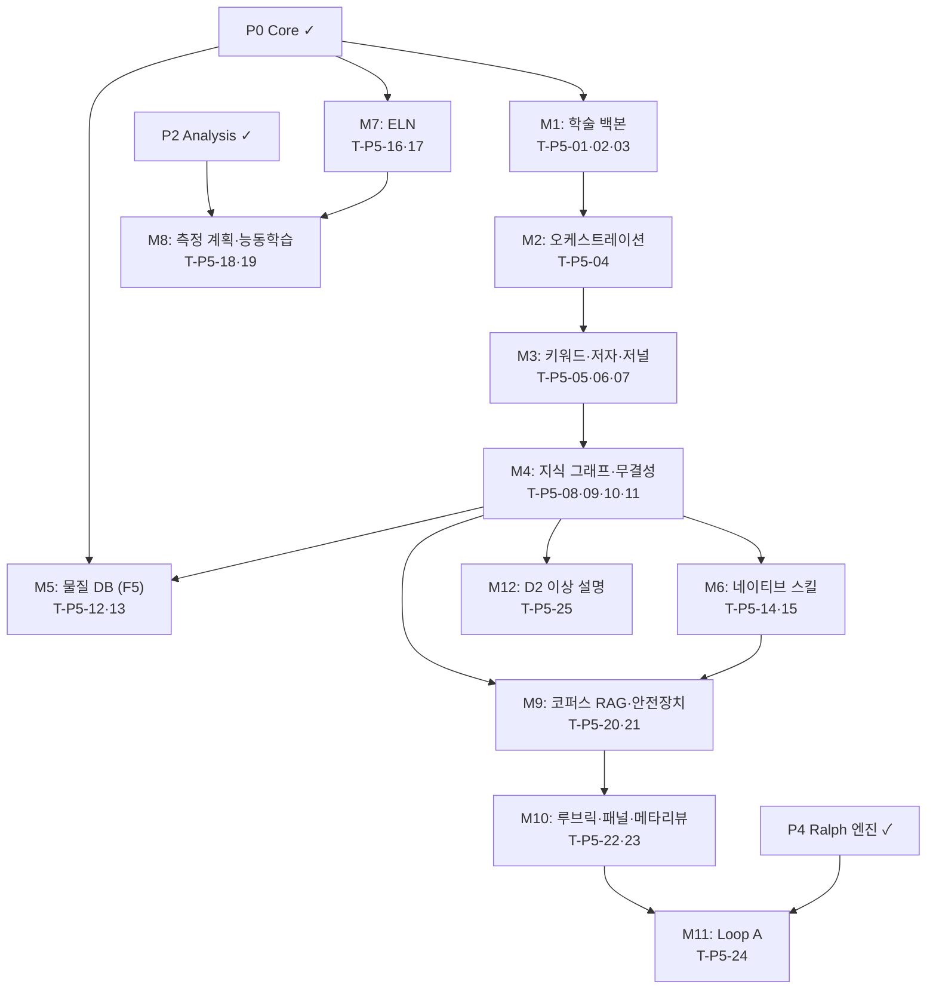

# MagLab 구현 계획 — Phase P5: 문헌 발견 인텔리전스 · 실험노트·측정 계획 · 페르소나 리뷰 패널

> 설계 근거: PLAN.md §19 로드맵 · plan/07-literature.md(§14) · plan/08-review.md(§15) · plan/06-experiment.md(§13.5–§13.7)
> 이 문서는 구현 실행 계획이다 — 코드 생성 없이 태스크·순서·DoD를 명세. 규약: impl/README.md

---

## P5.0 목표 & 범위

P5는 연구 생애주기의 **발견·기록·리뷰** 레이어를 완성한다.

**목표 산출물:**
- `maglab/literature/` — 4대 학술 소스 커넥터·가중 키워드 검색(F3)·임팩트 메트릭(F4)·지식 그래프·문헌 무결성
- `maglab/physics/material_builder.py` — 물질 DB 자동 구축(F5)
- `maglab/reviewer/` — SPECTER2 코퍼스 RAG·7대 안전장치·저널별 루브릭·3인 패널·메타리뷰
- `maglab/core/ralph.py` **Loop A** — 리뷰→패치→재리뷰 반복 루프
- `maglab/lab/notebook/` · `maglab/lab/planning/` — ELN(B1)·측정 계획/DOE(B3)·능동학습
- `maglab/core/reasoning.py` **D2** — 이상 결과 설명(`maglab explain`)
- 논문검색 MCP 커넥터 3종 opt-in 등록·리서치 오케스트레이션 5-서브에이전트
- 네이티브 스킬 `literature-search`·`literature-review`

**범위 밖:** `authoring/`(P6), D1 가설 생성(`core/reasoning.py` D1은 P6).

---

## P5.1 전제조건

P0·P2 산출물이 머지·검증 완료되어야 착수 가능하다.

**P0 체크리스트:**
- [ ] `core/orchestrator.py` — 오케스트레이터-워커 위상 동작
- [ ] `core/subagents.py` — 서브에이전트 풀·6요소 계약 로딩
- [ ] `core/memory.py` — `research_pool` 누적 연구 메모리
- [ ] `core/skills.py` — SKILL.md 스킬 시스템 로드·실행
- [ ] `core/hooks.py` + `report/honesty_gate.py` — honesty gate 차단 게이트 동작
- [ ] `llm/mcp.py` + `.maglab/mcp.json` — MCP 클라이언트·레지스트리 구동
- [ ] `provenance/` — DataPoint·W3C PROV 기록
- [ ] `physics/materials.py` — 기존 물성 DB·`DataPoint` 구조체

**P2 체크리스트:**
- [ ] `analysis/effects/` — 효과 레지스트리 `measurement_config` 필드 구현 완료
- [ ] `analysis/providers/` — 각 EffectModel `measurement_config` 역참조 가능

---

## P5.2 작업 분해 (WBS)

### A. 학술 데이터 백본 — `literature/connectors.py` (§14.1)

- [ ] **T-P5-01  `connectors.py` — 4대 소스 통합 백본**
  - 대상 파일: `maglab/literature/connectors.py`
  - 설계 근거: §14.1 (plan/07-literature.md) — 학술 데이터 백본
  - 구현: `pyalex`(OpenAlex)·`semanticscholar`·`arxiv`·`habanero`(CrossRef) 래핑. 각 소스에 공통 반환 스키마 `LiteratureRecord`(doi, title, authors, year, venue, abstract, pdf_url, openalex_id, s2_id, oa_status) 매핑. 지수 백오프·캐시(SQLite) 공통 레이어 적용. `mcp.json`의 MCP 커넥터가 미가용 시 이 백본으로 폴백한다.
  - 의존: T-F(Foundation) — `pyalex`·`semanticscholar`·`arxiv`·`habanero` extras 등록
  - DoD: 4대 소스 각각에서 DOI 조회 결과가 `LiteratureRecord` 형식으로 반환. 레이트 리밋 발생 시 지수 백오프 후 재시도 확인(§21 리스크).
  - 스킬/도구: —

- [ ] **T-P5-02  `corpus.py` — 로컬 코퍼스 인덱스**
  - 대상 파일: `maglab/literature/corpus.py`
  - 설계 근거: §14 — 로컬 문헌 풀 관리
  - 구현: `LiteratureRecord` 목록을 SQLite에 영속화. DOI 우선 중복제거(없으면 정규화 제목). PDF 경로 연결·인덱스 갱신 API. `research_pool` 메모리와 연계해 세션 간 코퍼스 누적.
  - 의존: T-P5-01
  - DoD: 동일 DOI 중복 삽입 시 단일 레코드 유지. SQLite 쿼리로 연도·저자·주제 필터 검색 동작.
  - 스킬/도구: —

### B. 논문 검색 MCP 커넥터·오케스트레이션 (§14.7)

- [ ] **T-P5-03  MCP 커넥터 opt-in 등록**
  - 대상 파일: `maglab/.maglab/mcp.json` (템플릿), `maglab/literature/connectors.py`
  - 설계 근거: §14.7 — 논문검색 MCP 커넥터 3종
  - 구현: `paperplain`(MIT)·`@cyanheads/openalex-mcp-server`(Apache-2.0)·`cite-mcp`(MIT) 세 엔트리를 `.maglab/mcp.json`에 opt-in 기본값으로 등록. `npx` 구동 명령·라이선스·출처 표기 주석 포함. P0 MCP 클라이언트(`llm/mcp.py`)가 이를 흡수해 서브프로세스로 구동한다. 역할 분담 문서화: 초벌 검색=`paperplain`, 메타데이터 필터=`openalex`, 병합·BibTeX=`cite-mcp`.
  - 의존: T-P5-01, P0 `llm/mcp.py`
  - DoD: `maglab mcp list`에 3종이 나타남. `maglab mcp enable paperplain` 후 `lit search` 에서 MCP 경유 결과 반환. MCP 미가용 시 T-P5-01 백본으로 자동 폴백.
  - 스킬/도구: node/npx

- [ ] **T-P5-04  5-서브에이전트 리서치 오케스트레이션**
  - 대상 파일: `maglab/agents/local-context-librarian.md`, `maglab/agents/search-scout.md`, `maglab/agents/citation-auditor.md`, `maglab/agents/paper-reviewer.md`, `maglab/agents/synthesis-editor.md`; `maglab/literature/index.py`
  - 설계 근거: §14.7 — 리서치 오케스트레이션 5-서브에이전트
  - 구현: 각 에이전트 정의 파일을 §5.16 6요소 계약(단일목표·입력명세·출력스키마·도구예산·소스가이드·경계처리)으로 작성. `harness.manifest.json`에 `survey`·`paper-review`·`citation-map`·`local-gap` 워크플로우 등록. `citation-auditor`와 `paper-reviewer`는 병렬, `synthesis-editor`는 직렬. `evidence_matrix` 스키마(`ref_key`·`tier`·`title`·`authors`·`year`·`venue`·`doi`·`url`·`openalex_id`·`s2_id`·`oa_status`·`retraction_status`·`verification_status`·`notes`) 정의 및 SQLite 영속화.
  - 의존: T-P5-03, P0 `core/orchestrator.py`
  - DoD: `maglab lit search <폴더>` 실행 시 5-에이전트가 순서대로 구동되고 `evidence_matrix` JSON이 생성됨. `synthesis-editor` 출력에 DOI 근거 없는 사실 주장 없음(품질 게이트).
  - 스킬/도구: `arxiv-search` 스킬, `pdf` 스킬

### C. 가중 키워드·저자·임팩트 메트릭 (§14.2–§14.4)

- [ ] **T-P5-05  `keywords.py` — 하이브리드 가중 키워드 추출 (F3)**
  - 대상 파일: `maglab/literature/keywords.py`
  - 설계 근거: §14.3 (plan/07-literature.md) — 가중 키워드 추출+검색 F3
  - 구현: PDF 전문 추출(`pdf` 스킬/`pdfplumber`) → TF-IDF 40% + KeyBERT/SPECTER2 40% + YAKE 20% 하이브리드 점수 계산, 정규화·중복제거 → LLM 도메인 재순위(자성/스핀트로닉스 관련도 boosting) → 상위 키워드로 §14.1 소스 검색·랭킹. 입력: 논문 폴더 또는 단일 텍스트. 출력: 가중 키워드 목록 + 소스별 검색 결과 `LiteratureRecord[]`.
  - 의존: T-P5-01, T-P5-02
  - DoD: 알려진 자성 논문 PDF → 추출 키워드 상위 10개에 분야 핵심 용어(SOT·AHE·DMI 등) 포함. `maglab lit search <폴더>` E2E 동작.
  - 스킬/도구: `pdf` 스킬, `keybert`·`yake` 패키지

- [ ] **T-P5-06  `authors.py` — 권위 연구자 탐색 (§14.2)**
  - 대상 파일: `maglab/literature/authors.py`
  - 설계 근거: §14.2 — 권위 연구자 탐색
  - 구현: OpenAlex 토픽 ID → `authors?filter=topics.id&sort=cited_by_count` 상위 저자 추출 → h-index·소속·최근 활동 순위 계산. Semantic Scholar 저자 프로파일 교차 보강. 출력: `AuthorRecord`(이름·소속·h-index·top_topics·recent_papers[]·s2_id·oa_id). 패널 구성(T-P5-18)의 입력으로 공급.
  - 의존: T-P5-01
  - DoD: `maglab lit authors "spin Hall effect"` → 상위 5인 목록 + 각 저자 최근 논문 3편. DOI 없는 저자 논문 목록 반환 시 경고.
  - 스킬/도구: —

- [ ] **T-P5-07  `journals.py` — 임팩트 메트릭 (F4)**
  - 대상 파일: `maglab/literature/journals.py`
  - 설계 근거: §14.4 (plan/07-literature.md) — 학술지 임팩트·품질 메트릭 F4
  - 구현: SJR + 사분위(scimagojr CSV 번들)·OpenAlex `2yr_mean_citedness`(실시간)·Eigenfactor(번들) 세 메트릭을 명시 라벨로 제공. "JCR IF" 용어 사용 금지, 출력 시 항상 메트릭 출처 명시. `maglab lit journal <저널명>` 진입점.
  - 의존: T-P5-01
  - DoD: `maglab lit journal "Physical Review Letters"` → SJR·OpenAlex·Eigenfactor 세 값 각각 출처 라벨과 함께 출력. "JCR Impact Factor"가 출력에 나타나지 않음.
  - 스킬/도구: —

### D. 지식 그래프·인용 계보·문헌 무결성 (§14.6)

- [ ] **T-P5-08  `graph.py` — 자성 지식 그래프**
  - 대상 파일: `maglab/literature/graph.py`
  - 설계 근거: §14.6 (plan/07-literature.md) — 자성 지식 그래프
  - 구현: 노드 = 물질·현상·물성·방법·소자, 엣지 = `extends`·`applies`·`evaluates`·`contradicts`·`uses` 관계 유형. SQLite 기반 인접 리스트. 문헌에서 관계 자동 추출(LLM 도구 호출 — 추론만, 수치 생성 없음). 그래프 경로 탐색 API. `maglab lit graph` 진입점. 가설 생성(D1, P6)·물질 DB(§14.5)가 이 그래프를 공유.
  - 의존: T-P5-02
  - DoD: 10편 이상 논문 처리 후 `maglab lit graph "IrMn"` → 연결 노드·관계 경로 출력. 비자명 연결(예: 교환 바이어스 → IrMn → SOT) 탐색 가능.
  - 스킬/도구: —

- [ ] **T-P5-09  `graph.py` — 관계 유형 인용 계보**
  - 대상 파일: `maglab/literature/graph.py` (T-P5-08 확장)
  - 설계 근거: §14.6 — 관계 유형 인용 계보
  - 구현: 인용 엣지에 타입(`extends`/`contradicts` 등) 태깅 API. 단일 논문의 개념 계보(무엇을 기반으로) + 반박 이력(누가 모순을 보고) 추적 쿼리. `maglab lit graph --cite-map <doi>` 서브커맨드.
  - 의존: T-P5-08
  - DoD: 특정 DOI에 대해 1세대 인용 계보 + 관계 유형이 출력됨. `contradicts` 엣지가 하나 이상 존재하는 논문 탐색 가능.
  - 스킬/도구: —

- [ ] **T-P5-10  `graph.py` — 문헌 무결성 검사 (retraction·모순)**
  - 대상 파일: `maglab/literature/graph.py` (T-P5-09 확장)
  - 설계 근거: §14.6 — 문헌 무결성; §17 honesty gate 문헌 입구
  - 구현: KB 진입 전 ① retraction 검사(OpenAlex `retraction_status` 필드 + Retraction Watch 캐시) — 철회·정정 논문 차단·경고. ② 모순 탐지 — 같은 물리량에 대해 상충 보고값을 `contradicts` 엣지로 플래그. honesty gate(P0 `core/hooks.py`)의 문헌 입구 단계로 연결 — 이 검사를 통과한 문헌만 저술 인용(§16.4 P6)에 공급.
  - 의존: T-P5-09, P0 `core/hooks.py`
  - DoD: retraction 처리된 논문 DOI 삽입 시 차단·경고(§20 무결성 테스트). 모순 보고값 2편 투입 시 `contradicts` 엣지 생성 확인.
  - 스킬/도구: —

- [ ] **T-P5-11  `rag.py` — 문헌 RAG 인덱스**
  - 대상 파일: `maglab/literature/rag.py`, `maglab/literature/index.py`
  - 설계 근거: §14·§15.3 — 코퍼스 RAG 공유 기반
  - 구현: PDF 전문 청킹(`pdfplumber`) → SPECTER2 임베딩(`sentence-transformers`) → LanceDB 벡터 인덱스. BM25 인덱스 병렬 유지. 하이브리드 검색 API(벡터 + BM25 RRF 퓨전). `literature/`와 `reviewer/` 코퍼스가 이 인덱스를 공유. `maglab lit` 검색 및 T-P5-18 페르소나 RAG 그라운딩에 모두 공급.
  - 의존: T-P5-02, T-P5-10
  - DoD: 5편 논문 인덱스 후 쿼리 → 관련 청크 Top-5 반환. 벡터 단독 vs. 하이브리드 MRR 비교 테스트 통과(하이브리드 ≥ 벡터 단독).
  - 스킬/도구: `sentence-transformers` SPECTER2, `lancedb`

### E. 물질 DB 자동 구축 (§14.5, F5)

- [ ] **T-P5-12  `material_builder.py` — 스택 파싱 (F5 1단계)**
  - 대상 파일: `maglab/physics/material_builder.py`
  - 설계 근거: §14.5 (plan/07-literature.md) — 물질 DB 자동 구축 F5
  - 구현: `"Ta(5)/CoFeB(1)/MgO(2)"` 형식 스택 문자열 파서 — 재귀적 층 분리·물질명·두께(nm) 추출. 파싱 실패 시 상세 오류 메시지, 추측 금지. 출력: 층별 `LayerSpec`(material, thickness_nm, order) 리스트.
  - 의존: P0 `physics/materials.py`
  - DoD: 5종 이상 스택 문자열(단층·다층·합금·괄호 혼합) 파싱 정확도 100%.
  - 스킬/도구: —

- [ ] **T-P5-13  `material_builder.py` — 층별 데이터 추출 + DataPoint (F5 2단계)**
  - 대상 파일: `maglab/physics/material_builder.py` (T-P5-12 확장)
  - 설계 근거: §14.5 — 층별 데이터(Materials Project·NEMAD·OPTIMADE) + 문헌 추출 → DataPoint
  - 구현: 각 층 물질명 → Materials Project(`mp-api`)·NEMAD CSV 번들·OPTIMADE 순서로 물성값 조회. 주요 스탯(밀도·격자상수·Ms·SOC 관련 계수) + DOI를 `DataPoint`로 래핑. LLM이 물성값을 기억에서 생성하는 경로 차단 — DB·문헌 조회만. `materials.yaml` 확장 저장. `maglab mat build "<스택>"` 진입점.
  - 의존: T-P5-12, T-P5-11
  - DoD: `maglab mat build "Ta(5)/CoFeB(1)/MgO(2)"` → 3개 층 각각 `DataPoint`(값+DOI) 반환. LLM 단독 물성값이 출력에 없음(§20 무결성 테스트).
  - 스킬/도구: `mp-api`, NEMAD CSV 번들

### F. 네이티브 스킬 — `literature-search`·`literature-review` (§14.7)

- [ ] **T-P5-14  스킬 `literature-search` — OpenAlex 쿼리 전략**
  - 대상 파일: `maglab/skills/literature-search/SKILL.md`, `maglab/skills/literature-search/scripts/`
  - 설계 근거: §14.7 — 네이티브 스킬; 부록 C — 스킬 카탈로그
  - 구현: SKILL.md에 OpenAlex REST 쿼리 전략(토픽 필터·인용수 정렬·query family 3–6개 생성·tier 분류 기준) 인코딩. T-P5-03 MCP 커넥터 활용 우선, 폴백 시 T-P5-01 직접 API. 방법론을 재구현 — 외부 SKILL.md 번들 불가.
  - 의존: T-P5-03, T-P5-04
  - DoD: `maglab skill list`에 `literature-search` 등장. 스킬 실행 → T-P5-04 `evidence_matrix` 생성 E2E 동작.
  - 스킬/도구: —

- [ ] **T-P5-15  스킬 `literature-review` — 체계적 리뷰 워크플로우**
  - 대상 파일: `maglab/skills/literature-review/SKILL.md`, `maglab/skills/literature-review/scripts/`
  - 설계 근거: §14.7 — 네이티브 스킬; 부록 C
  - 구현: 체계적 리뷰 워크플로우(검색→스크리닝→품질 평가→합성) SKILL.md 인코딩. `local-gap` 워크플로우 포함 — 로컬 문헌 대비 갭 분석. 합성 출력은 주제별(논문별 아님), 모든 주장에 DOI 근거.
  - 의존: T-P5-14
  - DoD: 스킬 실행 → 합성 보고서 생성, 주장마다 DOI 1개 이상. DOI 없는 주장이 출력에 없음.
  - 스킬/도구: `arxiv-search` 스킬, `pdf` 스킬

### G. 전자 실험노트 ELN (§13.5, B1)

- [ ] **T-P5-16  `lab/notebook` — ELN 핵심 기능**
  - 대상 파일: `maglab/lab/notebook/__init__.py`, `maglab/lab/notebook/entry.py`, `maglab/lab/notebook/templates/`
  - 설계 근거: §13.5 (plan/06-experiment.md) — ELN B1
  - 구현: `notebook/` 내 날짜별 Markdown 엔트리 생성·관리. frontmatter 스키마(date·sample·instrument·tags·datapoints). grep + 문헌식 색인 검색. 측정 유형별 Jinja2 템플릿(자기수송·FMR·MOKE·VSM). FAIR 포맷 내보내기(JSON-LD). `maglab lab note "<텍스트>"` 진입점.
  - 의존: P0 `provenance/`
  - DoD: `maglab lab note "오늘 Ta/CoFeB/MgO SMR 측정"` → 날짜 폴더에 Markdown 파일 생성, frontmatter 포함. `maglab lab note list` → 날짜·태그 필터 검색 동작.
  - 스킬/도구: —

- [ ] **T-P5-17  `lab/notebook` — 자동 초안·provenance 연결**
  - 대상 파일: `maglab/lab/notebook/auto_draft.py`
  - 설계 근거: §13.5 — 자동 초안·provenance 연결
  - 구현: 분석·피팅 완료 후 ELN 엔트리 자동 초안 생성(무엇을 분석·결과·provenance 연결). 사람 편집·확인 후 확정. 엔트리가 provenance 엔티티(데이터·피팅·시료 ID)에 링크. 에이전트가 분석 완료 시 "기록할까요?" 프롬프트 출력.
  - 의존: T-P5-16, P2 `analysis/`
  - DoD: 피팅 완료 후 자동 초안 엔트리 생성, `datapoints` frontmatter에 DataPoint ID 포함. provenance 쿼리로 엔트리↔DataPoint 역추적 가능.
  - 스킬/도구: —

### H. 측정 계획·DOE·능동학습 (§13.6–§13.7, B3)

- [ ] **T-P5-18  `lab/planning` — 물리 인식 측정 계획 (B3)**
  - 대상 파일: `maglab/lab/planning/__init__.py`, `maglab/lab/planning/planner.py`
  - 설계 근거: §13.6 (plan/06-experiment.md) — 측정 계획/DOE B3; P2 효과 레지스트리 역참조
  - 구현: P2 `analysis/effects/` `measurement_config`를 역으로 사용 — "물리량 X를 원함" 입력 → 필요 측정·기하 매핑(예: 스핀 홀 각 → 하모닉 홀 또는 ST-FMR; 댐핑 → 광대역 FMR). 다파라미터 시 완전/부분 요인배치·반응표면·Latin hypercube 설계 제안. 시간·비용 추정 포함. 산출: 측정 목록(타깃 물리량·장비·스윕·예상 신호·선행조건). 편집 가능한 living 체크리스트 YAML. `maglab lab plan "<목표>"` 진입점.
  - 의존: T-P5-16, P2 `analysis/effects/`
  - DoD: `maglab lab plan "SOT efficiency CoFeB"` → 하모닉 홀·ST-FMR 측정 계획 생성, 각 측정에 기하·장비·스윕 범위 포함. `measurement_config` 역참조 경로 확인.
  - 스킬/도구: `scipy` (Latin hypercube — `scipy.stats.qmc`)

- [ ] **T-P5-19  `lab/planning` — 능동학습·다중 정밀도 DOE (§13.7)**
  - 대상 파일: `maglab/lab/planning/active_learning.py`, `maglab/lab/planning/state.py`
  - 설계 근거: §13.7 (plan/06-experiment.md) — 능동학습·다중 정밀도
  - 구현: `StandardState`(측정 조건·수집 데이터·현 최적 모델) 공유 상태 객체. theorist 에이전트 — 현 데이터에 P2 효과 모델 피팅. experimentalist 에이전트 — 정보이득(모델 불확실도·모델 간 예측 분산 최대) 기준 다음 측정점 선택. 베이지안 최적화(`scipy.optimize`). 다중 정밀도 사다리(DFT 저비용→원자론 중간→실험 고비용) 비용 대비 정보이득으로 정밀도 선택. 미지 제약(실현 가능 영역) 캠페인 중 학습.
  - 의존: T-P5-18, P2 `analysis/`
  - DoD: 합성 데이터 5점 → theorist가 모델 피팅 → experimentalist가 다음 측정점 제안. 제안점이 랜덤 그리드보다 정보이득이 높음을 수치로 확인.
  - 스킬/도구: `scipy.optimize`·`scipy.stats.qmc`

### I. 페르소나 리뷰 패널 — `reviewer/` (§15)

- [ ] **T-P5-20  `reviewer/corpus_rag.py` — 저자 코퍼스 SPECTER2 RAG**
  - 대상 파일: `maglab/reviewer/corpus_rag.py`
  - 설계 근거: §15.3 (plan/08-review.md) — 코퍼스 RAG SPECTER2·LanceDB+BM25
  - 구현: 저자 ID(S2/arXiv) → 논문 전문 수집 → T-P5-11 공유 RAG 인덱스에 저자 네임스페이스로 분리 저장. 저자별 하이브리드 검색(벡터+BM25) API. 페르소나 에이전트가 원고 청크마다 이 RAG를 조회해 저자 입장 grounding. 날조 인용 금지 — 반드시 실제 청크 축자 발췌 + DOI.
  - 의존: T-P5-11, T-P5-06
  - DoD: 저자 10편 인덱스 후 원고 문단 → 관련 저자 논문 청크 Top-3 반환. 반환된 청크에 DOI 필드 항상 포함.
  - 스킬/도구: `sentence-transformers` SPECTER2

- [ ] **T-P5-21  `reviewer/disclosure.py` — 7대 안전장치 강제**
  - 대상 파일: `maglab/reviewer/disclosure.py`
  - 설계 근거: §15.2 (plan/08-review.md) — 연구 무결성·협상 불가; §20 무결성 테스트
  - 구현: ① 고지 라벨 자동 첨부("[저자]의 공개 논문 N편으로 모델링된 AI 리뷰어, 실제 의견·승인 아님") ② 1인칭 귀속 금지(3인칭 추론형 강제, 후처리 검사) ③ 날조 인용 금지(청크 축자 발췌+DOI만) ④ 공개·발표된 입장으로 범위 한정 ⑤ 코퍼스 밖 전문성 날조 금지 ⑥ 옵트아웃 레지스트리(저자 ID 등록 시 해당 저자 페르소나 생성 차단) ⑦ "AI 리뷰어(코퍼스 모델)" 명명 강제. 7대 안전장치 위반 출력은 P0 honesty gate와 연동해 차단.
  - 의존: T-P5-20, P0 `core/hooks.py`
  - DoD: 각 안전장치 위반 케이스를 개별 단위 테스트로 확인 — 위반 출력이 honesty gate에 차단됨(§20 무결성 테스트). 옵트아웃 등록 저자 → 패널 구성 거부.
  - 스킬/도구: —

- [ ] **T-P5-22  `reviewer/rubrics/` — 일반·저널별 루브릭**
  - 대상 파일: `maglab/reviewer/rubrics/__init__.py`, `maglab/reviewer/rubrics/default.yaml`, `maglab/reviewer/rubrics/prl.yaml`, `maglab/reviewer/rubrics/prb.yaml`, `maglab/reviewer/rubrics/npj.yaml`, `maglab/reviewer/rubrics/nature_family.yaml`
  - 설계 근거: §15.3·§15.4 (plan/08-review.md) — 일반 루브릭·저널별 루브릭
  - 구현: 일반 루브릭(신규성·건전성·중요성·명료성·종합, 각 0–10점 + 근거 절 의무). 저널별 YAML — PRL(광범위 관심·즉시성 강조·4쪽 제한)·PRB·PRX·npj·APL Materials·Nature 자매지. 각 저널의 신규성·중요성 문턱·전형적 거절 사유 인코딩. 구조화 JSON 출력(점수 + 사유 + 근거 절). **보정 모드** — 알려진 채택/거절 논문 집합에 패널을 돌려 거짓음성·거짓양성률 측정·표시.
  - 의존: T-P5-21
  - DoD: `maglab review --journal prl "<원고>"` → PRL 척도 기반 점수 JSON 반환. 근거 절 없는 점수 항목이 없음. 보정 모드 실행 시 정밀도/재현율 출력.
  - 스킬/도구: —

- [ ] **T-P5-23  `reviewer/panel.py` — 3인 패널 병렬·메타리뷰**
  - 대상 파일: `maglab/reviewer/panel.py`, `maglab/reviewer/meta_reviewer.py`
  - 설계 근거: §15.1·§15.3 — 3인 패널 병렬, `meta_reviewer` 합의·이견 종합
  - 구현: T-P5-06 권위 연구자 탐색 → 상위 3인 선택. 각 페르소나에 T-P5-20 RAG 연결 + T-P5-22 루브릭 적용. 3인 병렬 리뷰(P0 `core/subagents.py` 병렬 실행). `meta_reviewer` — 합의(3인 공통 지적)·이견(패널간 점수 괴리 ≥3점) 종합. 합의·이견 모두 근거 절과 함께. `maglab review "<원고>"` 진입점.
  - 의존: T-P5-20, T-P5-21, T-P5-22
  - DoD: `maglab review` 실행 → 3인 리뷰 + 메타리뷰 출력. 모든 리뷰에 T-P5-21 고지 라벨 포함. 메타리뷰에 이견 항목 명시.
  - 스킬/도구: —

### J. Loop A — 리뷰→패치→재리뷰 Ralph 루프 (§15.5)

- [ ] **T-P5-24  `core/ralph.py` **Loop A** 구현**
  - 대상 파일: `maglab/core/ralph.py` (P4 Ralph 엔진 확장), `maglab/core/checkpoint.py`
  - 설계 근거: §15.5 (plan/08-review.md) — 리뷰→패치 Ralph 루프 Loop A; §6.2 서킷 브레이커·휴먼게이트
  - 구현: Loop A 시퀀스 — ① 패널 인스턴스화(T-P5-23) ② 라운드1 병렬 리뷰 ③ 메타리뷰 ④ 패치 생성(검증 인용 그라운딩, T-P5-10 통과 문헌만) ⑤ **휴먼게이트(Tier 3 — diff별 사람 승인)** ⑥ 라운드2 델타 리뷰 ⑦ 점수 임계 또는 max 회수 종료. 전 라운드 provenance 기록. 원고 변경은 항상 사람 승인. 서킷 브레이커(max_rounds 초과·점수 수렴) 적용. `checkpoint.py`로 라운드별 상태 저장·재개.
  - 의존: T-P5-23, P4 Ralph 엔진(`core/ralph.py`), P0 `core/checkpoint.py`
  - DoD: 원고 투입 → 2라운드 리뷰·패치 사이클 완료. 휴먼게이트에서 거부 시 루프 중단. `maglab ralph status` → Loop A 진행 상태 표시. 전 라운드 provenance 기록 확인.
  - 스킬/도구: —

### K. 이상 결과 설명 — D2 (§5.11)

- [ ] **T-P5-25  `core/reasoning.py` **D2** — 이상 결과 가추 설명**
  - 대상 파일: `maglab/core/reasoning.py`
  - 설계 근거: PLAN §5.11; 부록 E D2 — 이상 결과 설명(P5)
  - 구현: `maglab explain "<데이터/결과>"` 진입점. 가추 추론(가장 그럴듯한 기전 후보 생성) → T-P5-11 RAG로 문헌 근거 검색 → 기전 후보 목록(가능성·근거·판별 테스트 제안). LLM이 물리값을 만들지 않음 — 후보 제안과 판별 테스트 설계만. D1 가설 생성은 P6 범위.
  - 의존: T-P5-11
  - DoD: `maglab explain "AHE sign reversal above 200 K"` → 기전 후보 2개 이상 + 각 후보에 문헌 근거(DOI) + 판별 테스트 제안. LLM이 물리값을 직접 생성하지 않음.
  - 스킬/도구: —

---

## P5.3 마일스톤 & 의존성

**병렬 가능 그룹:**
- M1·M5·M7은 P0+P2 완료 후 즉시 병렬 착수 가능.
- M3·M4는 M1 완료 후 병렬.
- M9와 M8은 M4(무결성)·M7(ELN) 완료 후 병렬.

**임계 경로:** P0 → M1 → M4 → M9 → M10 → M11

---

## P5.4 검증 게이트 (종료 기준)

P5 완료는 아래 게이트 전수 통과로 판정한다. §20·§19 테스트 기준과 연결된다.

| 게이트 | 기준 | 관련 태스크 |
|---|---|---|
| G1 키워드 검색 E2E | `maglab lit search <폴더>` → evidence_matrix JSON 생성·DOI 있는 레코드만 포함 | T-P5-04·05 |
| G2 임팩트 메트릭 무결성 | `maglab lit journal` 출력에 "JCR IF" 없음·3종 메트릭 출처 라벨 전수 확인 | T-P5-07 |
| G3 물질 DB (F5) | `maglab mat build "Ta(5)/CoFeB(1)/MgO(2)"` → DataPoint 3개, 각 DOI 포함·LLM 생성값 없음 | T-P5-12·13 |
| G4 retraction 차단 | retraction DOI 삽입 → KB 진입 차단·경고(§20 무결성 테스트) | T-P5-10 |
| G5 페르소나 7대 안전장치 | 각 안전장치 위반 케이스 → honesty gate 차단 확인(7개 단위 테스트) | T-P5-21 |
| G6 저널별 리뷰 루브릭 | `maglab review --journal prl` → 점수 JSON에 근거 절 전수 포함·보정 모드 정밀도/재현율 출력 | T-P5-22 |
| G7 Loop A 사이클 | 원고 → 2라운드 완료·휴먼게이트 차단 동작·전 라운드 provenance 기록 | T-P5-24 |
| G8 ELN 자동 초안 | 피팅 완료 → 자동 엔트리 생성·DataPoint ID 연결·provenance 역추적 | T-P5-17 |
| G9 측정 계획 역참조 | `maglab lab plan "SOT efficiency"` → `measurement_config` 역참조로 측정·기하 추출 | T-P5-18 |
| G10 능동학습 | 합성 데이터 5점 → 정보이득 기반 다음 측정점이 랜덤보다 높음 수치 확인 | T-P5-19 |
| G11 D2 이상 설명 | `maglab explain` → 기전 후보 ≥2 + DOI 근거 + 판별 테스트·LLM 물리값 생성 없음 | T-P5-25 |

---

## P5.5 스킬·도구·패키지

| 범주 | 항목 | 용도 |
|---|---|---|
| Claude 스킬 | `arxiv-search` | T-P5-04·05 문헌 검색 |
| Claude 스킬 | `pdf` | T-P5-05·11·15 논문 전문 추출 |
| Claude 스킬 | `firecrawl-web` | T-P5-04 웹 검색(MCP 미가용 시 보조) |
| Python 패키지 | `pyalex`·`semanticscholar`·`arxiv`·`habanero` | T-P5-01 학술 API |
| Python 패키지 | `keybert`·`yake`·`scikit-learn` | T-P5-05 가중 키워드 |
| Python 패키지 | `sentence-transformers`(SPECTER2) | T-P5-11·20 임베딩 |
| Python 패키지 | `lancedb`·`pdfplumber` | T-P5-11 RAG 인덱스 |
| Python 패키지 | `mp-api` | T-P5-13 Materials Project |
| Python 패키지 | `scipy`(`qmc`·`optimize`) | T-P5-18·19 DOE·베이지안 |
| MCP 커넥터 | `paperplain`·`openalex-mcp`·`cite-mcp` | T-P5-03 opt-in 논문 검색 |
| 외부 도구 | node/npx | T-P5-03 MCP 커넥터 구동 |
| 번들 데이터 | SJR CSV·NEMAD CSV | T-P5-07·13 임팩트·물성 오프라인 |

**`pyproject.toml` extras:**
- `[literature]` — `pyalex`·`semanticscholar`·`arxiv`·`habanero`·`keybert`·`yake`·`lancedb`·`pdfplumber`·`sentence-transformers`·`mp-api`
- `[reviewer]` — `lancedb`·`sentence-transformers` (공유)

---

## P5.6 리스크 & 주의

| 리스크 | 대응 |
|---|---|
| 학술 API 레이트 리밋 | T-P5-01 지수 백오프·SQLite 캐시 공통 레이어. OpenAlex는 polite pool(이메일 헤더). 번들 데이터셋(SJR·NEMAD) 오프라인 폴백(§21). |
| 진짜 JCR IF 유료·재배포 불가 | SJR·OpenAlex·Eigenfactor로 대체, 출력에 항상 출처 라벨(§14.4). "JCR Impact Factor" 오칭 금지(G2 게이트 강제). |
| 페르소나 리뷰어 명예훼손·퍼블리시티권 | T-P5-21 7대 안전장치 협상 불가·honesty gate 차단(G5 게이트). 옵트아웃 레지스트리 즉시 적용. |
| MCP 커넥터 미가용(npx 설치 실패) | T-P5-01 직접 API 자동 폴백(T-P5-03 설계). 커넥터 비활성 상태에서도 `lit search` 동작 확인(G1 게이트). |
| SPECTER2 모델 다운로드 지연(오프라인 환경) | 최초 인덱스 시 다운로드·캐시. `--no-embed` 모드(BM25 단독) 폴백 옵션 제공. |
| Loop A 폭주(무한 리뷰 루프) | T-P5-24 `max_rounds` 서킷 브레이커·휴먼게이트 차단·checkpoint 재개. §6.2 Ralph 설계 준수. |
| 물성값 LLM 생성 경로 | T-P5-13 DB·문헌 조회 경로만 허용. G3 게이트에서 DataPoint DOI 전수 확인. |
| retraction DB 최신성 | OpenAlex `retraction_status` 실시간 + Retraction Watch 주기 캐시 갱신. 오래된 캐시 경고 표시. |

---

## 관련 문서

- `impl/00-foundation.md` — 툴체인·`pyproject.toml` extras(`[literature]`·`[reviewer]`)
- `impl/01-P0-core.md` — honesty gate·MCP 클라이언트·서브에이전트·RAG 기반(P5 전제)
- `impl/03-P2-analysis.md` — 효과 레지스트리 `measurement_config`(T-P5-18 역참조)
- `impl/05-P4-instrument-figure.md` — Ralph 엔진(T-P5-24 Loop A 기반)
- `impl/07-P6-authoring-gateway.md` — authoring 범위(T-P5-10 문헌 무결성 공급), D1 가설 생성
- `impl/08-skills-and-tools.md` — `arxiv-search`·`pdf`·`firecrawl-web` 스킬 활성화
- `impl/09-testing-and-ci.md` — G1–G11 게이트 CI 연결; §20 무결성·인용 테스트
- `plan/07-literature.md` — §14 학술 데이터 백본·오케스트레이션 설계 상세
- `plan/08-review.md` — §15 페르소나 패널·7대 안전장치·Loop A 설계 상세
- `plan/06-experiment.md` — §13.5–§13.7 ELN·측정 계획·능동학습 설계 상세
- `plan/11-appendices.md` — 부록 E(기능→Phase 매핑)·C(스킬 카탈로그)·B(MCP 카탈로그)
