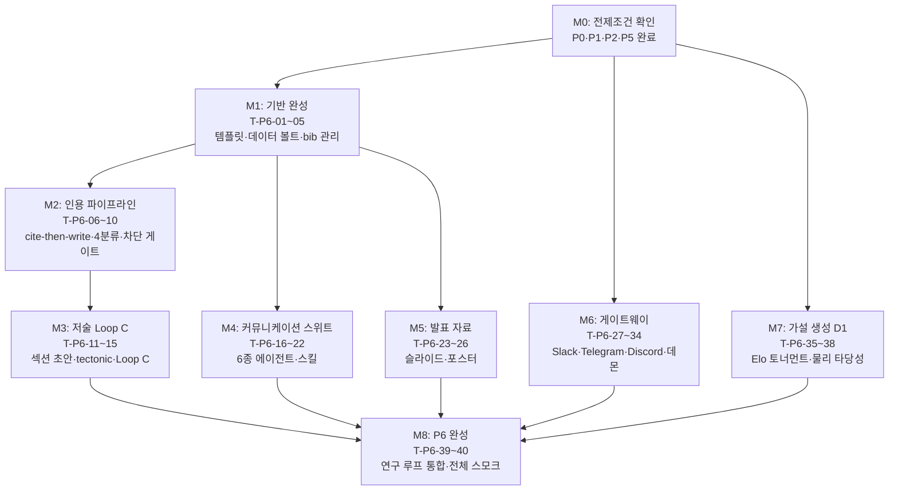

# MagLab 구현 계획 — Phase P6: 학술 저술·커뮤니케이션 · 메시징 게이트웨이 · 가설 생성

> 설계 근거: PLAN.md §19 로드맵 · plan/09-authoring.md(§16) · plan/02-delivery.md(§8) · plan/01-harness.md(§6·§5.10)
> 이 문서는 구현 실행 계획이다 — 코드 생성 없이 태스크·순서·DoD를 명세. 규약: impl/README.md

---

## P6.0 목표 & 범위

MagLab 마지막 Phase. 검증된 결과를 학술 논문·서신·발표 자료로 완성하고, 메시징
채널로 연구자에게 전달하며, 가설 생성으로 다음 연구 루프를 닫는다.

**핵심 산출물:**

- `maglab/authoring/` — 학술지 템플릿, 데이터 볼트, 인용 파이프라인, 섹션 초안기, 커뮤니케이션 스위트, 발표 자료
- `maglab/gateway/` — Slack·Telegram·Discord 어댑터, 라우터 데몬, 세션 DB
- `maglab/core/ralph.py` 확장 — Loop C(저술 Ralph) 추가
- `maglab/core/reasoning.py` 확장 — D1 가설 생성·Elo 토너먼트 추가
- CLI 진입점 — `maglab write`, `maglab comms`, `maglab present`, `maglab hypotheses`, `maglab gateway`

**종료 기준(§19 P6행):** `maglab write` 동작, 리비전·메일 초안 생성, Slack/Telegram/Discord 연동 스모크 통과.

---

## P6.1 전제조건

P6 착수 전 아래 산출물이 완료·머지되었음을 확인한다.

**P0 산출물:**
- [ ] `core/orchestrator.py` · `core/ralph.py` — 루프 엔진·서킷 브레이커·휴먼게이트(§6.2)
- [ ] `core/hooks.py` · `report/honesty_gate.py` — 차단 게이트 인프라(§5.15)
- [ ] `core/budget.py` — 비용 추적(§5.14)
- [ ] `provenance/` — DataPoint·W3C PROV·데이터 볼트 기반(§17)
- [ ] `core/skills.py` — 스킬 로더; `skills/` 디렉터리 존재
- [ ] `core/reasoning.py` — D2(이상 결과 설명) 이미 구현됨(P5에서 완성) — **P6은 D1만 추가**

**P1 산출물:**
- [ ] `figure/` 엔진 — 저술·발표 자료에 figure 삽입 가능, `figure/styles/` 저널 프로파일 존재

**P2 산출물:**
- [ ] `analysis/` 피팅 결과 `DataPoint` — 수치 주장의 출처로 사용 가능

**P5 산출물:**
- [ ] `reviewer/` — 리비전 레터가 소비할 리뷰 결정문 구조 정의됨
- [ ] `literature/` — cite-then-write가 사용할 검증된 문헌 풀, DOI 검증 파이프라인

---

## P6.2 작업 분해 (WBS)

작업은 6개 묶음으로 분해한다: ① 템플릿·데이터 볼트 기반 (T-P6-01~05), ② 인용 파이프라인 (T-P6-06~10), ③ 섹션 초안·Loop C (T-P6-11~15), ④ 커뮤니케이션 스위트 (T-P6-16~22), ⑤ 발표 자료 (T-P6-23~26), ⑥ 게이트웨이·가설 생성 (T-P6-27~40).

---

### 묶음 1 — 템플릿 & 데이터 볼트

#### 학술지 템플릿 — `authoring/templates/`

- [ ] **T-P6-01  `authoring/templates/` 디렉터리 골격**
  - 대상 파일: `maglab/authoring/templates/` 하위 양식 디렉터리 생성
  - 설계 근거: §16.2 (plan/09-authoring.md), 부록 G
  - 구현: 5개 출판사군 서브디렉터리(`sn-jnl/`·`scifile/`·`revtex4-2/`·`IEEEtran/`·`elsarticle/`) + `word/`(Wiley). 각 디렉터리에 `.tex` 프리앰블 파일, `figure_spec.yaml`(저널별 figure 폭·해상도·폰트), `style_profile.yaml`(§12 figure 엔진이 읽는 치수 프로파일). `word/` 는 `.dotx` 템플릿 번들.
  - 의존: P1 `figure/styles/` — 저널 스타일 프로파일을 공유 포맷으로 정렬
  - DoD: `maglab write --journal prl --dry-run` 실행 시 `revtex4-2` 디렉터리 내 프리앰블이 선택되고 `tectonic` 컴파일이 오류 없이 완료.
  - 스킬/도구: `journal-templates` 스킬, `doc-coauthoring`

- [ ] **T-P6-02  Word 양식 템플릿 — Wiley Advanced Materials**
  - 대상 파일: `maglab/authoring/templates/word/advanced_materials.dotx`
  - 설계 근거: §16.2, 부록 G (Advanced Materials = Word/PDF 제출)
  - 구현: `python-docx`로 Wiley 공식 `.dotx` 스타일 프로파일(제목·저자·본문·캡션·참조 스타일) 구현. `maglab write --journal advanced-materials`가 이 경로를 선택 → `.docx` 산출. HUMAN REVIEW REQUIRED 표식 첫 페이지 삽입.
  - 의존: T-P6-01
  - DoD: 생성 `.docx`를 Word에서 열었을 때 스타일이 Wiley 가이드라인에 맞고 표식이 존재함.
  - 스킬/도구: `docx`

#### 데이터 볼트 통합 — `authoring/data_vault.py`

- [ ] **T-P6-03  데이터 볼트 읽기 인터페이스**
  - 대상 파일: `maglab/authoring/data_vault.py`
  - 설계 근거: §16.4 (plan/09-authoring.md), §5.15 차단 게이트, §17 DataPoint
  - 구현: `provenance/` DataPoint 레지스트리에서 잠긴 수치를 읽는 `get_locked_value(key) → DataPoint | None` 인터페이스. `inject_into_draft(draft_tex, section)` — 초안 본문에서 수치 플레이스홀더(`{{dp:KEY}}`)를 DataPoint 값으로 치환하고 provenance ID를 LaTeX 주석으로 삽입. DataPoint 없는 플레이스홀더는 치환 거부 + 차단 게이트 트리거.
  - 의존: P0 `provenance/` DataPoint, T-P6-11(섹션 초안이 플레이스홀더 사용)
  - DoD: 존재하는 DataPoint 키는 정상 치환, 없는 키는 차단 게이트가 `AuthoringBlockedError` 발생시킴(§20 데이터 볼트 테스트).
  - 스킬/도구: —

- [ ] **T-P6-04  bib 관리자 — `authoring/bib_manager.py`**
  - 대상 파일: `maglab/authoring/bib_manager.py`
  - 설계 근거: §16.4 cite-then-write
  - 구현: `bibtexparser` v2 기반. `add_verified(doi, metadata)` — DOI 검증을 마친 항목만 `.bib`에 추가; `get_verified_keys()` — 검증된 cite-key 목록; `export_bib(path)` — 저술 디렉터리로 내보내기. 미검증 DOI 추가 시도는 거부.
  - 의존: P5 `literature/` DOI 검증 파이프라인
  - DoD: 검증된 DOI 추가 → `.bib` 항목 존재; 미검증 DOI 추가 → 예외 발생.
  - 스킬/도구: —

- [ ] **T-P6-05  `authoring/` 패키지 진입점 & `maglab write` CLI 연결**
  - 대상 파일: `maglab/authoring/__init__.py`, `maglab/cli.py` (`write` 서브커맨드)
  - 설계 근거: §16.1, 부록 A `maglab write`
  - 구현: `maglab write "<결과>" --journal <name> [--loop] [--dry-run]`. `--loop` 없으면 초안 1회; `--loop`이면 Loop C(T-P6-15) 기동. 모든 산출 디렉터리에 `HUMAN_REVIEW_REQUIRED.txt` 자동 생성. 자동 투고 경로 없음(§2.4 비목표).
  - 의존: T-P6-01~04, T-P6-15
  - DoD: `maglab write "AHE 측정 결과" --journal prl --dry-run` 실행 시 초안 디렉터리와 HUMAN_REVIEW_REQUIRED 파일이 생성됨.
  - 스킬/도구: `doc-coauthoring`

---

### 묶음 2 — 인용 파이프라인

#### cite-then-write & 의미 검증 — `authoring/citation_auditor.py`

- [ ] **T-P6-06  cite-then-write 파이프라인 조율**
  - 대상 파일: `maglab/authoring/citation_auditor.py` (존재 검증 계층)
  - 설계 근거: §16.4 (plan/09-authoring.md), P5 `literature/`
  - 구현: 섹션 초안 전 호출되는 `preflight_citations(topic, n_candidates) → VerifiedCitePool`. 내부적으로 P5 `literature/` 검색 → DOI·제목·저자 3중 검증 → 통과 항목만 `bib_manager`에 등록. 초안기에 검증 풀의 키만 공급. 섹션마다 1회 실행.
  - 의존: P5 `literature/connectors.py`, T-P6-04
  - DoD: `preflight_citations("SOT 토크 측정", n=10)` 호출 시 DOI 검증 통과 항목만 VerifiedCitePool에 담기고 미검증 항목은 배제됨.
  - 스킬/도구: —

- [ ] **T-P6-07  존재 검증 — 인용 전수 대조**
  - 대상 파일: `maglab/authoring/citation_auditor.py`
  - 설계 근거: §16.4, §16.7 (plan/09-authoring.md)
  - 구현: `audit_existence(draft_tex, bib_path) → ExistenceReport`. 초안 내 모든 `\cite{KEY}`를 추출 → `.bib` 내 존재 여부 확인 → 없는 키는 `MISSING` 태그. MISSING 인용이 1개 이상이면 차단 게이트 트리거.
  - 의존: T-P6-04, T-P6-06
  - DoD: 없는 키를 의도적으로 주입했을 때 `MISSING` 탐지 + 차단 확인.
  - 스킬/도구: —

- [ ] **T-P6-08  의미 검증 — 4분류 엔진**
  - 대상 파일: `maglab/authoring/citation_auditor.py`
  - 설계 근거: §16.7 (plan/09-authoring.md), §5.15 차단 게이트
  - 구현: `audit_semantics(draft_tex, bib_path, full_text_pool) → SemanticReport`. 각 인용에 대해 (주장 문장, 피인용 논문 전문) 쌍을 LLM에 전달 → 4분류 레이블(지지·부분지지·불지지·불확실) + 신뢰도(0–1) + 근거 스니펫(쪽·섹션). **불지지·불확실**은 차단 게이트가 저술 진행 정지. 지지·부분지지는 경고와 함께 통과.
  - 의존: T-P6-07, P5 `literature/rag.py`(전문 조회)
  - DoD: 주입한 불지지 인용을 4분류가 정확히 탐지·차단; 신뢰 인용은 통과(§20 인용 검증 테스트).
  - 스킬/도구: —

- [ ] **T-P6-09  차단 게이트 통합 — `core/hooks.py` 연결**
  - 대상 파일: `maglab/authoring/citation_auditor.py`, `maglab/core/hooks.py`
  - 설계 근거: §5.15 차단형 단계 게이트 (plan/01-harness.md)
  - 구현: `PreSectionFinalizeHook` — 섹션 확정 직전 `audit_existence` + `audit_semantics` + 데이터 볼트 수치 전수 확인을 연쇄 실행. 셋 중 하나라도 실패하면 `AuthoringBlockedError` 발생 → 섹션 확정 불가. 게이트 결과를 provenance에 기록.
  - 의존: T-P6-07, T-P6-08, T-P6-03, P0 `core/hooks.py`
  - DoD: 미검증 인용 또는 DataPoint 없는 수치가 있는 섹션은 확정 명령이 `AuthoringBlockedError`로 중단됨.
  - 스킬/도구: —

- [ ] **T-P6-10  `maglab write` cite-then-write 통합 엔드투엔드 테스트**
  - 대상 파일: `tests/test_authoring_citation.py`
  - 설계 근거: §20 인용 주입 가짜 탐지 테스트
  - 구현: (1) 합성 초안 + 의도적 불지지 인용 주입 → `audit_semantics`가 차단. (2) 합성 초안 + 전수 검증 통과 인용 → 차단 없음. (3) DataPoint 없는 수치 플레이스홀더 → 데이터 볼트 차단. 모두 결정론 검사(LLM-as-judge 금지).
  - 의존: T-P6-08, T-P6-09
  - DoD: `pytest tests/test_authoring_citation.py` 전 케이스 통과.
  - 스킬/도구: —

---

### 묶음 3 — 섹션 초안 & Loop C

#### 섹션 초안기 — `authoring/section_drafter.py`

- [ ] **T-P6-11  섹션 초안기 — Methods 섹션**
  - 대상 파일: `maglab/authoring/section_drafter.py`
  - 설계 근거: §16.4·§16.5 (plan/09-authoring.md)
  - 구현: `draft_section(section_type, context, verified_cite_pool, data_vault) → DraftResult`. `section_type`은 `methods | results | discussion | conclusion | intro | abstract | title` 중 하나. LLM에게 검증 풀 cite-key와 DataPoint 플레이스홀더만 공급 — LLM이 수치나 DOI를 직접 생성하지 못하도록 시스템 프롬프트 강제. 반환 `DraftResult`는 `.tex` 초안 + 사용된 cite-key 목록 + 플레이스홀더 목록.
  - 의존: T-P6-04, T-P6-06, T-P6-03
  - DoD: `draft_section("methods", ...)` 호출 결과에 검증 풀 외 cite-key가 없고, 수치는 `{{dp:KEY}}` 플레이스홀더 형태로만 존재.
  - 스킬/도구: `doc-coauthoring`

- [ ] **T-P6-12  나머지 섹션 순서 구현 — Results→Discussion→Conclusion→Intro→Abstract→Title**
  - 대상 파일: `maglab/authoring/section_drafter.py`
  - 설계 근거: §16.5 섹션 순서 (plan/09-authoring.md)
  - 구현: T-P6-11의 `draft_section`을 6개 섹션 타입에 적용. 섹션 타입별 시스템 프롬프트 분기(Results: 결과 서술 강조; Abstract: 부록 G 단어수 한계 주입; Title: 15단어 이하 강제). 각 섹션 초안 후 데이터 볼트 치환(T-P6-03) → 차단 게이트(T-P6-09) 순서로 자동 실행.
  - 의존: T-P6-11, T-P6-09
  - DoD: 7개 섹션 타입 모두 오류 없이 초안 생성; Abstract가 저널별 단어수 한계를 초과하면 경고 발생.
  - 스킬/도구: `doc-coauthoring`

- [ ] **T-P6-13  `tectonic` 컴파일 통합**
  - 대상 파일: `maglab/authoring/section_drafter.py` (또는 `authoring/compiler.py`)
  - 설계 근거: §16.5 `tectonic` 컴파일·PDF readback (plan/09-authoring.md)
  - 구현: `compile_draft(tex_dir) → CompileResult(pdf_path, log, success)`. `tectonic` 바이너리를 서브프로세스로 호출; 오류 시 로그 반환 + Loop C에 재작성 신호 전달. PDF 생성 성공 시 `pdf_path` 반환.
  - 의존: T-P6-11, T-P6-12 (`.tex` 조립 필요)
  - DoD: 합성 RevTeX 초안에 `compile_draft` 호출 → `success=True`·PDF 파일 존재.
  - 스킬/도구: `tectonic` 바이너리(시스템 설치 필요)

- [ ] **T-P6-14  PDF readback 비전 critic 통합**
  - 대상 파일: `maglab/authoring/section_drafter.py`
  - 설계 근거: §16.5 PDF readback, §5.7 비전 모델 critic
  - 구현: `readback_pdf(pdf_path) → ReadbackFeedback(issues, layout_ok)`. 비전 모델로 컴파일된 PDF를 읽어 레이아웃 이상(오버플로우·빠진 figure·참조 깨짐)을 감지. 데이터 수치 재확인은 결정론 검사 우선(비전 모델은 보조). 피드백을 Loop C에 전달.
  - 의존: T-P6-13
  - DoD: 의도적으로 오버플로우를 일으킨 초안 PDF에서 `issues`가 비어있지 않음.
  - 스킬/도구: 비전 모델(§5.7 단계 모델 라우팅)

- [ ] **T-P6-15  Loop C — 저술 Ralph 루프 (`core/ralph.py` 확장)**
  - 대상 파일: `maglab/core/ralph.py`
  - 설계 근거: §16.5 Loop C (plan/09-authoring.md), §6.2 ralph.py (plan/01-harness.md)
  - 구현: 기존 `ralph.py`에 `LoopC` 클래스 추가. 섹션 순서 고정(Methods→Results→Discussion→Conclusion→Intro→Abstract→Title), 각 iteration: 초안(T-P6-12) → 도메인 critic(별도 서브에이전트, 물리·논리 일관성 검토) → 수정 → `compile_draft`(T-P6-13) → `readback_pdf`(T-P6-14) → 차단 게이트 통과 확인. max 6회. 섹션마다 휴먼게이트(Tier 2 사인오프 요청). 서킷 브레이커(§6.2)도 상속. AI 사용 고지문 초안 말미 자동 첨부.
  - 의존: T-P6-12, T-P6-13, T-P6-14, T-P6-09, P0 `core/ralph.py`
  - DoD: `maglab write "<결과>" --journal prl --loop` 실행 시 6 iteration 안에 컴파일 가능한 PDF 산출; 섹션 간 휴먼게이트 프롬프트 노출; AI 고지문 존재.
  - 스킬/도구: `doc-coauthoring`, `tectonic`

---

### 묶음 4 — 커뮤니케이션 스위트

#### `authoring/comms/` — 6종 에이전트·스킬

- [ ] **T-P6-16  `comms/` 패키지 골격 & 공통 가드레일**
  - 대상 파일: `maglab/authoring/comms/__init__.py`, `maglab/authoring/comms/base.py`
  - 설계 근거: §16.3 (plan/09-authoring.md)
  - 구현: 6종 에이전트 공통 계약 — 산출물에 `HUMAN REVIEW REQUIRED` 표식, 자동 발송 없음, 날조 금지(AI는 구조화·다듬기만, 사용자 결과·문장이 1차 입력). `BaseCommsAgent.draft(inputs) → CommsResult(text, fill_markers)` 추상 인터페이스. `[FILL]` 표식으로 사용자 직접 입력 필요 구간 표시.
  - 의존: T-P6-05
  - DoD: `BaseCommsAgent` 서브클래스가 `[FILL]` 없는 최종본을 반환하면 `ValueError` 발생.
  - 스킬/도구: —

- [ ] **T-P6-17  `revision-letter` 에이전트·스킬**
  - 대상 파일: `maglab/authoring/comms/revision_letter.py`, `skills/revision-letter/SKILL.md`
  - 설계 근거: §16.3 (plan/09-authoring.md), P5 `reviewer/` 결정문 구조
  - 구현: 입력 — 리뷰 결정문 + 원고(원/수정본) + 코멘트별 노트 + 톤 설정. 출력 — 코멘트 축자 인용 → 응답 → 변경 위치(쪽·줄) 포맷의 리비전 레터. P5 `reviewer/` 패널 결정문을 직접 소비. HUMAN REVIEW REQUIRED 첫 줄 삽입.
  - 의존: T-P6-16, P5 `reviewer/`
  - DoD: 합성 리뷰 결정문 입력 → 코멘트 3개 각각 축자 인용·응답·위치 포함한 레터 생성; `[FILL]` 존재 위치는 사용자가 직접 채워야 진행.
  - 스킬/도구: `doc-coauthoring`

- [ ] **T-P6-18  `cover-letter` 에이전트·스킬**
  - 대상 파일: `maglab/authoring/comms/cover_letter.py`, `skills/cover-letter/SKILL.md`
  - 설계 근거: §16.3 (plan/09-authoring.md)
  - 구현: 입력 — 대상 저널·제목·핵심 결과·관련 게재 논문. 출력 — 250단어 이내 커버 레터. 저널별 에디터 커스텀 문구는 `[FILL]` 표식. 단어수 초과 시 경고.
  - 의존: T-P6-16
  - DoD: `draft(inputs)` 출력 단어수 ≤250; `[FILL]` 최소 1개 이상 존재(에디터명 등).
  - 스킬/도구: `doc-coauthoring`

- [ ] **T-P6-19  `academic-email` 에이전트·스킬**
  - 대상 파일: `maglab/authoring/comms/academic_email.py`, `skills/academic-email/SKILL.md`
  - 설계 근거: §16.3 (plan/09-authoring.md)
  - 구현: 입력 — 유형(협업·질문·면담·추천서·지원)·교수명·관련 논문·용건. 출력 — 메일 본문(≤200단어) + 제목 + 후속 조치. 자동 발송 경로 없음. `[FILL]` 표식으로 개인화 구간 명시.
  - 의존: T-P6-16
  - DoD: 5개 유형 각각 입력 → 200단어 이하 메일 + 제목 생성; `[FILL]` 구간 존재.
  - 스킬/도구: —

- [ ] **T-P6-20  `conference-abstract` 에이전트·스킬**
  - 대상 파일: `maglab/authoring/comms/conference_abstract.py`, `skills/conference-abstract/SKILL.md`
  - 설계 근거: §16.3 (plan/09-authoring.md)
  - 구현: 입력 — 학회명·캐릭터 한도·검증된 결과(DataPoint 참조). 출력 — 한도 내 초록. 수치는 DataPoint 조회로만 삽입(T-P6-03). 캐릭터 초과 시 에러.
  - 의존: T-P6-16, T-P6-03
  - DoD: APS March Meeting 1750자 한도 입력 → 출력이 1750자 이하; DataPoint 없는 수치 플레이스홀더 → 차단.
  - 스킬/도구: `doc-coauthoring`

- [ ] **T-P6-21  `grant-text` 에이전트·스킬**
  - 대상 파일: `maglab/authoring/comms/grant_text.py`, `skills/grant-text/SKILL.md`
  - 설계 근거: §16.3 (plan/09-authoring.md)
  - 구현: 입력 — 기관(NSF·DOE·기타)·메커니즘·specific aims·분량 한도. 출력 — 양식별 섹션 텍스트, 분량 강제, `[FILL]` 예산·공동연구자 구간. 수치·문헌은 cite-then-write 경유.
  - 의존: T-P6-16, T-P6-04, T-P6-03
  - DoD: NSF 2쪽 specific aims → 분량 초과 없이 섹션 구조 생성; `[FILL]` 존재.
  - 스킬/도구: `doc-coauthoring`

- [ ] **T-P6-22  `rebuttal` 에이전트·스킬 & `maglab comms` CLI 연결**
  - 대상 파일: `maglab/authoring/comms/rebuttal.py`, `skills/rebuttal/SKILL.md`, `maglab/cli.py`
  - 설계 근거: §16.3 (plan/09-authoring.md), 부록 A `maglab comms`
  - 구현: `rebuttal` — 학회 리뷰 + 노트 → 1쪽 이내 반박(기존 결과 명확화만, 신규 데이터 생성 금지). `maglab comms revision | cover-letter | email | abstract | grant | rebuttal` 라우팅. HUMAN REVIEW REQUIRED 모든 산출에 적용. 자동 발송 없음 최종 확인.
  - 의존: T-P6-16~T-P6-21
  - DoD: `maglab comms revision --review <path>` 실행 → 리비전 레터 파일 생성 + HUMAN_REVIEW_REQUIRED 표식 확인.
  - 스킬/도구: `doc-coauthoring`

---

### 묶음 5 — 발표 자료

#### `authoring/present/` — 슬라이드·포스터

- [ ] **T-P6-23  `authoring/present/` 패키지 골격 & 템플릿**
  - 대상 파일: `maglab/authoring/present/__init__.py`, `maglab/authoring/present/templates/`
  - 설계 근거: §16.6 (plan/09-authoring.md)
  - 구현: 템플릿 3종 — `beamer/`(APS March Meeting 12분·세미나), `pptx/`(python-pptx 기반), `marp/`(Marp 마크다운). 포스터 — `beamerposter/`(A0), `svg/`(대형 단일 레이아웃). 각 템플릿은 figure 엔진(§12)이 삽입할 `{{figure:SPEC}}` 플레이스홀더 규약을 포함.
  - 의존: P1 `figure/` 엔진
  - DoD: 템플릿 로드 후 `{{figure:SPEC}}` 플레이스홀더가 파서에서 인식됨.
  - 스킬/도구: `pptx`

- [ ] **T-P6-24  슬라이드 초안기 — beamer & python-pptx**
  - 대상 파일: `maglab/authoring/present/slide_drafter.py`
  - 설계 근거: §16.6 (plan/09-authoring.md)
  - 구현: `draft_slides(results, format, template) → SlideDeck`. 구조화 덱 초안 — 제목·동기·방법·결과(§12 figure 삽입)·결론 순서. LLM이 슬라이드 텍스트 구조화; 수치는 DataPoint 조회(T-P6-03). `beamer` 포맷은 LaTeX → `tectonic` 컴파일; `pptx`는 `python-pptx` 직접 조립; `marp`는 `.md` 파일.
  - 의존: T-P6-23, T-P6-03, P1 `figure/compose.py`
  - DoD: `maglab present slides "<결과>" --format beamer --template aps-12min` 실행 → `.pdf` 생성 또는 `.pptx` 생성; figure 플레이스홀더가 실제 figure로 치환됨.
  - 스킬/도구: `pptx`, `tectonic`

- [ ] **T-P6-25  포스터 초안기 — beamerposter & SVG**
  - 대상 파일: `maglab/authoring/present/poster_drafter.py`
  - 설계 근거: §16.6 (plan/09-authoring.md)
  - 구현: `draft_poster(results, size, format) → PosterFile`. A0 단일 레이아웃, 섹션 패널(동기·방법·결과·결론). SVG 경로: LLM이 SVG 레이아웃 코드 저작(래스터 생성형 모델 미사용 — §2.4·§3.3). honesty gate 동일 적용(주장 provenance 확인).
  - 의존: T-P6-23, T-P6-03, P1 `figure/`
  - DoD: `maglab present poster "<결과>" --size A0` 실행 → PDF 또는 SVG 파일 생성.
  - 스킬/도구: `pptx`(pptx 경로), `cairosvg`/Inkscape(SVG→PDF)

- [ ] **T-P6-26  `maglab present` CLI 연결 & honesty gate 통합**
  - 대상 파일: `maglab/cli.py` (`present` 서브커맨드)
  - 설계 근거: §16.6, §17 honesty gate (plan/09-authoring.md)
  - 구현: `maglab present slides | poster` 라우팅. 모든 산출물에 HUMAN REVIEW REQUIRED 표식. 발표자·저자는 사람임을 산출 파일 헤더에 기재. honesty gate — 수치는 DataPoint 출처 주석 포함.
  - 의존: T-P6-24, T-P6-25
  - DoD: `maglab present slides "<결과>" --dry-run` 실행 시 슬라이드 파일 디렉터리와 HUMAN_REVIEW_REQUIRED.txt 생성.
  - 스킬/도구: —

---

### 묶음 6 — 메시징 게이트웨이 & 가설 생성

#### 게이트웨이 — `gateway/`

- [ ] **T-P6-27  `gateway/session_db.py` — SQLite 세션 저장소**
  - 대상 파일: `maglab/gateway/session_db.py`
  - 설계 근거: §8 (plan/02-delivery.md)
  - 구현: `~/.maglab/gateway.db` SQLite. 테이블 — `sessions(id, platform, user_id_hash, channel_id, created_at, last_active)`, `messages(id, session_id, role, content_hash, ts)`. PII 해시 — user_id는 SHA-256 해시 저장(원문 미보관). `get_or_create_session(platform, user_id) → Session`.
  - 의존: 없음(P0 `provenance/` SQLite 패턴 참조)
  - DoD: `get_or_create_session("slack", "U12345")` 호출 2회 → 동일 session id 반환; DB 내 user_id는 해시 형태.
  - 스킬/도구: —

- [ ] **T-P6-28  게이트웨이 어댑터 추상 인터페이스 — `gateway/adapters/base.py`**
  - 대상 파일: `maglab/gateway/adapters/base.py`
  - 설계 근거: §8 어댑터 패턴 (plan/02-delivery.md)
  - 구현: `BaseAdapter`가 3메서드 계약 정의 — `verify_request(raw) → bool`(서명 검증·허용목록 체크), `parse_message(raw) → UnifiedMessage`(플랫폼 중립 메시지 구조), `send_reply(session, text, attachments) → None`. `UnifiedMessage` — `platform·user_id_hash·channel·text·attachments·ts`. 보안 필드 — `allowed_users·allowed_channels` 설정에서 로드, 설정 파일 0600 권한 강제.
  - 의존: T-P6-27
  - DoD: `BaseAdapter` 서브클래스가 `verify_request` 미구현 시 `NotImplementedError`; 허용목록 외 user_id → `verify_request` 반환 `False`.
  - 스킬/도구: —

- [ ] **T-P6-29  Slack 어댑터 — `gateway/adapters/slack.py`**
  - 대상 파일: `maglab/gateway/adapters/slack.py`
  - 설계 근거: §8 Slack Socket Mode (plan/02-delivery.md)
  - 구현: `slack-bolt` Socket Mode — 공개 IP 불필요. `verify_request`: bolt의 `SlackRequestVerifier`로 서명 검증. `parse_message`: `AppMentionEvent`·`MessageEvent` → `UnifiedMessage`. `send_reply`: `client.chat_postMessage`. 인라인 버튼 블록(`ActionBlock`) — 휴먼게이트 승인/거부 버튼 생성, `asyncio.Event`로 코루틴 일시정지·재개. 선제 알림 — 시뮬 완료·Ralph 마일스톤·figure 완성 시 채널 푸시, figure 파일 첨부.
  - 의존: T-P6-28
  - DoD: 로컬 Socket Mode 테스트(slack-bolt 테스트 프레임워크) — 서명 위조 → `verify_request=False`; 정상 멘션 → `UnifiedMessage` 파싱 성공.
  - 스킬/도구: `slack-bolt`

- [ ] **T-P6-30  Telegram 어댑터 — `gateway/adapters/telegram.py`**
  - 대상 파일: `maglab/gateway/adapters/telegram.py`
  - 설계 근거: §8 Telegram long-polling (plan/02-delivery.md)
  - 구현: `python-telegram-bot` long-polling(기본) / webhook(선택). `verify_request`: 봇 토큰 HMAC 검증 + `allowed_users` 체크. `parse_message`: `Update.message` → `UnifiedMessage`. `send_reply`: `bot.send_message` / `send_document`(figure 첨부). 인라인 키보드 버튼 — `InlineKeyboardMarkup`으로 휴먼게이트 구현.
  - 의존: T-P6-28
  - DoD: 허용목록 외 chat_id → 응답 없음; 허용 chat_id → `UnifiedMessage` 반환.
  - 스킬/도구: `python-telegram-bot`

- [ ] **T-P6-31  Discord 어댑터 — `gateway/adapters/discord.py`**
  - 대상 파일: `maglab/gateway/adapters/discord.py`
  - 설계 근거: §8 Discord Gateway (plan/02-delivery.md)
  - 구현: `discord.py` Gateway + 슬래시 커맨드. `verify_request`: `allowed_users`·`allowed_channels` 체크. `parse_message`: `Message`·`Interaction` → `UnifiedMessage`. `send_reply`: `channel.send` / `interaction.followup.send`. 버튼 컴포넌트(`discord.ui.Button`) — 휴먼게이트.
  - 의존: T-P6-28
  - DoD: 허용목록 외 channel → 응답 없음; `/maglab status` 슬래시 커맨드 → 세션 상태 반환.
  - 스킬/도구: `discord.py`

- [ ] **T-P6-32  `gateway/runner.py` — 라우팅·데몬**
  - 대상 파일: `maglab/gateway/runner.py`
  - 설계 근거: §8 (plan/02-delivery.md)
  - 구현: `asyncio` 이벤트 루프 위에 3개 어댑터를 동시 구동. `UnifiedMessage` → CLI 공유 커맨드 레지스트리 라우팅 → 하네스 실행 → `send_reply`. 선제 알림 전송 큐 — 내부 이벤트 버스에서 구독, 어댑터별 `send_reply` 호출. 데몬 모드: `maglab gateway start` → 백그라운드 프로세스, PID 파일 `~/.maglab/gateway.pid`.
  - 의존: T-P6-27, T-P6-29, T-P6-30, T-P6-31
  - DoD: `maglab gateway start` → PID 파일 생성; `maglab gateway status` → 실행 중 표시; `maglab gateway stop` → 프로세스 종료.
  - 스킬/도구: —

- [ ] **T-P6-33  `maglab gateway install` — systemd/launchd 서비스 등록**
  - 대상 파일: `maglab/gateway/install.py`, `maglab/cli.py` (`gateway install` 서브커맨드)
  - 설계 근거: §8 `gateway install` (plan/02-delivery.md), 부록 A
  - 구현: 플랫폼 감지(`sys.platform`) → macOS: `~/Library/LaunchAgents/com.maglab.gateway.plist` 생성 + `launchctl load`; Linux: `~/.config/systemd/user/maglab-gateway.service` 생성 + `systemctl --user enable`. 자격증명 파일 0600 권한 검사 — 위반 시 설치 거부.
  - 의존: T-P6-32
  - DoD: `maglab gateway install` 실행 → 플랫폼별 서비스 파일 존재 + 권한 0600 확인.
  - 스킬/도구: —

- [ ] **T-P6-34  게이트웨이 스모크 테스트**
  - 대상 파일: `tests/test_gateway_smoke.py`
  - 설계 근거: §20 게이트웨이 스모크 테스트
  - 구현: mock 어댑터로 `runner.py` 실행 → (1) 허용목록 외 메시지 → 응답 없음, (2) 허용 메시지 → 라우팅·응답 반환, (3) 선제 알림 이벤트 → 채널 전송 확인. 실제 플랫폼 API 미호출(완전 mock).
  - 의존: T-P6-32, T-P6-28
  - DoD: `pytest tests/test_gateway_smoke.py` 전 케이스 통과.
  - 스킬/도구: —

#### 가설 생성·평가 — `core/reasoning.py` D1 추가

- [ ] **T-P6-35  D1 — 가설 후보 생성 (`hypothesis-gen` 서브에이전트)**
  - 대상 파일: `maglab/core/reasoning.py`, `agents/hypothesis-gen.md`
  - 설계 근거: §5.10 (plan/01-harness.md), 부록 E D1
  - 구현: 기존 `core/reasoning.py`(D2 이미 구현)에 `D1HypothesisEngine` 클래스 추가. `generate_candidates(topic, lit_gap, current_results, n) → list[HypothesisCandidate]`. `HypothesisCandidate` — 아이디어·신규성 근거(인용 cite-key)·검증 방법(측정 계획 링크 또는 시뮬 링크)·실현성·임팩트 초기 점수. 문헌 갭(P5 `literature/`)·현 결과(`DataPoint`)에 그라운딩. LLM이 가설 텍스트를 생성하되, 신규성 근거는 검증된 문헌 풀에서만 인용.
  - 의존: P5 `literature/`, P0 `provenance/` DataPoint, D2 이미 존재
  - DoD: `generate_candidates("스핀 홀 자성체", n=5)` 호출 → 5개 후보 반환; 각 후보 신규성 근거의 cite-key가 검증 풀에 존재함.
  - 스킬/도구: —

- [ ] **T-P6-36  D1 — Elo 토너먼트 순위화**
  - 대상 파일: `maglab/core/reasoning.py`
  - 설계 근거: §5.10 Elo 토너먼트 (plan/01-harness.md)
  - 구현: `rank_by_elo(candidates, criteria) → list[RankedHypothesis]`. 쌍대 비교 — 신규성·검증가능성·실현성·임팩트 4기준으로 모든 쌍을 비교(LLM judge — 비정량적 판단이므로 §5.7 LLM judge 예외 허용). Elo 점수 갱신(`K=32`). 최종 순위화 리스트 반환.
  - 의존: T-P6-35
  - DoD: 5개 후보 Elo 토너먼트 실행 → 순위 리스트 반환; 동점 없이 정렬됨.
  - 스킬/도구: —

- [ ] **T-P6-37  D1 — 물리 타당성 reflection**
  - 대상 파일: `maglab/core/reasoning.py`
  - 설계 근거: §5.10 reflection 패스 (plan/01-harness.md)
  - 구현: `reflection_physics_check(candidate) → ReflectionResult(valid, contradiction, reason)`. `physics/oracle.py`·`physics/formulas.py` 대조 — 후보 가설이 알려진 물리 법칙과 명시적으로 모순되는지 확인. 모순 탐지 시 `valid=False` + 이유 반환; 해당 후보는 Elo 결과에서 제외 권고.
  - 의존: T-P6-35, P0 `physics/oracle.py`·`physics/formulas.py`
  - DoD: 에너지 보존 위반 가설 입력 → `valid=False`·`contradiction` 설명 반환.
  - 스킬/도구: —

- [ ] **T-P6-38  `maglab hypotheses` CLI 연결**
  - 대상 파일: `maglab/cli.py` (`hypotheses` 서브커맨드)
  - 설계 근거: §5.10, 부록 A `maglab hypotheses`
  - 구현: `maglab hypotheses "<주제>"` → 순위화된 가설 카드 렌더. 카드 포맷(Rich Panel) — 아이디어·신규성 근거(인용)·검증 방법(측정 계획 또는 시뮬 링크)·실현성·임팩트·Elo 점수·물리 타당성 결과. AI 제안임을 카드 헤더에 명시. 연구자가 카드 선택 → 연구 루프 또는 측정 계획(P5 `lab/planning`)에 투입.
  - 의존: T-P6-35, T-P6-36, T-P6-37
  - DoD: `maglab hypotheses "스핀 홀 각도 의존성"` → 최소 3개 가설 카드 출력; 각 카드에 "AI 제안" 라벨·Elo 점수·물리 타당성 표시.
  - 스킬/도구: —

#### 자율 루프 & 연구 루프 완성

- [ ] **T-P6-39  연구 루프 트리 탐색 — `experiment_manager` 서브에이전트 P6 통합**
  - 대상 파일: `agents/experiment-manager.md`
  - 설계 근거: §5.12, 부록 E "연구 루프 트리 탐색" P6 = 완성 (plan/01-harness.md)
  - 구현: P0에서 골격 생성된 `experiment-manager`에 P6 산출물 연결. 트리 노드 타입 확장 — `authoring(write_loop)·comms·hypotheses` 추가. Loop C 완료 → 노드 성공 기록. 가설 D1 결과 → 새 연구 루프 시작 또는 측정 계획 링크. 트리 전체 provenance 기록(§5.12).
  - 의존: T-P6-15 (Loop C), T-P6-38 (가설), P0 `core/orchestrator.py`·`core/checkpoint.py`
  - DoD: `maglab run "<연구 목표>"` 실행 시 저술·가설 노드가 트리에 포함되어 체크포인트에 기록됨.
  - 스킬/도구: —

- [ ] **T-P6-40  자율 루프(autonomous 모드) 통합 & P6 전체 스모크 테스트**
  - 대상 파일: `tests/test_p6_integration.py`
  - 설계 근거: §5.8 autonomous 모드, §20 CLI·MCP·게이트웨이 스모크 테스트
  - 구현: (1) `maglab write "<결과>" --journal prl --dry-run` — 초안 디렉터리·HUMAN_REVIEW_REQUIRED 생성 확인. (2) `maglab comms revision --review <합성리뷰>` — 리비전 레터 생성·HUMAN_REVIEW_REQUIRED 확인. (3) `maglab hypotheses "<주제>"` — 가설 카드 3개 이상 반환. (4) `maglab gateway start && maglab gateway status` — PID 확인 후 `gateway stop`. (5) 차단 게이트 — 불지지 인용 주입 → `AuthoringBlockedError` 확인. 모두 결정론 검사.
  - 의존: T-P6-05, T-P6-22, T-P6-38, T-P6-32, T-P6-09
  - DoD: `pytest tests/test_p6_integration.py` 전 케이스 통과.
  - 스킬/도구: —

---

## P6.3 마일스톤 & 의존성

**임계 경로:** M0 → M1 → M2 → M3 → M8. 게이트웨이(M6)·가설 생성(M7)은 M1 완료 후 병렬 진행 가능. 커뮤니케이션 스위트(M4)·발표 자료(M5)도 M1 이후 병렬.

---

## P6.4 검증 게이트 (종료 기준)

P6 완료 선언 전 아래 게이트를 전수 통과해야 한다.

### G1 — 저술 파이프라인 무결성 (§20)
- [ ] 불지지 인용 주입 → `citation_auditor`가 4분류 정확히 탐지·차단
- [ ] DataPoint 없는 수치 플레이스홀더 → `data_vault` 차단 게이트 발동
- [ ] `maglab write --journal prl --dry-run` → 컴파일 가능한 RevTeX 초안 + HUMAN_REVIEW_REQUIRED 파일 생성
- [ ] Loop C max 6 iteration 안에 `tectonic` 컴파일 성공

### G2 — 커뮤니케이션 스위트 (§20)
- [ ] `maglab comms revision` → 리비전 레터 생성; `[FILL]` 존재; HUMAN REVIEW REQUIRED 표식
- [ ] `maglab comms cover-letter` → 250단어 이하 커버 레터
- [ ] 자동 발송 경로 없음 — 모든 산출은 파일로만

### G3 — 발표 자료
- [ ] `maglab present slides` → beamer PDF 또는 `.pptx` 생성; figure가 실데이터(DataPoint) 기반
- [ ] `maglab present poster` → A0 PDF 또는 SVG 생성

### G4 — 메시징 게이트웨이 스모크 (§20)
- [ ] `pytest tests/test_gateway_smoke.py` 전 케이스 통과
- [ ] `maglab gateway install` → 플랫폼 서비스 파일 생성 + 0600 권한 확인
- [ ] 허용목록 외 사용자 메시지 → 응답 없음

### G5 — 가설 생성 D1
- [ ] `maglab hypotheses "<주제>"` → 최소 3개 가설 카드; 각 카드에 AI 제안 라벨·Elo 점수
- [ ] 물리 법칙 위반 가설 → `reflection_physics_check` `valid=False`

### G6 — 통합 스모크 (§20)
- [ ] `pytest tests/test_p6_integration.py` 전 케이스 통과
- [ ] `pytest tests/test_authoring_citation.py` 전 케이스 통과
- [ ] P6 산출물이 `maglab report` provenance 추적에서 조회 가능

---

## P6.5 스킬·도구·패키지

| 종류 | 항목 | 용도 | 태스크 |
|---|---|---|---|
| Claude 스킬 | `doc-coauthoring` | 저술 워크플로 오케스트레이션 | T-P6-05·11·12·17~22 |
| Claude 스킬 | `pptx` | 발표 슬라이드 python-pptx 조립 | T-P6-24·25 |
| Claude 스킬 | `docx` | Wiley Word 양식 조립 | T-P6-02 |
| Claude 스킬 | `journal-templates` | 학술지 템플릿 선택·검증 | T-P6-01 |
| 번들 스킬 | `revision-letter`·`cover-letter`·`academic-email`·`conference-abstract`·`grant-text`·`rebuttal` | 커뮤니케이션 스위트 SKILL.md | T-P6-17~22 |
| 외부 바이너리 | `tectonic` | LaTeX 컴파일 (Loop C·슬라이드) | T-P6-13·24 |
| Python 패키지 | `bibtexparser` v2 | bib 관리 | T-P6-04 |
| Python 패키지 | `python-pptx` | 슬라이드·포스터 조립 | T-P6-24·25 |
| Python 패키지 | `slack-bolt` | Slack Socket Mode 어댑터 | T-P6-29 |
| Python 패키지 | `python-telegram-bot` | Telegram 어댑터 | T-P6-30 |
| Python 패키지 | `discord.py` | Discord Gateway 어댑터 | T-P6-31 |
| Python 패키지 | `cairosvg` / Inkscape CLI | SVG→PDF 변환 (포스터) | T-P6-25 |
| Python 패키지 | `jinja2` | 템플릿 렌더링 | T-P6-01 |

**`pyproject.toml` extras 확인:**
- `[authoring]` — `bibtexparser`·`jinja2`·`python-pptx`
- `[gateway]` — `slack-bolt`·`python-telegram-bot`·`discord.py`

---

## P6.6 리스크 & 주의

| 리스크 | 대응 | 참조 |
|---|---|---|
| 자동 저술 날조 | 데이터 볼트·cite-then-write·citation auditor 4분류·차단 게이트·사람 저자 의무화 | §21·T-P6-03·09 |
| 인용 의미 검증 LLM 오판 | 4분류 결정론 앵커(쪽·섹션 스니펫) 함께 반환 → 연구자가 직접 확인. LLM judge는 비정량 판단에 한함(§5.7) | T-P6-08 |
| 게이트웨이 보안 침해 | `allowed_users`/`channels` 허용목록, 서명 검증, 자격증명 0600, PII 해시 — verify_request 실패 시 응답 없음 | §8·T-P6-28~33 |
| tectonic 미설치 | 설치 확인 훅 — 미설치 시 오류 메시지 + 설치 안내. CI에서 `tectonic` 사전 설치 | T-P6-13 |
| Ralph Loop C 폭주 | max 6 iteration + 서킷 브레이커(§6.2) 상속. 섹션 간 휴먼게이트 필수 | T-P6-15 |
| D2(`core/reasoning.py`) 덮어쓰기 | P6는 `D1HypothesisEngine` 클래스만 추가. D2 코드 절대 수정 금지. 분리 검증 | T-P6-35 |
| 플랫폼별 서비스 설치 실패 | macOS/Linux 자동 감지, 실패 시 수동 설치 안내 출력 | T-P6-33 |
| Word(.docx) 스타일 불일치 | Wiley 공식 템플릿 스타일 ID 사용; HUMAN REVIEW REQUIRED 표식으로 연구자가 최종 확인 | T-P6-02 |

---

## 관련 문서

- `impl/README.md` — 규약·태스크 ID·Phase 의존성 그래프
- `impl/01-P0-core.md` — 하네스·차단 게이트·ralph.py·provenance 골격
- `impl/02-P1-figure-sim.md` — figure 엔진 (저술·발표 자료에 figure 공급)
- `impl/03-P2-analysis.md` — DataPoint·효과 피팅 결과 (데이터 볼트 수치 출처)
- `impl/06-P5-literature-review.md` — `reviewer/`·`literature/` (cite-then-write·리비전 레터가 소비)
- `impl/08-skills-and-tools.md` — 번들 스킬 카탈로그·외부 도구 설치
- `impl/09-testing-and-ci.md` — 검증 전략·CI 게이트
- `plan/09-authoring.md` — §16 저술 상세 설계
- `plan/02-delivery.md` — §8 메시징 게이트웨이 설계
- `plan/01-harness.md` — §5.10 가설 생성·§5.15 차단 게이트·§6 Ralph 루프
- `plan/11-appendices.md` — 부록 A(CLI 트리)·C(스킬 카탈로그)·E(기능→Phase)·G(저널 템플릿)
