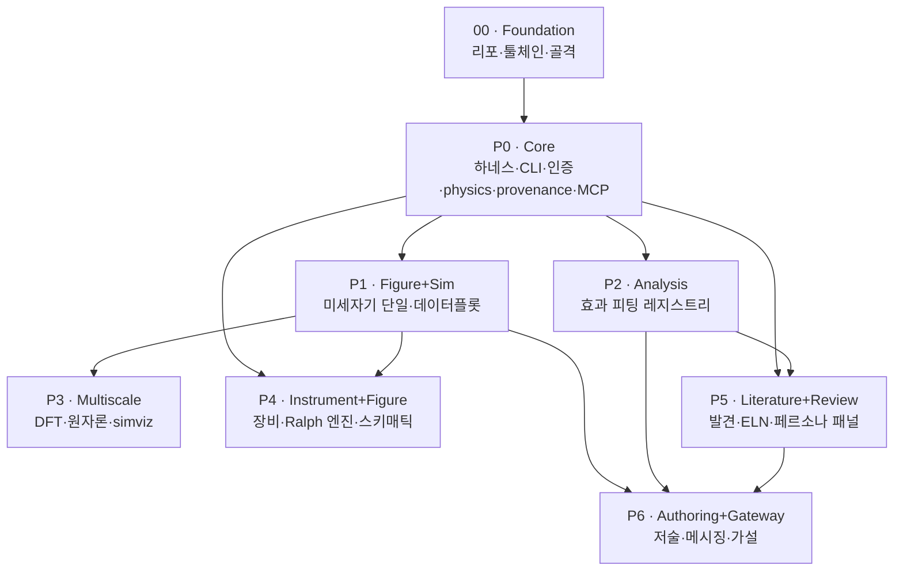

# MagLab 구현 계획 — `impl/`

MagLab(자성·스핀트로닉스 연구 생애주기 코파일럿, 독립 CLI 에이전트)의 **구현
실행 계획**이다. 설계("무엇을·왜")는 [`../PLAN.md`](../PLAN.md)와
[`../plan/`](../plan/)에 있고, 이 디렉터리는 **"어떤 순서로·어떤 태스크
단위로·무엇을 완료 기준으로"**를 명세한다.

## 1. plan/ 과 impl/

| | `plan/` — 설계 명세 | `impl/` — 구현 계획 |
|---|---|---|
| 답하는 질문 | 무엇을 만드는가, 왜 | 어떤 순서로, 언제 끝났다고 하는가 |
| 단위 | 절 §5–§17, 모듈 | Phase P0–P6, 태스크 `T-PX-NN` |
| 산출 | 아키텍처·인터페이스·원칙 | WBS·의존성 그래프·DoD·검증 게이트 |

impl/ 의 모든 태스크는 `설계 근거` 필드로 plan/ 절(§N)을 역참조한다. 절
번호 → 파일 대응은 PLAN.md "문서 구성" 색인으로 찾는다.

## 2. 문서 색인

| 파일 | 단계 | 핵심 산출 |
|---|---|---|
| [`00-foundation.md`](00-foundation.md) | 사전 준비 | git·venv·`pyproject.toml`·패키지 골격·dev 툴체인·CI |
| [`01-P0-core.md`](01-P0-core.md) | **P0** | 하네스·CLI·UI·인증(3 백엔드)·스킬 시스템·`physics/`·`provenance/`·MCP |
| [`02-P1-figure-sim.md`](02-P1-figure-sim.md) | **P1** | 미세자기 단일 스케일 시뮬·Figure 데이터플롯 엔진·데이터→figure(F6) |
| [`03-P2-analysis.md`](03-P2-analysis.md) | **P2** | 모델링·피팅 프로바이더·효과 피팅 레지스트리·교정·소자 FoM |
| [`04-P3-multiscale.md`](04-P3-multiscale.md) | **P3** | 멀티스케일 시뮬(DFT·원자론·핸드오프)·`simviz` OVF 시각화 |
| [`05-P4-instrument-figure.md`](05-P4-instrument-figure.md) | **P4** | 장비 코드·매뉴얼→스킬·Ralph 엔진·Figure 스키매틱·프리미티브 |
| [`06-P5-literature-review.md`](06-P5-literature-review.md) | **P5** | 문헌 발견 인텔리전스·ELN·측정 계획·페르소나 리뷰 패널 |
| [`07-P6-authoring-gateway.md`](07-P6-authoring-gateway.md) | **P6** | 학술 저술·커뮤니케이션·메시징 게이트웨이·가설 생성 |
| [`08-skills-and-tools.md`](08-skills-and-tools.md) | 횡단 | Claude 스킬·Python 패키지·외부 바이너리·MCP 서버 설치·활성화 카탈로그 |
| [`09-testing-and-ci.md`](09-testing-and-ci.md) | 횡단 | 검증 전략·골든값 데이터셋·CI 게이트 (PLAN §20 구현) |

## 3. 빌드 순서 & Phase 의존성

- **P0–P3 = 검증 가능한 오케스트레이터 코어**, **P4–P6 = 생애주기 레이어**
  (PLAN §19). 각 Phase는 독립 검증·머지 가능.
- **P1·P2는 P0 완료 후 병렬 진행 가능.** P3은 P1(시뮬·figure)에, P4는
  P0+P1에, P5는 P0+P2에, P6은 P1+P2+P5에 의존한다.
- 임계 경로: `00 → P0 → P1 → P3` 와 `00 → P0 → P2 → P5 → P6`.

## 4. 규약

- **언어** — 한국어. plan/ 과 동일한 간결·고밀도 문체.
- **태스크 ID** — `T-P{phase}-{NN}` (예 `T-P0-03`), 사전 준비는 `T-F-{NN}`.
- **체크박스** — 모든 태스크는 `- [ ]`. 구현자가 진척을 직접 체크한다.
- **파일 경로** — 리포 루트 기준 `maglab/<module>/<file>.py`. 패키지 구조는
  PLAN §4. 부록 E가 가리키는 추가 파일(`core/reasoning.py`·
  `analysis/calibration.py`·`lab/` 등)도 해당 Phase에서 반영한다.
- **교차참조** — 설계 절은 `(§N)`, impl 문서는 파일명, 태스크는 `T-PX-NN`.
- **완료 정의(DoD)** — 모든 태스크는 *관측 가능한* DoD를 갖는다(테스트 통과·
  CLI 명령 동작 등). 가능하면 `09-testing-and-ci.md`의 테스트에 연결한다.
- **스킬·도구** — 태스크가 Claude 스킬이나 외부 도구를 쓰면 명시한다.

## 5. 각 Phase 문서의 구조

`PX.0` 목표·범위 · `PX.1` 전제조건 · `PX.2` 작업 분해(WBS) ·
`PX.3` 마일스톤·의존성 그래프 · `PX.4` 검증 게이트(종료 기준) ·
`PX.5` 스킬·도구·패키지 · `PX.6` 리스크.

## 6. 불변 원칙 — 구현 내내 강제

**검증 가능한 오케스트레이터**(PLAN §3). 구현은 3-레이어 분리를 어느
태스크에서도 흐리지 않는다 — LLM은 추론·계획·도구 호출만, 숫자·인용·figure
데이터는 결정론 도구만, 모든 산출에 provenance. **정량·인용·피팅 검증
테스트에 LLM-as-judge 금지** — 결정론 검사만(§20). 사람이 저자·책임자.

## 7. 진행 상태

- [x] 리포지터리 git 초기화 (`main` 브랜치)·`.gitignore`
- [x] `impl/` 계획 문서군 작성
- [x] `00-foundation.md` — 툴체인·패키지 골격 구축 (venv·pyproject·골격·CI, 게이트 통과)
- [x] P0 Core — 하네스·CLI·인증·UI·physics·provenance·MCP (게이트 통과: `maglab --help`·배너·golden-value)
- [x] P1 Figure+Sim — 미세자기 단일 스케일·Figure 데이터플롯·F6 (게이트 통과: µMAG #1–5·저널 벡터 figure)
- [x] P2 Analysis — 효과 피팅 레지스트리(부록 F 효과 18종)·교정·소자 FoM (게이트 통과: AHE·SMR·하모닉홀·ST-FMR·FMR·OHE 합성 데이터 피팅)
- [x] P3 Multiscale — DFT·원자론·핸드오프·`simviz` (게이트 통과: bcc Fe T_C·핸드오프 골든값·스커미온 시각화)
- [x] P4 Instrument+Figure — 장비 코드·Ralph 엔진 Loop B/D/E·스키매틱·프리미티브 (게이트 통과)
- [x] P5 Literature+Review — 문헌 인텔리전스·ELN·측정 계획·페르소나 리뷰 패널 (게이트 통과)
- [ ] P6 Authoring+Gateway
