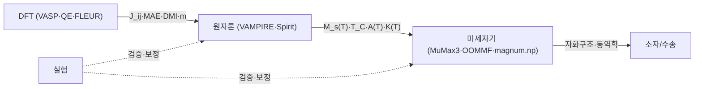

# MagLab 설계 — 물리 코어 · 멀티스케일 시뮬레이션

> `PLAN.md`의 **§9–§10** 상세. 전체 개요·색인은 [`../PLAN.md`](../PLAN.md).
> 본문의 `(§N)` 교차참조는 문서 전역 절 번호이며, 절↔파일 대응표는
> `../PLAN.md` 「문서 구성」 절에 있다.

---

## 9. 결정론적 물리 코어 — `physics/`

- `constants.py` — CODATA 값.
- `units.py`+`quantity.py` — 자성 단위 일체 변환(Oe↔A/m↔T, emu/cm³↔A/m,
  erg/cm↔J/m, J_ij meV↔K, DMI mJ/m²↔meV, CGS↔SI). `Quantity` 타입.
- `oracle.py` — sanity oracle: 차원·범위(0≤α≤1·M≤M_s·T>0·속도 한계)·보존칙
  검사. 비물리 결과 거부.
- `formulas.py` — 멀티스케일 결정론 수식(길이척도·DW 동역학·스커미온·스핀파·
  준강자성/반강자성·수송·멀티스케일 브리징). 효과별 *피팅* 모델은 §11.
- `materials.py`+`material_builder.py`+`data/` — 큐레이션 물질 DB + §14.5 자동
  구축. 물성은 외부 DB 조회, 출처 동반 — Materials Project·OPTIMADE·GPAW(DFT)
  등 외부 과학 MCP 서버를 네이티브 도구로 연동해 물성·구조·DFT 결과를 직접 질의.

---

## 10. 멀티스케일 시뮬레이션 — `sim/`

### 10.1 4-스케일 + 핸드오프

`handoff.py`가 스케일 N 출력을 N+1 입력으로 변환하며 단위·온도의존성·가정을
명시하고 provenance를 꿴다 (핵심 가치).

### 10.2 IR·백엔드·검증·Custodian

- `spec.py` — `MultiScaleSpec = {ScaleSpec[], Handoff[]}` 엔진 비종속 IR.
- `backends/` — `ssh_hpc`(Slurm)·`ssh_gpu`·`local`·`cpu`(폴백 — OOMMF/
  magnum.np/VAMPIRE CPU·소형 QE → **Mac 개발 가능**).
- `validate.py` — 실행 전 정적 검증(부록 D). `custodian.py` — 엔진 오류 분류·
  자동 교정. `parse.py` — 구조화 `JobResult`(LLM은 원시 파일을 안 읽음).

### 10.3 데이터 → 시뮬 → figure (F6)

`maglab sim plot <데이터>` — 실험 데이터에서 실험 유형 추론 → `sim-designer`가
SimSpec 작성 → 검증·실행 → 파싱 → **Figure 엔진(§12)**으로 플롯(시뮬 vs 측정
오버레이, provenance 캡션). 복잡 케이스는 Ralph Loop B.

---

## 관련 모듈

- [`04-analysis.md`](04-analysis.md) — 시뮬 출력이 효과 피팅·소자 FoM의 입력
- [`05-figure.md`](05-figure.md) — `simviz` 렌더러·데이터→figure(F6)
- [`07-literature.md`](07-literature.md) — 물질 DB 자동구축·과학 MCP 서버 연동
- [`../PLAN.md`](../PLAN.md) — 개요·아키텍처·로드맵
