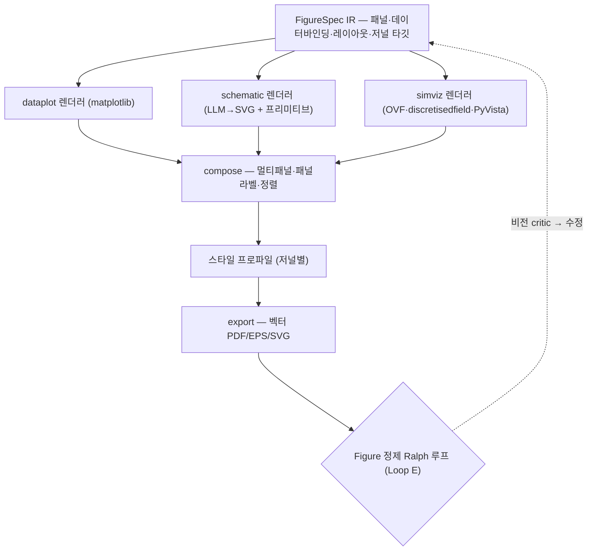

# MagLab 설계 — Figure 제작 엔진

> `PLAN.md`의 **§12** 상세. 전체 개요·색인은 [`../PLAN.md`](../PLAN.md).
> 본문의 `(§N)` 교차참조는 문서 전역 절 번호이며, 절↔파일 대응표는
> `../PLAN.md` 「문서 구성」 절에 있다.

---

## 12. Figure 제작 엔진 — `figure/`

> 출판용 figure 제작 — 논문 쓰는 이가 가장 막히는 지점. 핵심 원칙은 "검증
> 가능한 오케스트레이터"의 figure판: **figure는 코드/벡터로 *저작*하지 래스터
> 이미지로 *생성*하지 않는다.** LLM이 figure 코드(matplotlib·SVG)를 쓰고,
> 결정론적 렌더러가 벡터 출력을 만들며, 데이터는 데이터 레이어에서 온다.

### 12.1 왜 래스터 생성형 이미지 모델을 쓰지 않는가

Nano Banana·GPT-image·Imagen 등 래스터 이미지 모델은 데이터·텍스트를 담은
figure에 부적합하다 — ① **데이터 환각**(막대 높이·축 값을 학습 분포에서 합성,
실제 데이터와 무관) ② **텍스트 오류**(13자+ 기술 용어 라벨 정확도 40–71%)
③ **비편집·비벡터**(저널은 PDF/EPS 벡터 요구) ④ **연결·화살표 방향 오류**
(비전 모델 critic조차 못 잡음 — PaperBanana 보고, 충실도 45.8 < 인간 50.0)
⑤ **비재현성**. PaperBanana도 *통계 플롯은 matplotlib 코드*로 전환했고, Cell
Press는 데이터 표현에 AI figure를 금지한다. → **LLM이 숫자를 계산하지 않듯,
데이터를 *그리지도* 않는다.** 래스터 생성형 모델은 v1 범위 밖(순수 장식용
컨셉 아트는 명시 라벨 시 예외 검토 가능하나 기본 미사용).

### 12.2 출발점 — 렌더링 기술 결정

| 후보 | 판정 |
|---|---|
| HTML 코드 | UI 미리보기·인터랙티브 뷰어 전용. 헤드리스 브라우저 `page.pdf()`는 진짜 벡터 아님(canvas 래스터화·EPS 없음·RGB 전용) → 저널 제출용 불가 |
| React + 캡처 | 캡처는 래스터. 정적 출판 figure에 잘못된 추상화. React는 UI 전용 |
| Illustrator MCP | macOS 전용 + CC 라이선스 + 로컬 전용(ExtendScript) → 서버 파이프라인 불가. **사람 최종 손질용 선택 핸드오프**로만 |
| **코드/벡터 저작 (채택)** | **matplotlib**(데이터 플롯) + **SVG**(스키매틱). TikZ는 LaTeX 통합용 opt-in. 출판급 벡터·재현·편집 가능 |

### 12.3 작업 레이어 & 모델 배치



1. **FigureSpec IR** (`figure/spec.py`) — LLM+사용자가 구조화 명세 생성:
   패널 목록·각 패널 유형(data-plot / schematic / sim-viz)·콘텐츠 바인딩
   (어떤 DataPoint·데이터셋)·레이아웃 그리드·저널 타깃·라벨·캡션. 선언적,
   SimSpec과 동형. (DiagrammerGPT 교훈 — 공간 레이아웃을 텍스트로 먼저 계획.)
2. **패널 렌더러** (`figure/renderers/`):
   - `dataplot.py` — matplotlib. 데이터 플롯(히스테리시스·Hall·FMR·분산),
     데이터는 데이터 레이어에서. SciencePlots식 저널 스타일.
   - `schematic.py` — LLM이 SVG 코드 저작, 단 §12.3-③ 프리미티브 위에서
     *조합·파라미터화*. Inkscape CLI(헤드리스)로 PDF 내보내기.
   - `simviz.py` — 미세자기/OVF 시각화. discretisedfield `mpl()`·`mpl.lightness()`
     (HSL 컬러휠 — 스커미온 표준)·matplotlib quiver. 3D는 PyVista off-screen → PNG.
3. **자성 스키매틱 프리미티브 라이브러리** (`figure/primitives/`) — ★ 킬러
   기능. 파라메트릭 출판급 벡터 템플릿: 샘플 스택 단면(`Ta(5)/CoFeB(1)/MgO(2)`
   → 다이어그램)·Hall bar+측정 기하(전류·자기장·전압 화살표)·결정/격자·
   에너지/밴드·스핀 텍스처(자구벽·스커미온·볼텍스)·소자 단면·BZ/k-공간·
   측정 회로·좌표축. LLM이 프리미티브를 *조합*하므로 raw SVG 맨바닥 저작보다
   신뢰성이 높다 (BioRender가 큐레이션 라이브러리로 환각을 없애는 것과 동일).
4. **합성/레이아웃** (`figure/compose.py`) — 멀티패널(matplotlib GridSpec/
   subfigures)·패널 라벨(a/b/c)·저널 컬럼폭 맞춤·공유 컬러스케일·정렬.
5. **스타일 프로파일** (`figure/styles/*.yaml`) — 저널별 치수·폰트·선폭·
   팔레트(색맹 안전): Nature 89/183mm·APS 86/178mm·IEEE 88.9mm·Elsevier 90mm.
   §16 저널 템플릿과 연동.
6. **내보내기** (`figure/export.py`) — 벡터 PDF/EPS/SVG, 폰트 임베딩
   (`pdf.fonttype=42`·`svg.fonttype=none`), 필요시 래스터 TIFF(저널 DPI).
   선택적 핸드오프: 편집형 SVG → Inkscape(헤드리스·`inkex` API; 설치 시
   Illustrator MCP)에서 사람이 최종 손질.

**모델 배치.** LLM = FigureSpec 작성·SVG 스키매틱 코드 저작·캡션 초안.
비전 모델 = Loop E figure critic. 결정론 렌더러 = matplotlib·Inkscape·
discretisedfield·PyVista. 래스터 생성형 이미지 모델 = 미사용.

### 12.4 스키매틱 프리미티브 라이브러리 — 확장 아키텍처

> 프리미티브 라이브러리는 figure 엔진의 ★ 킬러 기능이자 *지속 확장되는*
> 자산이다. 구현 시 매우 다양한 파라메트릭 벡터 템플릿을 검색·수집·삽입할 수
> 있도록 아래 판을 미리 깔아둔다. **계약·레지스트리·수집 파이프라인은 P1에
> 확정**하고, 프리미티브 자체는 이후 무제한 확장한다.

**(1) `Primitive` 계약** (`figure/primitives/spec.py`) — 모든 프리미티브가
구현하는 단일 인터페이스:

```
Primitive = {
  name, category, tags[],         # 식별·검색
  description,                    # 자연어 — figure-designer 에이전트가 매칭
  parameters[],                   # 타입·기본값·경계 (예: layers, angle, labels)
  body,                           # 파라메트릭 벡터 본체, 백엔드별:
                                  #   svg(플레이스홀더 템플릿)/tikz(매크로)/py(draw 함수)
  render(params, backend, style) -> 벡터,
  physics_convention,             # 표준 규약 (예: Néel/Bloch 벽 색·키랄리티)
  references, provenance,         # 출처 (문헌 DOI·원본 라이브러리)
  preview, journal_styles[]
}
```

프리미티브는 **다중 백엔드 표현**을 가진다 — 동일 파라미터 스키마에 SVG
본체(기본)와 TikZ 본체(LaTeX 통합용). 가변 로직(층 개수 가변 스택 등)은
Python `draw()`로.

**(2) 카테고리 택소노미** — 구현 시 이 분류를 따라 폭넓게 채운다:

| 패밀리 | 프리미티브 예 |
|---|---|
| 시료/박막 구조 | 다층 스택 단면·초격자·패턴 소자 평면도·웨이퍼·기판 |
| 소자 기하 | Hall bar·Hall cross·MTJ 필러·스핀밸브·나노와이어/racetrack·CPW·4-프로브·van der Pauw·게이트 소자 |
| 측정 기하 | 전류·자기장·전압 벡터·회전각(θ,φ) 정의·MOKE·FMR/ST-FMR·수송·VSM·중성자/X선 |
| 스핀/자기 텍스처 | 단일 스핀·스핀 체인·FM/AFM/FiM 정렬·자구+자구벽(Bloch/Néel)·스커미온(Bloch/Néel/안티)·볼텍스·나선·홉피온·자화 컬러휠 |
| 결정/격자 | 단위셀·Bravais 격자·bcc/fcc/hcp·2D 격자·계면·Brillouin 존·k-경로 |
| 에너지/밴드 | 밴드 구조·DOS·에너지 준위·이방성 이중우물·교환 분리·스핀 분리 밴드 |
| 동역학 | LLG 세차(Bloch 구)·토크/댐핑 벡터·히스테리시스 모식도·마그논 분산·Walker |
| 회로/계측 | 측정 회로·락인 셋업·브리지·전류원·SOT/STT 토크 다이어그램 |
| 개념/공정 | 실험 흐름도·공정 흐름·타임라인·비교 패널 |
| 주석 | 좌표축·스케일바·패널 라벨·범례·컬러바·콜아웃 |

**(3) 소싱 맵** — 구현 시 프리미티브를 어디서 검색·유도하는가:

| 소스 | 활용 |
|---|---|
| TikZ 라이브러리 생태계 | `circuitikz`·`tikz-feynman`·`quantikz`·`tikz-3dplot`·격자/결정 패키지를 `Primitive` 계약으로 래핑·유도 |
| SVG 아이콘/템플릿 세트 | 과학 아이콘을 파라메트릭화 |
| 문헌 figure 마이닝 | arXiv `cond-mat` figure에서 반복 모식도 패턴 추출; DeTikZify식 이미지→TikZ, DaTikZ 코퍼스 활용 |
| 핸드오서링 | 도메인 전문가 작성 코어 세트 |
| LLM 보조 저작 | 라이브러리에 없으면 `figure-designer` 에이전트가 새 프리미티브 초안 → (4) 파이프라인으로 검증·승격 |
| 커뮤니티 기여 | 외부 기여 프리미티브 패키지 |

**(4) 수집·승격 파이프라인** (`maglab figure primitives ingest <소스>`) — 신규
프리미티브가 라이브러리에 들어가는 경로(Ralph 루프로 자동화 가능): 검색/소싱 →
벡터화(래스터면 sketch→vector) → **파라미터화**(가변 부분 식별 → 타입 있는
파라미터로 노출) → 검증(저널 스타일별 렌더·파라미터 스윕 테스트·물리 규약
검사 — 적용 가능 시 `oracle`/`symmetry`) → 메타데이터·provenance 부여 →
레지스트리 등록.

**(5) 레지스트리 & 검색** (`figure/primitives/registry`) — 프리미티브는 스킬과
동일하게 *디렉터리 + 매니페스트*의 플러그형 패키지. 시작 시 색인(`name`·
`category`·`tags`·`description`)만 로드, 사용 시 전체 본체 로드 — §5.6 스킬
3단계 점진 공개와 동형. `figure-designer` 에이전트가 색인을 자연어로 검색해
프리미티브를 고르고 파라미터를 채운다. 버전 관리·파라미터 스윕 테스트는 §20.

### 12.5 Figure 정제 Ralph 루프 (Loop E)

렌더 → 래스터화 미리보기 → **비전 모델 figure critic**(축·단위 라벨 유무,
출판 크기 가독성, 색맹 안전, 패널 라벨, 저널 스펙 일치, 데이터-출처 일치)
→ 수정 → 반복. MatPlotAgent/PlotGen의 시각·수치·어휘 3종 피드백 + §16.5
PDF-readback 패턴. 서킷 브레이커 적용.

### 12.6 무결성

모든 데이터 패널은 provenance의 `DataPoint`에 바인딩 → honesty gate가
미태그·날조 데이터를 담은 figure 생성을 차단. 데이터는 코드가 실제 값으로
렌더하므로 "AI가 데이터를 그렸다"가 아니다 → Cell Press 등 저널 정책 준수,
AI 사용은 §16식 고지. figure는 §16 저술에 공급(`figure_handler.py`).
CLI `maglab figure`.

---

## 관련 모듈

- [`04-analysis.md`](04-analysis.md) — 데이터플롯이 피팅·분석 결과를 렌더
- [`09-authoring.md`](09-authoring.md) — figure를 §16 저술·발표 자료에 공급
- [`03-physics-simulation.md`](03-physics-simulation.md) — `simviz`가 OVF·시뮬 결과 시각화
- [`01-harness.md`](01-harness.md) — figure 정제 Ralph 루프(Loop E)
- [`../PLAN.md`](../PLAN.md) — 개요·아키텍처·로드맵
